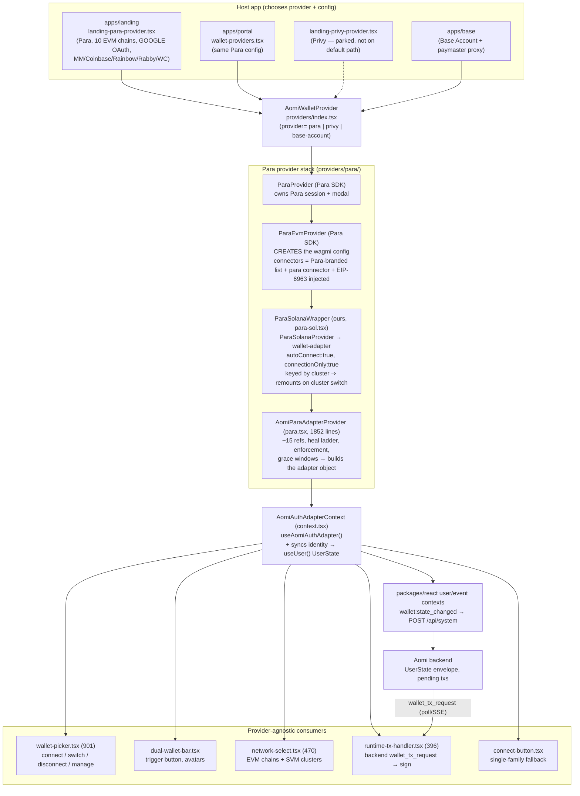
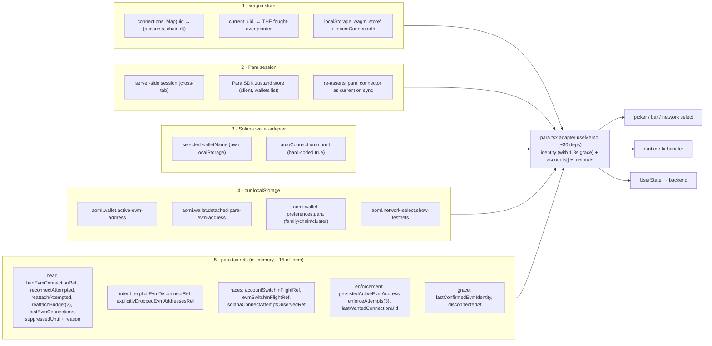
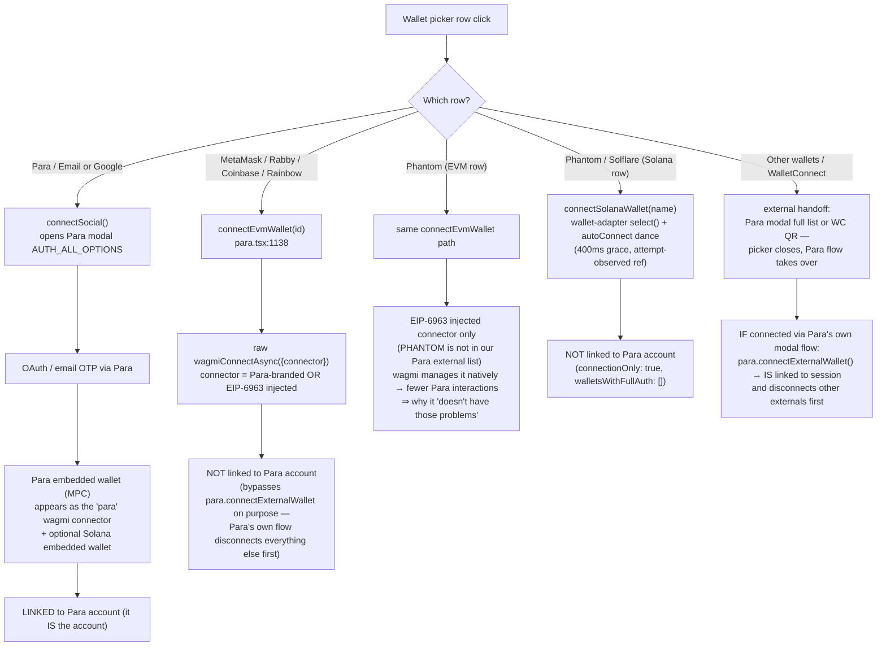
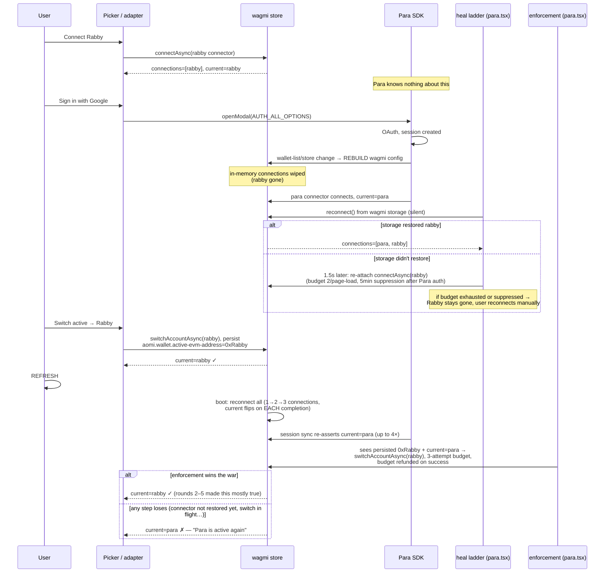
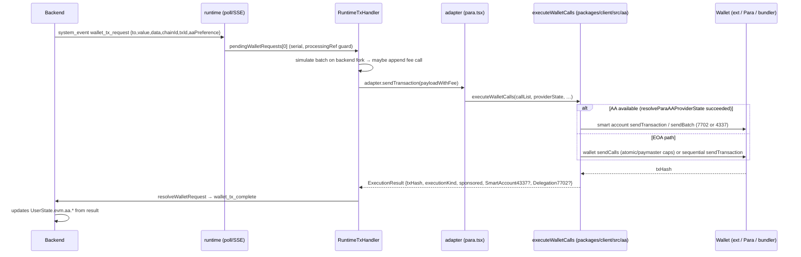
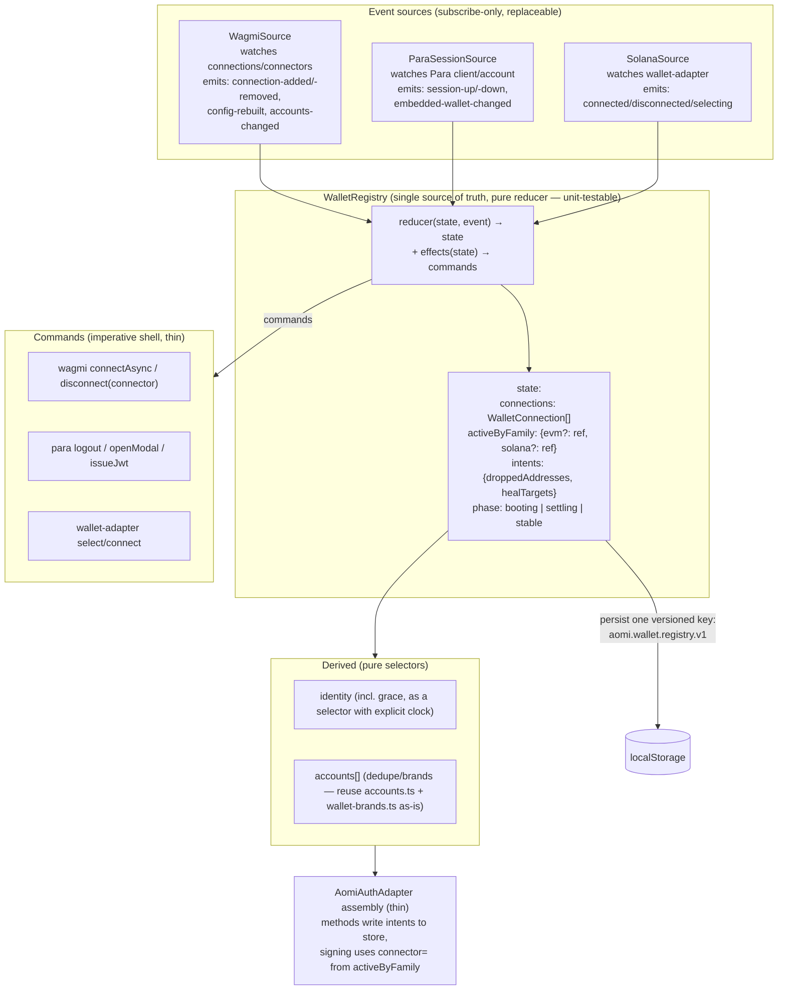

# Aomi Wallet Stack — Architecture, Diagnosis, and Refactor Plan

> Written 2026-06-11 on branch `polish-multi-wallet`. Companion reading: `specs/STATE.md`
> (rounds 1–5 of wallet fixes), `docs/superpowers/specs/2026-05-29-multiwallet-per-family-picker-design.md`.
>
> Purpose: explain how the whole wallet connection stack works today, *why* it grew the
> defensive machinery it has, what is structurally wrong with it, and how to proceed in the
> next PR — both the immediate refactor (frontend multi-wallet switching that actually works)
> and the groundwork for the later goal (backend-linked wallets under one account).

---

## Table of contents

1. [TL;DR — the one-paragraph diagnosis](#1-tldr)
2. [Cast of characters](#2-cast-of-characters)
3. [The layer map](#3-the-layer-map)
4. [Where state actually lives (the five stores problem)](#4-where-state-actually-lives)
5. [How each connection path works](#5-how-each-connection-path-works)
6. [The worked example: your Rabby + Google bug, step by step](#6-the-worked-example)
7. [Identity → backend sync, and the transaction flow](#7-identity--backend-sync)
8. [Account abstraction (AA) — widget and CLI](#8-account-abstraction)
9. [Inventory of defensive machinery (why the code is weird)](#9-inventory-of-defensive-machinery)
10. [Structural diagnosis — what is actually wrong](#10-structural-diagnosis)
11. [What Para and Privy natively support (linking)](#11-what-para-and-privy-natively-support)
12. [Proposed target architecture](#12-proposed-target-architecture)
13. [Concrete plan for the next PR](#13-concrete-plan-for-the-next-pr)
14. [Open product decisions](#14-open-product-decisions)
15. [Appendix: file map, storage keys, debug tooling](#15-appendix)

---

<a name="1-tldr"></a>
## 1. TL;DR — the one-paragraph diagnosis

We have **one good abstraction** (`AomiAuthAdapter` — the interface every UI surface and the
tx runtime consume) sitting on top of **one structural mistake**: we use **Para as both our
identity provider *and* our wallet plumbing**, while simultaneously **bypassing Para's own
account model** to get multi-wallet behavior it wasn't designed for. Concretely:

- Para's SDK owns the wagmi config and assumes **one external wallet, linked into the Para
  session, at a time** (its own connect flow literally calls `disconnectAsync()` on everything
  else first — verified in `@getpara/evm-wallet-connectors` source).
- We want **N simultaneous connections with one user-chosen active wallet per family**, so we
  connect external wallets behind Para's back (raw wagmi `connectAsync`) and treat wagmi's
  single mutable **"current connection" pointer** as "the active wallet".
- Para's session sync keeps "correcting" that pointer back to its own connector, wagmi flips
  it on every reconnect during boot, and our code fights back with **enforcement budgets,
  grace windows, re-attach ladders, suppression timers, and ~15 refs** in a 1,852-line file.

Every bug you've seen (Para steals active after refresh, Rabby drops when Para logs in,
sign-out doesn't stick, random active-wallet jumps) is a symptom of three parties fighting
over one global pointer. The fix is not more budgets. The fix is: **declare active-wallet
state ourselves in one store, treat wagmi/Para/wallet-adapter as event *sources* rather than
sources of truth, and route signing to an explicit connector** (wagmi v2 supports a
`connector` parameter on `sendTransaction`/`signTypedData`/etc. — we never have to read or
fight the "current" pointer again). Sections 12–13 spell this out.

---

<a name="2-cast-of-characters"></a>
## 2. Cast of characters

| Name | What it is | Role in our stack |
|---|---|---|
| **Para** (`@getpara/react-sdk`, `react-core`, `evm-wallet-connectors`, `solana-wallet-connectors`) | Embedded-wallet provider (formerly Capsule). Email/Google login creates an MPC-backed embedded wallet. Also ships connector packages that wrap wagmi/wallet-adapter for *external* wallets. | Production provider. Supplies: the social-login modal, the embedded "Para" wallet, the wagmi config (it *creates* it), the Solana provider, AA signers. |
| **wagmi** (`wagmi`, `@wagmi/core`, viem) | The standard EVM React connection library. Holds a store of `connections` (Map keyed by connector uid) plus a single `current` pointer. Persists to localStorage (`wagmi.store`), reconnects on mount. | The actual EVM connection layer. **Para instantiates it**, we consume it via `safe-wagmi-hooks.ts`. |
| **EIP-6963** | "Multi Injected Provider Discovery" — browser wallets announce themselves via window events instead of fighting over `window.ethereum`. | wagmi's `multiInjectedProviderDiscovery` (default **on**) auto-creates a connector per announced wallet. This is how **Phantom-EVM** gets in (it's *not* in our Para external-wallet list), and why MetaMask/Rabby can appear as *two* connectors (Para's branded one + the 6963 one) → the dedupe machinery. |
| **@solana/wallet-adapter** | The standard Solana wallet connection library (Phantom, Solflare, Backpack, Glow). | Mounted by Para's `ParaSolanaProvider` with hard-coded `autoConnect: true`. We run it `connectionOnly: true` — Solana wallets never touch the Para session. |
| **Privy** (`@privy-io/react-auth`) | Competing embedded-wallet + auth provider. Native **linked-accounts** model: one user object, many linked wallets/socials, server-verifiable. | Second adapter implementation (`providers/privy/privy.tsx`, ~800 lines, ~80% parity). Wired in `landing-privy-provider.tsx` but not on the default rendering path. |
| **Base Account** (`@base-org/account`) | Coinbase's smart-wallet (always-4337) product. | Third adapter implementation. Used by the standalone `apps/base` host app (full-page widget + paymaster proxy). EVM-only, not part of the Para/Privy story. |
| **Alchemy / Pimlico** (`@getpara/aa-alchemy`, `@getpara/aa-pimlico`) | Bundler/paymaster providers for account abstraction. | Power AA execution: EIP-7702 (preferred) or ERC-4337, BYOK or zero-config backend proxy. |
| **WalletConnect** | QR-code/deep-link connection protocol. | One of Para's external-wallet options; treated as an "external handoff" by the picker. |
| **`AomiAuthAdapter`** | *Our* interface (`apps/registry/src/lib/aomi-auth-adapter/types.ts`). | The seam. Everything above it is provider-specific; everything below it (picker, network select, tx handler, backend sync) is provider-agnostic. This is the part worth keeping. |

### Para SDK packages we actually import

| Package | Used for |
|---|---|
| `@getpara/react-sdk` | `ParaProvider`, `useAccount`, `useClient`, `useModal`, `useLogout`, `useIssueJwt` |
| `@getpara/evm-wallet-connectors` | (transitively, via `ParaProvider`'s `externalWalletConfig`) creates the wagmi config + branded connectors |
| `@getpara/solana-wallet-connectors` | `ParaSolanaProvider` wrapping `@solana/wallet-adapter` |
| `@getpara/aa-alchemy`, `@getpara/aa-pimlico` | smart-account creation (dynamic imports in `packages/client/src/aa/*/create.ts`) |

---

<a name="3-the-layer-map"></a>
## 3. The layer map



The full React tree on landing/portal (Para path):

```
ExtUserProvider                              ← runtime user state (packages/react)
└── QueryClientProvider
    └── ParaProvider                         ← Para session, modal, OAuth
        └── (internal) ParaEvmProvider       ← creates wagmi config; WagmiProvider
            └── ParaSolanaWrapper            ← ours; keyed by Solana network id (!)
                └── ParaSolanaProvider       ← Para SDK; wallet-adapter, autoConnect:true
                    └── FullTestnetWalletRouter   ← anvil/testnet RPC rerouting (dev)
                        └── AomiParaAdapterProvider  ← builds AomiAuthAdapter
                            └── {app subtree: AomiFrame, picker, tx handler…}
```

Two structural notes you should internalize from this tree:

1. **Para's SDK sits *above* wagmi, not beside it.** `ParaEvmProvider` calls wagmi's
   `createConfig()` itself, with `connectors = [Para-branded externals…, paraConnector]`
   plus wagmi's auto-discovered EIP-6963 injected connectors. Any time Para decides to
   rebuild that config (its zustand store sees a new `wallets` array identity, login modal
   rebuilds, session reinit), **every in-memory wagmi connection is dropped** and must be
   recovered. This single fact spawned the entire "heal" subsystem. (Verified in
   `@getpara/evm-wallet-connectors/dist/providers/ParaEvmContext.js` — `createConfig` is
   re-run from a `useEffect` keyed on the wallet-list prop, with an identity compare.)
2. **`ParaSolanaWrapper` is keyed on the active cluster** (`key={resolvedSolanaConfig.activeNetwork.id}`,
   para.tsx:1782). Switching Solana network **unmounts and remounts the whole app subtree
   beneath it** — adapter, picker, chat frame, everything. That's the real reason the SVM
   network switch needs a scary confirm dialog (`solanaNetworkSwitchRequiresReconnect`).

---

<a name="4-where-state-actually-lives"></a>
## 4. Where state actually lives (the five stores problem)

The single biggest source of confusion — and the root of "I refresh and the wrong wallet is
active" — is that connection state lives in **five places with no designated owner**:



Key observations:

- **"Which wallet is active" is *derived*, not declared.** `identity.address` = whatever
  wagmi's `current` connection says (filtered through a 1.8 s grace cache). Our localStorage
  `active-evm-address` is not the source of truth — it's a *wish* that an enforcement effect
  tries to impose back onto wagmi's pointer, with a 3-attempt budget, refunded on success
  (STATE.md round 4). When the enforcement loses (budget exhausted, connector not yet
  restored, switch in flight), the UI shows whatever Para last asserted. That **is** the
  refresh bug.
- **Nobody owns recovery.** wagmi restores from its storage; Para restores its session and
  re-asserts its connector; wallet-adapter autoConnects; our heal ladder re-attaches what
  wagmi forgot. These four restorations race **every page load**, and each one moves
  `current`.
- **Two of our four localStorage keys are patches over the other stores' behavior**
  (`active-evm-address` patches wagmi/Para's pointer war; `detached-para-evm-address`
  patches "Para session survives a local disconnect").

---

<a name="5-how-each-connection-path-works"></a>
## 5. How each connection path works

This is the part nobody could see clearly anymore. There are **five distinct connection
protocols** hiding behind the one picker UI:



### 5.1 Para embedded (Google / email) — the "account"

- `connectSocial()` → `paraModal.openModal({step: "AUTH_ALL_OPTIONS"})` → Para handles
  OAuth/OTP → an MPC **embedded wallet** materializes.
- It shows up in wagmi as the **`para` connector** (id `"para"`), so to the rest of the stack
  it looks like just another EVM connection — but it is special: it's the only one tied to
  the **Para session** (server-side session whose state persists in localStorage under
  `@CAPSULE/*` keys, up to 30 days, kept alive by `ParaProvider`; revives on reload).
- Sign-out must call Para's `useLogout` (with a duck-typed `paraSession.logout()` fallback —
  STATE.md round 4), otherwise the session silently re-attaches the wallet on next load.
  This was the "sign-out doesn't stick" bug.
- `getAccountCredential()` issues a **Para JWT** (`useIssueJwt`) which the runtime exchanges
  at `POST /api/account/sessions/exchange` for a short-lived Aomi bearer
  (`packages/client/src/account-session.ts`). **This is the existing backend-linking
  primitive** — it already accepts `provider: "para" | "privy"`.

### 5.2 External EVM wallets through our picker — the deliberate sidestep

- `connectEvmWallet(id)` matches a wagmi connector by id/uid/canonical brand and calls
  **raw `wagmiConnectAsync({connector})`** (para.tsx:1138–1161). No Para involvement.
- Why we bypass Para's own external-wallet flow: `para.connectExternalWallet()` (in
  `EvmExternalWalletContext.js`) does `await disconnectAsync()` **before** connecting —
  Para's model is *one* external wallet bound to the session at a time. Multi-wallet was
  impossible through the front door.
- Consequence: these connections exist **only in wagmi's store**. Para doesn't know about
  them. When Para rebuilds the wagmi config (login, session sync), they're collateral
  damage — hence the heal ladder. And because they're not in the Para session, Para's
  restore logic happily re-asserts *its* connector as current over them — hence the
  enforcement war.
- **This is the "linking through Para but not through Para" you sensed.** In Para's own
  vocabulary it's the **`NONE` connection mode** (see §11.1): logged-in Para user + external
  wallet connected via `externalWalletConfig` = a local wagmi connection with **no account
  association**. The wallets ride on Para's wagmi config but are invisible to the Para
  account.

### 5.3 Phantom over EVM — why it behaves differently

- Our Para external-wallet list is `["WALLETCONNECT","METAMASK","COINBASE","RAINBOW","RABBY"]`
  (landing-para-provider.tsx). **No PHANTOM.**
- wagmi's `multiInjectedProviderDiscovery` (default on, Para doesn't disable it) turns every
  EIP-6963-announcing extension into an auto-managed injected connector. Phantom-EVM connects
  through *that* — a connector wagmi itself creates, persists, and restores, with no Para
  branding wrapper.
- Para's branded connectors (MetaMask, Rabby) carry Para's wallet-list metadata and live or
  die with Para's config rebuild cycle; the 6963 ones are comparatively boring and stable.
  **That's why Phantom-EVM "uses some different connection" and dodges several bugs.**
- Side effect: MetaMask/Rabby can appear as **two connectors for one address** (Para-branded
  + 6963), and Rabby sets `isMetaMask` for compatibility — that's why `accounts.ts` dedupes
  by lowercased address, why `connectorIds[]` exists on `AomiAccount`, and why
  `useEvmProviderBrands` sniffs `isRabby`/`isPhantom`/… flags off the live provider to label
  rows truthfully.

### 5.4 Solana (Phantom / Solflare / Backpack / Glow)

- Lives entirely in `@solana/wallet-adapter`, mounted by Para's `ParaSolanaProvider` with
  **hard-coded `autoConnect: true`** and our `connectionOnly: true` + `walletsWithFullAuth: []`
  (para-sol.tsx:436–445) — so Solana wallets **never touch the Para session** either.
- Connect is a two-phase dance: `select(walletName)` swaps the adapter, then the *provider's*
  autoConnect fires `connect()` itself. Our manual `connect()` used to race it, and the loser's
  error path unselected the wallet (the "Phantom click does nothing until refresh" bug). Now an
  effect defers to autoConnect, waits 400 ms, and only connects manually if no attempt was
  observed (`solanaConnectAttemptObservedRef`).
- Single active wallet per the wallet-adapter design — `selectAccount` is a no-op for Solana,
  and per-account disconnect doesn't exist (family-level only).
- Cluster switch = provider remount (the `key=` on `ParaSolanaWrapper`) ⇒ wallet must
  reconnect ⇒ the confirm dialog.

### 5.5 WalletConnect / "Other wallets"

- Rendered as add-list rows but flagged `isExternalHandoff` (wallet-picker.tsx:129) — the
  picker closes and Para's modal/WC QR takes over. If a wallet is connected through Para's
  *own* modal flow, it goes through `para.connectExternalWallet` → **is** session-linked →
  and disconnects other externals first (the Para single-wallet assumption again).

---

<a name="6-the-worked-example"></a>
## 6. The worked example: your Rabby + Google bug, step by step

The exact scenario you described — connect Rabby, then sign in with Google, Rabby drops,
reconnect Rabby, switch active to Rabby, refresh, Para is active again:



Every box on the `H` and `E` lanes is code that exists **only** because:

1. Para rebuilds the wagmi config it owns (wipes connections), and
2. "active wallet" is wagmi's `current` pointer, which Para and wagmi-boot both write.

Remove those two premises and the whole diagram collapses to three arrows.

---

<a name="7-identity--backend-sync"></a>
## 7. Identity → backend sync, and the transaction flow

### 7.1 State sync (who tells the backend which wallet is active)

```
adapter.identity (para.tsx useMemo, grace-filtered)
  → AomiAuthAdapterProvider syncs into useUser() UserState   (context.tsx)
  → onUserStateChange subscription fires
  → postSystemMessage("wallet:state_changed", payload)        (packages/react)
  → POST /api/system  → backend session UserState envelope
```

The payload (see `packages/client/src/user-state/index.ts`) carries
`connection.{provider, primary_family, auth_method}`, `evm.{address, chain_id, aa.{mode,
smart_account, delegation_7702, provider}, sponsorship}`, `svm.{address, cluster,
wallet_name, capabilities}`. **The backend only ever sees the one active account per family**
— the multi-wallet registry is a pure frontend concept today. That's the right shape to keep
until backend linking lands (§13.6).

### 7.2 Transaction flow (backend asks, wallet signs)



Solana mirrors this with `solana_sign | solana_sign_message | solana_send |
solana_sign_and_send` kinds; the handler auto-switches cluster when allowed, and falls back
to sign-then-broadcast through `adapter.solanaRpcHttpUrl` when the adapter lacks a direct
send method. EIP-712 requests auto-`switchChain` to the domain's chainId first.

**Important property to preserve in any refactor:** `RuntimeTxHandler` is *provider-blind*.
It speaks only the adapter interface. The whole signing pipeline survives a Para→Privy swap
untouched.

---

<a name="8-account-abstraction"></a>
## 8. Account abstraction (AA) — widget and CLI

### 8.1 The shared core (`packages/client/src/aa/`)

- `createAAProviderState({provider, owner, chain, mode, apiKey?, proxyBaseUrl?})` →
  dynamically imports `@getpara/aa-alchemy` or `@getpara/aa-pimlico` and adapts the SDK
  account to our `SmartAccount` shape (`adapt.ts`).
- Modes: **7702** (EIP-7702 delegation, default; delegation contract
  `0x69007702…E139` for Alchemy) and **4337** (smart-account contract). Chains: ETH,
  Polygon, Arbitrum, Optimism, Base.
- `executeWalletCalls()` (`execute.ts`, 582 lines) is the single execution router:
  AA account ready → AA path (with one retry on transient bundler errors, on-chain
  delegation-address lookup for 7702); otherwise EOA path (local private key → viem;
  or wallet `sendCalls` with atomic/paymaster capabilities → sequential fallback).
- Sponsorship is tri-state (`disabled | optional | required`); `optional` + wallet sendCalls
  returns `sponsored: undefined` because we genuinely can't tell post-hoc who paid.

### 8.2 Widget AA (`providers/para/para-aa.ts`)

- **Owner = the Para session**: `{kind:"session", adapter:"para", session: paraSession,
  address, signer?: walletClient}`. With an **external** wallet active, the external viem
  `walletClient` is passed as signer and **7702 silently falls back to 4337**
  (`requested_7702_connected_wallet_fallback_4337`). This is a hard Para SDK constraint,
  not our choice: `@getpara/viem-v2-integration` throws `INVALID_CONFIG` for 7702 +
  external wallets because "external wallets add an EIP-191 prefix to all signatures, which
  is incompatible with the raw ecrecover required by EIP-7702 authorization". So: embedded
  Para wallet → 7702 or 4337; external wallet → **4337 only**.
- Sponsorship resolved from `NEXT_PUBLIC_ALCHEMY_API_KEY` + `NEXT_PUBLIC_ALCHEMY_GAS_POLICY_ID`
  (or Pimlico key); surfaces on `identity.{sponsored, sponsorProvider, sponsorAccount}`.
- **Constraint for the refactor:** the AA path needs *a Para session* (even for external
  signers). If a user has only MetaMask connected and no Para login, AA resolves to null and
  execution falls back to EOA. So "Para = AA engine" is a real coupling, distinct from
  "Para = wallet plumbing". Decoupling the latter must not break the former.

### 8.3 CLI (`packages/client/src/cli/execution.ts`)

The CLI **does not use the Para session at all** — owner is `{kind:"direct", privateKey}`.
Same `executeWalletCalls` core, different owner. Decision table:

| Env | Flag | Result |
|---|---|---|
| (none) | (none) | **AA via backend Alchemy proxy** (`{baseUrl}/aa/v1/{chain-slug}`, zero-config) |
| `ALCHEMY_API_KEY` | (none) | AA BYOK Alchemy |
| `PIMLICO_API_KEY` | `--aa-provider pimlico` | AA BYOK Pimlico |
| any | `--eoa` | EOA |

CLI wallet state reaches the backend through the same `wallet:state_changed` system message
(`cli.publicKey`, `cli.chainId`), and signing is `aomi tx sign <id>` against the pending txs
hydrated from `UserState.pending.evm_txs`. **The CLI shares the contract, not the React
stack** — so frontend refactors don't touch it as long as `packages/client` types and the
`wallet:state_changed` / `wallet_tx_complete` shapes stay stable.

---

<a name="9-inventory-of-defensive-machinery"></a>
## 9. Inventory of defensive machinery (why the code is weird)

Every entry below is real code on this branch, with the bug it fixed and the **root cause it
compensates for**. This table is the honest answer to "why are we doing the stuff we're doing".

| # | Mechanism (where) | What it does | Bug it fixed | Root cause it papers over |
|---|---|---|---|---|
| 1 | Memoized `resolvedWallets` / `paraClientConfig` / `externalWalletConfig` (para.tsx:1667–1729) | keeps prop identity stable across re-renders | network switch froze/flashed wallet UI; all connections dropped | **Para rebuilds the entire wagmi config on a prop identity change** |
| 2 | Heal step 1: storage `reconnect()` (re-armed per connector-set rebuild) | silently restore connections after a wagmi wipe | EVM wallet vanished during Para OAuth popup | same as #1 — Para wipes in-memory connections |
| 3 | Heal step 2: re-attach via `connectAsync` 1.5 s later, **budget 2/page-load**, **5 min suppression** after Para auth ops | re-create connections wagmi storage didn't restore | survivors stayed dead after Para login; later: MetaMask popup spam when re-attaching locked wallets | locked/de-authorized wallets pop their extension UI on `connectAsync`; we can't tell silent-reconnectable from popping |
| 4 | Active-EVM **enforcement** effect: persisted `aomi.wallet.active-evm-address`, watch + `switchAccountAsync` back, 3-attempt budget **refunded on success** (rounds 2–4) | re-impose user's chosen active wallet | Para active again after refresh; first switch away from Para flipped back | **active wallet = wagmi `current` pointer**, which Para re-asserts (4×/boot observed; SDK-source-confirmed `connecting_para_connectors` state machine, §11.1) and wagmi flips per reconnect completion |
| 5 | `evm-identity-grace.ts`: 1.8 s cached identity on disconnect (expired state must stay expired — round "flash loop" fix) | hide transient disconnects | EVM logo + chip flashing ~1/s forever after a network switch | identity is *derived* from a flapping source instead of owned state |
| 6 | `ParaSolanaWrapper` `lastParaRef` caching; adapter renders in both wrapper states (round 5) | never unmount the adapter subtree | minutes after Para sign-out, ALL wallets disconnected | Para nulls its client transiently during logout/re-init; our provider tree hung the whole subtree off that client |
| 7 | Solana connect: 400 ms autoConnect grace + `solanaConnectAttemptObservedRef` | defer to wallet-adapter's self-initiated connect | Phantom click silently did nothing until refresh | Para mounts `WalletProvider autoConnect:true` (hard-coded) and wallet-adapter fires connect itself on select |
| 8 | `explicitEvmDisconnectRef` + `explicitlyDroppedEvmAddressesRef` + `evm-disconnect-plan.ts` | distinguish "user signed this out" from "Para wiped it" | sign-out of one wallet killed all wallets; heal resurrected deliberately dropped wallets | recovery has no concept of *intent* — it must be reconstructed from flags |
| 9 | `aomi.wallet.detached-para-evm-address` | remember "Para wallet locally detached but session alive" | per-row Para sign-out didn't stick (session re-attached on load) | Para session is server-side & cross-tab; a wagmi-level disconnect doesn't touch it |
| 10 | `useLogout` + duck-typed `paraSession.logout()` fallback | actually end the Para session on sign-out | same as #9 | SDK logout surface is awkward; failure used to be silent |
| 11 | `accountSwitchInFlightRef` / `evmSwitchInFlightRef` | mute reconnect/align effects during a deliberate switch | first account switch reverted; duplicate `wallet_switchEthereumChain` popups (−32002) | multiple effects all write the same wagmi state with no coordination |
| 12 | `useEvmProviderBrands` provider sniffing (`isRabby` before `isMetaMask`) | label rows truthfully | Rabby showed as MetaMask; adding MetaMask swallowed the Rabby row | EIP-6963 + impersonation flags ⇒ several connectors per brand/address |
| 13 | `buildAccounts` dedupe by lowercased address + `connectorIds[]` | one row per address | duplicate connected rows; sign-out-one = sign-out-all | same as #12 |
| 14 | `wallet_getCapabilities` 403 noise (known, unfixed) | — | console noise on Base public RPC | Para's EIP-1193 provider probes capabilities against public RPCs |

Plus the **wallet-debug tracer** (`wallet-debug.ts`, `localStorage["aomi.wallet.debug"]`,
`[aomi-wallet]` console lines) — built in round 3 because nobody could see the timeline.
Keep it; whatever we refactor to, observability of this dance is non-negotiable.

The verdict on this table: **items 1–11 all derive from two premises** (Para owns the wagmi
config; active = wagmi `current`). Items 12–13 are inherent to the EVM extension ecosystem
and worth keeping in any design. Item 14 is cosmetic.

---

<a name="10-structural-diagnosis"></a>
## 10. Structural diagnosis — what is actually wrong

In order of severity:

1. **Active-wallet state is derived from a fought-over global.** wagmi's `current` pointer
   is written by: wagmi boot (per reconnect completion), Para session sync, our enforcement
   effect, and the user's deliberate switches. We *react* to it instead of *owning* the
   decision. Everything in rounds 2–4 is a fight we chose by not owning this state.

2. **Para plays two roles and we honor neither fully.** As an *identity provider* (Google →
   embedded wallet → JWT → backend exchange) it's exactly what we want long-term. As
   *wallet plumbing* for externals, its single-wallet, session-linked model contradicts our
   multi-wallet registry — so we bypass it (raw wagmi connects) and then suffer its config
   rebuilds and pointer re-assertions anyway. We get the costs of Para-as-plumbing without
   the benefit (server-side linking).

3. **`para.tsx` is a god module.** 1,852 lines; session handling, connection recovery,
   active enforcement, Solana dance, account building, AA resolution, network switching, and
   adapter assembly all interleaved through one ~30-dependency `useMemo` and a dozen
   `useEffect`s that communicate through refs. None of the recovery logic is independently
   testable (the tested parts — grace, disconnect-plan, accounts, brands — are exactly the
   parts that were extracted; pattern worth finishing).

4. **Recovery logic is time-based, not state-based.** 400 ms, 1.5 s, 1.8 s, 5 min, budgets
   of 2 and 3 — every constant is a guess about how long some other actor's async dance
   takes. Time-based guards degrade differently on slow machines/extensions and are
   impossible to reason about compositionally. A state machine with explicit transitions
   ("config-rebuilt → restoring → restored/needs-reattach") would make most timers
   unnecessary or at least localized.

5. **Network switching is coupled to provider lifecycle.** EVM network prefs re-render the
   provider (fixed by memoization — fragile, one new inline prop away from regressing);
   Solana cluster switch remounts the world via React `key`. Network identity should be a
   parameter the providers *read*, not scaffolding they're keyed on.

6. **The UI layer is actually fine.** Picker/bar/network-select consume the adapter cleanly,
   have tests, and their remaining quirks (global pending-disable, the add-list rules) are
   product decisions, not architecture. Don't rewrite the UI; rewrite what feeds it.

7. **Backend contract is fine too.** One active account per family, AA fields, pending txs —
   none of it blocks the refactor, and `POST /api/account/sessions/exchange` is already the
   right hook for future linking.

---

<a name="11-what-para-and-privy-natively-support"></a>
## 11. What Para and Privy natively support (linking)

> Status: verified against official docs (docs.getpara.com v2/v3, docs.privy.io, fetched
> 2026-06-11) and direct inspection of the installed SDK source (`@getpara/core-sdk@2.27.0`,
> `web-sdk@2.24.0`, `evm-wallet-connectors@2.24.0`, `viem-v2-integration@2.24.0`).
> Para's JS SDK is closed-source, so SDK-source citations are from shipped dist files.

### 11.1 Para's account model — the four external-wallet modes

A Para account natively holds **many wallets** (a `wallets[]` array across chain types;
`useWalletState` switches which one signs — Para 2.0 added in-session multi-wallet
switching). For **external** wallets, the SDK has four distinct relationship modes
(`ExternalWalletService.externalWalletConnectionType`, core-sdk source):

| Mode | Meaning | Server-side? |
|---|---|---|
| `AUTHENTICATED` | The external wallet **is** the auth method (`loginExternalWallet`, SIWE signature, server-verified). Para can even provision a linked embedded wallet for it (server-side mapping, "not deterministically generated"). | ✅ |
| `VERIFICATION` | Wallet connected while "wallet verification" is enabled for the API key — "external wallet connections can establish a valid Para session". | ✅ |
| `CONNECTION_ONLY` | No Para auth at all; SDK uses placeholder user id `EXTERNAL_WALLET_CONNECTION_ONLY`. Pure client-side wagmi connection. Notably: **switching between external wallets is only allowed in this mode** — "Cannot switch external wallets when using Para authentication or wallet verification" (SDK source). | ❌ |
| `NONE` | A logged-in (email/Google) Para user **plus** an external wallet connected via `externalWalletConfig`. **The external wallet is a local wagmi connection, not an account association.** | ❌ |

**Our setup is the `NONE` mode.** This is the precise name for the sidestep you sensed:
`ParaProvider` + `externalWalletConfig` does *not* link MetaMask/Rabby to the logged-in
Para account. And note the `CONNECTION_ONLY` row — Para's own model *forbids* switching
between external wallets once Para auth is in play, which is exactly the multi-wallet
behavior our picker implements behind its back. The bug war was structurally predictable.

**Para Account Linking exists as a real feature** (launched June 2025, "part of Para's core
stack"): users link external wallets (MetaMask, Coinbase Wallet, Phantom), socials, and
email "under one identity"; the SDK ships `getLinkedAccounts({withMetadata})`,
`linkAccount` / `unlinkAccount` / `verifyExternalWalletLink` (core-sdk types), with linked
data available via SDK. Caveat: docs coverage is thin (blog post + SDK types; no dedicated
docs page found) — budget a spike before betting on it.

**Server-side verification (what our backend can do today):**

- Para-issued **JWT** (`useIssueJwt` — already wired as our `getAccountCredential`) carries
  `userId`, `authType`, identity claims, **and two wallet arrays**: `wallets[]` (embedded)
  + `connectedWallets[]` ("wallets the user has linked in the session"), verifiable against
  JWKS at `api.getpara.com/.well-known/jwks.json`. Whether a `NONE`-mode connection shows up
  in `connectedWallets[]` is unconfirmed — worth one experiment before designing linking.
- Alternative: client `getVerificationToken()` → backend POST to
  `api.getpara.com/sessions/verify` with the secret API key → `{authType, identifier,
  oAuthMethod}`.

**Sessions:** persisted in **localStorage** (`@CAPSULE/*` keys — including the server
session cookie *value*), up to 30 days, kept alive by `ParaProvider`. `useLogout` calls the
server logout endpoint then clears all `@CAPSULE/` storage and disconnects external wallets.
**No cross-tab logout broadcast exists in the SDK** (no storage-event listener) — other tabs
hold stale state until their next session check fails. (Relevant to our sign-out bugs: a
revived session is a same-tab restore from localStorage, not another tab's doing.)

**Connector re-assertion — confirmed from SDK source, not just observed:** core-sdk's wallet
state machine has a `connecting_para_connectors` state (reached after login, wallet
creation, and wallets-ready transitions) that calls wagmi `connect(config, {connector:
paraConnector})` — and in wagmi v2 the most recently connected connector becomes `current`.
So "Para steals active after login/refresh" is shipped, deliberate SDK behavior, not a race
we can out-tune. There is no public issue tracker to follow (closed-source SDK). This is
the final nail for §12's "stop reading `current`" decision.

### 11.2 Privy

- **One server-side user object with `linkedAccounts[]`** — one email/phone/social each,
  **unlimited wallets** (EVM + Solana both). `useLinkAccount` gives `linkWallet`,
  `linkGoogle`, etc.; wallet linking requires proof of ownership (EIP-4361/SIWE signature).
- Privy's docs make the **connected ≠ linked** distinction explicitly — a wallet can be
  connected-not-linked or linked-not-connected. (Our registry's `linked` flag in §12 maps
  1:1 onto this vocabulary.)
- Backend verification: **access tokens** (ES256 JWT, ~1 h, `sub` = user DID) and
  **identity tokens** (carry the full stringified `linkedAccounts[]`, auto-sent as
  cookie/header). "User links Google + MetaMask + Phantom → backend sees one user with
  three wallets" is **natively supported, today**.
- Our `providers/privy/privy.tsx` already implements the adapter contract (~80% parity: no
  per-account EVM disconnect, simpler Solana, no brand dedupe), `landing-privy-provider.tsx`
  exists, and `POST /api/account/sessions/exchange` already accepts `provider: "privy"`.

### 11.3 Implication for the linking milestone

Three viable paths, all compatible with §12 (the registry just gains `linked` /
`linkedVia` per wallet):

| Path | How | Pros | Cons |
|---|---|---|---|
| **Para Account Linking** | `linkAccount`/`verifyExternalWalletLink`; backend reads links from Para JWT / session verify | stays on current provider; server-side identity is Para's problem | thin docs; multi-external *live* switching still ours to own; vendor lock |
| **Privy linked accounts** | their user object *is* the registry; identity token carries it | exactly our end-state model, documented, verifiable | provider migration cost; Para AA/session code parked |
| **Own linking** | our backend stores wallet↔account rows keyed by provider subject; ownership via one-time SIWE-style signature challenge | provider-agnostic (works with both, and with plain EIP-6963 wallets); no lock-in | we build & operate verification + storage |

Decision deferred (correctly) out of this PR; the Privy bake-off (§13, Step 6) plus one
experiment (does `NONE`-mode show in Para's `connectedWallets[]`?) is the cheapest way to
de-risk it.

---

<a name="12-proposed-target-architecture"></a>
## 12. Proposed target architecture

### 12.1 The one-sentence version

**Introduce a single owned `WalletRegistry` store; demote wagmi, Para, and wallet-adapter
from "sources of truth" to "event sources"; declare (don't derive) the active account per
family; and route signing to an explicit connector so wagmi's `current` pointer stops
mattering.**



### 12.2 The load-bearing decisions

**A. Active is declared, not derived.** `activeByFamily.evm = {address, connectorId}` is set
by exactly two things: the user clicking a row, and a deterministic boot rule ("restore
persisted choice if its connection exists; else prefer external over Para; else Para").
Nothing else writes it. Para re-asserting wagmi's `current` becomes a non-event: **nobody
reads `current` anymore.**

**B. Signing targets the chosen connection explicitly.** wagmi v2 core actions
(`sendTransaction`, `signTypedData`, `signMessage`, `switchChain`, `disconnect`, …) accept a
`connector` parameter (verified in `@wagmi/core` types — `ConnectorParameter`). The adapter's
`sendTransaction` resolves the connector from `activeByFamily` and passes it. This deletes
the enforcement war (machinery #4) outright, and the "first switch reverts" class of bug
becomes unrepresentable. (`switchAccountAsync` can still be called *cosmetically* so Para's
modal shows the same notion of active, but nothing depends on it.)

**C. Recovery becomes a state machine, not timers.** The registry has an explicit `phase`:
`config-rebuilt` event → `settling` (expect storage reconnect) → if expected connections
missing after the settle transition → emit `heal` commands for the diff, minus
`droppedAddresses`. The 2-attempt popup budget survives as policy *inside the reducer*
(testable), not as a ref. The 1.8 s identity grace survives as a *selector* concern with an
injected clock (the existing `evm-identity-grace.ts` is already exactly this — keep it).

**D. Intent is first-class.** `disconnect({accountId})` writes
`intents.droppedAddresses` *in the store* before issuing the command; heal reads the same
store. No more flag-refs reconstructing what the user meant. (The existing
`evm-disconnect-plan.ts` logic moves into the reducer nearly verbatim — it's already pure.)

**E. One persistence key.** `aomi.wallet.registry.v1` = `{activeByFamily, droppedAddresses,
schemaVersion}` replaces `aomi.wallet.active-evm-address` +
`aomi.wallet.detached-para-evm-address` (migration: read old keys once, write new, delete).
Network prefs (`aomi.wallet-preferences.*`) stay separate — they're display/preference
state, not connection state, and they already work.

**F. The adapter interface does not change.** `AomiAuthAdapter` (types.ts) is the contract
the picker, network select, tx handler, user-state sync, and registry consumers already
speak. Privy and Base Account implement it. The refactor swaps the *implementation* behind
`AomiParaAdapterProvider`; zero UI or runtime churn. This is what makes the refactor safe to
do incrementally.

**G. The registry shape is the future backend shape.** When backend linking arrives, `GET
/api/account/wallets` returns rows that hydrate the same `connections[]` (with
`linked: true, linkedVia: "para-account" | "signature-challenge"`), and link/unlink are
commands like any other. Nothing about the store needs redesign — that's the "prepared for
later" requirement.

### 12.3 Module decomposition of `para.tsx`

| New module | Pulled from para.tsx | ~Lines | Pure? |
|---|---|---|---|
| `registry/store.ts` (reducer + types + persistence) | new + evm-disconnect-plan.ts + the ref-soup semantics | 250 | ✅ unit-tested |
| `registry/boot-policy.ts` (active restore rule, heal diffing, budgets) | enforcement + heal effects | 150 | ✅ unit-tested |
| `sources/wagmi-source.ts` | connections/connectors watching effects | 120 | thin |
| `sources/para-session-source.ts` | paraAccount/paraClient effects, logout paths | 150 | thin |
| `sources/solana-source.ts` | the select/autoConnect dance | 120 | thin |
| `para-adapter.tsx` (assembly: useMemo over store snapshot + method impls) | the giant useMemo | 350 | thin |
| (kept as-is) `evm-identity-grace.ts`, `accounts.ts`, `wallet-brands.ts`, `para-aa.ts`, `para-sol.tsx` helpers | already extracted & tested | — | ✅ |

Target: no file over ~400 lines, every behavior that has ever had a bug lives in a pure,
unit-tested module, and `walletDebug()` events become reducer-event logs (timeline for free).

---

<a name="13-concrete-plan-for-the-next-pr"></a>
## 13. Concrete plan for the next PR

> **Executable version: see [`WALLET-REFACTOR-PLAN.md`](WALLET-REFACTOR-PLAN.md)** — the
> phase-by-phase execution plan (exact files, type definitions, per-phase verification,
> commit boundaries, gotchas) written for an executor agent. The outline below is the
> summary; the plan file is authoritative where they differ.

Ordered so each step lands green and is independently revertable. Steps 1–5 are the PR's
core; 6–8 are stretch/prep.

### Step 0 — freeze behavior with a manual test script (½ day)
Write `docs/wallet-test-matrix.md`: the ~12 scenarios from rounds 1–5 (refresh-active,
Para-login-with-Rabby, sign-out-stick, Phantom first-click, network-switch-no-flash,
SVM cluster switch, …). Run it once on this branch to establish the baseline. Every later
step re-runs the affected rows. (These need real extensions — they stay manual; the point is
a checklist, not automation.)

### Step 1 — registry store + boot policy, shadow mode (1–2 days)
Add `registry/store.ts` + `boot-policy.ts` with unit tests (reducer-level replays of the
round-3/4 debug traces make excellent fixtures). Mount the sources and run the registry in
**shadow mode**: it ingests events and logs decisions (`walletDebug("registry:…")`) but
controls nothing. Verify its decisions match/improve on the live behavior in the manual
matrix.

### Step 2 — flip identity + accounts to the registry (1 day)
`identity` and `accounts[]` derive from the registry (grace as selector). Delete machinery
#5's ref wiring (the grace module itself stays). UI now renders from owned state; wagmi
`current` is no longer read for display.

### Step 3 — flip signing to explicit connectors; delete the enforcement (1 day)
`sendTransaction` / `signTypedData` / `signMessage` / `switchChain` resolve `connector` from
`activeByFamily`. Delete the enforcement effect, the 3-attempt budget, the persisted-address
restore effect; replace with the boot rule. Re-run matrix rows: refresh-active, first-switch.
**This is the step where the war ends.**

### Step 4 — move heal + intent into the reducer (1–2 days)
Port the reconnect/re-attach ladder and dropped-address logic into reducer policy; delete
the corresponding refs (#2, #3, #8). Suppression windows/budgets become reducer data. The
Solana connect dance moves into `solana-source` with the same state machine treatment (#7).

### Step 5 — decompose para.tsx (1 day, mechanical)
Split per the §12.3 table. No behavior change; registry item file lists updated (and fix the
**known stale registry file lists** flagged in STATE.md for the wallet UI components while
in there); dist rebuilt; `apps/landing/public/r` synced.

### Step 6 — Privy on a demo route (stretch, 1 day)
Wire `landing-privy-provider` on `/privy` (or env-gated) and run the picker matrix against
it. Sources make this clean: Privy needs only a `privy-session-source`; wagmi/solana sources
are shared. Gaps to accept for now: no per-account disconnect, simpler Solana. The point is
proving the adapter seam + registry are provider-portable *before* we bet on the linking
model.

### Step 7 — linking groundwork, types only (hours)
Add to the registry types: `linked?: boolean`, `linkedVia?: "para" | "privy" | "challenge"`,
and a `WalletLink` record mirroring the future backend row. Document (don't implement) the
two linking flows from §11. Keep `getAccountCredential` + `/api/account/sessions/exchange`
as-is — they're already correct.

### Step 8 — cleanup pass
Delete dead keys (with migration), delete dead refs, keep `wallet-debug` permanently
(reducer event log). Update `specs/DOMAIN.md` invariants: *"Active wallet per family is
owned by WalletRegistry; wagmi `current` must never be read"* — make the mistake
unrepeatable by writing it down.

### Explicitly out of scope for this PR
- Backend wallet persistence / linking endpoints (future milestone; §12.2-G keeps us ready).
- Replacing Para, or switching AA off the Para session (§8.2 coupling stays).
- Solana multi-wallet (wallet-adapter is single-active by design; registry models it as a
  one-element family).
- UI redesign of picker/bar/network-select (they're fine; they keep working unmodified
  through the adapter contract).

---

<a name="14-open-product-decisions"></a>
## 14. Open product decisions

1. **Linking strategy (the big one, decides the *next* PR):** lean into **Para's** account
   model (use `connectExternalWallet` to register externals with the Para account; we store
   the association via our exchange endpoint) vs **Privy's** linked-accounts (their user
   object *is* the registry) vs **own it ourselves** (signature-challenge linking on our
   backend, provider-agnostic — most work, most control, no vendor lock). The registry
   architecture is deliberately neutral; this can be decided after Step 6's Privy bake-off.
2. **Should connecting an external wallet while a Para session exists *offer* linking?**
   ("Add MetaMask — also link it to your account?") UX decision; mechanically it's one
   optional command after connect.
3. **Para single-external-wallet constraint:** if we ever route connects through
   `para.connectExternalWallet` for linking, its disconnect-others behavior must be confirmed
   acceptable (or confirmed configurable with Para support) — otherwise linking happens as a
   background registration, not as the connection path.
4. **Phantom-EVM positioning:** it's currently the *most* stable path because it bypasses
   Para entirely. Do we want to migrate MetaMask/Rabby toward plain EIP-6963 connectors too
   (Para list only for WalletConnect + brands without 6963 support)? Worth a spike in Step 1
   shadow mode — it would shrink the Para blast radius further.
5. **SVM cluster switch UX:** keep remount-with-confirm, or invest in reconnect-in-place
   (rebuild connection against new RPC without remounting the app subtree)? Currently cheap
   to keep; becomes cheap to fix once sources are decoupled from the provider tree.

---

<a name="15-appendix"></a>
## 15. Appendix

### 15.1 File map (wallet-relevant, this branch)

```
apps/registry/src/lib/aomi-auth-adapter/
├── types.ts                  # AomiAuthAdapter / AomiAccount / identity — THE contract
├── context.tsx               # provider + useAomiAuthAdapter + identity→UserState sync
├── accounts.ts (+test)       # buildAccounts: dedupe by address, active flags
├── persistence.ts (+test)    # aomi.wallet-preferences.* load/save
├── network-preferences.tsx   # selected family/chain/cluster context
├── safe-wagmi-hooks.ts       # try/catch wrappers; useSafeConnections memoized
├── wallet-brands.ts (+test)  # canonical keys, EIP-6963 probes, brand sniffing, dedupe
├── wallet-debug.ts           # [aomi-wallet] tracer, localStorage toggle
├── identity.ts               # format helpers, disconnected/booting constants
├── solana-networks.ts        # cluster options/defaults
├── wallet-family.ts          # "solana" ↔ wire "svm"
├── full-testnet-wallet-routing.tsx  # anvil RPC rerouting (dev)
├── use-wallet-activation-guard.ts   # block switches during pending tx requests
└── providers/
    ├── index.tsx             # AomiWalletProvider router (para|privy|base-account)
    ├── para/
    │   ├── para.tsx          # 1,852 lines — session, heal, enforcement, adapter build
    │   ├── para-sol.tsx      # Solana wrapper, lastParaRef, connect dance helpers
    │   ├── para-aa.ts        # AA provider/sponsorship resolution
    │   ├── evm-identity-grace.ts (+test)   # 1.8s identity cache
    │   └── evm-disconnect-plan.ts (+test)  # per-account disconnect planning
    ├── privy/privy.tsx       # ~800 lines, ~80% parity
    └── base-account/base-account.tsx  # EVM-only, always-4337 (apps/base host)

apps/registry/src/components/
├── control-bar/wallet-picker.tsx (+test)   # 901 lines — the modal
├── control-bar/wallet-picker-context.tsx
├── control-bar/dual-wallet-bar.tsx         # trigger, avatars, container queries
├── control-bar/network-select.tsx (+test)  # 470 lines — chains + clusters
├── control-bar/connect-button.tsx          # single-family fallback
├── wallet-icon-slot.tsx + icons/wallet-map.tsx + icons/wallets/
└── runtime-tx-handler.tsx                  # 396 lines — backend↔wallet bridge

packages/client/src/
├── aa/        # types, create, adapt, execute (582), policy, alchemy/, pimlico/
├── cli/execution.ts          # EOA/BYOK/proxy decision
├── account-session.ts        # /api/account/sessions/exchange token provider
├── session/   # WalletRequest types, SessionWalletController
└── user-state/index.ts       # backend UserState envelope

packages/react/src/handlers/wallet-handler.ts  # pending request queue hooks

apps/landing/app/components/landing-para-provider.tsx   # Para host config
apps/landing/app/components/landing-privy-provider.tsx  # Privy host config (parked)
apps/portal/src/components/wallet-providers.tsx          # portal Para config
apps/base/                                               # Base Account host app
```

### 15.2 localStorage keys

| Key | Owner | Content | Fate in target arch |
|---|---|---|---|
| `wagmi.store`, `wagmi.recentConnectorId` | wagmi | its connection persistence | unchanged (source-internal) |
| Para SDK session storage | Para | session/client state | unchanged (source-internal) |
| wallet-adapter walletName | wallet-adapter | selected Solana wallet | unchanged (source-internal) |
| `aomi.wallet.active-evm-address` | para.tsx | enforcement target | **replaced** by registry key |
| `aomi.wallet.detached-para-evm-address` | para.tsx | local Para detach marker | **replaced** by registry key |
| `aomi.wallet-preferences.para` | persistence.ts | family/chain/cluster prefs | kept |
| `aomi.network-select.show-testnets` | network-select | display pref | kept |
| `aomi.wallet.debug` | wallet-debug | tracer toggle | kept |
| *(new)* `aomi.wallet.registry.v1` | registry | activeByFamily + droppedAddresses | **the** key |

### 15.3 Timing constants (today)

| Constant | Value | Where | Target-arch fate |
|---|---|---|---|
| EVM identity grace | 1.8 s | evm-identity-grace.ts | kept (selector w/ injected clock) |
| Re-attach delay | 1.5 s | para.tsx heal | replaced by settle-phase transition |
| Re-attach popup budget | 2 / page load | para.tsx | kept as reducer policy |
| Re-attach suppression | 5 min after Para auth | para.tsx | kept as reducer policy |
| Active-enforce budget | 3 / theft, refund on success | para.tsx | **deleted** (explicit connectors) |
| Solana autoConnect grace | 400 ms | para.tsx/para-sol | kept inside solana-source machine |

### 15.4 Debugging

`localStorage["aomi.wallet.debug"] = "1"` → `[aomi-wallet]` console lines: `active-evm:init`,
`evm:current-changed`, `evm:connections-changed`, `active-evm:enforce` (every decision),
`active-evm:user-select/persisted`, `evm:heal`, `evm:account-sign-out`, `para:logout`,
`para:solana-wrapper`. Round-3+ traces of real sessions read like flight recorders — keep
this surface through the refactor (registry events slot straight into it).
