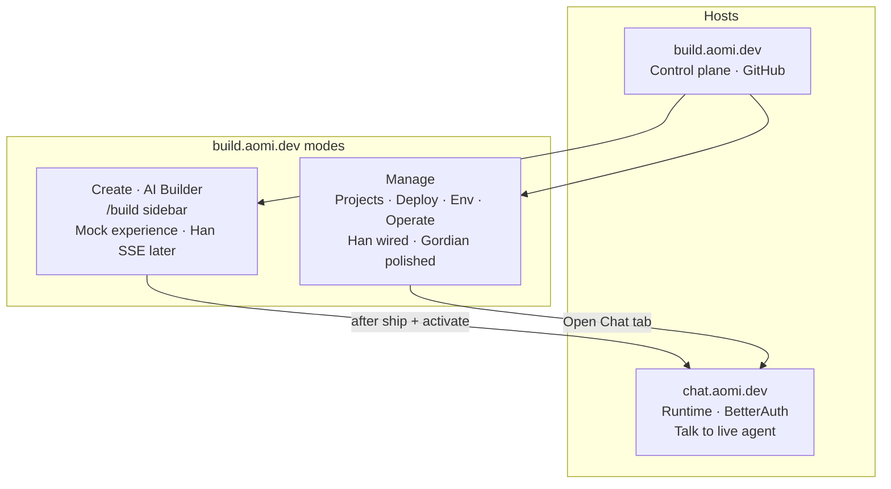
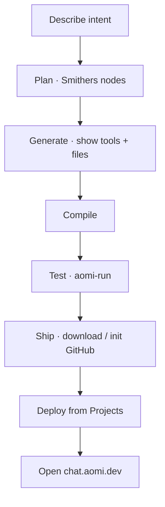
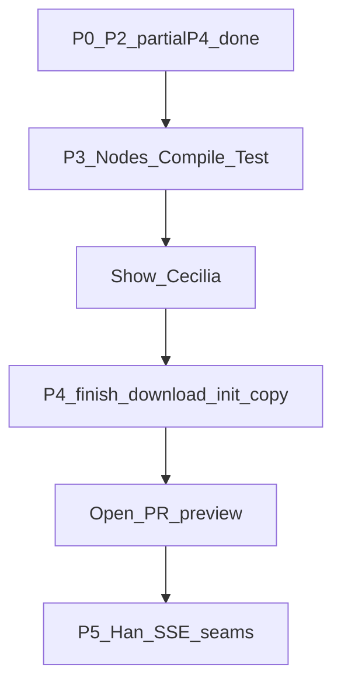
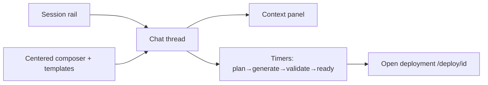
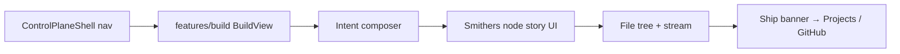
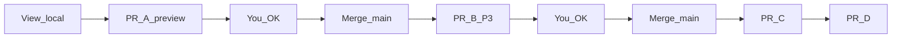
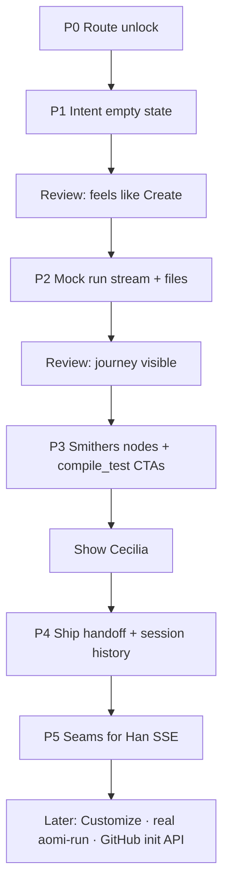

# Aomi Build — AI Builder (Create / “Chat Mock”) Plan

> **Status:** P0–P2 + partial P4 landed (craft port). **Next = P3** (nodes + compile/test) — biggest gap vs Cecilia sketches.  
> **App:** `aomi/apps/aomi-build` → [build.aomi.dev](https://build.aomi.dev)  
> **Reference mock:** `aomi-build` repo → `apps/portal` `/build`  
> **Owner:** Gordian (`0xgordian`) — experience + mock UI  
> **Backend / Smithers stream:** Han (`POST /api/build` + SSE — **not in product-mono yet**)  
> **Branch:** `feat/build-enable-route`  
> **Last updated:** 2026-07-14 (post-craft review)

Local source of truth for bringing the **AI Builder** onto the live control plane.  
Pair with a Scrum Board issue so Cecilia/Han can see status. This file alone is not team sync.

Related:

- [BUILDERS-EXPERIENCE.md](./BUILDERS-EXPERIENCE.md) — manage/deploy/operate polish (**mostly done**; do not reopen for chrome)
- [BILLING-EXPERIENCE.md](./BILLING-EXPERIENCE.md) — pay on Chat, not fake Build billing

---

## One-sentence goal

Ship a **nested-in-shell** Create experience on live `/build`: describe intent → Smithers-shaped plan/generate → review/compile → hand off to GitHub/Projects — using the **mock as craft reference**, not as a drop-in portal clone.

---

## Why this exists (Cecilia)

```text
@gordian how's the chat mock up… build page is more or less done…
focus on the next highest value… don't get yourself trapped
```

Decoded with product sketches + code:

| Phrase | Means |
|--------|--------|
| **Chat mock** | Chat-**like** AI Builder on **Build** (create), not `chat.aomi.dev` |
| **Build more or less done** | Manage/deploy/Environment clarity is good enough — stop trapping there |
| **Next highest value** | Create / generate journey mock inside live Build |
| **Don't get trapped** | Ship stages; don't polish Cursor chrome forever |

Architecture sketch (team):

- `chat.aomi.dev` — user runtime, BetterAuth, **no build**
- `build.aomi.dev` — builder, GitHub login, deploy/operate **and** (next) Create
- **Gordian** = mock experience → **Han** = wiring → **final** `build.aomi.dev`

Wireframe sketch (product journey):

1. Manage deployment (today — Projects/Operate)
2. Build new app — “what do u wanna build?” + Smithers nodes
3. Tool layer done → compile → aomi-run → download / init GitHub

---

## Platform map (truthful)

Two hosts. Build has **two modes**. Create is not a third product hostname.



### What exists in code today

```mermaid
flowchart LR
  subgraph mockRepo ["aomi-build repo MOCK"]
    MockBuild["/build\nImmersive BuildLayout\nComposer · sessions · stream\nlocalStorage timers"]
  end

  subgraph liveApp ["aomi/apps/aomi-build LIVE"]
    Shell["ControlPlaneShell"]
    Scaffold["/build BuildView\ncomposer · stream · files\nlocal mock pipeline"]
    BFF["/api/bff/*\ndeploy · operate · github"]
  end

  subgraph localGen ["Local generate today"]
    Smither["aomi-smither CLI\n+ Gateway"]
  end

  subgraph be ["product-mono"]
    Manager["platforms + github-app\nLIVE"]
    Planned["POST /api/build + SSE\nNOT IMPLEMENTED"]
  end

  MockBuild -.->|"reference only"| Scaffold
  Scaffold --> Shell
  Shell --> BFF --> Manager
  Scaffold -.x.-> Planned
  Smither --> Manager
```

| Layer | Path | Status |
|-------|------|--------|
| Mock Create UI | `aomi-build/.../app/build` | Strong prototype |
| Live `/build` | `apps/aomi-build/.../build` | Create craft in shell (local mock run) |
| Live manage/deploy | Projects / Operate BFFs | Live (Han) |
| Hosted Smithers API | `POST /api/build` | **Docs only** |
| Local Smithers | `aomi/packages/smither` | CLI exists |
| Runtime chat | `chat.aomi.dev` | Live; Build deep-links here |

---

## Product journey (correct target)

Not “prompt → dump code.” Workflow:



Every stage needs: loading · error · success · back · next (when interactive).

### Live journey stages (target naming)

1. **Describe** — intent in, not code  
2. **Plan** — Smithers nodes compose work  
3. **Generate** — review tool layer + source  
4. **Compile & test** — compile, then aomi-run  
5. **Ship** — download / init GitHub → manage on Projects  

**Honesty check after craft port:** stream UI still uses mock labels `plan → generate → validate → ready` (from original mock), mapped into journey chips. Visual pipeline ≠ full sketch yet — **no node cards, no explicit Compile / aomi-run buttons**. That is P3.

---

## Plan review (2026-07-14) — adjustments

Reviewed after craft port. Direction stays. Phase diagram and priorities update as follows:

| Finding | Adjustment |
|---------|------------|
| Sparse P1 was wrong; craft port fixed feel | Keep rule: **mock craft first**, thin scaffold never again |
| P1 + P2 + most of P4 landed in one craft slice | Treat P0–P2 + P4(banner/history) as **done on branch**; don't re-do |
| Still Cursor-ish (Plan/Multitask pills, model chip) | **Tighten before Cecilia demo**: drop or relabel Multitask; keep one honest “Local mock” chip |
| Cecilia wireframe = nodes + compile + aomi-run + download/init GitHub | **P3 is now the highest-value remaining product work** — not more timeline polish |
| Ship banner → Projects only; GitHub init Soon; no download | Finish P4 leftovers on P3 pass: mock **Download**, clearer init copy |
| File layout listed `smithers-nodes.tsx` | Still missing — create in P3 |
| Platform diagram said “Scaffold” | Already updated to craft pipeline — keep truthful |
| P5 Han seams not urgent for demo | Defer until after P3 + Cecilia stop gate |
| Risk: polish forever / get trapped | After P3 → **show Cecilia** → only then PR polish or P5 |

### Revised phase flowchart



---

## Mock vs target (do not confuse)

### Mock (`aomi-build` portal `/build`) — craft reference



Traits:

- Immersive **BuildLayout** (replaces dashboard chrome)
- Cursor-style Compose (model chips, Plan/Multitask, Customize marketplace)
- Fake stages as **progress labels in chat**, not node graph
- Handoff = **Deploy**, not GitHub ship

### Target (live control plane `/build`)



Traits:

- Nested in Han’s shell (no second global sidebar)
- Journey matches Cecilia sketches
- Mock driver until SSE; no fake manager APIs
- Manage stays on Projects/Operate

---

## Import policy

**Do not port wholesale.** Extract patterns into `features/build/`.

| Bring over (adapt) | Do not copy as-is |
|--------------------|-------------------|
| Composer empty-state feel / `composer-surface` | Immersive `BuildLayout` |
| `build-stream-timeline.tsx` | Deploy CTA → `/deploy/[id]` |
| `file-tree-preview.tsx` | Customize marketplace as MVP |
| Template gallery + template list | Monolithic mock `page.tsx` |
| Session types + `use-build-session` as **local mock** | `@/` aliases, custom Icon pack, heavy DropdownMenu stack |
| Ship-handoff **pattern** (rewrite CTAs) | Billing Upgrade card on rail |

Live already has many mock-era tokens in `globals.css` (`composer-surface`, `panel-row`, `action-pill`, `text-dim`, …).

---

## Rules (same spirit as BUILDERS-EXPERIENCE)

1. **Clarify, don't invent** — no fake `POST /api/build` responses painted as live.
2. **Nest in `ControlPlaneShell`** — never replace global nav with BuildLayout.
3. **Mock driver until Han SSE** — timers / localStorage OK if copy says mock / local.
4. **Reuse live patterns** — thin `page.tsx` → `features/*`; GitHub session; existing toasts.
5. **Smallest phase that reviews** — one vertical slice per PR when possible.
6. **Don't reopen manage polish** — Cecilia: Build manage is “more or less done.”
7. **Hand off to Projects** after Ship — don't invent a parallel deploy console on `/build`.

---

## Target file layout

```text
apps/aomi-build/src/
  app/(control-plane)/build/page.tsx          # thin re-export (exists)
  features/build/
    build-view.tsx                            # orchestrator (scaffold exists)
    contracts.ts                              # session / stage / node types
    templates.ts                              # starters from mock
    hooks/use-build-session.ts                # local mock driver
    storage/build-session-storage.ts
    components/
      intent-composer.tsx                     # describe CTA
      template-gallery.tsx
      smithers-nodes.tsx                      # plan visualization (sketch)
      build-stream-timeline.tsx
      file-tree-preview.tsx
      session-history.tsx                     # in-page, not immersive rail
      ship-handoff-banner.tsx                 # → Projects / GitHub copy
```

---

## PR track (how you review without rushing main)

You view **locally** (`pnpm run dev:aomi-build` → `/build`) and/or on the **Vercel preview** from each PR. Merge to `main` only after you OK — agents do not auto-merge.

| PR | Phase(s) | Branch | Status |
|----|----------|--------|--------|
| **PR-A** | P0 + P1 + P2 + partial P4 (craft in shell) | `feat/build-enable-route` | **[#343](https://github.com/aomi-labs/aomi/pull/343)** — review local/preview; merge when you OK |
| **PR-B** | P3 Smithers nodes + compile / aomi-run | `feat/build-p3-smithers-nodes` | Implement locally → PR after you OK |
| **PR-C** | P4 leftovers / polish only if needed | `feat/build-p4-ship-polish` | Likely skip — folded into P3 |
| **PR-D** | P5 Han SSE seams (no fake live) | `feat/build-p5-sse-seams` | After Han API or accepted stubs |



### Phase status board

| Phase | What | Done? | Ships in |
|-------|------|-------|----------|
| **P0** | Enable Build nav + `/build` route | Yes | PR-A |
| **P1** | Intent composer + templates + session chrome | Yes | PR-A |
| **P1 craft** | Mock feel nested in shell | Yes | PR-A |
| **P2** | Stream timeline + file tree + local timers | Yes | PR-A |
| **P3** | Smithers **nodes** + Compile + aomi-run | **No — next** | PR-B |
| **P4** | Ship banner + history | Partial (banner/history yes; download/init copy no) | Rest → PR-C |
| **P5** | `POST /api/build` client seams | No | PR-D |

---

## Implementation phases



### P0 — Route unlock ✅ (this branch)

- [x] Sidebar Build `enabled: true`
- [x] `/build` page + scaffold journey + disabled Start
- [ ] Merge when ready (PR) so staging shows Create surface

**Done when:** Click Build → no Soon, no 404.

### P1 — Intent empty state ✅ (this branch)

**Goal:** First viewport matches “what do you wanna build?”

- [x] Working **intent composer** (client-only)
- [x] Template gallery seeds prompts
- [x] Journey strip on empty + active session
- [x] Submit seeds a **local** session + active chrome (stream stub for P2)

**Source craft:** mock empty composer + template gallery  
**Skipped:** model picker DropdownMenu, Customize marketplace, immersive BuildLayout

**Done when:** Type arb-bot prompt → see active session chrome.

### P1 craft port ✅ (this branch)

Nested in `ControlPlaneShell` (not BuildLayout). Ported mock craft:

- [x] Composer surface + action pills; model chip **visual-only** (no DropdownMenu)
- [x] Chat messages + light markdown
- [x] Template gallery polish
- [x] Local mock pipeline plan→generate→validate→ready → journey stages
- [x] `build-stream-timeline` + `file-tree-preview` (main + lg context column)
- [x] `ship-handoff-banner` → `/projects` (not `/deploy/[id]`)
- [x] Thin in-page session history (xl left column) — no Upgrade rail
- [x] Honest “Local mock” labeling on timers / chips

### P2 — Mock run: stream + files ✅ (landed with craft port)

**Goal:** After submit, builder sees progress + artifacts.

- [x] Adapt `use-build-session` timers to **live stage names** (Describe→…→Ship)
- [x] `build-stream-timeline` + `file-tree-preview` in main / side column inside shell
- [x] Assistant/status copy with thin markdown; honest local-mock labeling

**Done when:** One click-through shows stream completing and a file tree appearing.

### P3 — Smithers nodes + compile / test affordances ✅ (branch `feat/build-p3-smithers-nodes`)

**Goal:** Closer to Cecilia wireframe than Cursor thread.

- [x] `components/smithers-nodes.tsx` — plan step shows **node cards**
- [x] Nodes derive from prompt (hype/binance openapi-gen, aomi-run, compose)
- [x] Explicit **Compile** and **Test with aomi-run** after generate (mock)
- [x] Ship unlocked only after both verify steps
- [x] Soften Cursor residue: drop Multitask pill
- [x] Mock **Download code** on ship banner; GitHub init copy = needs API

**Done when:** Local click-through: prompt → nodes → files → compile → aomi-run → download / Projects.

**Stop gate:** You review locally → open **PR-B** → merge only after OK. Cecilia Loom optional.

### P4 — Ship handoff + light history ✅ (mostly; leftovers folded into P3)

- [x] Banner: **Open Projects**
- [x] In-page session history
- [x] Never deep-link to mock portal `/deploy/[id]`
- [x] Download (mock)
- [x] GitHub init copy: “needs API”

### P5 — Han seams (no fake live)

Document + thin client stubs only:

```text
POST /api/build          # start (planned)
GET  /api/build/status   # SSE (planned)
```

- Feature flag or `MOCK_BUILD=1` default on
- When Han ships, swap driver behind `use-build-session`

**Out of scope until Han:** real codegen, real aomi-run, real GitHub create-repo from Build.

---

## Ownership

| Person | Owns |
|--------|------|
| **Gordian** | Journey, layout nested in shell, mock interactions, copy, empty/error/success |
| **Han** | Smithers hosted stream, GitHub create/init APIs, any compile/run remote |
| **Cecilia** | Sign-off on Create feel vs manage; node/compile priority |

---

## Explicit non-goals (MVP)

- Rebuilding mock portal as live app  
- Replacing `ControlPlaneShell`  
- Customize / plugins marketplace  
- Inventing Billing or Chat-portal UX on `/build`  
- Calling local timers “Smithers production”  
- More Projects/Deployments chrome polish  

---

## Click-through checklist (every phase)

1. Sidebar **Build** clickable → `/build`  
2. Empty Create state readable without explaining  
3. Run mock once → stages advance → files or nodes appear  
4. Ship → Projects (or clear disabled reason)  
5. Global nav still works (Overview / Projects / Operate)  
6. Mobile: usable enough; craft remains desktop-first  

If anything feels more like Cursor than Aomi Create → cut chrome, keep journey.

---

## Done enough (show Cecilia)

- `/build` is Create, not another dashboard page  
- Prompt → **Smithers nodes visible** → generate/files → **compile / aomi-run affordances** → ship toward GitHub/Projects  
- Manage path untouched and still the place for deploy/operate  
- Honest mock labeling until Han SSE  
- Not stuck polishing Cursor pills

---

## Quick reference: repos

| Repo / path | Role |
|-------------|------|
| `aomi-build` (standalone) | Historical mock portal — **reference** |
| `aomi/apps/aomi-build` | Live control plane — **implement here** |
| `aomi/packages/smither` | Local CLI generate — parallel track, not this UI yet |
| `product-mono` manager | Deploy/operate live; `/api/build` absent |

---

## Next action

1. **PR-A** [#343](https://github.com/aomi-labs/aomi/pull/343) — view locally / Vercel preview; merge only when you OK (not auto).  
2. On `feat/build-p3-smithers-nodes`: `pnpm run dev:aomi-build` → `/build` → arb prompt → nodes → compile → aomi-run → download.  
3. When P3 feels right → push + **PR-B** (still no merge until you say).  
4. **PR-D** later for Han SSE seams only.
