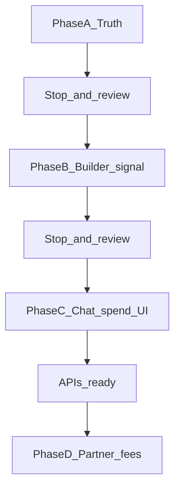
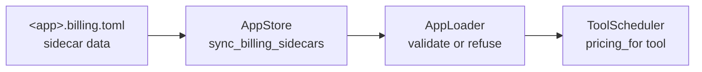
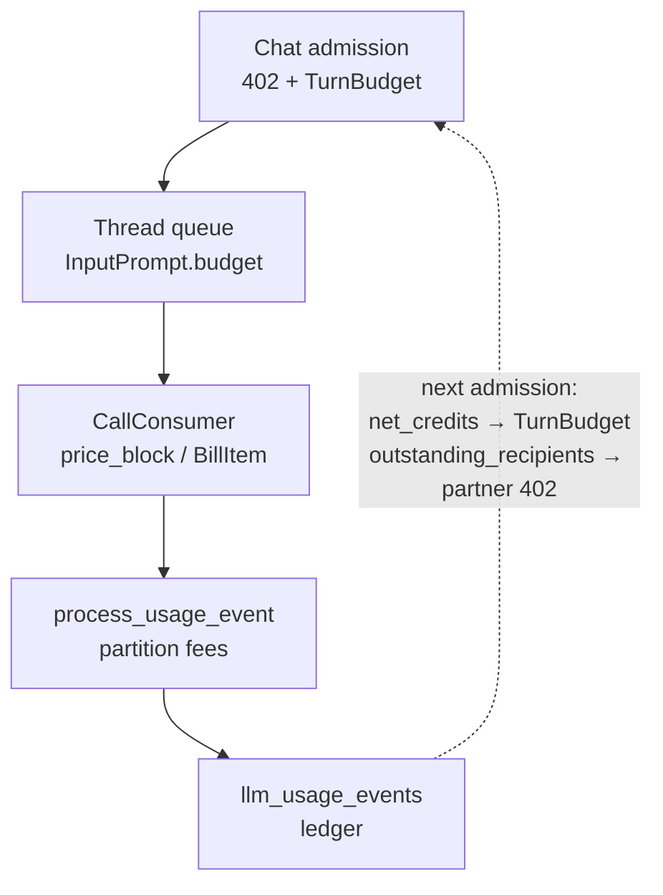
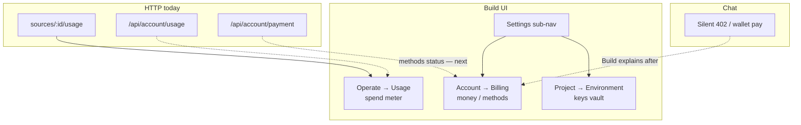

# Aomi Build — Billing Experience Plan

> **Status:** Phase A merged; option A — methods point to Chat (Build has no AccountBearer)  
> **App:** `aomi/apps/aomi-build` → [build.aomi.dev](https://build.aomi.dev)  
> **Owner:** Gordian (`0xgordian`)  
> **Last updated:** 2026-07-13

Execution plan for the **billing experience** on Build.  
Not a payments product. Not a rewrite of Kevin’s rails. Not fake invoice UI.

**Team visibility:** Pair with a Scrum Board issue when useful. This file is the local source of truth for Gordian’s UI/IA work.

---

## Scope

Work only in `aomi/apps/aomi-build`. Teach the billing mental model on surfaces that already exist.

---

## Lane (so we stay on team direction)

| Own (UI / IA) | Not own (unless asked) |
|---|---|
| Where builders/users *see* spend, caps, empty states | x402 / Tempo / ledger / `billing.toml` runtime |
| Account → Billing as an honest page | Partner settlement math, treasury |
| Linking Usage ↔ Billing ↔ Environment | New payment APIs (unless already exposed) |

**Rules:** reuse Kevin/Han wiring; smallest fix that answers *Where am I? What is this? What next?*; no Vercel Billing clone; no mocks that look like live invoices.

---

## Mental model (what the UI must teach)

| Surface | Job |
|---|---|
| **Project → Environment** | Builder vault — API keys so the app can run |
| **Operate → Usage** | Meter — credits / tokens already spent |
| **Account → Billing** | Money / plan — methods now; balance / invoices *when HTTP exists* |
| **Chat** | Pay in the moment — silent 402; Build explains after |

Environment ≠ Billing. Usage ≠ broken Billing.

Cursor-style ownership: **Usage = spend charts; Billing = payment / account money; Chat = paywall moment.**

---

## How the backend works (product-mono, code-checked)

Verified against `product-mono` (not wishful APIs). Control plane loads prices; data plane admits, meters, charges, persists; chat closes the loop on the *next* admission.

### Control plane — sidecar load & bind

- Missing file = free app; invalid file = refuse load.
- Pure data — never compiled, never crosses FFI.
- Unlisted / zero-price tools stay free.
- **Build:** no toml editor. Phase B badge only when a *read* API exists for priced tools / sidecar presence.

### Data plane — admit → meter → charge → persist → feed back

| Hop | What happens | UI? |
|---|---|---|
| Admission | `compute_turn_budget`; partner settlement may 402 first | Chat only |
| Guard | `pricing_for` → block or dispatch; charge on success only | Chat (`payment_required`) |
| Persist | Aomi fees → turn `credits_used`; partner → `{event}:fee:{recipient}` | Ledger; not a Build page yet |
| Feedback | `net_credits` / `outstanding_recipients` at **next** chat gate | Internal today — no HTTP |

### HTTP available to UI today

| Endpoint | Returns | Build home |
|---|---|---|
| `GET …/sources/:id/usage` | Daily credits/tokens + breakdown | **Operate → Usage** (live) |
| `GET /api/account/usage` | Tier `credit_used` vs `credit_paid` (cap) + per-app | Portal / optional Build mirror |
| `GET /api/account/payment` | `{ byok, streams }` — **methods only** | Account → Billing (can wire next) |

### Exists in code, **not** HTTP yet

| Symbol | Used for | UI implication |
|---|---|---|
| `TokenHandler::net_credits` | Turn budget at admission | Do **not** invent balance from Usage rollups |
| `outstanding_recipients` | Partner 402 `pay_to` | Phase D needs a read API |
| `AppBillingConfig` / pricing registry | App load bind | Phase B needs a presence/catalog read |

---

## UI map — now vs should

| Surface | Like Cursor… | Now | Should (still backend-true) |
|---|---|---|---|
| **Operate → Usage** | Usage / spend charts | Live meter + honest copy | Period polish; don’t mix partner fee rows into LLM meter |
| **Account → Billing** | Settings → Billing | Phase A guidance + links | Wire **payment methods** from `GET /api/account/payment`; later balance / partner debt when HTTP wraps existing DB helpers |
| **Project → Environment** | Project secrets | Shipped; Secrets stays on Settings until explicit CTA (#320) | Unchanged |
| **Chat** | Paywall moment | 402 in-band | Stay out of Build |

**Do not build:** `billing.toml` editor · fake invoices · fake balance from Usage · account-wide secret store · Build “Pay now” duplicate of chat 402.

---

## Phase A — Truth before chrome (must-ship first)

**Goal:** Billing stops lying. Cross-links teach the map.

| Change | Action |
|---|---|
| `settings-data.ts` billing copy | Honest: invoices later; spend today → Usage; secrets → Environment |
| `SettingsBillingPanel` | Honesty: methods → Chat account; Usage + Secrets + Open Chat; no invoice / no fake BYOK status |
| `[section]/page.tsx` | Render panel when `slug === "billing"`; enable navigation to the page |
| Settings sub-nav | `SettingsNav` + `SettingsLayout` on all `/settings` routes; Overview + sections from `settings-data.ts`; Planned/Available/Project-scoped badges |
| Overview + Usage | One sentence: credits meter ≠ partner fees / Billing is for money-plan later |
| Secrets entry (#320) | Single-project: stay on Settings + **Open Environment** CTA (no auto-redirect) |

**Do not:** fake invoices, balance widgets, `billing.toml` editors, payment forms.

**Done when:** Nobody thinks Billing is a vault or that Usage is “broken Billing.”

**Stop gate:** Open Account → Billing on staging. Does it feel like guidance, not a dead stub or a fake product?

---

## Phase B — Builder readiness (later)

Thin signal only when an API exposes priced tools / `billing.toml`: badge or Details note (“this app may charge users”).  
No Build form for editing `billing.toml` until product asks.

**Stop gate:** Only start after Phase A feels solid **and** a read API exists (code today: load-time only).

---

## Phase C — Chat-user spend (when APIs *and* Build account auth ready)

**Blocker (2026-07-13):** `GET /api/account/payment` exists, but Build is
GitHub-session only. Proxy does not allowlist `/api/account/*`, and
`resolveCanonicalUserId` is a no-op — no AccountBearer. A live methods fetch
would 404/401.

**Shipped (option A):** Billing teaches BYOK / Tempo live on the **Chat
account**, links Open Chat + Usage + Secrets, and keeps “Not available yet”
for balance/invoices. No fake method status.

**Later (option B):** Wire BetterAuth → AccountBearer into Build, allowlist
`GET /api/account/payment`, then show real BYOK/Tempo status. After that:
balance / `net_credits` only when HTTP wraps those helpers.

Chat keeps silent 402.

---

## Phase D — Partner fee visibility (later)

Only when ledger exposes partner debt / `BillItem`s over HTTP: line items “Paid to partner X”; optional tx hash → Transactions.  
Until then partner settlement stays chat-runtime (`outstanding_recipients` at admission).

---

## Click-through checklist (Phase A)

1. Settings sidebar: Overview + all sections visible; active route highlighted  
2. Settings → Billing opens (not greyed-out dead)  
3. Payment methods copy points to **Chat account** (not a fake Build methods list)  
4. Copy points to **Operate → Usage** for spend  
5. Copy points to **Secrets / Environment** for API keys  
6. Secrets with one project: stay on Settings until **Open Environment**  
7. Open Chat link works  
8. Overview / Usage helper doesn’t imply partner fees are shown there yet  
9. No invoice table or mock balance / “Tempo: Connected” 

---

## North star

A builder can configure an app that runs without chat users pasting keys; a chat user can understand what they’re paying for without opening a fake finance dashboard.
