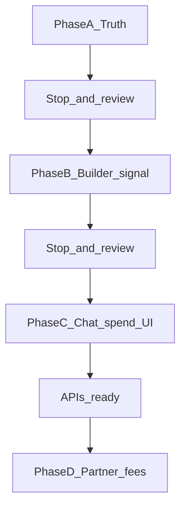

# Aomi Build — Billing Experience Plan

> **Status:** Phase A done — stop for staging click-through  
> **App:** `aomi/apps/aomi-build` → [build.aomi.dev](https://build.aomi.dev)  
> **Owner:** Gordian (`0xgordian`)  
> **Branch:** `feat/builders-billing-experience-phase-a`  
> **Last updated:** 2026-07-12

Execution plan for the **billing experience** on Build.  
Not a payments product. Not a rewrite of Kevin’s rails. Not fake invoice UI.

**Team visibility:** Pair with a Scrum Board issue when useful. This file is the local source of truth for Gordian’s UI/IA work.

---

## Scope

Work only in `aomi/apps/aomi-build`. Teach the billing mental model on surfaces that already exist.

---

## Lane (so we stay on team direction)

| Own (UI / IA) | Not own (unless asked) |
|---|---|
| Where builders/users *see* spend, caps, empty states | x402 / Tempo / ledger / `billing.toml` runtime |
| Account → Billing as an honest page | Partner settlement math, treasury |
| Linking Usage ↔ Billing ↔ Environment | New payment APIs |

**Rules:** reuse Kevin/Han wiring; smallest fix that answers *Where am I? What is this? What next?*; no Vercel Billing clone; no mocks that look like live invoices.

---

## Mental model (what the UI must teach)

| Surface | Job |
|---|---|
| **Project → Environment** | Builder vault — API keys so the app can run |
| **Operate → Usage** | Meter — credits / tokens already spent |
| **Account → Billing** | Money / plan — balance, methods, invoices *when wired* |
| **Chat** | Pay in the moment — silent 402; Build explains after |

Environment ≠ Billing. Usage ≠ broken Billing.

---

## Phase A — Truth before chrome (must-ship first)

**Goal:** Billing stops lying. Cross-links teach the map.

| Change | Action |
|---|---|
| `settings-data.ts` billing copy | Honest: invoices later; spend today → Usage; secrets → Environment |
| `SettingsBillingPanel` | Client island: guidance + links (Usage, Secrets/Environment path) — no invoice UI |
| `[section]/page.tsx` | Render panel when `slug === "billing"`; enable navigation to the page |
| Settings sub-nav | `SettingsNav` + `SettingsLayout` on all `/settings` routes; Overview + sections from `settings-data.ts`; Planned/Available/Project-scoped badges |
| Overview + Usage | One sentence: credits meter ≠ partner fees / Billing is for money-plan later |

**Do not:** fake invoices, balance widgets, `billing.toml` editors, payment forms.

**Done when:** Nobody thinks Billing is a vault or that Usage is “broken Billing.”

**Stop gate:** Open Account → Billing on staging. Does it feel like guidance, not a dead stub or a fake product?

---

## Phase B — Builder readiness (later)

Thin signal only when an API exposes priced tools / `billing.toml`: badge or Details note (“this app may charge users”).  
No Build form for editing `billing.toml` until product asks.

**Stop gate:** Only start after Phase A feels solid.

---

## Phase C — Chat-user spend (when APIs ready)

Account → Billing becomes real: balance / net credits, payment method status, spend caps (if API allows), link to Usage, empty = how to top up / connect wallet.  
Chat keeps silent 402.

---

## Phase D — Partner fee visibility (later)

Only when ledger exposes partner `BillItem`s: line items “Paid to partner X”; optional tx hash → Transactions.

---

## Click-through checklist (Phase A)

1. Settings sidebar: Overview + all sections visible; active route highlighted  
2. Settings → Billing opens (not greyed-out dead)  
3. Copy points to **Operate → Usage** for spend  
4. Copy points to **Secrets / Environment** for API keys  
5. Overview / Usage helper doesn’t imply partner fees are shown there yet  
6. No invoice table or mock balance  

---

## North star

A builder can configure an app that runs without chat users pasting keys; a chat user can understand what they’re paying for without opening a fake finance dashboard.
