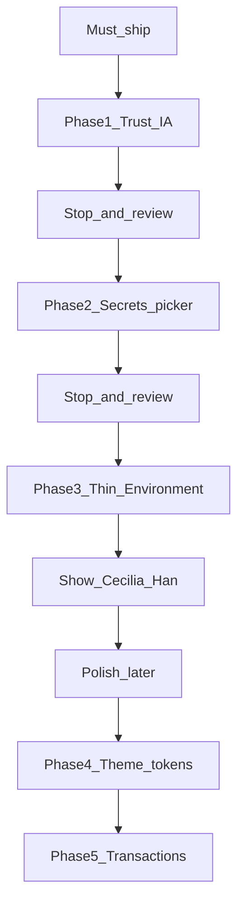
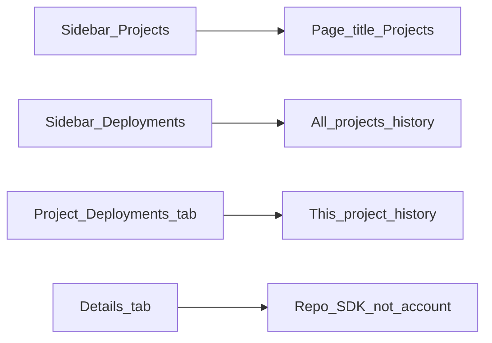
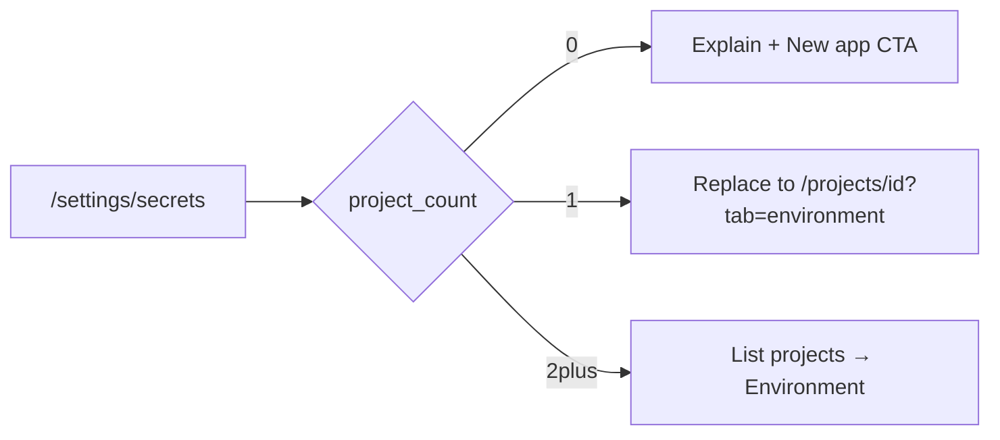
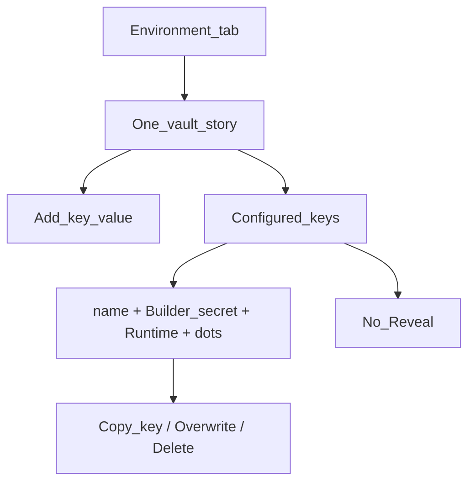
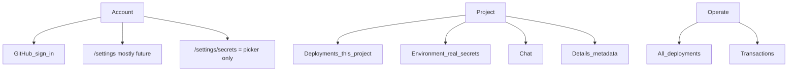

# Aomi Build — Builders' Experience Plan

> **Status:** Phase 1 in progress (trust & IA)  
> **App:** `aomi/apps/aomi-build` → [build.aomi.dev](https://build.aomi.dev)  
> **Owner:** Gordian (`0xgordian`)  
> **Branch:** `feat/builders-experience-phase-1`  
> **Last updated:** 2026-07-12

Execution plan for improving the **builders' experience** on Han's live Build app.  
Not a redesign. Not a backend task. Not a rebuild of the mock portal.

**Team visibility:** This file is the local source of truth for the work. Pair it with a Scrum Board issue (and optional `aomi-scrum` handoff) so Cecilia/Han can see status. Do not treat this markdown alone as team sync.

---

## Scope

Work only in `aomi/apps/aomi-build`. Improve builders' experience on what Han already shipped.

**Not** a redesign. **Not** a backend task. **Not** a rebuild of the mock.

---

## Rules (so we don't spoil Han's work)

1. **Clarify, don't invent** — every change must answer: *Where am I? What is this? What do I do next?*
2. **Reuse his wiring** — `useProjects`, `useProjectDetail`, secrets BFF, operate APIs. No parallel data layer.
3. **Smallest fix that works** — prefer a string/label change over a component rewrite.
4. **Keep his behavior** — deploy promote/deactivate, write-only vault, GitHub session, existing routes.
5. **One phase → pause → click-through** before the next. No "while we're here."
6. **If unsure it was intentional** — leave it; note it. Don't guess-improve.

---

## Product principles

- Builders own applications.
- Builders configure environments.
- Builders manage secrets.
- End users should never think about API keys.
- Every page should clearly answer: Where am I? What am I looking at? What should I do next?
- Avoid dead ends. Prefer guidance over documentation. The UI should teach the product.
- Direction: closer to **Vercel** than a traditional dashboard — without cloning Vercel feature-for-feature.

---

## Hard constraint

Backend returns **secret names only**. Values are write-only.

**Reveal is impossible** without a new API → **out of scope**.  
UI may show masked `••••` as a *status affordance*, never as a real reveal control.

---

## Must-ship vs polish later

| Tier | Phases | Why |
|---|---|---|
| **Must-ship** | 1 → 2 → thin 3 | Trust + Cecilia's builder-secrets rule |
| **Polish later** | 4 → 5 | Only after 1–3 feel solid; don't block the product story |

---

## Phase 1 — Trust & IA (must-ship)

**Goal:** Fix "where am I?" without visual redesign.

| Change | File | Action |
|---|---|---|
| Projects title | `src/features/launch/components/deployments/project-index.tsx` | h1 `Deployments` → **Projects**; project-first subtitle |
| Tab rename | `src/features/launch/components/deployments/project-page.tsx` | Label `Settings` → **Details**; keep `id: "settings"` |
| Global copy | `src/features/launch/components/deployments/global-deployments-list.tsx` | "Deployment history across all projects." |
| Project copy | `src/features/launch/components/deployments/tabs/deployments-tab.tsx` | "Deployment history for this project." |
| Empty states (**thin**) | Projects, global Deployments, project Deployments, Environment, Transactions only | Why empty + one next action |

**Do not** empty-state every panel in the app in this phase.

**Done when:** Projects isn't mislabeled; Details ≠ Account Settings; global vs project Deployments are verbally distinct; worst empties aren't dead ends.

**Stop gate:** Click Projects → open project → Global Deployments. Does it make sense?

---

## Phase 2 — Account → Secrets = project picker (must-ship)

**Goal:** `/settings/secrets` teaches "secrets live on projects." Never a fake vault.

| Piece | Action |
|---|---|
| `src/app/(control-plane)/settings/[section]/page.tsx` | Keep server page; render client island when `slug === "secrets"` |
| New `SettingsSecretsPanel` (client) | Uses `useProjects`; lists / routes only |
| `src/app/(control-plane)/settings/settings-data.ts` | Remove broken `actionHref` to `/operate/deployments?tab=environment` |
| Links | Only `/projects/{id}?tab=environment` |

**Do not** add a secret editor on this page.

**Done when:** No dead button; 0 / 1 / 2+ behaviors work; builders land in Environment.

**Stop gate:** Open `/settings/secrets` signed in. Does it feel like guidance, not a broken settings page?

---

## Phase 3 — Thin Environment (must-ship, highest product value)

**Goal:** Honest builder vault — **not** a Vercel clone.

Primary: `src/features/launch/components/deployments/tabs/environment-tab.tsx`  
APIs unchanged: `loadSecrets` / `setEnvVars` / `deleteEnvVar`

**Do:**
- One vault story (stop implying Env vs Secret are different backends)
- Configured rows: name, badges, `••••`, Copy key / overwrite / Delete
- Empty copy: builders set keys here; chat users never paste them
- Keep multi-app scope tabs when needed

**Don't:**
- Provider grouping (OpenAI / Anthropic / …)
- Reveal
- New APIs
- Full tab chrome redesign

**Done when:** Cecilia's rule is obvious in the UI.

**Stop gate:** Show Cecilia/Han. Ready for chat work only after this feels clear — Phase 4–5 are optional polish.

---

## Phase 4 — Theme consistency (polish later)

**Goal:** Same dark shell language. Token swap only — no redesign.

Restyle zinc/`bg-white` on project/deploy surfaces:
`project-page`, `project-index`, `project-header`, `project-row`, `global-deployments-list`, tabs, shared `deployments/ui/*`

Leave Overview / Operate / New app alone (already dark).

**Diff should look like class renames**, not a new design system.

**Only start after Phase 3 stop gate passes.**

---

## Phase 5 — Transactions (polish later)

**Goal:** Slightly denser operate table from fields already on the wire.

`src/features/operate/operate-view.tsx`: keep Time / App / Status / Chain / To / Hash; add `fromAddress`, `value`, `description`; better empty state; truncate addresses.

No new filters product.

---

## Onboarding (threaded, not a new system)

No separate onboarding product. Guide via Phase 1 empties + existing New app / Onboarding wizard:

| Moment | Next action |
|---|---|
| Not signed in | Continue with GitHub |
| No projects | New app |
| No deploys | Deploy CTA on project |
| No env vars | Environment empty + builder copy |
| Account Secrets | Phase 2 picker |

---

## Mental model (what the UI must teach)

**Account** = sidebar group (Settings + GitHub session), not a separate page.  
**Two Settings:** Account `/settings` vs project **Details** tab (renamed from Settings) — do not conflate them.

**Cecilia rule:** builders set secrets on **Project → Environment**. Chat users never paste API keys.

---

## Out of scope

- Sidebar / nav redesign  
- Backend, APIs, auth, deploy architecture  
- Chat / Smithers Build page  
- Reveal / value read-back  
- Global account secret store  
- Provider-grouped env UI  
- New onboarding system  

---

## Commit order

**Must-ship**
1. Projects title + Details tab  
2. Deployment scope copy + thin empty states  
3. Settings secrets → project picker  
4. Thin Environment vault UX  

**Then pause for review**

**Polish later**
5. Dark tokens on project/deploy pages  
6. Transactions density  

---

## Click-through checklist (every phase)

1. Sign out → sign in  
2. Projects → open a project  
3. Global Deployments vs project Deployments tab  
4. Account Settings → Secrets  
5. Project → Environment  

If anything feels worse than before → revert that piece.

---

## Done enough (before chat work)

- Projects isn't mislabeled  
- Secrets path isn't a dead end  
- Environment clearly owns builder secrets  
- Theme/txs either done or consciously deferred  

---

## Team sync (how others know)

| Channel | Use |
|---|---|
| This file | Local execution plan + stop gates |
| Scrum Board issue | Team-visible "what Gordian is working on" |
| PR on `aomi` | Reviewable code + file touch list |
| `aomi-scrum` handoff | Only when packaging context for a teammate |

Skills in `product-mono/.agents/skills` (`track-work-on-kanban`, `handoff-bridge`) are **how** agents publish to the board / `aomi-scrum` — they do not replace a board card or PR.

---

## One sentence

**Ship Phases 1 → 2 → thin 3 with stop gates, reuse Han's wiring, and only then polish theme and transactions — that's the builders' experience plan.**

Say **start Phase 1** when ready to implement.
