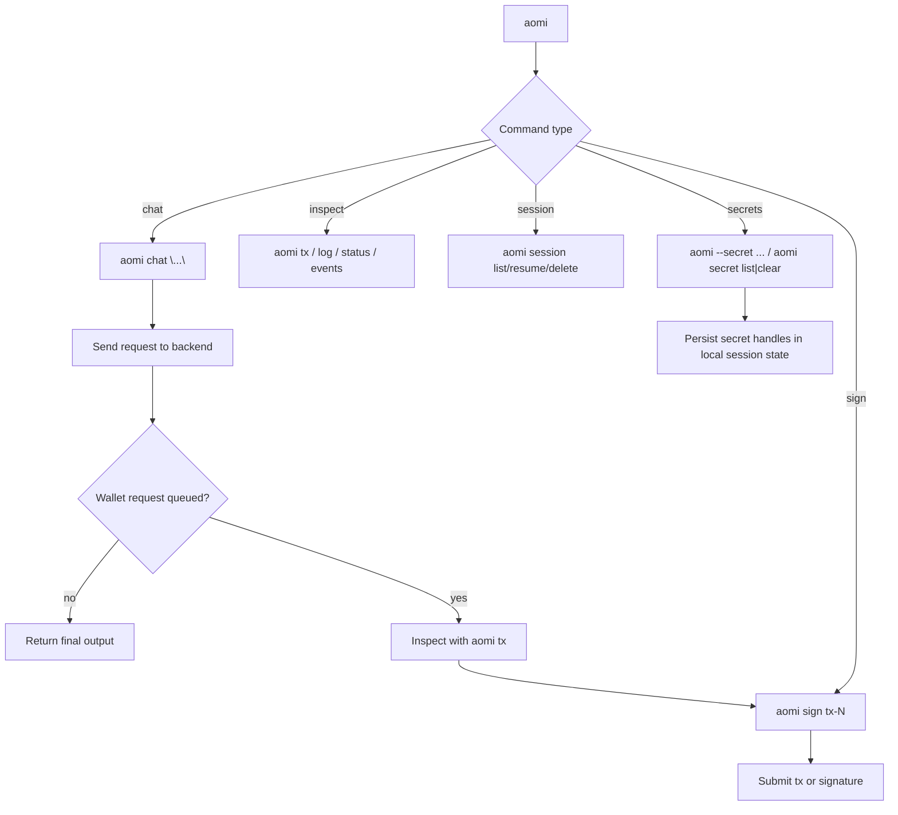
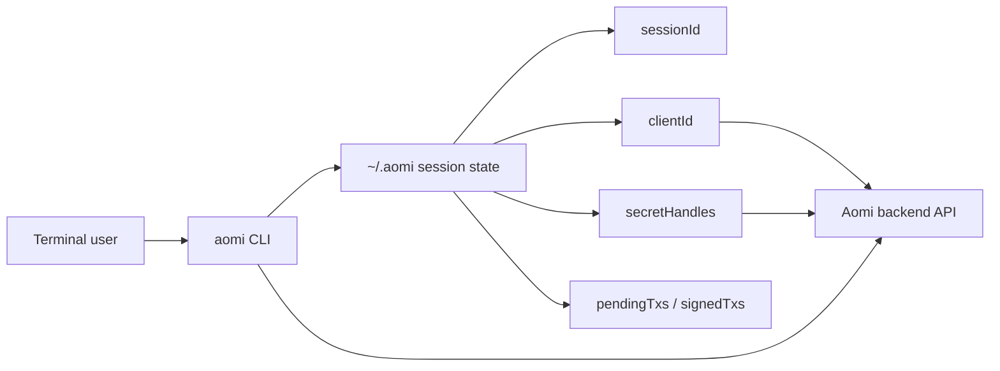

# AOMI CLI

The current Aomi CLI ships with [`@aomi-labs/client`](https://www.npmjs.com/package/@aomi-labs/client) and exposes the `aomi` executable.

Use it to:

- chat with an Aomi backend from the terminal
- persist and resume local sessions
- inspect pending wallet requests and sign them
- ingest per-session secrets with `aomi --secret ...` or `aomi secret ...`

## Installation

### One-off usage

```bash
npx @aomi-labs/client --version
npx @aomi-labs/client --help
```

### Global install

```bash
npm install -g @aomi-labs/client
aomi --version
aomi --help
```

## Core Commands

```bash
aomi chat "swap 1 ETH for USDC"
aomi chat "swap 1 ETH for USDC" --model claude-sonnet-4
aomi chat "swap 1 ETH" --verbose

aomi app list
aomi app current

aomi model list
aomi model current
aomi model set claude-sonnet-4

aomi chain list
aomi --version

aomi secret list
aomi secret clear
aomi --secret ALCHEMY_API_KEY=... TENDERLY_ACCESS_TOKEN=...

aomi session list
aomi session resume session-2
aomi session delete session-2

aomi log
aomi tx
aomi sign tx-1 --private-key 0x...
aomi status
aomi events
aomi close
```



## Secrets

The CLI supports per-session secret ingestion. This is the feature that lets the backend refer to opaque handles instead of raw secret values.

### Ingest secrets

```bash
aomi --secret ALCHEMY_API_KEY=sk_live_123
```

You can ingest multiple values in one call:

```bash
aomi --secret \
  ALCHEMY_API_KEY=sk_live_123 \
  TENDERLY_ACCESS_TOKEN=tok_456
```

You can also prepend `--secret` to another command. The CLI ingests the values first, then runs the command:

```bash
aomi --secret ALCHEMY_API_KEY=sk_live_123 chat "check my Base wallet activity"
```

### Inspect or clear secrets

```bash
aomi secret list
aomi secret clear
```

`aomi secret clear` removes all configured secrets for the active session.

## Transaction Flow

The backend prepares wallet requests. The CLI stores them locally and submits them when you call `aomi sign`.

```bash
$ aomi chat "swap 1 ETH for USDC on Uniswap" --public-key 0xYourAddr --chain 1
⚡ Wallet request queued: tx-1
Run `aomi tx` to see pending transactions, `aomi sign <id>` to sign.

$ aomi tx
Pending (1):
  ⏳ tx-1  to: 0x3fC9...7FAD  value: 1000000000000000000  chain: 1

$ aomi sign tx-1 --private-key 0xabc...
Signer:  0xYourAddr
IDs:     tx-1
Kind:    transaction
Exec:    aa (alchemy, 7702; fallback: eoa)
✅ Sent! Hash: 0xabc123...
```

## Signing Modes

`aomi sign` supports three modes:

- default: account abstraction first, then automatic EOA fallback
- `--aa`: require account abstraction and do not fall back
- `--eoa`: force direct EOA execution

You can further constrain AA execution with:

- `--aa-provider alchemy|pimlico`
- `--aa-mode 4337|7702`

## Options

These flags match the current CLI help output:

| Flag                    | Env               | Description                                              |
| ----------------------- | ----------------- | -------------------------------------------------------- |
| `--backend-url`         | `AOMI_BASE_URL`   | Backend URL                                              |
| `--api-key`             | `AOMI_API_KEY`    | API key for non-default apps                             |
| `--app`                 | `AOMI_APP`        | App name                                                 |
| `--model`               | `AOMI_MODEL`      | Model rig to apply before chat                           |
| `--secret <NAME=value>` | —                 | Ingest secret values for the active session              |
| `--public-key`          | `AOMI_PUBLIC_KEY` | Wallet address shared with the agent                     |
| `--private-key`         | `PRIVATE_KEY`     | Hex private key for `aomi sign`                          |
| `--rpc-url`             | `CHAIN_RPC_URL`   | RPC URL for transaction submission                       |
| `--chain`               | `AOMI_CHAIN_ID`   | Chain ID (`1`, `137`, `42161`, `8453`, `10`, `11155111`) |
| `--verbose`, `-v`       | —                 | Stream tool calls and agent responses live               |
| `--version`, `-V`       | —                 | Print the installed CLI version                          |

## Session State

The CLI is not a daemon. Each command starts, reads local state, talks to the backend, and exits.

By default it stores session files under `~/.aomi/`:

- `sessionId`: active backend conversation
- `clientId`: stable client identity used for secret handles
- `model`: last selected model
- `publicKey`: persisted wallet address
- `chainId`: persisted active chain
- `secretHandles`: ingested secret handles for the session
- `pendingTxs`: unsigned wallet requests
- `signedTxs`: completed transactions



## Examples

```bash
# Start a session
aomi chat "hello"

# Switch models
aomi model set gpt-5

# Inject a secret, then use it immediately
aomi --secret ALCHEMY_API_KEY=sk_live_123 chat "simulate a swap on Base"

# Review local session state
aomi status
aomi log

# Close the active local session pointer
aomi close
```
