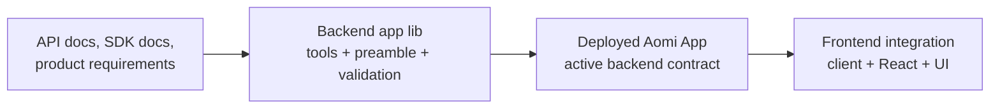
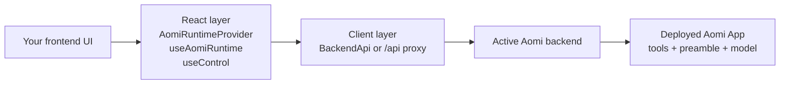

# Build and Deploy an External App

This guide is for teams building an Aomi App end to end. That usually means two connected pieces:

- the **backend app lib** that defines tools, preamble, and runtime behavior
- the **frontend** that connects to the deployed Aomi backend and gives users a product surface

In this page, **Aomi App** means the backend app Aomi hosts for your tools, preamble, model configuration, and optional RAG or MCP integrations.

For external apps, the current product flow is dynamic: the host loads published app bundles at runtime, and the frontend discovers app availability from the backend rather than bundling app-specific logic into the UI.

## The two layers of work



If you still need to create or change the app lib, start with `aomi-build`. If the app contract already exists and you just need to ship the UI, skip to the frontend integration sections below.

## Current external app path

In the current product monorepo, external apps follow this shape:

1. Build the app lib and publish it as a plugin bundle.
2. Let the host fetch and load that bundle dynamically.
3. Expose the loaded app through backend control endpoints.
4. Let the frontend fetch authorized apps and optionally preselect one by URL.

That means your frontend usually does **not** import per-app code. It integrates with the generic Aomi runtime, and the backend decides which apps are actually available in the current environment.

### What makes this different from a built-in app

For a built-in app, the backend already knows about the app because it ships with the host.

For an external dynamically loaded app:

- you publish a bundle separately from the frontend
- the backend host fetches and validates that bundle
- the app only becomes selectable after the host has loaded it
- the frontend discovers it through backend control APIs instead of hardcoding it locally

## 1. Build the backend app lib with `aomi-build`

The repo's `aomi-build` skill lives at `packages/client/skills/aomi-build/SKILL.md`. It exists specifically for building or updating the backend Aomi app lib from:

- API docs or OpenAPI specs
- SDK documentation
- repository examples
- endpoint notes
- product requirements

Use it when you still need to turn a product surface into a clean Aomi app with semantically useful tools and a good preamble.

### What `aomi-build` is for

`aomi-build` is not a frontend helper. Its job is to shape the backend app contract that the frontend will later consume.

It is designed to help you:

- reduce a product surface into the right tool set
- choose the primary user workflow to optimize first
- scaffold or update `lib.rs`, `client.rs`, and `tool.rs`
- write a preamble that matches real tool behavior and confirmation rules
- validate the app crate against the SDK build flow

### How `aomi-sdk` fits into the workflow

In practice, `aomi-build` should leave you with an app crate that fits the public `aomi-sdk` dynamic-plugin layout.

Reference repo: [aomi-sdk on GitHub](https://github.com/aomi-labs/aomi-sdk)

The current SDK workspace expects apps to live like this:

```text
apps/my-app/
├─ Cargo.toml
└─ src/
   ├─ lib.rs
   ├─ client.rs
   └─ tool.rs
```

- `lib.rs` holds the app manifest, preamble, and `dyn_aomi_app!` registration
- `client.rs` owns HTTP client setup, auth, models, and normalization
- `tool.rs` implements the actual tools and typed args

That means `aomi-build` is best thought of as the authoring assistant for an `aomi-sdk` app crate, not as a separate deployment system.

### Expected output from the skill

The default output is an Aomi app lib with a clear file split:

| File | Responsibility |
| --- | --- |
| `lib.rs` | Manifest wiring, tool registration, preamble |
| `client.rs` | HTTP client, auth, models, normalization |
| `tool.rs` | Tool definitions and model-facing descriptions |

You should reach for `aomi-build` before frontend work when:

- the tool surface is still unclear
- the preamble does not exist yet
- the app crate needs to be scaffolded
- you are adding new endpoints or product workflows
- the app behavior still needs validation in the SDK

### Using `aomi-sdk` to scaffold and build the lib

In the current SDK repo, the standard path is:

```bash
# scaffold a new app crate
cargo xtask new-app my-app

# build one plugin locally
cargo xtask build-aomi --app my-app

# build release output
cargo xtask build-aomi --app my-app --release
```

The `new-app` command creates the standard file split and prints the expected next steps:

1. edit the preamble in `src/lib.rs`
2. add the HTTP client in `src/client.rs`
3. implement the tools in `src/tool.rs`
4. build with `cargo xtask build-aomi --app my-app`

When the build succeeds, `xtask` compiles the app as a dynamic plugin, copies the built library into the SDK workspace `plugins/` directory, and validates the plugin manifest before keeping the artifact.

The app manifest itself is registered from `lib.rs` with `dyn_aomi_app!`, following the same pattern as the SDK template app.

### Local validation with product-mono

If you want to test the app lib against the current host without publishing a release first, the current product-mono dev flow supports local plugin workspaces:

```bash
LOCAL_AOMI_APPS=/path/to/aomi-sdk bash scripts/dev.sh --local-apps
```

That path builds plugins from the local SDK workspace with:

```bash
cargo xtask build-aomi
```

and then points the host at those locally built plugin libraries instead of fetching the latest published bundle.

### Recommended backend workflow

1. Start with the real product surface: API, SDK, RPC, or runnable service.
2. Define the smallest useful first tool set.
3. Build or update the app lib with `aomi-build`.
4. Compile the app with `aomi-sdk` and validate the plugin locally.
5. Publish a bundle that the host can load dynamically.
6. Validate one representative end-to-end workflow.
7. Deploy that app so the frontend can target a stable backend contract.

### Current host loading contract

In the current product monorepo, dynamic apps are loaded as published plugin bundles rather than hardwired backend registrations. The important behavior to match is:

- the host selects bundles by release tag
- the host validates bundle metadata before installing it
- the host rejects bundles built against the wrong SDK version
- the frontend only sees apps that the backend has successfully loaded and authorized

For practical purposes, treat the SDK version and the released app bundle as one compatibility contract. If the host SDK line and the published app bundle drift apart, the app may publish successfully but still fail to load.

The current host-side app loading knobs exposed by product-mono are:

- `APP_RELEASE_TAG`
- `AOMI_APPS_REPO`
- `AOMI_APPS_POLL_SECS`

The important practical rule is: a bundle that does not match the host's SDK expectations can download successfully and still never become available to users.

### How deployment works after the lib builds

The current [`aomi-sdk`](https://github.com/aomi-labs/aomi-sdk) release path is:

If you want the public source repo for this workflow, use [aomi-sdk on GitHub](https://github.com/aomi-labs/aomi-sdk).

1. develop or update the app in the SDK repo
2. open a PR to `main`
3. let CI build and validate plugins
4. merge forward to `publish`
5. let the release workflow cross-compile and publish a GitHub Release bundle
6. let product-mono fetch that release and hot-load the plugin bundle

So the deployment artifact is not a frontend build and not a raw Rust crate alone. The deployable unit is the published plugin bundle generated from the `aomi-sdk` workspace.

For the current host, `APP_RELEASE_TAG` chooses which published bundle line to fetch, while SDK-version matching decides whether the bundle is actually loadable.

For deeper platform details, keep [App Backend Reference](/docs/build/services/app-backend-reference) and [Integration Guide](/docs/build/integration-guide) alongside this page.

## What "active backend" means

Once the backend app lib is deployed, your frontend does not contain the Aomi runtime itself. It only needs to know which backend URL to talk to for the current environment.

- **Local** -- `http://localhost:8080`
- **Hosted** -- `https://api.aomi.dev`
- **Proxy** -- your own `/api` route that forwards requests to the current Aomi backend

If you deploy the same frontend to preview and production with different environment variables, it will automatically follow whichever backend is active in that environment.

## 2. Frontend wiring against the deployed app



The important separation is:

- **Client layer** handles transport and backend access.
- **React layer** handles live UI state, threads, streaming, wallet state, and control state.
- **Your UI layer** renders the product experience on top.

In the current product frontend, app choice is runtime-driven:

- the frontend fetches available apps from the backend
- app authorization depends on the current API key and user context
- URL query params can preselect the requested app before the first interaction

That runtime path is much closer to how external apps behave in the current product than a frontend that hardcodes one app at build time.

## 3. Set deployment environment variables

At minimum, give the frontend a backend URL:

```bash
NEXT_PUBLIC_BACKEND_URL=https://api.aomi.dev
```

If this frontend should always open a specific app, also set the app name and scoped API key:

```bash
NEXT_PUBLIC_BACKEND_URL=https://api.aomi.dev
NEXT_PUBLIC_AOMI_APP=mycoindex
NEXT_PUBLIC_AOMI_API_KEY=sk-your-app-key
```

Use that approach only when you intentionally want one frontend deployment pinned to one app context. For product-mono-style integrations, app access is usually discovered dynamically from the backend instead of compiled into the frontend.

If you prefer same-origin browser requests, point the React runtime at your own app and proxy `/api/*` to Aomi from the server side:

```bash
NEXT_PUBLIC_BACKEND_URL=/
AOMI_PROXY_BACKEND_URL=https://api.aomi.dev
```

That pattern matches the kind of `app/api/[...slug]/route.ts` proxy used in this repo's landing app.

### Current product-mono frontend pattern

The current product frontend resolves backend access like this:

- `backendUrl` prop if you pass one
- otherwise `NEXT_PUBLIC_BACKEND_URL`
- otherwise `http://localhost:8080`

It also supports runtime app preselection via `?app=` or `?aomi_app=` in the URL, then refreshes authorized apps from the backend.

### URL preselection example

If your frontend supports the current product-mono pattern, these can point the UI at a requested app before the user interacts:

```text
/chat?app=pelagos
/chat?aomi_app=pelagos
```

That does not guarantee the app will be usable. The backend still has to authorize and expose it in the current environment.

## 4. Mount the runtime once near the top of the app

Use `AomiRuntimeProvider` to connect the frontend to the active backend. Then seed the app and API key with `useControl` if you want the UI to boot into one specific Aomi App.

```tsx
"use client";

import { useEffect } from "react";
import { AomiRuntimeProvider, useControl } from "@aomi-labs/react";

function BootstrapAomiApp() {
  const { setState } = useControl();

  useEffect(() => {
    setState({
      apiKey: process.env.NEXT_PUBLIC_AOMI_API_KEY ?? null,
      app: process.env.NEXT_PUBLIC_AOMI_APP ?? "default",
    });
  }, [setState]);

  return null;
}

export function Providers({ children }: { children: React.ReactNode }) {
  return (
    <AomiRuntimeProvider backendUrl={process.env.NEXT_PUBLIC_BACKEND_URL!}>
      <BootstrapAomiApp />
      {children}
    </AomiRuntimeProvider>
  );
}
```

If you want the user to switch apps or paste API keys manually, keep the ControlBar visible instead of hard-wiring those values at startup.

If you want the current product-mono behavior more closely, pair runtime provider setup with:

- `getAuthorizedApps()` to fetch the current backend-visible app list
- URL-based requested app handling
- runtime API key application rather than only build-time env injection

That combination is the key difference between:

- a simple demo integration pinned to one app
- a production-style frontend that can surface externally loaded apps as they become available

## 5. Choose the right layer for the job

Both the widget and headless paths sit on top of the same backend contract, but they solve different problems.

| Layer | Use it for | Primary exports |
| --- | --- | --- |
| **Client layer** | Server actions, route handlers, non-React code, custom proxying, direct backend access | `BackendApi`, raw `/api/*` calls |
| **React layer** | Live chat UI, thread state, streaming, app/model selection, wallet state | `AomiRuntimeProvider`, `useAomiRuntime`, `useControl`, `useUser` |
| **Widget layer** | Fastest path to a complete chat product | `AomiFrame` |

### Client layer

Use the client layer when you need direct access to Aomi outside React. Good fits include server-side helpers, custom auth flows, API route proxies, or non-visual integrations.

```ts
import { BackendApi } from "@aomi-labs/react";

const api = new BackendApi(process.env.NEXT_PUBLIC_BACKEND_URL!);
```

### React layer

Use the React layer when you are building the actual frontend surface. This is where thread state, streaming responses, wallet state, notifications, and control state live.

- `AomiRuntimeProvider` wires your tree to the backend
- `useAomiRuntime` gives you threads, messages, and send/cancel actions
- `useControl` manages model, app, and API key selection
- `useUser` manages wallet and user state

This is the right layer when you want a custom layout but still want Aomi's runtime behavior.

## 6. Deploy so the frontend follows the backend

For most teams, deployment is mostly environment management:

1. Point `NEXT_PUBLIC_BACKEND_URL` at the correct Aomi backend for each environment.
2. Keep any pinned app or bootstrap API key aligned with that backend.
3. If you use wallet connect, deploy the matching Para and WalletConnect keys in the same environment.
4. Redeploy after environment changes so the client boots against the new active backend.

If the backend endpoint changes later, you usually do not need to rewrite frontend code. Update the deployment environment variables, redeploy, and the same runtime/provider setup will reconnect to the new backend.

For dynamically loaded external apps, also verify that:

- the backend host is pointed at the intended app bundle release
- the published bundle matches the host SDK line
- the app appears in the backend-authorized app list before you debug the frontend

## Build Checklist

- `aomi-build` or an equivalent SDK workflow has produced the backend app lib
- the app bundle is published in the format expected by the current host
- the tool set and preamble reflect the real product workflow
- the app crate is validated before frontend integration starts
- `NEXT_PUBLIC_BACKEND_URL` points at the intended backend or proxy
- `AomiRuntimeProvider` is mounted once near the root
- `useControl` or the ControlBar sets the intended app and API key
- authorized apps can be fetched from the backend in the target environment
- wallet providers are present if the app needs signing or transaction flows
- preview and production environments use matching backend/app/API key sets

## Next Steps

- [App Backend Reference](/docs/build/services/app-backend-reference) -- deeper backend reference for tools, preambles, model config, and app structure
- [Integration Guide](/docs/build/integration-guide) -- connect your APIs, tools, deployed app, and client surface end to end
- [Apps and Authentication](/docs/build/namespaces) -- understand how app access, API keys, and sessions are resolved
- [Aomi API](/docs/build/services/api-reference) -- review the backend HTTP endpoints your client and runtime call
- [Headless Library](/docs/build/ui/headless/install) -- install `@aomi-labs/react` for a custom frontend
- [AomiFrame](/docs/build/ui/widget/aomi-frame) -- use the pre-built widget shell when you do not need a fully custom UI
