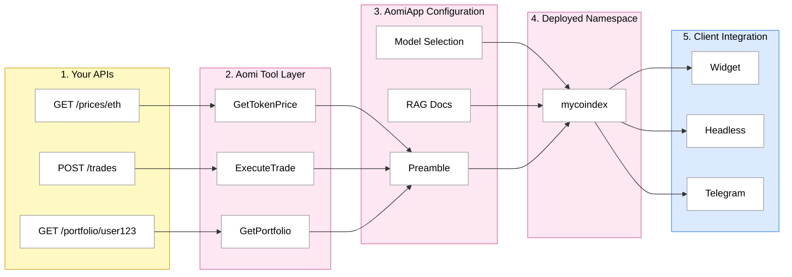

# Integration Guide

This guide walks through the full-stack integration process — from your existing APIs to a deployed Aomi App that your users can interact with across web, Telegram, and other channels. We use **MyCoinDex**, a fictional crypto exchange, as the running example.

To work with us on an integration, [please contact us](https://aomi.dev/contact).

## The Pipeline



**1. Your APIs** — Your backend is responsible for maintaining its own user state. Notice `GET /portfolio/user123` passes a user ID because the Aomi App is stateless — it only retains conversation history, not your application state. Your APIs handle authentication, user data, and business logic as they normally would.

**2. Aomi Tool Layer** — Each tool wraps one or more of your API endpoints. A one-to-one mapping is not required. You can aggregate multiple endpoints into a single tool so the LLM's context stays clean and semantically coherent. For example, a `GetMarketOverview` tool might call both `/prices` and `/orderbook` internally. What matters is that each tool makes sense as a discrete action the AI would choose to take.

**3. AomiApp Configuration** — Your system prompt (preamble) should clearly explain what each tool does, when to use it, and your business logic constraints. The LLM's performance depends directly on how well the preamble describes the Aomi App's role and rules. Model selection affects cost, latency, and reasoning quality. If you need a document store for FAQs, guides, or knowledge bases, we can set up RAG ingestion as part of the integration.

**4. Deployed Namespace** — Aomi compiles and deploys the configured Aomi App as an isolated namespace on our hosted platform. Each namespace gets a scoped API key and a dedicated chat endpoint. Deployment and scaling are managed by Aomi.

**5. Client Integration** — You are responsible for your own product surface. Use any combination of our SDK, component library, or Telegram bot framework to integrate the deployed Aomi App into your frontend. We provide assistance throughout the integration process.

### 1. Your APIs

MyCoinDex exposes standard HTTP endpoints. Aomi does not modify them — your APIs stay exactly as they are. The only requirement is that they are reachable over HTTP.

| Endpoint | Method | Description |
| --- | --- | --- |
| `/prices/{symbol}` | GET | Current token price |
| `/trades` | POST | Execute a trade |
| `/portfolio/{userId}` | GET | User portfolio and P&L |
| `/markets` | GET | Available trading pairs |
| `/orderbook/{pair}` | GET | Order book depth |

Your backend owns all user state. The Aomi App is stateless — it retains conversation history but nothing about your users, balances, or sessions. That's why `GET /portfolio/user123` passes a user ID explicitly. Your APIs continue to handle authentication, authorization, and business logic as they normally would.

### 2. Aomi Tool Layer

Aomi wraps your endpoints as **tools** — typed functions the LLM can invoke during a conversation. Each tool has a name, a description so the model knows when to use it, and typed input parameters.

A one-to-one mapping between endpoints and tools is not required. You can aggregate multiple endpoints into a single tool so the LLM's context stays clean and semantically coherent. For example, a `GetMarketOverview` tool might call both `/prices` and `/orderbook` internally. What matters is that each tool makes sense as a discrete action the AI would choose to take — everything needs to be semantically meaningful.

Tools can execute concurrently. If the model needs both a price and a portfolio balance to answer a question, it calls both tools in parallel rather than sequentially.

### 3. AomiApp Configuration

Three settings define the Aomi App's behavior.

**Preamble** — The system prompt that shapes the AI's personality, constraints, and rules. Your preamble should clearly explain what each tool does, when to use it, and your business logic constraints. The LLM's performance depends directly on how well the preamble describes the Aomi App's role and rules. A well-written preamble keeps the AI on-task and prevents it from overstepping.

```
You are the MyCoinDex trading agent. You help users check
prices, manage portfolios, and execute trades.

Always confirm with the user before executing a trade.
Show prices in USD unless the user requests otherwise.
Never provide financial advice or price predictions.
```

**Model Selection** — Different models have different strengths. Claude excels at nuanced reasoning, GPT-4o is strong at structured output, and smaller models like Haiku or GPT-4o Mini are faster and cheaper for simpler interactions. Models can be changed at runtime — no redeployment needed.

| Provider | Models |
| --- | --- |
| Anthropic | Claude Sonnet, Claude Haiku |
| OpenAI | GPT-4o, GPT-4o Mini |
| OpenRouter | Access to 100+ models |

**RAG Document Store** — If you have documentation, FAQs, or knowledge base articles, we can set up RAG ingestion as part of the integration. The AI searches these documents when answering questions that go beyond what the tools can provide.

### 4. Deployed Namespace

Aomi compiles and deploys the configured Aomi App as an isolated **namespace** on our hosted platform. A namespace bundles tools, preamble, model, and credentials into a single addressable endpoint.

```
Namespace:  "mycoindex"
Endpoint:   POST /api/chat?namespace=mycoindex
Tools:      GetTokenPrice, ExecuteTrade, GetPortfolio, ListMarkets
Preamble:   MyCoinDex trading agent
Model:      Claude Sonnet (default, switchable)
```

Each namespace is fully isolated. MyCoinDex's tools, preamble, and configuration do not affect other namespaces on the platform. Deployment and scaling are managed by Aomi — you receive a scoped API key and a dedicated chat endpoint.

### 5. Client Integration

You are responsible for your own product surface. Aomi provides the SDK, component library, and Telegram bot framework — use any combination to integrate the deployed Aomi App into your frontend. We provide assistance throughout the integration process.

| Path | Install | Best For |
| --- | --- | --- |
| Widget (shadcn) | `npx shadcn add https://aomi.dev/r/aomi-frame.json` | Quick integration, standard chat UI |
| Headless Library | `npm install @aomi-labs/react` | Custom designs, maximum control |
| Telegram Bot | Managed by Aomi | Reaching users without frontend deployment |

## Next Steps

- [Agentic Application](/docs/agentic-application) — how Apps, namespaces, and API keys fit together.
- [API Reference](/docs/build/services/api-reference) — full HTTP endpoint documentation.
- [Sessions](/docs/build/services/sessions) — how chat sessions are created and managed.
