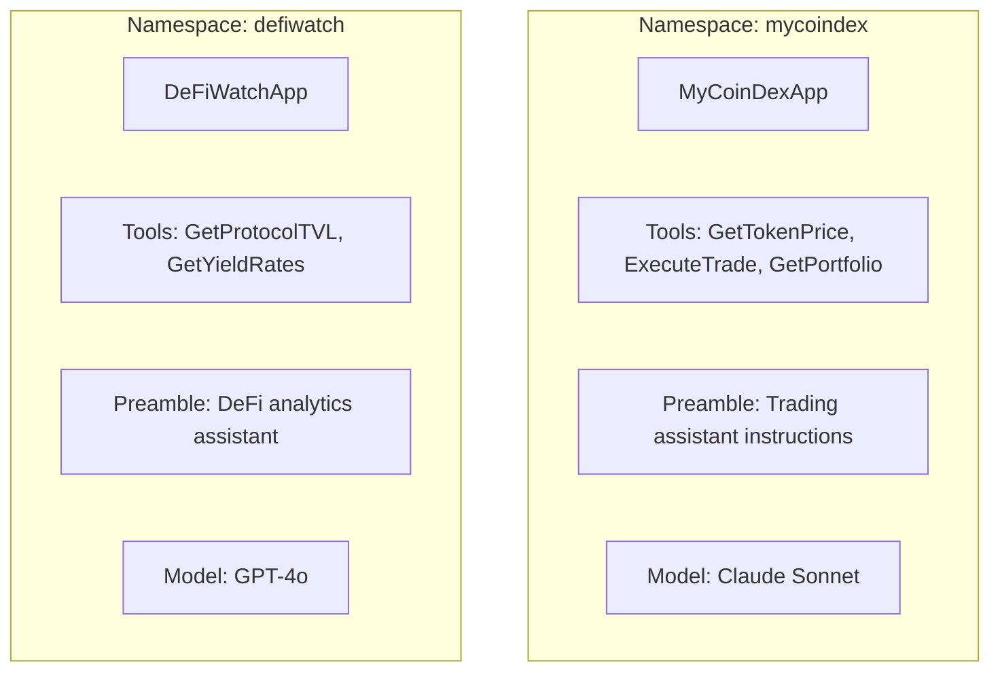
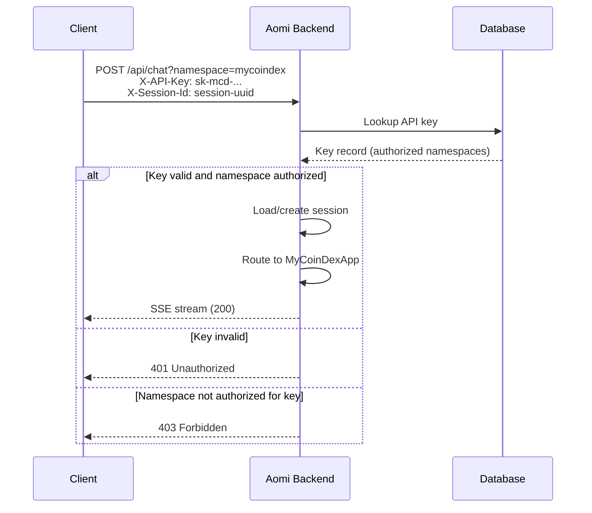

# Namespaces and Authentication

Every Aomi-powered assistant runs inside a **namespace**. This page explains how namespaces, API keys, and sessions work together to provide isolated, authenticated access to your AI assistant.

## What is a Namespace?

A namespace is a self-contained AI assistant environment. It encapsulates:

| Component | Description | Example |
| --- | --- | --- |
| **Tools** | The API-backed functions the assistant can call | `GetTokenPrice`, `ExecuteTrade` |
| **Preamble** | The system prompt defining personality and rules | "You are the MyCoinDex assistant..." |
| **Model config** | Default LLM and available alternatives | Claude Sonnet, GPT-4o |
| **RAG docs** | Optional document store for domain knowledge | MyCoinDex FAQ, API docs |

Each namespace maps to an **AomiApp** -- the backend construct that bundles these components:



Namespaces are fully isolated. MyCoinDex's tools and configuration have no visibility into other namespaces.

## API Keys

API keys are issued by Aomi and scoped to one or more namespaces.

### Key Properties

| Property | Description |
| --- | --- |
| **Scoped** | Each key authorizes access to specific namespaces |
| **Stored securely** | Keys are hashed and stored in the database |
| **Revocable** | Keys can be deactivated without affecting the namespace |

### How Keys Are Used

Include the API key in the `X-API-Key` header on every request:

```bash
curl -X POST https://api.aomi.dev/api/chat?namespace=mycoindex \
  -H "X-API-Key: sk-mcd-a1b2c3d4e5f6" \
  -H "X-Session-Id: 550e8400-e29b-41d4-a716-446655440000" \
  -H "Content-Type: application/json" \
  -d '{"text": "What is the price of ETH?"}'
```

### Key Scoping

A single key can authorize multiple namespaces:

```
Key: sk-mcd-a1b2c3d4e5f6
Authorized: ["mycoindex", "mycoindex-staging"]
```

Or a namespace can have multiple keys (e.g., production vs. development):

```
Key: sk-mcd-prod-...  → ["mycoindex"]
Key: sk-mcd-dev-...   → ["mycoindex-staging"]
```

## Authentication Flow



### Step by Step

1. Client sends a request with `X-API-Key` and `X-Session-Id` headers.
2. Backend looks up the API key in the database.
3. Backend checks if the key authorizes the requested namespace (from the `?namespace=` query parameter).
4. If authorized, the request proceeds to the appropriate AomiApp.
5. If not, the request is rejected with a `401` or `403` status.

## Sessions

Sessions represent conversation threads. They are identified by a UUID sent in the `X-Session-Id` header.

### Session Properties

| Property | Description |
| --- | --- |
| **ID** | Client-generated UUID |
| **Messages** | Full conversation history |
| **Wallet binding** | Optional association with a wallet address (public key) |
| **Processing status** | Idle, processing, or interrupted |

### Session Lifecycle

Sessions are loaded using a three-tier strategy:

1. **Memory cache** -- check if the session is already active in memory.
2. **Database** -- load persisted session from PostgreSQL.
3. **Create new** -- if not found, create a fresh session.

### Wallet Binding

Sessions can optionally be associated with a wallet address. This enables:

- Cross-session context (the assistant knows the user's wallet)
- Wallet-aware tool calls (portfolio queries scoped to the user)
- Persistent history tied to a public key

```
Session: 550e8400-e29b-41d4-a716-446655440000
Wallet:  0x742d35Cc6634C0532925a3b844Bc9e7595f2bD68
Chain:   Ethereum (1)
```

## Default Namespace

Aomi provides a `default` namespace that is accessible without an API key. This is useful for:

- Public demos
- Evaluation and testing
- Development before you receive your production key

The default namespace has general-purpose tools but no custom configuration. For production use, always use a scoped API key with your own namespace.

## Headers Reference

| Header | Required | Description |
| --- | --- | --- |
| `X-API-Key` | For non-default namespaces | Your Aomi API key |
| `X-Session-Id` | Yes | UUID identifying the conversation session |
| `Content-Type` | For POST requests | `application/json` |

## Next Steps

- [API Reference](/docs/build/api-reference) -- full endpoint documentation with request/response formats.
- [Sessions](/docs/build/sessions) -- deep dive into session management, threads, and persistence.
- [Quickstart](/docs/build/quickstart) -- get a working integration in 5 minutes.
