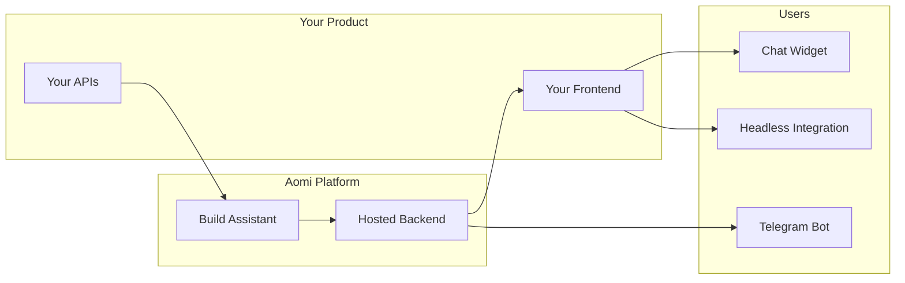

# Overview

Aomi is agentic AI infrastructure. You provide your APIs, we build and host an AI assistant that can call them. You integrate it into your frontend with a few lines of code.

## How It Works



1. **You provide your APIs** -- REST endpoints, data feeds, trading actions, whatever your product does.
2. **Aomi wraps them as AI tools** -- each API becomes a tool the assistant can invoke during conversations.
3. **We deploy a hosted assistant** -- configured with your branding, instructions, and model preferences.
4. **Users interact** -- via an embedded chat widget, a headless integration, or a Telegram bot.

## Key Features

### Streaming Responses

Responses stream in real-time via Server-Sent Events. Text appears as the model generates it, with tool calls and results displayed inline.

### Tool Calling

Your APIs become AI-callable tools. When a user asks something that requires data or an action, the assistant calls the appropriate tool, processes the result, and responds naturally. Multiple tools can execute concurrently.

### Wallet Integration

Built-in Web3 wallet support via Reown AppKit. Users can connect wallets, sign transactions, and interact with on-chain data within the chat interface.

### Multi-Model Support

Choose from Anthropic (Claude), OpenAI (GPT-4), or models via OpenRouter. Switch models at runtime without redeploying.

## Integration Paths

| | Widget (shadcn) | Headless Library | Telegram Bot |
| --- | --- | --- | --- |
| **Setup time** | Minutes | Hours | Managed by Aomi |
| **Install method** | `npx shadcn add` | `npm install` | No frontend code |
| **UI included** | Full chat interface, sidebar, controls | None -- build your own | Telegram-native |
| **Customization** | Edit copied source files | Build from scratch | Bot commands and panels |
| **Dependencies** | `@aomi-labs/react`, `@assistant-ui/react`, shadcn primitives | `@aomi-labs/react`, `@assistant-ui/react` | None |
| **Framework** | Next.js (React) | Any React app (API client works anywhere) | N/A |
| **Code ownership** | Components copied to your project | Library imported from npm | Hosted by Aomi |
| **Best for** | Quick integration, standard chat UI, projects using shadcn/ui | Fully custom designs, non-standard layouts, maximum control | Reaching users on Telegram without frontend deployment |

### Widget (shadcn)

Pre-built UI components installed via the shadcn CLI. Complete chat interface out of the box, with every line of source code editable.

```bash
npx shadcn add https://aomi.dev/r/aomi-frame.json
```

### Headless Library

Pure logic distributed as an npm package. Hooks, providers, API client, and utilities -- zero UI opinions.

```bash
npm install @aomi-labs/react
```

### Telegram Bot

Aomi hosts the bot and connects it to the same backend and tools as the widget. No frontend deployment needed.

## Shared Foundation

Both frontend paths use the same core:

- **`@aomi-labs/react`** provides all runtime logic: `AomiRuntimeProvider`, `useAomiRuntime`, `useControl`, `useUser`, and the `BackendApi` client.
- **Same backend API** endpoints for chat, threads, models, namespaces, and wallet operations.
- **Same authentication** via API keys and wallet addresses.

The widget is built on top of the headless library. Installing the widget pulls in `@aomi-labs/react` as a dependency automatically.

**Start with the widget** if you want results quickly. The source code is copied into your project, so you can customize or replace individual components later.

**Start with the headless library** if you have an existing design system and want to integrate Aomi logic into your own components from day one.

## Platform Support

| Platform | Support |
| --- | --- |
| **Next.js 15** | Primary target. App Router with Server Components. |
| **React 18 / 19** | Supported via `@aomi-labs/react` and shadcn components. |
| **Modern Browsers** | Chrome, Firefox, Safari, Edge (latest 2 versions). |

## Next Steps

- [Quickstart](/docs/build/quickstart) -- get a working chat widget in 5 minutes.
- [How It Works](/docs/build/how-it-works) -- technical deep dive into the platform pipeline.
- [Widget Installation](/docs/build/ui/widget/aomi-frame) -- install the full UI.
- [Headless Library](/docs/build/ui/headless/install) -- install the headless package.
