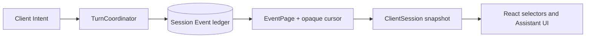

# Sessions

A session is one durable ordered Event ledger. The client chooses a session ID,
submits typed Intents, and advances through the ledger with an opaque cursor.
Messages, tool/task updates, titles, lifecycle transitions, errors, and Actions
share that one order.



## Start a turn

```ts
const sessionId = crypto.randomUUID();
const page = await fetch("/v1/agent/chat", {
  method: "POST",
  headers: {
    "Content-Type": "application/json",
    "Idempotency-Key": crypto.randomUUID(),
  },
  body: JSON.stringify({
    sessionId,
    message: "Hello",
    app: "mycoindex",
    userState: { connection: { is_connected: false } },
  }),
}).then((response) => response.json());
```

`UserState` contains client facts only: connection provider, EVM/SVM wallet
identity, preferences, and extensions. Pending execution, leases, lifecycle,
and transaction authority are not client state.

## Follow the Event cursor

```ts
let cursor = page.cursor;

while (true) {
  const next = await fetch(
    `/v1/agent/chat/${sessionId}?cursor=${encodeURIComponent(cursor)}&wait=25000`,
  ).then((response) => response.json());

  cursor = next.cursor;
  render(next.events);

  if (
    next.events.some(
      (event) =>
        event.type === "turn_state_changed" &&
        ["complete", "interrupted", "failed"].includes(event.state),
    )
  ) break;
}
```

Do not infer lifecycle from timers, message presence, or Actions. The latest
`turn_state_changed` Event is authoritative. An invalid or expired cursor
returns a typed cursor error; recover by polling without a cursor.

## Actions

An Action is a durable Event. Its nested `request` contains the complete EVM,
SVM, or signing payload. Submit the result with the Action ID and revision;
the backend validates ownership, compatibility, revision CAS, and idempotency
before resuming the turn.

## Thread management

The React thread store owns only selection, list metadata, persistence keys,
and drafts. Each thread keeps its own `ClientSession` snapshot and opaque
cursor, so switching away and back does not rebuild or duplicate Events.

## Next steps

- [API Reference](/guides/build/services/api-reference)
- [Headless React hooks](/guides/build/ui/headless/hooks)
