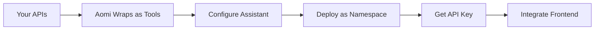

# For Businesses

This guide walks through how a company goes from having a product with APIs to having a fully deployed AI assistant. We use **MyCoinDex**, a fictional crypto exchange, as a running example.

## The Journey



## Step 1: You Have a Product with APIs

MyCoinDex is a crypto exchange with REST endpoints for:

- **Price feeds** -- `GET /prices/{symbol}` returns real-time token prices.
- **Trading** -- `POST /trades` executes buy/sell orders.
- **Portfolio** -- `GET /portfolio/{userId}` returns holdings and P&L.
- **Market data** -- `GET /markets` lists available trading pairs.

These are standard HTTP APIs. They do not need to be modified for Aomi.

## Step 2: Aomi Wraps Your APIs as AI Tools

Each of MyCoinDex's endpoints becomes an AI-callable tool:

| API Endpoint | Tool Name | What the AI Can Do |
| --- | --- | --- |
| `GET /prices/{symbol}` | `GetTokenPrice` | Look up current prices when users ask |
| `POST /trades` | `ExecuteTrade` | Place trades on behalf of the user |
| `GET /portfolio/{userId}` | `GetPortfolio` | Show users their holdings |
| `GET /markets` | `ListMarkets` | List available trading pairs |

When a user asks "What's the price of ETH?", the assistant calls `GetTokenPrice` with `symbol: "ETH"`, gets the result, and responds naturally.

## Step 3: We Configure the Assistant

Aomi configures three things for MyCoinDex:

### Preamble (Personality and Instructions)

The preamble tells the AI who it is and how to behave:

```
You are the MyCoinDex trading assistant. Help users check prices,
manage their portfolio, and execute trades.

Rules:
- Always confirm before executing trades
- Show portfolio values in USD by default
- If a user asks about a token you don't have data for, say so
```

### Model Selection

Choose which LLM powers the assistant:

- **Anthropic Claude** -- strong reasoning, good with structured tool use.
- **OpenAI GPT-4** -- broad general knowledge.
- **OpenRouter** -- access to additional models.

Models can be switched at runtime without redeploying.

### Optional: RAG Document Store

If MyCoinDex has documentation, guides, or FAQs, Aomi can ingest them into a vector store. The assistant will search these documents when answering questions that go beyond what the tools provide.

## Step 4: We Deploy as a Namespace

Aomi deploys the configured assistant as a **namespace** -- a self-contained environment with its own tools, preamble, and settings.

```
Namespace: "mycoindex"
Tools:     GetTokenPrice, ExecuteTrade, GetPortfolio, ListMarkets
Preamble:  MyCoinDex trading assistant prompt
Model:     Claude Sonnet (default)
```

The namespace runs on Aomi's hosted backend. MyCoinDex does not need to manage servers, GPUs, or LLM API keys.

## Step 5: You Receive an API Key

Aomi issues an API key scoped to the MyCoinDex namespace:

```
API Key: sk-mcd-a1b2c3d4e5f6
Authorized namespaces: ["mycoindex"]
```

This key authenticates requests from MyCoinDex's frontend. It is stored securely and should never be exposed to end users in client-side code -- see [Namespaces and Authentication](/docs/core-concepts/namespaces) for details.

## Step 6: Integrate Into Your Product

MyCoinDex chooses how to surface the assistant to their users:

### Option A: Widget (Recommended)

Install the full chat UI with one command:

```bash
npx shadcn add https://aomi.dev/r/aomi-frame.json
```

Add it to a page:

```tsx
import { AomiFrame } from "@/components/aomi-frame";

export default function TradingPage() {
  return (
    <AomiFrame
      backendUrl="https://api.aomi.dev"
      height="600px"
    />
  );
}
```

### Option B: Headless Lib

For custom UI, use `@aomi-labs/react` to get runtime providers and hooks:

```tsx
import { AomiRuntimeProvider, useThreadContext } from "@aomi-labs/react";

function MyCoinDexChat() {
  return (
    <AomiRuntimeProvider backendUrl="https://api.aomi.dev">
      <CustomChatUI />
    </AomiRuntimeProvider>
  );
}
```

### Option C: Telegram Bot

Aomi hosts a Telegram bot connected to the same backend. MyCoinDex users can message the bot directly -- no frontend deployment needed.

## What MyCoinDex Gets

| Capability | Details |
| --- | --- |
| **AI assistant** | Understands their product, can call their APIs |
| **Streaming chat** | Real-time responses via SSE |
| **Tool execution** | AI calls MyCoinDex APIs as needed during conversations |
| **Thread management** | Users can have multiple conversation threads |
| **Wallet integration** | Optional Web3 wallet connect for on-chain actions |
| **Multi-model** | Switch between Claude, GPT-4, and others at runtime |
| **Hosted infrastructure** | Aomi manages the backend, scaling, and model API keys |

## Next Steps

- [Quickstart](/docs/getting-started/quickstart) -- get a working widget in 5 minutes.
- [How It Works](/docs/core-concepts/how-it-works) -- technical deep dive into the request flow.
- [API Reference](/docs/core-concepts/api-reference) -- full endpoint documentation.
