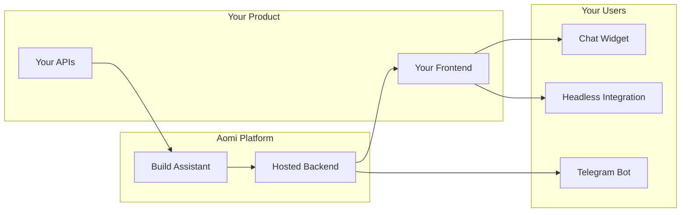

# What is Aomi

Aomi is agentic AI infrastructure. We design and host AI assistants customized to your product, so your users get an intelligent, context-aware chat experience without you building LLM orchestration from scratch.

You tell us your APIs. We build an AI assistant that can call them. We deploy it. You integrate it into your frontend with a few lines of code.

## How It Works

1. **You provide your APIs** -- REST endpoints, data feeds, trading actions, whatever your product does.
2. **Aomi wraps them as AI tools** -- each API becomes a tool the assistant can invoke during conversations.
3. **We deploy a hosted assistant** -- configured with your branding, instructions, and model preferences.
4. **Your users interact** -- via an embedded chat widget, a headless integration, or a Telegram bot.

## Key Features

### Streaming Responses

All responses stream in real-time via Server-Sent Events. Users see text appear as the model generates it, with tool calls and results displayed inline.

### Tool Calling

Your APIs become AI-callable tools. When a user asks a question that requires data or an action, the assistant calls the appropriate tool, processes the result, and responds naturally. Multiple tools can execute concurrently.

### Wallet Integration

Built-in Web3 wallet support via Reown AppKit. Users can connect wallets, sign transactions, and interact with on-chain data -- all within the chat interface.

### Multi-Model Support

Choose from Anthropic (Claude), OpenAI (GPT-4), or models via OpenRouter. Switch models at runtime without redeploying.

## Integration Paths

| Path | Package | Best For |
| --- | --- | --- |
| **Widget** | `npx shadcn add https://aomi.dev/r/aomi-frame.json` | Full chat UI with sidebar, thread management, and wallet connect. Drop-in component. |
| **Headless Lib** | `npm install @aomi-labs/react` | Build your own UI. Get runtime providers, hooks, and API clients without any pre-built components. |
| **Telegram Bot** | Managed by Aomi | Users interact via Telegram. No frontend code required. |

### Widget (shadcn)

A complete chat interface distributed via the shadcn registry. Install with one command, get a full-featured AI chat with thread management, markdown rendering, tool call display, and wallet integration. You own the source code and can customize freely.

### Headless Lib (npm)

The `@aomi-labs/react` package provides runtime providers, state management hooks, and an API client -- no UI components. Use it when you want full control over the chat interface design.

### Telegram Bot

For products that want to reach users on Telegram. Aomi hosts the bot, connects it to the same backend and tools as the widget. No frontend deployment needed.

## Platform Support

| Platform | Support |
| --- | --- |
| **Next.js 15** | Primary target. App Router with Server Components. |
| **React 18 / 19** | Supported via `@aomi-labs/react` and shadcn components. |
| **Modern Browsers** | Chrome, Firefox, Safari, Edge (latest 2 versions). |

## Next Steps

- [For Businesses](/docs/getting-started/for-businesses) -- understand the full journey from APIs to deployed assistant.
- [Quickstart](/docs/getting-started/quickstart) -- get a working chat widget in 5 minutes.
- [How It Works](/docs/core-concepts/how-it-works) -- technical deep dive into the platform pipeline.
