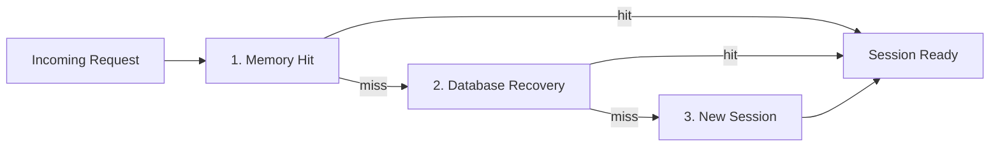

# Aomi Runtime

The Aomi Runtime is the hosted execution environment that powers all Aomi Apps. It manages sessions, routes requests to the correct app, handles wallet binding, and orchestrates LLM completion and tool execution. This page describes the architecture at a level relevant to integration partners and developers building on the platform.

## Architecture

The runtime is designed around stateless dispatch and application-defined execution. No request carries server-side session state — every call is routed purely by its credentials and app. The application layer owns the definition of what an Aomi App is: which tools it has, how it behaves, and what model it runs on. The runtime underneath is a shared execution environment that treats each app as an opaque unit — it schedules tool calls, manages memory, and forwards LLM completions without needing to understand the domain logic above it. This separation means the same runtime can host a DeFi trading agent and a GameFi assistant side by side with zero coupling between them.

### Session Manager

The Session Manager is a concurrent in-memory store that holds all active sessions. Each session contains the current runtime state (conversation history, active backend, streaming state) and metadata (title, API key, last activity timestamp). No database calls happen at this layer — it is pure memory.

### Reconstructor

The Reconstructor handles session reconciliation. When a request arrives, the runtime needs to resolve the correct backend, verify API key authorization, and bind the user's wallet if present. The Reconstructor maintains:

- A **backend registry** keyed by app and model selection
- An **auth snapshot** per session tracking the last-known API key, public key, and app
- **Reconcile locks** to prevent race conditions during session recovery

When a user switches apps or connects a different wallet mid-session, the Reconstructor hot-swaps the backend on the live session without creating a new one.

### History Backend

The History Backend is a pluggable persistence layer. Sessions are held in memory while active and flushed to the database when they become inactive. Conversation history is loaded on-demand when a session is recovered from the database.

History is linked to the user's wallet address (public key). This means a user who connects the same wallet across different sessions or platforms (web, Telegram) shares a unified conversation history.

### Background Tasks

Two background processes run continuously:

- **Title generation** — periodically examines active sessions with new messages and auto-generates conversation titles using a language model. Titles are broadcast to connected clients via SSE.
- **Session cleanup** — identifies inactive sessions (based on a configurable timeout), flushes their messages to the database, and evicts them from memory. Sessions are only removed after successful database persistence.

## Session Lifecycle

Every incoming request follows a three-tier reconstruction pipeline:

**1. Fast path** — The session is already in memory. No database call, no LLM initialization. The runtime verifies auth, reconciles any app or wallet changes, and returns the session state.

**2. Slow path** — The session is not in memory but exists in the database. The Reconstructor loads the session record, rehydrates its message history, binds the correct backend, and inserts it back into the Session Manager.

**3. Create** — No session exists. The Reconstructor creates a fresh session, binds it to the requested app and model, associates the user's wallet if provided, and inserts it into both memory and the database.

Per-session reconcile locks ensure that only one request performs recovery or creation at a time. Concurrent requests for the same session wait for the lock and then take the fast path.

## App Isolation

Each Aomi App runs as an isolated app. An app bundles a specific backend implementation with its own set of tools, system prompt, and model configuration. Apps do not share state — a DeFi app cannot access tools or history from a Prediction app.

The runtime initializes all configured app backends at startup. When a session is created or switched, the Reconstructor resolves the correct backend from the registry and binds it to the session.

## Wallet Binding

Sessions can optionally be bound to a wallet address. When a user connects a wallet:

1. The public key is associated with the session ID in the Reconstructor
2. Conversation history for that wallet is loaded from the database
3. Subsequent sessions with the same wallet share history across platforms

Disconnecting a wallet disassociates the public key from the session. The session continues to function but loses access to wallet-linked history and on-chain operations.

## Streaming and Events

The runtime uses bounded channels for backpressure between components. LLM responses, tool results, and system events (title updates, session state changes) flow through separate channels:

- **LLM → Session** — streaming text chunks, tool call requests, completion signals
- **Tool → Session** — single-shot results and multi-step progress updates
- **Session → Client** — SSE events forwarded to the frontend

Multi-step tools (like transaction simulation) stream intermediate progress updates to the client while the operation is in flight, without blocking the session.

## Performance

| Aspect | Approach |
| --- | --- |
| **Concurrency** | All sessions share a single async runtime with per-session isolation |
| **Memory** | Active sessions held in memory; inactive sessions evicted to database |
| **History** | Loaded on-demand during session recovery; not held for inactive sessions |
| **Backpressure** | Bounded channels between all components prevent memory exhaustion |
| **Timeouts** | External calls (LLM, tools, APIs) have configurable timeouts |

## Further Reading

- [Integration Guide](/docs/build/integration-guide) — how your APIs connect to the runtime through apps
- [Sessions](/docs/build/services/sessions) — client-facing session API
- [Aomi API](/docs/build/services/api-reference) — full HTTP endpoint documentation
