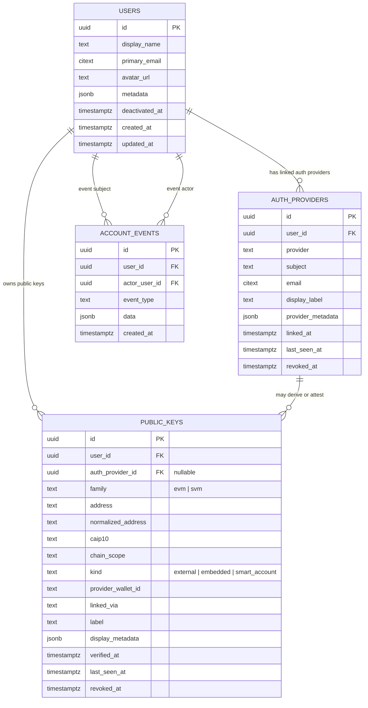
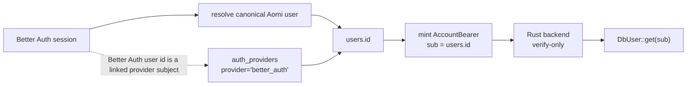
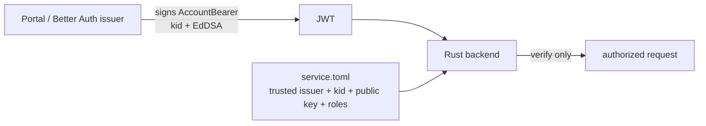

## Account-model alignment note

Not a blocker on this provider-error PR. Capturing the account/auth schema alignment here because this is the active branch line where the Better Auth work is meeting the backend account model, and I want us to converge before the schema settles.

I agree with the high-level split in your Better Auth model: the product account should be our canonical account, providers should be linked credentials, and public keys/wallet addresses should be separate account capabilities. The part I want to adjust is naming + provenance so the model stays obvious and compatible with the Rust backend.

## Proposed shape

Let's rename the concepts this way:

| Current draft name | Proposed name | Why |
|---|---|---|
| `aomi_users` | `users` / canonical account table | This is the product account. Its `id` is the stable Aomi user id. |
| `aomi_auth_identities` | `auth_providers` | "Identity" is overloaded. These rows are provider credentials/sign-in roots like Better Auth, Privy, Para, SIWE, GitHub, email. |
| `aomi_wallets` | `public_keys` | These are public keys / addresses the account can use. They are not the identity root. |
| `jwks` | remove | Backend trust should come from service mesh config (`service.toml` / `service.portal.toml`), not private keys in the app DB. |

The important model distinction:

- `auth_providers` answers: "how did this user authenticate or link a provider?"
- `public_keys` answers: "which chain keys/addresses can this user operate with?"
- `public_keys.auth_provider_id` is nullable because some keys are provider-derived and some are direct/manual/SIWE/imported.



## Why I want the direct link

In the current draft, provider rows and wallet rows are sibling children of the user. That tells us "this user has provider X" and "this user has key Y", but not "provider X is the source of key Y" except by inferring from `provider`, `provider_wallet_id`, `linked_via`, or metadata.

I do not think we need a separate wallet-attestations table yet. A nullable FK on `public_keys` is enough for the simple/current case:

```sql
alter table public_keys
  add column auth_provider_id uuid null references auth_providers(id);
```

Then:

- Para-derived embedded key: `public_keys.auth_provider_id -> auth_providers(provider='para', subject=...)`
- Privy-derived key: `public_keys.auth_provider_id -> auth_providers(provider='privy', subject=...)`
- SIWE/direct wallet: either `auth_provider_id -> auth_providers(provider='siwe', subject=...)` if we record SIWE as a provider, or `null` if it was linked manually/imported without provider provenance.

One invariant we should enforce in code, or with a DB trigger/composite FK if we want it stronger: if `public_keys.auth_provider_id` is set, that provider row must belong to the same `user_id`.

## Backend compatibility

For the backend contract, please keep the canonical Aomi user id as the bearer subject:



That means Better Auth can own login/session, but the Rust backend stays verify-only and find-only:

- `sub` = canonical Aomi UUID (`users.id`)
- Better Auth user id = linked provider subject in `auth_providers`
- provider tokens / wallets are linked credentials, not the identity root
- no backend minting or provider verification

## Key trust / JWKS

I would remove the `jwks` table from the product account schema. Storing signing private keys in the app DB is not the trust model we want.

The backend already has a service-mesh-style allowlist: `service.toml` on the backend side and `service.portal.toml` on the portal/BFF side. Treat that like the SSH known-hosts/authorized-keys boundary:



If we want JWKS later, that should be a coordinated backend verifier change. It should not require a `jwks` table with private keys in the normal account schema.

## Suggested change

Verdict: **keep-with-changes**.

- Keep the account/provider/public-key split.
- Rename `aomi_auth_identities` to `auth_providers`.
- Rename `aomi_wallets` to `public_keys`.
- Add nullable `public_keys.auth_provider_id -> auth_providers.id`.
- Drop `jwks` from this schema and use the existing service config trust boundary.
- Keep `sub = canonical Aomi user id` for backend AccountBearers.

This keeps your Better Auth direction, but makes the schema line up with the backend's account model and makes wallet provenance explicit without adding another table.
