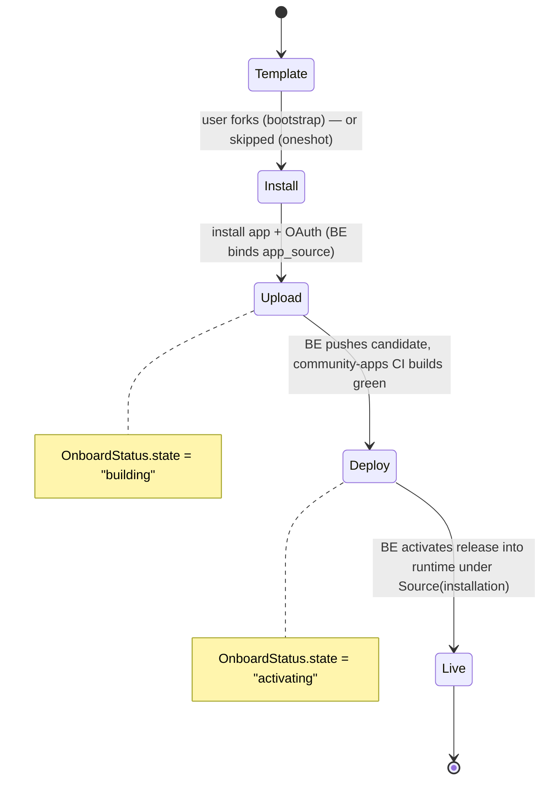
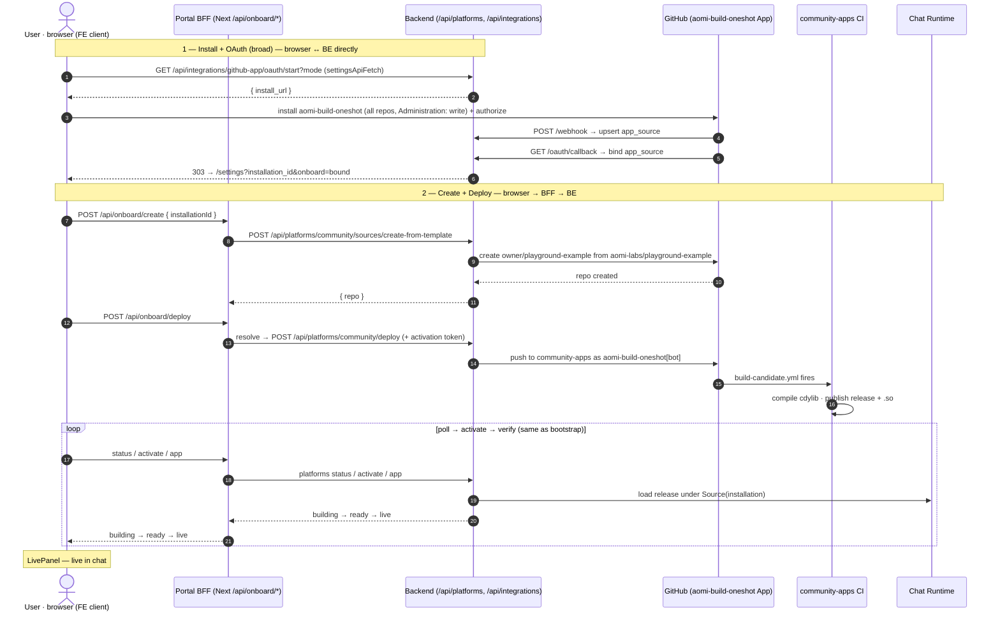

# Portal onboarding deploy — workflows

How the **Deploy** tab takes a developer from "nothing" to "my agent is live in
chat", for both onboarding paths. Backend is owned end-to-end via a GitHub App;
the browser never holds GitHub tokens or the platform activation token.

> **Latest changes (2026-06, PRs #243–#245 + post-merge fixes):**
> - GitHub install redirects in the **same tab** (was: new tab + fragile localStorage polling) — eliminates popup-blocker + race-condition bugs
> - BFF hardened: CSRF fail-open when `NEXT_PUBLIC_APP_URL` unset, rate limit raised 10→60 req/min, empty `releaseTags` validated
> - Backend `with_snapshot()` fix: deployment status checks CI against the recorded built commit, not the live branch HEAD — prevents pending deployments from being orphaned by snapshot merges
> - 4 new BFF unit-test files (csrf, rate-limit, validate-input, chat-url), 6 new component test files covering all wizard states
> - Portal typecheck fixed: test files excluded from `tsconfig.json` (`vitest` handles its own type checking)
> - Portal vitest aliases: added `@/` and `@aomi-labs/*` to vitest config — unblocks real widget-lib imports in tests
> - Portal bfcache fix: stale "Waiting for GitHub..." state cleared when user returns without redirect params
> - Redirect URL mismatch fixed: `NEXT_PUBLIC_BACKEND_URL` → `https://api.aomi.dev` (production), staging backend `AOMI_PORTAL_URL` → `https://chat.aomi.dev`
> - CLI error messages: all 7 GOAL spec error types unified across deploy/status/activate commands
> - All 132 portal tests + 375 package tests = 507 tests passing

## Three layers

| Layer | What runs | Holds |
|-------|-----------|-------|
| **Browser (FE client)** | React onboarding wizard | nothing secret |
| **Portal BFF** | Next.js route handlers `app/api/onboard/*` (server-side) | the **activation token**; resolves `app_source.id` |
| **Backend (BE)** | Rust service `/api/platforms/*`, `/api/integrations/*` | GitHub App keys, DB |

Two distinct call patterns:

- **Browser → BE directly** (`settingsApiFetch`, CORS, `NEXT_PUBLIC_BACKEND_URL`):
  only `oauth/start`. Plus GitHub → BE (webhook, callback redirect).
- **Browser → BFF → BE**: the whole **deploy** phase. The BFF (`/api/onboard/*`)
  injects the activation token and translates to the BE's `/api/platforms/:platform/*`.

## Two paths (the picker)

| Path | GitHub App | Consent | Who creates the repo |
|------|-----------|---------|----------------------|
| **One-click** (`oneshot`) | `aomi-build-oneshot` (broad: `Administration: write`, all repos) | broad | **the backend** creates it from the template |
| **Fork & customize** (`bootstrap`) | `aomi-build` (narrow: Contents / PRs / Checks, one repo) | narrow | **the user** ("Use this template") |

## State machine



## Endpoint reference

**Backend (BE)** — `product-mono/aomi/bin/backend/src/endpoint/…`

| Endpoint | Purpose |
|----------|---------|
| `GET /api/integrations/github-app/oauth/start?platform&repo&mode` | mint signed `state`, return GitHub `install_url`. `mode=authorize` re-verifies an existing install. |
| `GET /api/integrations/github-app/oauth/callback` | validate `state`, exchange `code`, confirm the install is visible to the user, bind `app_source`, then **303 → `$AOMI_FRONTEND_URL/settings?installation_id&onboard=bound`** |
| `POST /api/integrations/github-app/webhook` | (HMAC) installation events → **upsert `app_source`** |
| `GET /api/platforms/:platform/sources/resolve?installation_id&repo` | `(installation, repo) → app_source.id` |
| `POST /api/platforms/:platform/sources/{create-from-template,sync-installed}` | create repo from template / resolve+upsert an existing install |
| `POST /api/platforms/:platform/{deploy,activate}` | push candidate / activate a built release |

**Portal BFF** — `aomi-widget/apps/portal/src/app/api/onboard/*` (each proxies the BE)

| BFF route | → Backend |
|-----------|-----------|
| `POST /api/onboard/{dry-run,deploy}` | `resolve` then `POST …/deploy` |
| `POST /api/onboard/create` | `…/sources/create-from-template` |
| `GET  /api/onboard/status` | deployment status |
| `POST /api/onboard/activate` | `…/activate` |
| `GET  /api/onboard/app` | app load status |
| `POST /api/onboard/sync-installed` | `…/sources/sync-installed` |

---

## Fork & customize (`bootstrap`)

```mermaid
sequenceDiagram
    autonumber
    actor U as User · browser (FE client)
    participant BFF as Portal BFF (Next /api/onboard/*)
    participant BE as Backend (/api/platforms, /api/integrations)
    participant GH as GitHub (aomi-build App)
    participant CA as community-apps CI
    participant RT as Chat Runtime

    Note over U,GH: 1 — Template
    U->>GH: "Use this template" (aomi-labs/playground-example)
    GH-->>U: creates owner/my-agent
    Note over U: paste "owner/my-agent" → Confirm

    Note over U,BE: 2 — Install + OAuth — browser ↔ BE directly (no BFF)
    U->>BE: GET /api/integrations/github-app/oauth/start?repo&mode (settingsApiFetch, CORS)
    BE-->>U: { install_url } (signed state)
    U->>GH: redirect → install_url; install aomi-build + authorize
    GH->>BE: POST /api/integrations/github-app/webhook (server→server)
    BE->>BE: upsert app_source(installation, repo, github_account)
    GH->>BE: GET /oauth/callback?code&state&installation_id (browser redirect)
    BE->>GH: exchange code → user token; GET /user/installations (trust anchor)
    BE->>BE: bind app_source.github_user_id
    BE-->>U: 303 → {AOMI_FRONTEND_URL}/settings?installation_id&onboard=bound

    Note over U,RT: 3 — Deploy — browser → BFF → BE
    U->>BFF: POST /api/onboard/deploy { installationId, repo }
    BFF->>BE: GET /api/platforms/community/sources/resolve?installation_id&repo
    BE-->>BFF: { source.id }
    BFF->>BE: POST /api/platforms/community/deploy { appSourceId } (+ activation token)
    BE->>GH: push app to community-apps as aomi-build[bot]<br/>branch owner/my-agent/{installation}/{commit}
    GH->>CA: build-candidate.yml fires (actor = aomi-build[bot])
    CA->>CA: compile cdylib · publish release apps-{installation}-{app}-{commit} + .so
    BFF-->>U: 202 { deployment, releaseTags, apps }
    loop poll until ready
        U->>BFF: GET /api/onboard/status?deploymentId
        BFF->>BE: deployment status
        BE-->>BFF: state = building → ready
        BFF-->>U: building → ready
    end
    U->>BFF: POST /api/onboard/activate { releaseTags }
    BFF->>BE: POST /api/platforms/community/activate
    BE->>RT: load release into runtime under Source(installation)
    loop verify live
        U->>BFF: GET /api/onboard/app
        BFF->>BE: app status
        BE-->>BFF: state = live
        BFF-->>U: live
    end
    Note over U: LivePanel — "owner/my-agent is live in your chat session"
```

**Recovery — "Verify existing install":** if the OAuth redirect is lost (e.g. a
dead tunnel) but the App is already installed, the FE calls `oauth/start` with
`mode=authorize`; on return the BFF route `POST /api/onboard/sync-installed`
→ BE `…/sources/sync-installed` resolves the install via the App and upserts
`app_source`, so the wizard advances without a fresh install.

---

## One-click (`oneshot`)

Same layering; the **broad** App lets the backend create the repo, so the user
never touches "Use this template".



---

## Why the split: CI sits between "promoted" and "activated"

`Live` on the UI = the backend **activated** a release into the runtime. Between
the BE pushing the source and that activation, **`community-apps` GitHub Actions
(`build-candidate.yml`, gated to `aomi-build[bot]` pushes)** compiles the
`cdylib` and publishes the release. The BE can't activate until that release
exists — exactly the `building` poll state.

Per-user isolation: the candidate branch + release tag both encode the
`installation_id`, so the runtime loads each developer's app under its own
`Source(installation)` scope — even when every fork is named `playground-example`.

## Configuration

| Knob | Local dev | Deployed (staging) |
|------|-----------|--------------------|
| FE `NEXT_PUBLIC_BACKEND_URL` (browser→BE + BFF→BE base) | `http://localhost:8080` | `https://api-staging.aomi.dev` |
| BE `AOMI_PORTAL_URL` (callback redirect target, was `AOMI_FRONTEND_URL`) | `http://localhost:3000` | the deployed portal URL |
| GitHub App **Webhook URL** | tunnel → `/api/integrations/github-app/webhook` | `https://api-staging.aomi.dev/api/integrations/github-app/webhook` |
| GitHub App **Callback URL** | tunnel → `/api/integrations/github-app/oauth/callback` | `https://api-staging.aomi.dev/api/integrations/github-app/oauth/callback` |
| BE GitHub App secrets | `github_app.toml` / `GITHUB_APP_TOML` + `AOMI_GITHUB_APP_*` | same `AOMI_GITHUB_APP_*` as deployment secrets |
| BFF activation token | `APP_DEPLOY_ACTIVATION_TOKEN` (portal env) | portal deployment secret |

> Only the **webhook** strictly needs a public tunnel (server-to-server); the
> callback is a browser redirect. Pointing at staging requires the App's
> webhook+callback to be the staging host **and** staging to have the
> `AOMI_GITHUB_APP_*` secrets (else `oauth/start` → `500 github_app.toml not found`).
