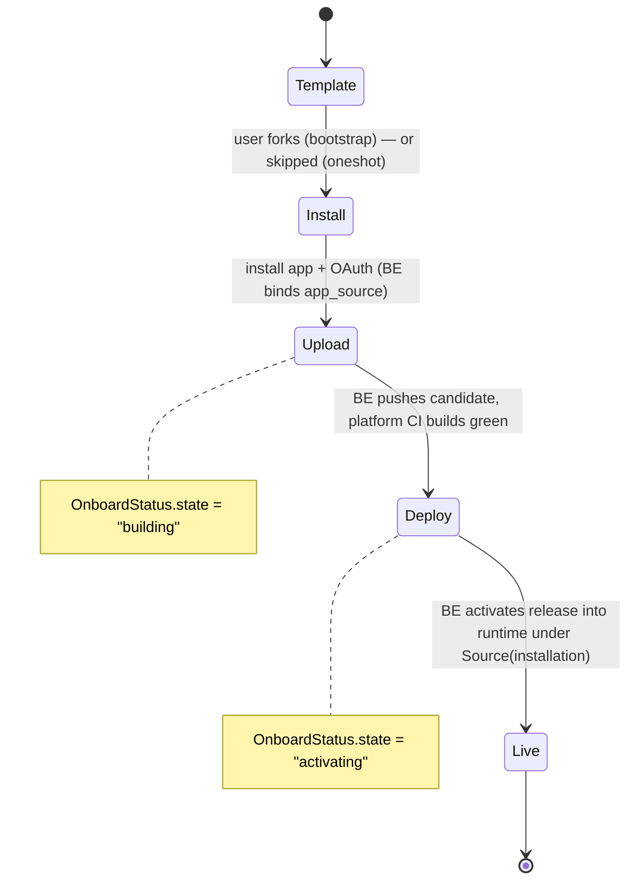
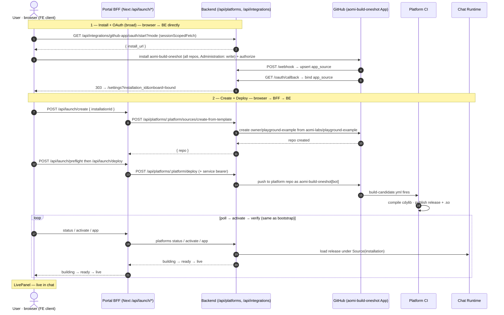

# Portal onboarding deploy — workflows

How the **Deploy** tab takes a developer from "nothing" to "my agent is live in
chat", for both onboarding paths. Backend is owned end-to-end via a GitHub App;
the browser never holds GitHub tokens or service credentials.

> **Latest changes (2026-06-25 launch cleanup):**
>
> - Portal BFF source dashboard now calls backend `user/sources` with the configured launch platform; backend hides unrelated repos from broad GitHub App installations.
> - Existing-repo preflight sync sends the signed-in GitHub user id so the backend can prove ownership and bind `app_source.github_user_id`; otherwise deployed/admin-synced repos can be live but missing from the Source Repositories dashboard.
> - The deploy preview route is `preflight`, not `dry-run`.
> - Launch defaults are server-env-driven: `APP_DEPLOY_PLATFORMS` (JSON array or comma-separated list), `APP_DEPLOY_AOMI_TOML_PATHS`, and optional `APP_DEPLOY_TARGET_TAGS`. The first platform is the primary deploy target; app pickers can merge all configured platforms. Aomi Build's platform switcher does not enumerate this configuration: it submits one exact name to the authenticated manager source read and advances only when that platform exists. The deploy source ref is an immutable commit SHA from `APP_DEPLOY_SOURCE_REF` (or `APP_DEPLOY_SOURCE_COMMIT`).
> - Chat links are controlled by `NEXT_PUBLIC_CHAT_URL`.
> - Redeploy hydrates one target source's latest deployment metadata, then reruns an existing backend-owned GitHub Actions run. It requires portal `GITHUB_TOKEN` and refuses when no `ciRunId` is available.
> - GitHub install redirects in the **same tab** (was: new tab + fragile localStorage polling) — eliminates popup-blocker + race-condition bugs
> - BFF hardened: CSRF validates against the incoming request origin, rate limit raised 10→60 req/min, empty `releaseTags` validated
> - Backend `with_snapshot()` fix: deployment status checks CI against the recorded built commit, not the live branch HEAD — prevents pending deployments from being orphaned by snapshot merges
> - 4 new BFF unit-test files (csrf, rate-limit, validate-input, chat-url), 6 new component test files covering all wizard states
> - Portal typecheck fixed: test files excluded from `tsconfig.json` (`vitest` handles its own type checking)
> - Portal vitest aliases: added `@/` and `@aomi-labs/*` to vitest config — unblocks real widget-lib imports in tests
> - Portal bfcache fix: stale "Waiting for GitHub..." state cleared when user returns without redirect params
> - Redirect URL mismatch fixed: `NEXT_PUBLIC_BACKEND_URL` → `https://api.aomi.dev` (production), staging backend `AOMI_PORTAL_URL` → `https://chat.aomi.dev`
> - CLI error messages: all 7 GOAL spec error types unified across deploy/status/activate commands
> - All 132 portal tests + 375 package tests = 507 tests passing

## Three layers

| Layer                   | What runs                                               | Holds                                                        |
| ----------------------- | ------------------------------------------------------- | ------------------------------------------------------------ |
| **Browser (FE client)** | React onboarding wizard                                 | nothing secret                                               |
| **Portal BFF**          | Next.js route handlers `app/api/launch/*` (server-side) | the `aomi-bff` service signing key; resolves `app_source.id` |
| **Backend (BE)**        | Rust service `/api/platforms/*`, `/api/integrations/*`  | GitHub App keys, DB                                          |

Two distinct call patterns:

- **Browser → BE directly** (`sessionScopedFetch`, CORS, `NEXT_PUBLIC_BACKEND_URL`):
  only `oauth/start`. Plus GitHub → BE (webhook, callback redirect).
- **Browser → BFF → BE**: the whole **deploy** phase. The BFF (`/api/launch/*`)
  signs a short-lived `service` bearer and translates to the BE's `/api/platforms/:platform/*`.

## Two paths (the picker)

| Path                               | GitHub App                                                       | Consent | Who creates the repo                         |
| ---------------------------------- | ---------------------------------------------------------------- | ------- | -------------------------------------------- |
| **One-click** (`oneshot`)          | `aomi-build-oneshot` (broad: `Administration: write`, all repos) | broad   | **the backend** creates it from the template |
| **Fork & customize** (`bootstrap`) | `aomi-build` (narrow: Contents / PRs / Checks, one repo)         | narrow  | **the user** ("Use this template")           |

## State machine



## Endpoint reference

**Backend (BE)** — `product-mono/aomi/bin/backend/src/endpoint/…`

| Endpoint                                                                      | Purpose                                                                                                                                                                                     |
| ----------------------------------------------------------------------------- | ------------------------------------------------------------------------------------------------------------------------------------------------------------------------------------------- |
| `GET /api/integrations/github-app/oauth/start?platform&repo&mode&return_to`   | mint signed `state`, return GitHub `install_url`. A validated Aomi Build Projects `return_to` is signed with the exact platform and repo; `mode=authorize` re-verifies an existing install. |
| `GET /api/integrations/github-app/oauth/callback`                             | validate `state`, exchange `code`, prove one visible installation reads the signed repo, bind `app_source`, then **303 → the signed Build Projects page**.                                  |
| `POST /api/integrations/github-app/webhook`                                   | (HMAC) installation events → **upsert `app_source`**                                                                                                                                        |
| `POST /api/platforms/:platform/sources/{create-from-template,sync-installed}` | create repo from template / resolve+upsert an existing install to get `app_source.id`                                                                                                       |
| `POST /api/platforms/:platform/{deploy,activate}`                             | push candidate / activate a built release                                                                                                                                                   |

**Portal BFF** — `aomi/apps/portal/src/app/api/launch/*` (each proxies the BE)

| BFF route                         | → Backend                                                                                                                |
| --------------------------------- | ------------------------------------------------------------------------------------------------------------------------ |
| `GET  /api/launch/sources`        | `GET /api/integrations/github-app/user/sources?github_user_id&platform`                                                  |
| `POST /api/launch/preflight`      | `POST …/sources/sync-installed` with signed-in `github_user_id` when needed, then `POST …/deploy` with `preflight: true` |
| `POST /api/launch/deploy`         | `POST …/deploy` with explicit `app_source_id`                                                                            |
| `POST /api/launch/create`         | `…/sources/create-from-template`                                                                                         |
| `POST /api/launch/sync-installed` | `…/sources/sync-installed` for exactly the pasted `owner/repo`                                                           |
| `GET  /api/launch/status`         | deployment status                                                                                                        |
| `POST /api/launch/activate`       | `…/activate`                                                                                                             |
| `GET  /api/launch/app`            | app load status                                                                                                          |
| `POST /api/launch/redeploy`       | backend single-source latest-deployment lookup, then GitHub `actions/runs/{ciRunId}/rerun`                               |

---

## Fork & customize (`bootstrap`)

```mermaid
sequenceDiagram
    autonumber
    actor U as User · browser (FE client)
    participant BFF as Portal BFF (Next /api/launch/*)
    participant BE as Backend (/api/platforms, /api/integrations)
    participant GH as GitHub (aomi-build App)
    participant CA as Platform CI
    participant RT as Chat Runtime

    Note over U,GH: 1 — Template
    U->>GH: "Use this template" (aomi-labs/playground-example)
    GH-->>U: creates owner/my-agent
    Note over U: paste "owner/my-agent" → Confirm

    Note over U,BE: 2 — Install + OAuth — browser ↔ BE directly (no BFF)
    U->>BE: GET /api/integrations/github-app/oauth/start?repo&mode (sessionScopedFetch, CORS)
    BE-->>U: { install_url } (signed state)
    U->>GH: redirect → install_url; install aomi-build + authorize
    GH->>BE: POST /api/integrations/github-app/webhook (server→server)
    BE->>BE: upsert app_source(installation, repo, github_account)
    GH->>BE: GET /oauth/callback?code&state&installation_id (browser redirect)
    BE->>GH: exchange code → user token; GET /user/installations (trust anchor)
    BE->>BE: bind app_source.github_user_id
    BE-->>U: 303 → {AOMI_FRONTEND_URL}/settings?installation_id&onboard=bound

    Note over U,RT: 3 — Deploy — browser → BFF → BE
    U->>BFF: POST /api/launch/preflight { appSourceId? , repo }
    BFF->>BE: POST /api/platforms/:platform/sources/sync-installed { repo } when appSourceId is absent
    BE-->>BFF: { source.id }
    BFF->>BE: POST /api/platforms/:platform/deploy { appSourceId, preflight: true } (+ service bearer)
    BFF-->>U: 200 { deployment, appSourceId, releaseTags, apps }
    U->>BFF: POST /api/launch/deploy { appSourceId }
    BFF->>BE: POST /api/platforms/:platform/deploy { appSourceId } (+ service bearer)
    BE->>GH: push app to platform repo as aomi-build[bot]<br/>branch owner/my-agent/{installation}/{commit}
    GH->>CA: build-candidate.yml fires (actor = aomi-build[bot])
    CA->>CA: compile cdylib · publish release apps-{installation}-{app}-{commit} + .so
    BFF-->>U: 202 { deployment, releaseTags, apps }
    loop poll until ready
        U->>BFF: GET /api/launch/status?deploymentId
        BFF->>BE: deployment status
        BE-->>BFF: state = building → ready
        BFF-->>U: building → ready
    end
    U->>BFF: POST /api/launch/activate { releaseTags }
    BFF->>BE: POST /api/platforms/:platform/activate
    BE->>RT: load release into runtime under Source(installation)
    loop verify live
        U->>BFF: GET /api/launch/app
        BFF->>BE: app status
        BE-->>BFF: state = live
        BFF-->>U: live
    end
    Note over U: LivePanel — "owner/my-agent is live in your chat session"
```

**Recovery — "Verify existing install":** if the OAuth redirect is lost (e.g. a
dead tunnel) but the App is already installed, the FE calls `oauth/start` with
`mode=authorize`; on return the BFF route `POST /api/launch/sync-installed`
→ BE `…/sources/sync-installed` resolves the install via the App and upserts
`app_source`, so the wizard advances without a fresh install.

**Self-service existing repository:** on a platform-scoped Aomi Build Projects
page, the developer can enter an exact `owner/repo`. The OAuth callback proves
the signed-in GitHub user can see an installation that reads that repository,
claims the source for that user and platform, and returns to the same Projects
page. If several installations are visible, the backend resolves the one that
can read the signed repository; it never guesses from installation order.

---

## One-click (`oneshot`)

Same layering; the **broad** App lets the backend create the repo, so the user
never touches "Use this template".



---

## Why the split: CI sits between "promoted" and "activated"

`Live` on the UI = the backend **activated** a release into the runtime. Between
the BE pushing the source and that activation, the platform repo's GitHub Actions
(`build-candidate.yml`, gated to `aomi-build[bot]` pushes) compiles the `cdylib`
and publishes the release. The BE can't activate until that release exists —
exactly the `building` poll state.

Per-user isolation: the candidate branch + release tag both encode the
`installation_id`, so the runtime loads each developer's app under its own
`Source(installation)` scope — even when every fork is named `playground-example`.

## Configuration

| Knob                                                                     | Local dev                                                   | Deployed (staging)                                                                                                                            |
| ------------------------------------------------------------------------ | ----------------------------------------------------------- | --------------------------------------------------------------------------------------------------------------------------------------------- |
| Backend URL                                                              | local defaults to `http://127.0.0.1:8080`                   | Vercel production defaults to `https://api.aomi.dev`; previews default to `https://api-staging.aomi.dev`                                      |
| BE `AOMI_PORTAL_URL` (callback redirect target, was `AOMI_FRONTEND_URL`) | `http://localhost:3000`                                     | the deployed portal URL                                                                                                                       |
| GitHub App **Webhook URL**                                               | tunnel → `/api/integrations/github-app/webhook`             | `https://api-staging.aomi.dev/api/integrations/github-app/webhook`                                                                            |
| GitHub App **Callback URL**                                              | tunnel → `/api/integrations/github-app/oauth/callback`      | `https://api-staging.aomi.dev/api/integrations/github-app/oauth/callback`                                                                     |
| BE GitHub App secrets                                                    | `github_app.toml` / `GITHUB_APP_TOML` + `AOMI_GITHUB_APP_*` | same `AOMI_GITHUB_APP_*` as deployment secrets                                                                                                |
| BFF service signer                                                       | `PORTAL_SERVICE_PRIVATE_KEY`                                | portal deployment secret; committed topology is auto-selected                                                                                 |
| Portal deploy defaults                                                   | `APP_DEPLOY_PLATFORMS`, defaults to `community`             | set explicitly for white-labeled partner portals, e.g. `["somm.finance"]`; the first platform is used when a request does not name a platform |

> Only the **webhook** strictly needs a public tunnel (server-to-server); the
> callback is a browser redirect. Pointing at staging requires the App's
> webhook+callback to be the staging host **and** staging to have the
> `AOMI_GITHUB_APP_*` secrets (else `oauth/start` → `500 github_app.toml not found`).
