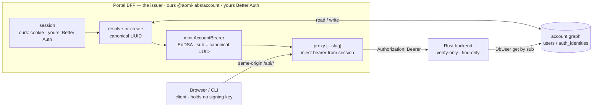
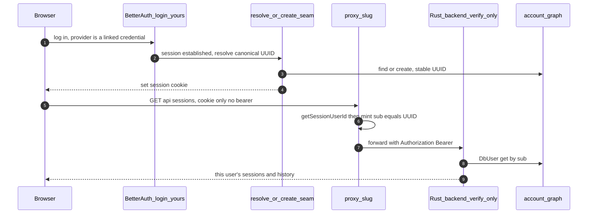
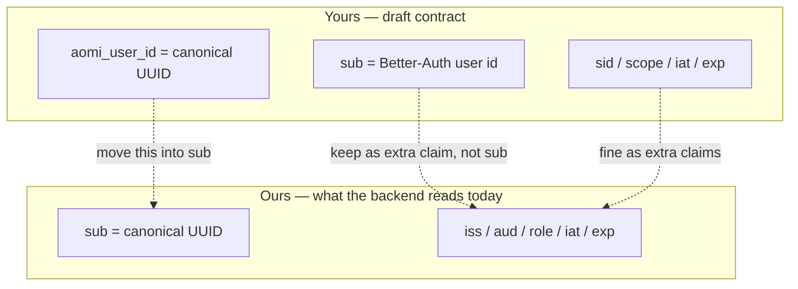
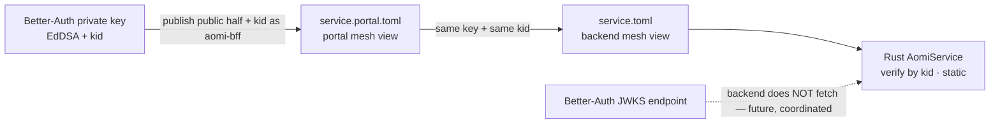
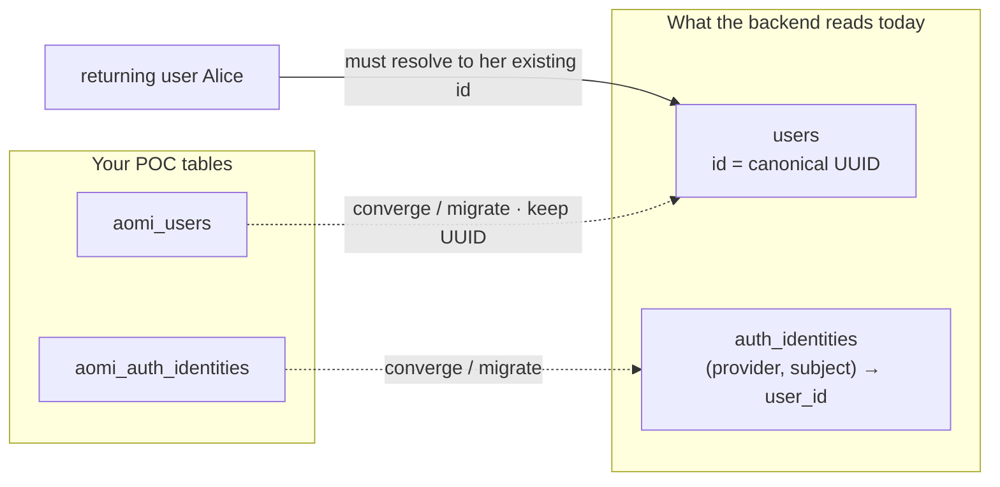

# Handoff → arixoneth: account auth (`codex/widget-auth-pre-rust`)

Status: 2026-06-22 · from: account-auth (canonical-id) work on `reconstruct_authenticated` (product-mono) + portal changes here.

## The one ask

We've shipped a working, stripped-down version of the BFF→backend account-auth
your branch is building. **Good news: our model is the same as yours — same
architecture, same split, same canonical-id concept.** The only differences are
three small, mechanical gaps (named GAP-1/2/3 below), and each is a *bridge*, not
a redesign. **Plug your Better-Auth work into the seams we left in
`@aomi-labs/account` (server-only) rather than forking a parallel stack** — the
backend is already deployed against this contract, so diverging means rewriting
the Rust verifier, not just the portal.

The full contract is in product-mono
`docs/topics/account-authentication/facts/service-identity.md` — read that first;
this doc is the delta + migration notes for your branch.

## Same model — where we already agree

Both designs are the *same architecture*. Strip away naming and both say: **the
BFF owns identity and mints; the backend only verifies; the provider (Privy/Para)
is a linked credential, not the identity; and a stable canonical UUID is the
account.** Your Better-Auth stack and our `@aomi-labs/account` are two
implementations of one contract.

| concept | ours | yours | status |
|---|---|---|---|
| who owns identity / session | our session (cookie) | Better-Auth session | ✅ same principle |
| where the bearer is minted | BFF (`@aomi-labs/account`) | BFF (Better Auth) | ✅ same |
| backend's job | verify-only, find-only | verify-only | ✅ same |
| provider (Privy/Para) | linked credential → wallet state | linked provider | ✅ same |
| canonical user | UUID, stable per person | UUID, stable per person | ✅ same concept |
| signing algorithm | EdDSA + `kid` | EdDSA + `kid` | ✅ same |
| **which claim holds the canonical id** | `sub` | `aomi_user_id` (with `sub` = BA id) | ⚠️ **GAP-1** |
| **how the verify key is distributed** | static mesh toml | JWKS endpoint | ⚠️ **GAP-2** |
| **which tables hold the account graph** | `users` / `auth_identities` | `aomi_users` / `aomi_auth_identities` | ⚠️ **GAP-3** |

The shared pipeline — both implementations fill the *same boxes*:

End-to-end, your Better-Auth pieces slot straight into our seams (the dashed
calls are the parts you own):

## The three gaps (labeled) — and the bridge for each

None of these is an architecture change. Each is a small alignment that keeps
the already-deployed backend working.

### GAP-1 — the canonical id must ride in `sub`

The Rust backend keys session ownership + history on `sub` and looks it up
**find-only** (`DbUser::get(sub)`, never creates). Your draft
(`specs/AUTH-BACKEND-JWT-CONTRACT.md`) puts the Better-Auth user id in `sub` and
the canonical id in a separate `aomi_user_id` claim — inverted from ours, so the
backend would 401 every request (no `users` row has id = a Better-Auth user id).

- **Why it matters:** a 1-line mismatch silently breaks *all* authenticated
  requests in every env.
- **Bridge:** put the **canonical UUID in `sub`**. Keep `aomi_user_id` / `sid` /
  `scope` as *extra* claims if you like — just not as the identity slot.

### GAP-2 — verify is static-key (mesh toml), not JWKS yet

The backend trusts EdDSA public keys per `kid` from a committed mesh
(`service.toml` on the Rust side, `service.portal.toml` on the portal side — the
same key per `kid` on both sides). It does **not** fetch a JWKS endpoint.

- **Why it matters:** a Better-Auth-signed token only verifies if its key is in
  the mesh; otherwise `untrusted kid` → 401.
- **Bridge:** you don't have to drop Better-Auth signing — **register Better
  Auth's public key + `kid` as the `aomi-bff` issuer** in both mesh tomls.
  Moving the backend to JWKS later is a separate, coordinated change, not a
  unilateral one.

### GAP-3 — the account graph must be the tables the backend reads

The backend reads `users` (id = canonical UUID) and
`auth_identities` `(provider, subject) → user_id`. Your `aomi_users` /
`aomi_auth_identities` (`packages/auth/src/db/schema.sql`) are a POC slated to
"migrate into our DB later."

- **Why it matters:** if resolve-or-create writes tables the backend doesn't
  read, `DbUser::get(sub)` finds nothing → 401, even with a perfect token.
- **Bridge:** converge onto the existing tables, **or** ship a migration that
  **preserves canonical UUIDs** — the Alice invariant: a returning user must
  resolve to her *existing* `users.id`, or her sessions/history detach.

## What we built (so you don't rebuild or clobber it)

Server-only issuer package — **`@aomi-labs/account`** (`packages/account/src/`):

| file | what it does | your move |
|---|---|---|
| `account-graph.ts` | `resolveOrCreateCanonicalUser({provider, subject}) → {userId, created}` — TS port of the Rust `DbUser::insert_for_identity` against the existing `users`/`auth_identities`. Race-safe. 4 unit tests. | **Replace the body** with your Better-Auth account graph — keep the signature + the stable-UUID contract. This is the seam. |
| `bearer.ts` | `mintAccountBearer(userId, role?) → {accessToken, expiresAt}` — `sub` = UUID, EdDSA, via the topology signer. | Converge your JWT minting here; keep the claim set (`sub`/`iss`/`aud`/`role`/`iat`/`exp`). |
| `topology.ts` | `portalService()` = `AomiService.fromTopology(service.portal.toml)`; signing key from env `PORTAL_SERVICE_PRIVATE_KEY`. | The mint mechanism. (Topology/`AomiService` is owned elsewhere — coordinate before changing it.) |
| `db.ts` | `pg` pool from `DATABASE_URL` (same DB the backend reads). | Reuse, or swap for Better-Auth's pool — but write the tables the backend reads. |

Portal wiring (consumers of the package):

- `apps/portal/src/app/api/[...slug]/route.ts` — **proxy-inject catch-all**.
  Same file path as your branch's proxy, so this is a merge, not two files.
  **The deliberate difference: ours mints + injects the bearer server-side from
  the session cookie; yours forwards a browser-held bearer.** Keep ours
  (browser holds nothing) and take your allowlist breadth. It reads the session
  → mints via `@aomi-labs/account` → injects `Authorization`, strips `cookie`
  and any client `authorization`.
- `apps/portal/src/lib/aomi-account/session.ts` — a **stand-in** HS256 cookie
  (`aomi_session`, httpOnly) carrying the canonical UUID. **This is your lane:**
  replace it with the Better-Auth session. The only contract the proxy needs is
  `getSessionUserId(req) → canonical UUID` — keep that shape and the proxy is
  unchanged.
- `apps/portal/src/app/api/account/sessions/exchange/route.ts` — current login:
  verify provider → `resolveOrCreateCanonicalUser` → set session cookie → mint.
  This becomes "verify a *linked credential*"; the session itself should come
  from Better-Auth login (see Identity root below).
- The browser always calls same-origin: `getBackendUrl()` returns `""`, so the
  client builds relative `/api/*` URLs that hit the portal proxy. (Required for
  proxy-inject anyway — the httpOnly session cookie is same-origin only.)

Backend (product-mono, already merged on `reconstruct_authenticated`):
verify-only via the `aomi-service` crate, find-only `DbUser::get`, role claim
(`user`/`service`/`admin`) authorized against the issuer's configured roles.
**Don't add mint/provider-verify/account-graph writes to the backend** — that's
the whole point of the split.

## Identity root (the mental model to preserve)

Identity is **ours** (our session, our cookie, our canonical UUID). Privy/Para
are **linked credentials**, not the identity — "Alice is our user; she *also*
signs into Privy through us to attach a wallet state." So:

- `sub` derives from **our session**, never from a provider token.
- Provider verification is a *link-credential* flow; its output is wallet state
  (`user_state`), **not** the bearer.
- A provider being down/swapped/unlinked never changes the canonical user.

This is why the exchange route's current "verify Privy → mint" is a scaffold:
under your Better-Auth login, the session is the root and Privy is one linkable
provider behind it.

## CLI — leave it alone (decided: acquire-only)

`packages/client/src/cli` is a **client**, not an issuer. It acquires a bearer
(`--account-bearer` / the backend Privy-begin flow → token in `~/.aomi`) and
attaches it via `createCliGetAccountBearer` + `wrapFetchWithAccountBearer`
(already in `packages/client`). It holds **no signing key and no DB access**.
Do not move issuer code into `packages/client` — that package is browser-bundled
(viem/solana/getpara), so `pg` + the private key must never land there. Issuer
code lives in `@aomi-labs/account` (server-only); the acquire/attach seam lives
in `packages/client`.

## Suggested sequence

1. **(GAP-2)** Register Better-Auth's signing public key + `kid` as `aomi-bff` in
   both `service.toml` (backend) and `service.portal.toml` (portal mesh). Confirm
   a Better-Auth-signed token with `sub` = a known UUID verifies in the backend.
2. **(GAP-1 + GAP-3)** Implement `resolveOrCreateCanonicalUser`'s body with your
   account graph, writing the existing `users`/`auth_identities` (or your migrated
   tables with UUID stability), and mint with the canonical UUID in `sub`. Keep
   the 4 unit tests green.
3. Replace `session.ts` with the Better-Auth session; expose
   `getSessionUserId(req) → canonical UUID`. The proxy is then unchanged.
4. Merge the two `[...slug]` proxies into one (inject-from-session + your
   allowlist).
5. Reframe `exchange` as credential-linking; the session bearer comes from the
   Better-Auth session via the proxy.

## References

- Contract (source of truth): product-mono `docs/topics/account-authentication/facts/service-identity.md`
- Rust verifier: product-mono `aomi/crates/service/src/lib.rs`
- Your branch's draft contract (to reconcile): `specs/AUTH-BACKEND-JWT-CONTRACT.md`
- This package: `packages/account/src/`
