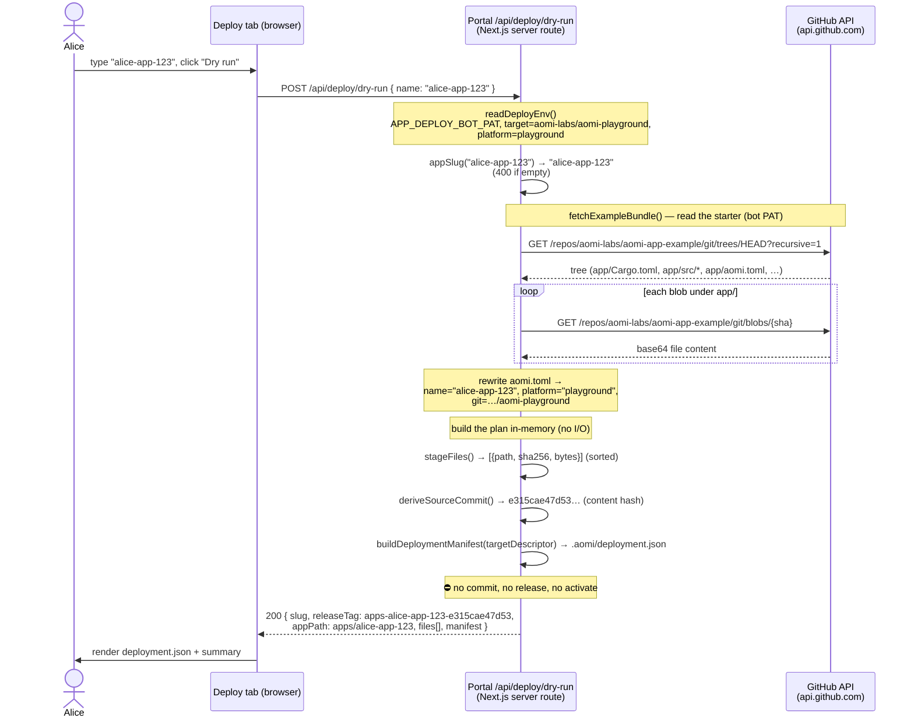
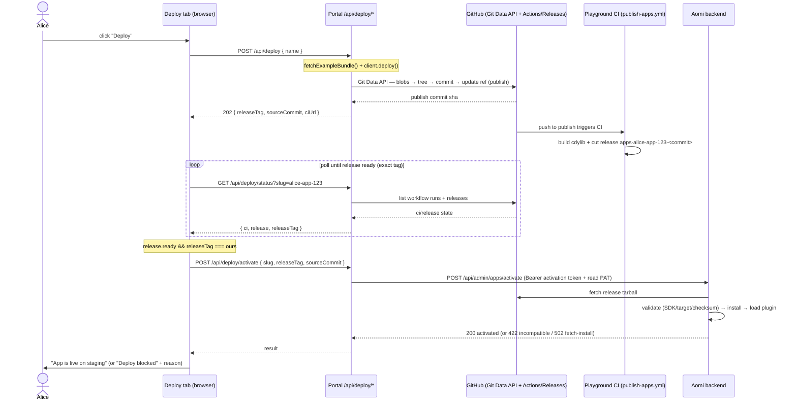

# Portal "Deploy" tab — playground deploy flow

The **Settings → Deploy** tab lets a visitor name an app (e.g. `alice-app-123`),
preview it, deploy it to the sandbox platform repo, and activate it — **no code,
no CLI, no tokens in the browser**.

## Architecture (who holds what)

- **Browser** (`apps/portal/src/components/settings/deploy-settings.tsx`) — the UI.
  Holds no secrets; only calls the portal's own `/api/deploy/*` routes.
- **Portal server routes** (`apps/portal/src/app/api/deploy/*`) — the
  **deploy-proxy** (ADR 0011). Holds the secrets, does the privileged work over
  HTTP. Wraps `@aomi-labs/deploy` (`apps/portal/src/lib/deploy.ts`).
- **GitHub API** — source of the starter app + the publish target.
- **Aomi backend** — activates the built release.

Everything is HTTP — **no git binary, no local clone, no filesystem** — so it
runs unchanged on Vercel/serverless.

### Config

Server env in the portal (never `NEXT_PUBLIC_*`); everything else is hard-coded
in `src/lib/deploy.ts`:

| env | required for | note |
|---|---|---|
| `APP_DEPLOY_BOT_PAT` | deploy + status | fine-grained PAT, Contents R/W on `aomi-labs/aomi-playground` (secret) |
| `APP_DEPLOY_ACTIVATION_TOKEN` | activate only | platform-wide `playground` activation token (secret) |
| `APP_DEPLOY_DISCORD_WEBHOOK` | optional | webhook for the "Publish your own app" request. Unset → request is built but not auto-posted. (secret — this repo is public, so it must stay in env) |

Hard-coded: target repo `aomi-labs/aomi-playground`, platform `playground`,
starter `aomi-labs/aomi-app-example` (`app/` subdir), the ops role mention.
Backend URL reuses the portal's existing `NEXT_PUBLIC_BACKEND_URL`.

---

## Dry run — `POST /api/deploy/dry-run`

Read-only preview. Reads the starter from GitHub, computes the plan in-memory,
and returns the exact `.aomi/deployment.json` that a real deploy would publish.
**No push, no commit, no backend call.**

**Notes**

- The bot PAT is used only to *read* the public starter (avoids rate limits);
  nothing is written.
- The release tag is **deterministic** from bundle contents
  (`apps-<slug>-<contenthash>`), so the dry-run shows the exact tag a real deploy
  produces.
- `stageFiles` / `deriveSourceCommit` / `buildDeploymentManifest` run in-process
  (uses `node:crypto`); no git, no disk.

---

## Deploy + activate — the write path

`Deploy` does what dry-run does, then writes to GitHub, waits for CI, and
activates. The UI shows a GitHub-checks-style stepper driven by polling
`/api/deploy/status`.

**Notes**

- The status poll activates only when the release's **exact** tag is ready — not
  a stale release that merely shares the `apps-<slug>-` prefix.
- Activation is gated on the backend; a documented **502** in the fetch/install
  step can block the final step (tracked separately). The UI surfaces the reason
  and offers a retry rather than hanging.
- After a live deploy the UI shows "customize it" steps: clone the starter, edit,
  then `aomi-git deploy && aomi-git activate` from the user's own machine
  (request contributor access first via "Publish your own app").
