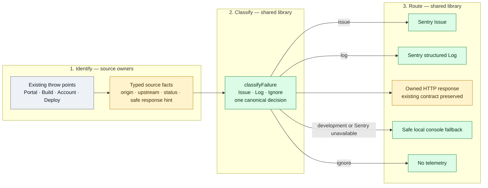

# BFF Sentry Observability Decision Record

This document records the approved design and implementation plan for adding
Sentry error diagnosis and structured failure logs to Aomi's Next.js BFF
layer. The decisions were reviewed in a grilling session on 2026-07-29.

Implementation status: **local code complete and verified on 2026-07-30;
external Sentry, Vercel, dashboard, staging-smoke, and production-rollout work
remains pending**. No external state was changed during the local
implementation.

## Outcome

Create one Sentry project named `aomi-bff` that receives server-side events
from both Next.js BFF deployments:

| Application   | Service tag  | Current API route count |
| ------------- | ------------ | ----------------------: |
| `apps/portal` | `portal-bff` |                      49 |
| `apps/build`  | `build-bff`  |                      48 |

The project uses `staging` and `production` environments. Temporary Vercel
preview/branch deployments, local development, tests, and browser-side code
remain disabled.

The day-one objective is:

1. Diagnose every unexpected exception originating in a BFF, including a
   readable source-mapped stack.
2. Search structured, failure-focused BFF logs.
3. Store Issues without adding a new notification or triage workflow until
   real traffic establishes which failures deserve alerts.

Rust remains responsible for transaction tracing and backend-root-cause
Issues. The BFF will not enable performance tracing initially.

## Implemented Error Flow

Every handled or uncaught BFF failure now follows exactly three layers. Portal
and Build do not own parallel classifiers or reporters; each app owns only a
service-bound pipeline instance whose error API is `handle(...)`.



Legend: grey is behavior that already produced errors, amber is an existing
boundary changed to emit bounded facts while preserving its response contract,
and green is new shared observability behavior.

Ownership is intentionally narrow:

| Layer    | Owner                                  | Responsibility                                                                                                                        |
| -------- | -------------------------------------- | ------------------------------------------------------------------------------------------------------------------------------------- |
| Identify | The package where the error originates | Preserve the original error and emit only bounded facts; deploy owns launch-domain identification and Account owns proxy observations |
| Classify | `@aomi-labs/bff-observability`         | Make the single Issue/Log/Ignore decision and choose the safe public result                                                           |
| Route    | `@aomi-labs/bff-observability`         | Deliver the decision to Sentry, the local console, the HTTP caller, or nowhere                                                        |

The only app-specific error objects are:

```ts
export const portalFailures = createFailurePipeline("portal-bff");
export const buildFailures = createFailurePipeline("build-bff");
```

A call point identifies its source and then receives the routed safe result:

```ts
return portalFailures.handle({
  source: "launch",
  error,
  context: { routeFamily, operation, method },
}).response;
```

## Current-State Snapshot

This plan applies to the `aomi` repository at
`/Users/kevin/aomi/pg2/aomi`, not the legacy widget-named checkout. The
workspace uses pnpm 10.28.0 and both target applications use Next.js 16.1.0.

At the time this decision record was prepared:

- neither `apps/portal` nor `apps/build` had a Sentry dependency or Sentry
  configuration;
- `apps/portal` had 48 API route entrypoints;
- `apps/build` had 47 API route entrypoints;
- `apps/build/src/instrumentation.ts` already registered Bun compatibility
  hooks and must be extended rather than replaced;
- both Next.js configs had custom Turbopack/Webpack aliases that must survive
  `withSentryConfig` wrapping;
- `packages/account` was version `0.1.9` and was publishable;
- `packages/account/src/proxy.ts` swallowed bearer-mint and network exceptions
  after writing to `console.error`;
- `packages/account/src/token.ts` returned a raw mint exception message;
- launch/deployment error mappers in both apps returned some raw internal or
  upstream messages;
- portal device-auth routes converted some unexpected errors into 400
  responses;
- build request and background code contained caught, logged, and silently
  swallowed exceptions; and
- the working Rust Sentry reference was in sibling
  `product-mono/aomi/bin/backend/src/main.rs`.

The Rust reference enables error capture, stack traces, structured logs,
release and environment tags, and 10% transaction tracing. This plan mirrors
everything except tracing. Rust's ignored live smoke test is in
`product-mono/aomi/bin/backend/src/endpoint/tests/sentry.rs`.

## Task Start Checklist

An implementation session should begin here:

1. Read this document, the repository `AGENTS.md`, and `GOAL.md`.
2. Confirm `/Users/kevin/aomi/pg2/aomi` is clean and synchronized with
   `origin/main`; do not discard unrelated user changes.
3. Create a `codex/bff-sentry-observability` branch unless the task specifies
   another branch.
4. Confirm pnpm 10.28.0 is active and run `pnpm install` only if dependencies
   are not already present.
5. Re-run the route and caught-exception inventories before editing because
   route counts and ownership boundaries may have changed since this record.
6. Confirm the implementation task authorizes external Sentry/Vercel changes.
   Code can be implemented with a disabled SDK before those permissions are
   available.
7. Implement the work as one PR, but keep the logical phases below separately
   reviewable.

Required external access for full completion:

- permission to create/configure a Sentry project in the organization that
  owns `rust`;
- access to canonical staging and production environment variables for both
  Vercel applications;
- permission to upload source maps using a least-privilege Sentry build token;
  and
- permission to update the existing Backend Overview dashboard.

## Approved Decisions

| Area                  | Decision                                                                       |
| --------------------- | ------------------------------------------------------------------------------ |
| Product scope         | Both `portal` and `build` BFFs in the first implementation                     |
| Sentry projects       | One `aomi-bff` project for both apps and both environments                     |
| Environment model     | `staging` and `production` in the same project                                 |
| Temporary previews    | Disabled                                                                       |
| Service separation    | Bounded `service=portal-bff` or `service=build-bff` tag                        |
| Primary telemetry     | Unexpected Issues plus failure-focused structured logs                         |
| Stack information     | Full source-mapped exception stacks                                            |
| Performance tracing   | Disabled; Rust continues to trace transactions                                 |
| User data             | Not collected                                                                  |
| Downstream Rust 5xx   | BFF error log only; do not create a duplicate BFF Issue                        |
| Expected 4xx          | Ignore                                                                         |
| Console capture       | No global console integration                                                  |
| Console cleanup       | Audit the complete server graph reachable by both BFF apps                     |
| Swallowed errors      | Preserve original `Error` through an internal observer callback                |
| Client responses      | Preserve established status/body contracts; response hardening is separate     |
| Shared implementation | Private `@aomi-labs/bff-observability` workspace package                       |
| Live verification     | Durable, disabled-by-default, secret-protected staging smoke route in each app |
| Dashboard             | Existing Backend Overview includes `rust` and `aomi-bff`                       |
| Notifications         | No new notification rules initially                                            |
| Delivery              | One coherent PR, with both apps validated in staging before production         |

## Required Libraries and Package Layout

The only new third-party library is `@sentry/nextjs`. Both apps require it
directly because each Next.js build owns its Sentry build plugin,
instrumentation, release, and source-map upload. Do not add direct dependencies
on `@sentry/node`, `@sentry/browser`, Replay, profiling, or a standalone Sentry
CLI.

At research time, the current `@sentry/nextjs` release was `10.69.0` and its
peer range included Next.js 16. Resolve and lock a compatible current version
when implementation begins.

Add a private workspace package:

```text
packages/bff-observability/
  package.json
  src/
    index.ts
    failure.ts
    identify.ts
    classify.ts
    pipeline.ts
    privacy.ts
    route.ts
    smoke.ts
  test/
```

`@aomi-labs/bff-observability` owns:

- the Issue/Log/Ignore classification;
- the allowlisted event attribute schema;
- request-path normalization;
- event and log redaction;
- the `identify → classify → route` composition;
- handled and uncaught exception routing;
- downstream failure routing;
- service scoping; and
- reusable smoke-test behavior.

Use a narrow public API so app code cannot attach arbitrary event context. The
implemented app interface is conceptually:

```ts
type BffService = "portal-bff" | "build-bff";

type FailureContext = {
  routeFamily: string;
  operation: string;
  method?: string;
  durationMs?: number;
};

type FailurePipeline = {
  handle(input: FailureInput): {
    action: "issue" | "log" | "ignore";
    reason: FailureReason;
    response: Response;
  };
};

createFailurePipeline(service: BffService): FailurePipeline;
initBffSentry(options: { service: BffService }): void;
```

Exact names may change during implementation, but arbitrary `extra`, user
objects, request objects, response bodies, headers, and payloads must not be
accepted by the reporter API. Context validation should fail closed.

The account package observer should likewise be a typed, Sentry-neutral
failure union. It must expose the original exception and only normalized
request metadata:

```ts
type ProxyFailure =
  | {
      kind: "bearer_mint";
      error: unknown;
      method: string;
      pathname: string;
      responseStatus: number;
    }
  | {
      kind: "upstream_request";
      error: unknown;
      method: string;
      pathname: string;
      responseStatus: number;
    }
  | {
      kind: "upstream_response";
      status: number;
      method: string;
      pathname: string;
      responseStatus: number;
    };
```

Do not pass a `Request`, `Response`, URL query, canonical user ID, bearer, or
upstream body to the observer.

Each app retains local files required by Next.js:

```text
apps/<app>/src/instrumentation.ts
apps/<app>/src/sentry.server.config.ts
apps/<app>/src/sentry.edge.config.ts
apps/<app>/next.config.ts
```

Do not add client instrumentation, `instrumentation-client.ts`, or a Sentry
global-error page in the initial scope.

`apps/build/src/instrumentation.ts` already registers Bun compatibility hooks.
Sentry initialization must be merged into that file, not replace it. Initialize
Sentry before registering the Bun hooks so startup-hook failures can be
reported.

## SDK Configuration Defaults

Use the same baseline in both apps:

| Option                               | Required behavior                                                                                |
| ------------------------------------ | ------------------------------------------------------------------------------------------------ |
| Enabled                              | Only when `SENTRY_ENABLED=1`, a DSN exists, and environment is exactly `staging` or `production` |
| Error event sampling                 | 100% initially                                                                                   |
| Logs                                 | Enabled                                                                                          |
| Traces                               | Disabled (`tracesSampleRate: 0`)                                                                 |
| PII                                  | Disabled                                                                                         |
| Stack traces                         | Enabled for captured exceptions/messages                                                         |
| Console integration                  | Not installed                                                                                    |
| Request bodies/headers/cookies/query | Disabled                                                                                         |
| GenAI content and local variables    | Disabled                                                                                         |
| Release                              | App-specific release derived from the deployed Git SHA                                           |

`src/instrumentation.ts` exports the SDK's `onRequestError` hook for uncaught
Next.js failures. Caught failures are reported only at the boundary that owns
the response. Background failures have no request scope and must provide their
service and operation explicitly.

Use per-request/isolation scopes. Never mutate a global Sentry scope with
route-specific tags because concurrent serverless requests could leak context
across events. Do not call `flush` on normal request paths; a bounded flush is
acceptable in the explicit smoke route.

Wrap each existing Next config as the outer export while preserving all
aliases, external packages, tracing roots, and application-specific options.
Source-map upload credentials are build-only and must not be available to the
runtime bundle.

## Expected Change Set

The implementation should be concentrated in shared boundaries; do not add a
Sentry call to every one of the 95 route entrypoints.

| Target                          | Expected change                                                                                        |
| ------------------------------- | ------------------------------------------------------------------------------------------------------ |
| `packages/bff-observability/**` | New private package, reporter, classifier, privacy scrubbers, smoke helper, and tests                  |
| `apps/portal/package.json`      | Add `@sentry/nextjs` and the new workspace package                                                     |
| `apps/build/package.json`       | Add `@sentry/nextjs` and the new workspace package                                                     |
| `pnpm-lock.yaml`                | Lock the SDK and workspace dependency graph                                                            |
| Both `next.config.ts` files     | Preserve current configs and wrap their outer exports with `withSentryConfig`                          |
| Portal instrumentation/config   | Add `instrumentation.ts`, `sentry.server.config.ts`, and `sentry.edge.config.ts`                       |
| Build instrumentation/config    | Extend existing `instrumentation.ts`; add server and Edge configs                                      |
| `packages/account/package.json` | Patch-version bump for the observer API                                                                |
| `packages/account/src/proxy.ts` | Emit typed mint, network, and upstream-response observations                                           |
| `packages/account/src/token.ts` | Emit the original mint exception and sanitize its response                                             |
| Portal ownership boundaries     | Wire the shared pipeline only where exceptions are caught/converted or handled failures must be logged |
| Build ownership boundaries      | Wire request and background failures at their owning boundary                                          |
| Both smoke routes               | Add the same staging-only, secret-protected contract                                                   |
| Existing tests                  | Update approved 5xx response expectations and add capture/no-capture assertions                        |
| This document                   | Change implementation status after rollout and record final operational values without secrets         |

The root `pnpm-workspace.yaml` already uses workspace package globs; verify
that the new package is discovered, but do not edit workspace configuration
unless the current file proves it necessary.

## Safe Event Context

Allow only bounded operational attributes:

- `service`
- `route_family`
- `operation`
- normalized route template
- HTTP method
- HTTP status
- upstream service and status
- runtime
- environment
- release
- whether the exception was handled
- bounded duration/timing
- `smoke_test=true` for controlled verification events

Do not use user, session, thread, run, deployment, source, repository, wallet,
or application identifiers as Sentry tags. High-cardinality identifiers are
unnecessary for fixing application defects and make grouping and search less
reliable.

## Privacy Boundary

The BFF processes prompts, cookies, OAuth credentials, session tokens, wallet
signatures, transaction data, x402 proofs, MCP arguments/results, generated
source, build artifacts, and deployment secrets. None of this belongs in
Sentry.

Explicitly disable or remove:

- request and response bodies;
- headers and cookies;
- query values;
- automatic user information;
- OAuth codes, state, verifier, challenge, client IDs, and redirect URIs;
- wallet addresses, signatures, messages, and nonces;
- prompts, generated source, build output, and artifacts;
- MCP arguments, programs, and tool results;
- backend response bodies;
- deployment secrets, service credentials, and bearer tokens;
- GenAI inputs and outputs; and
- stack-frame local variables.

Keep `sendDefaultPii` disabled and configure the SDK's data-collection options
explicitly rather than trusting defaults. Apply `beforeSend` and
`beforeSendLog` as defense-in-depth scrubbers. The scrubbers should drop unknown
object context instead of attempting to recursively preserve arbitrary data.

Do not enable Sentry's global console logging integration. Relevant failures
must use the shared pipeline with deliberately selected attributes.

## Event Classification

### Create a Sentry Issue

Use `captureException` with the original `Error` when a defect originates in
the BFF:

- uncaught Next.js request errors;
- AccountBearer mint failures;
- BFF-to-Rust network failures;
- proxy response-transform failures;
- unexpected launch/deployment exceptions originating in the BFF;
- GitHub OAuth exchange failures;
- rejection of the BFF's own service credential;
- unexpected device-auth storage, provider, or session failures;
- Better Auth internal failures;
- MCP dispatch failures originating in the BFF;
- build-engine failures represented as 5xx;
- build supervisor, durable-store, tar, sandbox, or reconstruction
  exceptions;
- background failures currently swallowed by empty `.catch()` handlers; and
- any other unexpected caught exception found by the complete server audit.

The boundary that converts an exception into a response owns capture. An error
that remains thrown is left to Next.js `onRequestError`. Never capture at both
levels.

BFF-to-upstream network failures deliberately remain Issues because the BFF
owns completing the request. This can create volume during an outage, so the
staging rollout must measure grouping and event volume before production;
deduplication or rate limiting is a follow-up if real traffic warrants it.

### Create a Structured Error Log Only

Use a Sentry error log when the BFF completed its responsibility but a
downstream system failed:

- Rust returns HTTP 5xx through the general backend proxy;
- Rust returns 5xx during launch, deployment, operate, account, or MCP work;
- another explicitly identified upstream returns a handled 5xx without a BFF
  exception.

Do not create a second BFF Issue for these responses. The root exception should
remain in the existing `rust` project. Do not attach the upstream response
body.

### Ignore

Do not create a Sentry Issue or Log for expected outcomes:

- unauthenticated requests;
- invalid OAuth state or user-denied OAuth;
- validation failures;
- expired or invalid device codes;
- invalid wallet signatures;
- identity/link conflicts;
- rate limits;
- unsupported routes or methods;
- expected MCP/JSON-RPC errors;
- ordinary tool or domain failures; and
- other known 4xx responses.

An expected failure may attach a bounded `localDiagnostic` when its source has
useful troubleshooting facts. The shared router prints that diagnostic only in
development; it never reaches Sentry or production console output. Expected
failures without this explicit diagnostic remain completely silent.

An internal configuration defect does not become expected merely because it
uses a 4xx status. For example, Rust rejecting the BFF's own service credential
is a BFF Issue.

## Integration Points

### Shared account package

`packages/account/src/proxy.ts` currently catches AccountBearer mint and
upstream network exceptions and returns 502 responses. Add an optional observer
to `ProxyConfig` so the app receives the original `Error` before the sanitized
response is returned.

`packages/account/src/token.ts` needs the same optional observer for direct
AccountBearer mint failures.

The callbacks are Sentry-neutral: `@aomi-labs/account` must not import Sentry.
Changing this public workspace package requires its normal patch-version bump.

### Portal BFF

Instrument these ownership boundaries:

- `apps/portal/src/lib/widget-auth/response.ts`
- `apps/portal/src/server/bff/failures.ts`
- `apps/portal/src/server/bff/launch/routes.ts`
- `apps/portal/src/app/api/[...slug]/route.ts`
- `apps/portal/src/app/api/aomi/account-bearer/route.ts`
- `apps/portal/src/app/api/bff/auth/github/callback/route.ts`
- `apps/portal/src/app/api/auth/[...all]/route.ts`
- `apps/portal/src/server/mcp/oauth-redirect.ts`
- the four `apps/portal/src/app/api/aomi/device-auth/*` routes
- `apps/portal/src/app/api/mcp/route.ts` and its backend boundary

The widget wrapper should capture unknown exceptions centrally while leaving
its typed validation, credential, and conflict errors ignored.

### Build BFF

Instrument these ownership boundaries:

- `apps/build/src/server/bff/build/routes.ts`
- `apps/build/src/server/bff/build/engine.ts`
- `apps/build/src/server/bff/build/supervisor.ts`
- `apps/build/src/server/bff/operate/routes.ts`
- `apps/build/src/server/bff/failures.ts`
- `apps/build/src/server/bff/launch/routes.ts`
- `apps/build/src/app/api/[...slug]/route.ts`
- `apps/build/src/app/api/bff/auth/github/callback/route.ts`
- `apps/build/src/app/api/bff/build/supervise/route.ts`

`BuildEngineError` remains an expected response when its status is 4xx. A 5xx
`BuildEngineError` or an unknown build exception is a BFF Issue. Partial
operate failures caused by Rust 5xx are logs; local processing/network
exceptions are Issues.

The audit covers all caught exceptions and background promise failures, not
only existing `console.error` and `console.warn` calls.

## Client-Facing Error Contract

Observability is not authorized to rewrite an established response contract.
The identify layer therefore carries a source-owned response hint through the
classifier and router. Status codes, error strings, JSON-RPC behavior, and
silent-degrade fallbacks that existed before this work remain intact.

The preserved contracts include:

| Boundary                           | Existing result retained                                        |
| ---------------------------------- | --------------------------------------------------------------- |
| General proxy network failure      | 502 `{ "error": "Upstream request failed" }`                    |
| Inline proxy bearer mint failure   | 502 `{ "error": "Account bearer mint failed" }`                 |
| Direct account-bearer mint failure | Existing 500 error message/fallback                             |
| Widget-auth wrapper                | Existing typed status/body or `widget_auth_failed` fallback     |
| Device-auth caught failures        | Existing 400 status and error text/fallback                     |
| Build engine routes                | Existing typed status/message and `build engine error` fallback |
| Deploy/Rust responses              | Existing meaningful status and mapped response text             |
| MCP JSON-RPC and tool dispatch     | Existing HTTP and JSON-RPC propagation behavior                 |

The shared pipeline uses `internal_error` only for its own defensive fallback
or at boundaries that already owned that response. Hardening existing public
5xx bodies is a separate, explicitly reviewed change. Telemetry privacy does
not depend on those bodies: response text and upstream bodies are never added
to Sentry attributes or logs.

## Local Implementation Record

The local implementation on `codex/bff-sentry-observability` includes the
planned shared package, both application integrations, app-specific releases,
source-map build wrapping, typed Account observers, ownership-boundary
classification, preserved application response contracts, and both durable
smoke routes. The route inventory is now 49 Portal entrypoints and 48 Build
entrypoints because each app gained its smoke route.

One additional publishable-package seam was required by the caught-exception
audit:

- `@aomi-labs/deploy` is `0.3.2`; network and invalid-response wrappers retain
  their original `cause`, and required-secret checks retain bounded upstream
  identity/status metadata.

Smither is intentionally unchanged. This work adds no Smither observer, result
field, package-version change, generated declaration change, or database
schema change. Artifact packaging continues to use its established warning and
null-result behavior.

An independent fresh-context review first consolidated launch response and
telemetry decisions. A subsequent architecture review removed the remaining
Portal/Build wrappers and replaced them with the three-layer pipeline above.
There is now one classifier (`classifyFailure`) and one router
(`routeFailure`); launch, proxy, build, account, expected, and
uncaught failures are source parties rather than parallel reporting systems.
The review also retained GitHub service-credential 401/403 classification
without rewriting its HTTP response and preserved existing 404, 409, null, and
400 fallbacks at reconstruction, artifact-read, device-auth, and provider-auth
boundaries.

A final repository-wide catch-boundary audit removed response-producing
wrappers from Build and widget auth so every call to the shared router is
visible at the owning catch point. It also connected the previously missed
GitHub development-session routes, classified response-transform failures as
local BFF failures, made sync and async observers and Sentry delivery
best-effort, and
restored useful SIWE/provider diagnostics through the central development-only
diagnostic path without restoring identifiers or raw credential data.

The post-implementation review made the pipeline itself total: malformed
response statuses are normalized, failures in identify/classify/route fall
back to a fixed internal response, invalid context uses fixed safe attributes,
and telemetry cannot escape a caller's catch block. Build recovery state is
mutated before reporting, and telemetry-only work cannot block sandbox release
or application boot.

In local development, classified Issues print their original error and stack
through the shared router, and upstream 5xx Logs print only their safe
structured context. Ignored outcomes remain quiet. If Sentry is not initialized
in production, Issues and Logs receive a sanitized console fallback containing
only the fixed event name and allowlisted attributes—not the original error.

Local verification completed with Sentry disabled:

- shared observability: 53 tests and type-check passed;
- Account plus the full Deploy suite: 242 tests passed, plus
  Account type-check and Deploy build;
- Smither remains unchanged; its source suite passed as part of 387 package
  tests;
- Portal: all 324 tests, type-check, focused changed-file lint, and production
  build passed;
- Build: all 384 tests, type-check, lint (three existing warnings), and
  production build passed; and
- frozen-lockfile installation and `git diff --check` passed.

The full Portal lint command still reports existing restricted-import and
Next.js link-rule violations outside this observability change. Newly
introduced files pass targeted lint; the changed widget wrapper retains its
pre-existing restricted Account imports and therefore remains part of that
baseline lint failure.

## Sentry Project Setup

1. In the same Sentry organization as `rust`, create a **Next.js** project with
   display name and slug `aomi-bff`.
2. Assign the platform/backend-owning team.
3. Copy the server DSN from the project's Client Keys settings.
4. Link both canonical Vercel applications through the Sentry Vercel
   integration or configure variables manually.
5. Do not create broad notification or paging rules initially.
6. After staging verification, add `aomi-bff` alongside `rust` in the existing
   Backend Overview dashboard, filterable by environment and service.

Required deployment variables for both apps:

| Variable               | Use                                                                  |
| ---------------------- | -------------------------------------------------------------------- |
| `SENTRY_ENABLED`       | Explicit runtime gate; set only for canonical staging and production |
| `SENTRY_DSN`           | Server event destination                                             |
| `SENTRY_ENVIRONMENT`   | `staging` or `production`                                            |
| `SENTRY_AUTH_TOKEN`    | Build-only source-map/release upload credential                      |
| `SENTRY_ORG`           | Sentry organization slug                                             |
| `SENTRY_PROJECT`       | `aomi-bff`                                                           |
| `SENTRY_SMOKE_ENABLED` | Explicit staging-only smoke gate                                     |
| `SENTRY_SMOKE_SECRET`  | Secret required to invoke the smoke route                            |

Do not use `NEXT_PUBLIC_SENTRY_DSN`. Temporary previews remain disabled even
when `VERCEL_ENV=preview`; enablement must come from the explicit deployment
gate, not from `VERCEL_ENV` alone.

Use distinct release names, for example `portal-bff@<git-sha>` and
`build-bff@<git-sha>`, so source-map artifacts from the two Next.js builds
cannot collide inside the shared Sentry project.

The following operational values are intentionally not guessed in this
document and must be resolved during setup:

- Sentry organization slug and owning team;
- exact Vercel project names/IDs for portal and build canonical staging and
  production;
- whether canonical staging is a custom Vercel environment or a separate
  Vercel project;
- the existing Backend Overview dashboard identifier;
- the source-map token's exact minimum scopes under the organization's current
  Sentry auth model; and
- generated `SENTRY_SMOKE_SECRET` values for each staging deployment.

These values do not change the code architecture. Record them in the normal
secret/configuration systems, not in this repository.

No product or architecture decision remains open. Only these environment- and
account-specific values need discovery during execution.

## Staging Smoke Route

Add one internal route to each app, for example
`/api/bff/internal/sentry-smoke`. The route must:

- return 404 unless `SENTRY_ENVIRONMENT=staging` and
  `SENTRY_SMOKE_ENABLED=1`;
- require a constant-time comparison with a secret request header;
- accept no user-controlled event message or context;
- emit one fixed test exception and one fixed error log;
- attach `smoke_test=true` and the app's service tag; and
- remain disabled in production, temporary previews, tests, and local
  development.

The smoke proves the deployed runtime path, release association, logs, and
source-map upload. Resolve the resulting test Issue after verification; do not
delete the durable test path.

## Implementation Sequence

Deliver one coherent PR:

1. Add `@aomi-labs/bff-observability` and its privacy/classification tests.
2. Add `@sentry/nextjs` and app-local initialization to both apps.
3. Wrap both Next.js configs for releases and source maps.
4. Add Sentry-neutral account proxy/token observers and bump the account
   package patch version.
5. Wire portal error boundaries.
6. Wire build request and background error boundaries.
7. Replace all reachable server console calls with explicit classified
   reporting or remove logging for expected outcomes.
8. Preserve existing response contracts and keep response data out of telemetry.
9. Add both staging smoke routes.
10. Document deployment variables and the operator verification procedure.

## Verification and Acceptance Criteria

Automated checks must prove:

- unexpected exceptions are captured exactly once;
- the original exception stack survives shared-package observer callbacks;
- expected 4xx responses create no Sentry data;
- downstream Rust 5xx creates a BFF error log but no BFF Issue;
- all forbidden data categories are stripped from Issues and Logs;
- service, environment, operation, and release are correct;
- temporary previews and local/test execution are disabled;
- smoke routes reject disabled, production, and incorrectly authenticated
  requests; and
- existing HTTP status, body, JSON-RPC, CORS, redirect, and silent-degrade
  contracts remain intact.

At minimum, add or extend tests at these seams:

| Test area                   | Required assertion                                                                                   |
| --------------------------- | ---------------------------------------------------------------------------------------------------- |
| Shared three-layer pipeline | Identification, Issue/Log/Ignore classification, response mapping, and delivery are deterministic    |
| Privacy scrubbers           | Every forbidden field class is removed from both events and logs                                     |
| Account proxy/token         | Original exception reaches the observer; existing response contract is unchanged                     |
| Portal widget wrapper       | Unknown exception captured once; typed 4xx captured zero times                                       |
| Portal launch source        | Local 5xx is an Issue; Rust 5xx is log-only; 4xx is ignored                                          |
| Portal GitHub callback      | Internal exchange failure is captured without OAuth values                                           |
| Portal device auth          | Existing catch boundaries remain 400; uncaught framework failures use request capture                |
| Portal Better Auth/MCP      | Uncaught failures use request capture; handled downstream 5xx is log-only                            |
| Build route mapper          | Unknown/5xx build errors are Issues; 4xx `BuildEngineError` is ignored                               |
| Build background work       | Supervisor/store failures are captured without changing release or fallback behavior                 |
| Both smoke routes           | Disabled/wrong-secret/production requests return 404; valid staging invocation emits fixed telemetry |
| Both SDK configs            | Disabled environments are no-ops; service/environment/release are correct when enabled               |

Before production, deploy both apps to canonical staging and verify:

1. one controlled Issue and error log arrive from each service;
2. stacks resolve to readable TypeScript source lines;
3. the two releases use the correct source maps;
4. no headers, cookies, bodies, query values, identities, prompts, tokens,
   wallet data, source, artifacts, or upstream bodies appear;
5. representative 400, 401, 403, 409, and 429 responses create no events; and
6. a controlled Rust 5xx creates only the expected BFF log.

Production rollout happens only after both staging services pass. Review event
volume and grouping after several days before deciding on any notifications,
performance tracing, or additional lifecycle logs.

## Local Validation Commands

Run focused checks first, followed by both application builds. The new shared
package should define `test` and `type-check` scripts so it can be checked
independently.

```bash
pnpm --filter @aomi-labs/bff-observability test
pnpm --filter @aomi-labs/bff-observability type-check

pnpm exec vitest run \
  packages/account/src/proxy.test.ts \
  packages/account/src/token.test.ts
pnpm --filter @aomi-labs/account type-check

pnpm --filter portal test
pnpm --filter portal type-check
pnpm --filter portal lint
pnpm --filter portal build

pnpm --filter aomi-build test
pnpm --filter aomi-build type-check
pnpm --filter aomi-build lint
pnpm --filter aomi-build build

pnpm exec prettier --check \
  packages/bff-observability \
  packages/account/src \
  apps/portal \
  apps/build
git diff --check
```

`apps/build/next.config.ts` currently has `typescript.ignoreBuildErrors: true`,
so its explicit `type-check` command is mandatory; a successful Next build
alone is not sufficient.

## Definition of Done

The task is complete only when all of the following are true:

- one PR contains the shared package and both app integrations;
- all automated checks above pass;
- no relevant server-side exception remains silently swallowed or written
  through an unclassified console call;
- known 4xx outcomes remain absent from Sentry;
- telemetry contains no raw client response or upstream-body details;
- the `aomi-bff` Sentry project exists and both canonical staging apps use it;
- the portal and build staging smoke events have readable TypeScript stacks,
  correct service/environment/release tags, and corresponding error logs;
- manual payload inspection confirms the privacy boundary;
- temporary preview deployments emit nothing;
- both production apps have the approved environment variables and have been
  redeployed;
- the Backend Overview dashboard includes `rust` and `aomi-bff`; and
- no new alert or notification policy has been introduced.

If external access prevents project creation, environment configuration,
dashboard updates, or live smoke verification, the code PR may be ready but
the overall task is not complete. Record the precise remaining operator steps
in the handoff.

## Remaining Operator Rollout

The following work was intentionally not performed by the local implementation
and keeps the overall task open:

1. Create the `aomi-bff` Next.js project in the same Sentry organization as
   `rust`, assign the platform/backend team, and create a least-privilege
   source-map upload token.
2. Resolve the canonical Portal and Build staging Vercel targets, then set the
   runtime, build, and smoke variables listed above without exposing their
   values to the repository.
3. Deploy both staging apps and invoke each secret-protected smoke route.
   Confirm delivery, app-specific release names, readable TypeScript stacks,
   matching source maps, fixed error logs, and the complete privacy checklist.
4. Confirm temporary previews remain silent and representative expected 4xx
   outcomes create no Sentry data; confirm a controlled Rust 5xx creates only
   the BFF log.
5. Configure and redeploy both production apps only after both staging checks
   pass.
6. Add `aomi-bff` beside `rust` in the existing Backend Overview dashboard,
   with environment and service filters, and introduce no notification rule.

## Deferred and Out of Scope

- browser/client Sentry instrumentation;
- performance tracing in the BFF;
- Session Replay and profiling;
- successful-request/access logging;
- broad console capture;
- user/session correlation;
- temporary preview telemetry;
- new notification or paging rules; and
- removal of the old `phoebe-zeroclaw` Sentry project, which remains a separate
  cleanup task after its DSN and recent-event usage are audited.

## External References

- [Sentry Next.js manual setup](https://docs.sentry.io/platforms/javascript/guides/nextjs/manual-setup/)
- [Sentry Next.js logs](https://docs.sentry.io/platforms/javascript/guides/nextjs/logs/)
- [Sentry Next.js source maps](https://docs.sentry.io/platforms/javascript/guides/nextjs/sourcemaps/)
- [Sentry Vercel integration](https://vercel.com/marketplace/sentry/sentry)
- [Vercel environment variables](https://vercel.com/docs/environment-variables)
