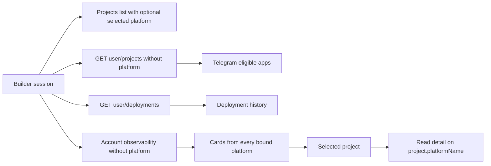

# Build Project Frontend Contract

The frontend has one persisted repository concept: `Project`. Repository
candidates exist only in the GitHub connection flow and never appear in the
Projects, Deployments, Operate, or bot-configuration data sets.

```ts
type Project = {
  id: number;
  installationId: number;
  repositoryId: number;
  repositoryLink: string;
  platformId: number;
  ownerBuilderId: number;
  createdAt: number;
  updatedAt: number;
};

type UserProject = Project & {
  platformName: string | null;
  apps: PlatformApp[];
  latestDeployment: UserProjectLatestDeployment | null;
  sdkVersion: string | null;
  sdkVersions: string[];
};
```

There is no `AppSource`, `UserSource`, `app_source_id`, `/sources`, parsed
project configuration, or manifest-path selection adapter. The backend owns
`.aomi/config.json` parsing. The browser and CLI send `project_id`; preflight
may omit `source_ref`, receives the resolved immutable commit, and apply must
send that exact commit.

## Read scopes



Account-wide Deployments, Operate, and Telegram reads omit `platform`. This
lets the backend aggregate projects and deployment history across different
platforms. The Projects page may explicitly select one platform. A
single-project read first proves account ownership, then uses that project's
`platformName`; the launch default must not override the binding.

## Page invariants

- Projects renders only persisted `UserProject` rows, never GitHub candidates.
- Deployments uses the builder-wide deployment feed and joins rows by
  `projectId`.
- Observability overview and detail share the same project identity. A card
  that links to detail cannot switch back to the default platform.
- Telegram configuration receives the same builder-wide projects collection,
  so every owned eligible application is selectable regardless of platform.
- Project creation persists only after the backend validates the repository's
  root `.aomi/config.json` at an immutable revision.

## Deletion boundary

The refactor deliberately removed compatibility surfaces instead of aliasing
them. New code must not restore source-named routes, source identifiers, client
manifest parsing, GitHub candidate imports, or per-platform defaults on
account-wide reads.
