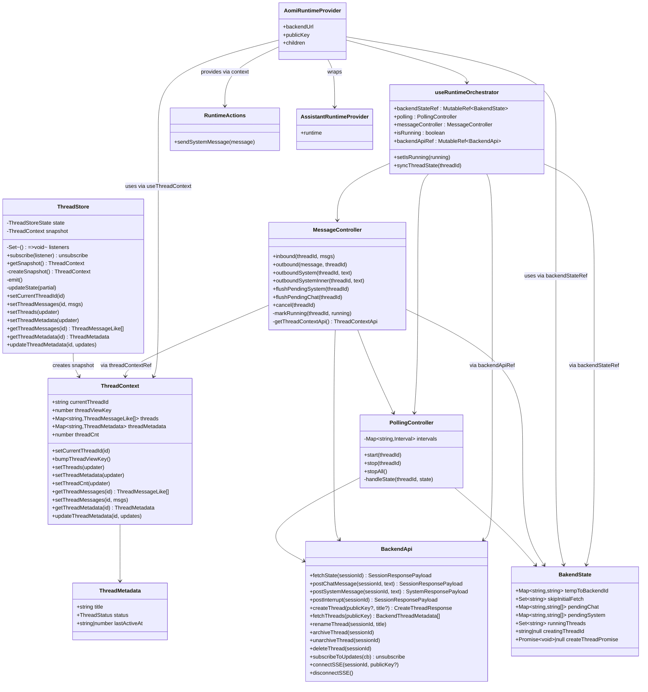
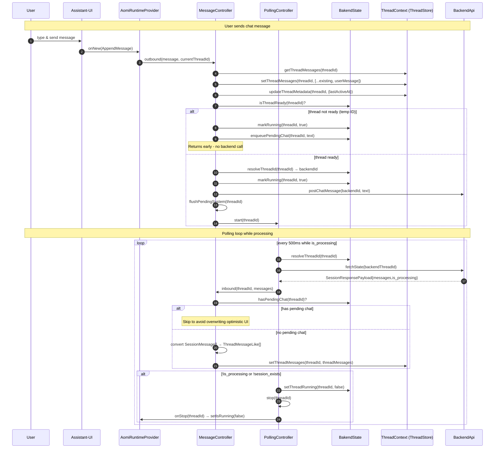
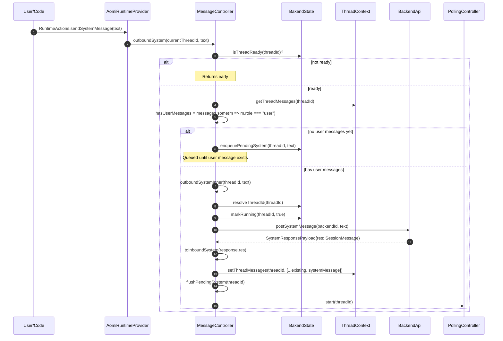
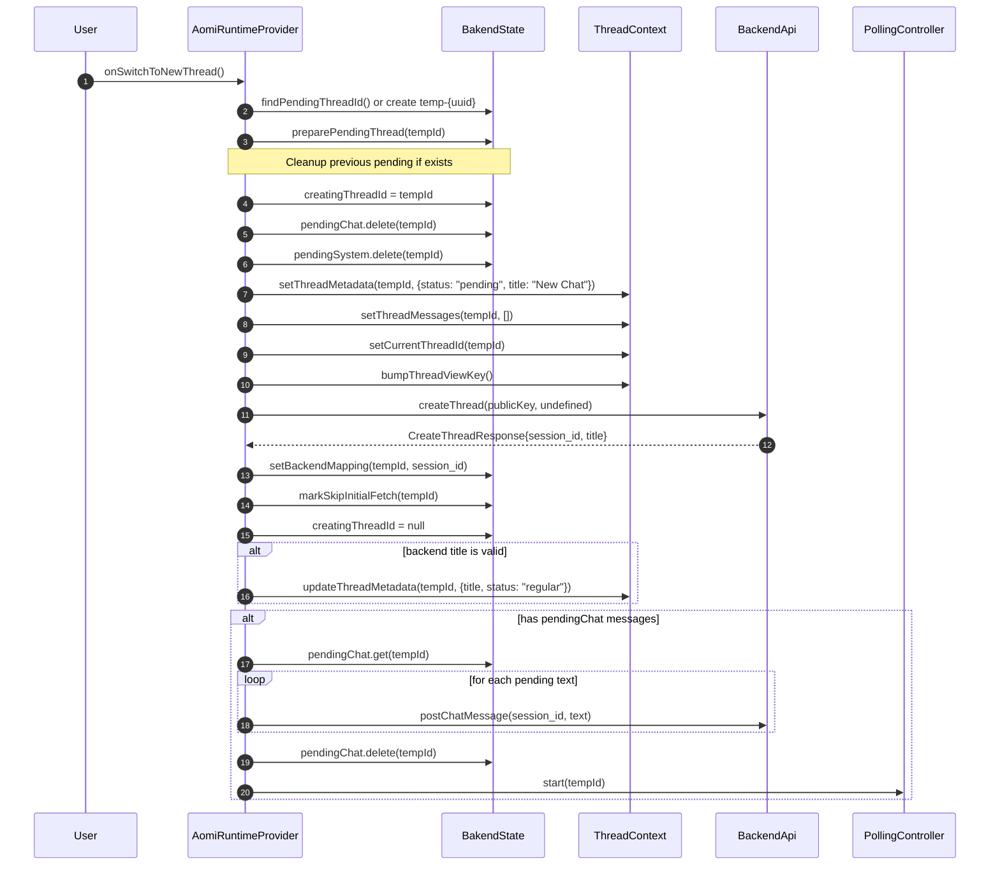

# Runtime Architecture Diagrams

## Type Structure & Relationships



## Data Flow: User Message → Backend → UI Update



## Data Flow: System Message



## Data Flow: Thread Creation



## ThreadContext ↔ BakendState Interaction Patterns

```mermaid
graph TB
  subgraph "ThreadContext (UI State)"
    TC1[threads: Map~id, messages~]
    TC2[threadMetadata: Map~id, metadata~]
    TC3[currentThreadId]
    TC4[threadViewKey]
  end

  subgraph "BakendState (Runtime State)"
    BS1[tempToBackendId: Map~tempId, backendId~]
    BS2[pendingChat: Map~id, string[]~]
    BS3[pendingSystem: Map~id, string[]~]
    BS4[runningThreads: Set~id~]
    BS5[skipInitialFetch: Set~id~]
    BS6[creatingThreadId]
  end

  subgraph "Controllers"
    MC[MessageController]
    PC[PollingController]
    AR[AomiRuntimeProvider]
  end

  MC -->|reads/writes| TC1
  MC -->|reads/writes| TC2
  MC -->|reads/writes| BS1
  MC -->|reads/writes| BS2
  MC -->|reads/writes| BS3
  MC -->|reads/writes| BS4

  PC -->|reads| BS1
  PC -->|reads/writes| BS4
  PC -->|triggers| MC

  AR -->|reads/writes| TC1
  AR -->|reads/writes| TC2
  AR -->|reads/writes| TC3
  AR -->|reads/writes| BS1
  AR -->|reads/writes| BS2
  AR -->|reads/writes| BS3
  AR -->|reads/writes| BS5
  AR -->|reads/writes| BS6

  style TC1 fill:#e1f5ff
  style TC2 fill:#e1f5ff
  style TC3 fill:#e1f5ff
  style BS1 fill:#fff4e1
  style BS2 fill:#fff4e1
  style BS3 fill:#fff4e1
  style BS4 fill:#fff4e1
```

## Key Changes from Previous Version

1. **Renamed Types:**
   - `ThreadRuntimeState` → `BakendState` (note: typo in codebase)
   - `ThreadContextValue` → `ThreadContext`
   - `runtimeStateRef` → `backendStateRef`

2. **MessageController Method Renames:**
   - `applyBackendMessages` → `inbound`
   - `sendChat` → `outbound`
   - `sendSystemMessage` → `outboundSystem`
   - `sendSystemMessageNow` → `outboundSystemInner`

3. **Conversion Functions:**
   - `constructSystemMessage` → `toInboundSystem`
   - `constructThreadMessage` → `toInboundMessage`

4. **New Features:**
   - `fetchThreads(publicKey)` - syncs thread list from backend
   - `setMessages` callback in runtime config for direct message updates
   - `isRunning` derived from `isThreadRunning(backendState, threadId)` per-thread
   - `ThreadStore` maintains a `snapshot` property updated on state changes

5. **Improved State Management:**
   - `markRunning` now checks if thread is current before updating global `isRunning`
   - `onStop` callback in PollingController checks current thread before stopping
   - Better cleanup of previous pending threads when creating new ones
