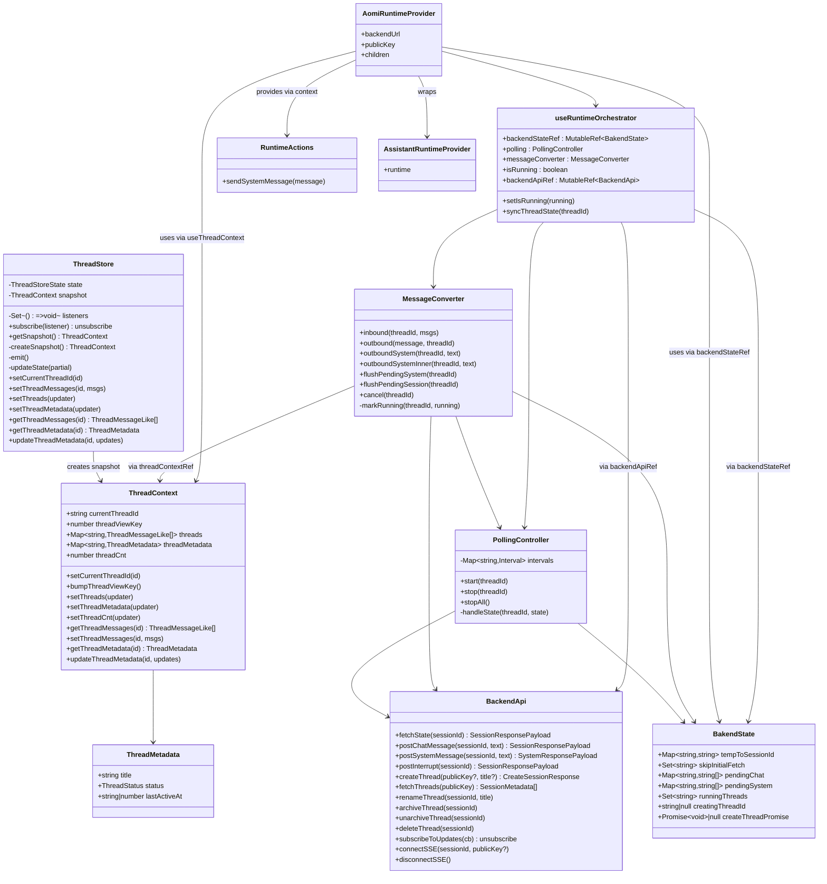
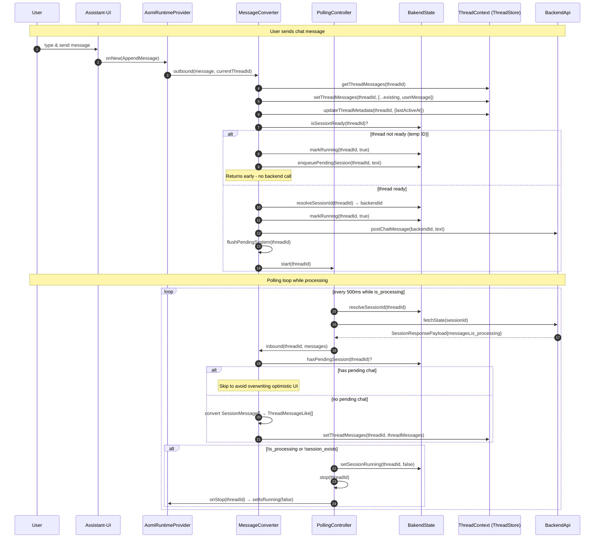
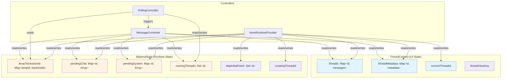

# Runtime Architecture Diagrams

## Type Structure & Relationships

This diagram shows the class structure and relationships between the core runtime components. `ThreadStore` manages UI state through snapshots exposed as `ThreadContext`, while `BakendState` tracks runtime coordination state like pending messages and thread mappings. `AomiRuntimeProvider` orchestrates `MessageConverter` and `PollingController` to coordinate between the UI state, backend API, and polling mechanisms.

## Data Flow: User Message → Backend → UI Update

This sequence diagram illustrates the complete flow when a user sends a chat message. The message flows from the UI through `AomiRuntimeProvider` to `MessageConverter`, which optimistically updates the UI state. If the thread is ready (has a backend ID), it immediately posts to the backend API and starts polling. If the thread is still pending (temp ID), the message is queued. The `PollingController` then continuously fetches updates from the backend and applies them to the UI state until processing completes.

## Data Flow: System Message

This sequence diagram shows how system messages (like wallet transactions) are handled. System messages require an existing user message in the thread before they can be sent. If no user messages exist yet, the system message is queued in `BakendState.pendingSystem`. Once a user message is present, the system message is sent to the backend, the response is converted and added to the thread, and any queued system messages are flushed.

## Data Flow: Thread Creation

This sequence diagram demonstrates the thread creation process when a user starts a new chat. A temporary thread ID is created immediately for optimistic UI updates, and the thread is marked as "pending" in the UI state. The backend API is called to create the actual thread, and once the backend responds with a session ID, the temporary ID is mapped to the backend ID. Any pending messages that were queued during creation are then sent to the backend.

## ThreadContext ↔ BakendState Interaction Patterns

This graph shows the interaction patterns between `ThreadContext` (UI state) and `BakendState` (runtime coordination state). `ThreadContext` holds the user-facing data like messages and thread metadata, while `BakendState` manages internal coordination like pending message queues, thread ID mappings, and running state. The controllers (`MessageConverter`, `PollingController`, and `AomiRuntimeProvider`) coordinate reads and writes between these two state layers to keep the UI in sync with backend operations.

## Key Changes from Previous Version

1. **Renamed Types:**
   - `ThreadRuntimeState` → `BakendState` (note: typo in codebase)
   - `ThreadContextValue` → `ThreadContext`
   - `runtimeStateRef` → `backendStateRef`

2. **MessageConverter Method Renames:**
   - `applyBackendMessages` → `inbound`
   - `sendChat` → `outbound`
   - `sendSystemMessage` → `outboundSystem`
   - `sendSystemMessageNow` → `outboundSystemInner`

3. **Conversion Functions:**
   - `constructSystemMessage` → `toInboundSystem`
   - `constructThreadMessage` → `toInboundMessage`

4. **New Features:**
   - `fetchThreads(publicKey)` - syncs thread list from backend
   - `setMessages` callback in runtime config for direct message updates
   - `isRunning` derived from `isSessionRunning(backendState, threadId)` per-thread
   - `ThreadStore` maintains a `snapshot` property updated on state changes

5. **Improved State Management:**
   - `markRunning` now checks if thread is current before updating global `isRunning`
   - `onStop` callback in PollingController checks current thread before stopping
   - Better cleanup of previous pending threads when creating new ones
