# Temporary Plan: Registry Auth Provider Decoupling

This is temporary planning material and can be deleted before commit.

## Goal

Keep Para as the default wallet/auth provider, but decouple the registry UI/runtime from Para so additional providers can be installed through the registry. Add Base Account as the first optional provider through wagmi's `baseAccount` connector.

This should be a registry-level provider abstraction, not a broad React/runtime package rewrite.

## Alignment With Current Direction

This plan follows the current main-branch direction:

- Start from main and preserve the merged transaction/AA work.
- Keep Para as the default provider.
- Add Base Account through the registry.
- Abstract Para-coupled areas in `apps/registry/src/lib/aomi-auth-adapter.ts`.
- Avoid changing `packages/react` unless something truly blocks the registry work.
- Do not force Base Account through Para AA owner/session logic.

The current Para coupling exists in three places:

- Account identity.
- Connect/manage modal behavior.
- AA owner creation.

The registry also currently bundles Para-specific dependencies into generic components such as `control-bar` and `runtime-tx-handler`.

## High-Level Design

The UI and runtime should only talk to a generic Aomi auth adapter:

```ts
useAomiAuthAdapter()
```

Provider-specific details live behind provider wrappers:

```tsx
<AomiParaProvider>
  <AomiFrame />
</AomiParaProvider>
```

or:

```tsx
<AomiBaseAccountProvider appName="Aomi">
  <AomiFrame />
</AomiBaseAccountProvider>
```

Para remains the landing/default path. Base Account is optional and self-contained.

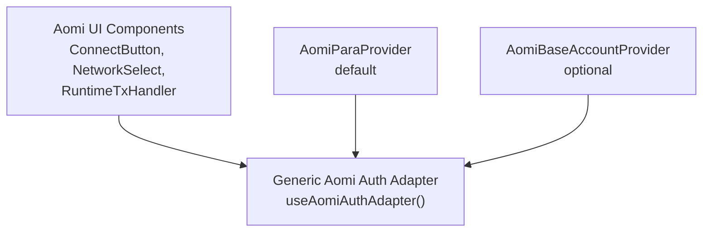

Core rule: visible UI and runtime bridge components should never import Para or Base Account directly.

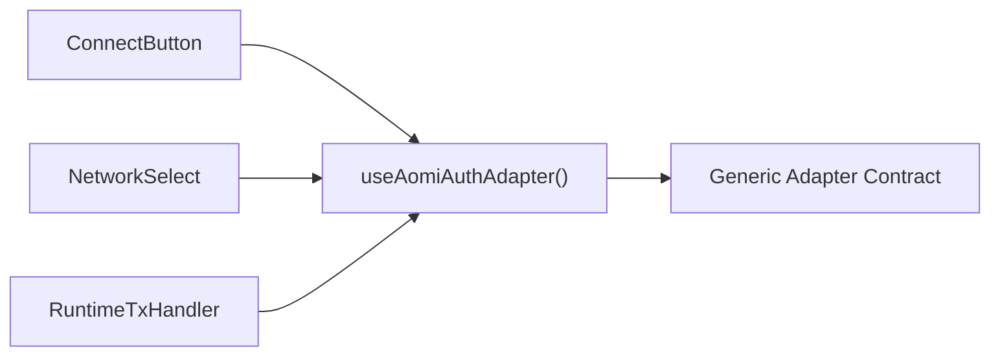

## File Shape

Keep the old import path:

```txt
apps/registry/src/lib/aomi-auth-adapter.ts
```

Make it a stable re-export:

```ts
export * from "./aomi-auth-adapter";
```

Create:

```txt
apps/registry/src/lib/aomi-auth-adapter/
  index.ts
  context.tsx
  types.ts
  identity.ts
  runtime-user-sync.tsx
  safe-wagmi-hooks.ts
  wallet-execution.ts
  providers/
    para.tsx
    base-account.tsx
```

Use `safe-wagmi-hooks.ts` instead of `wagmi-hooks.ts` to make clear that it is just shared defensive wrappers around wagmi hooks, not a provider.

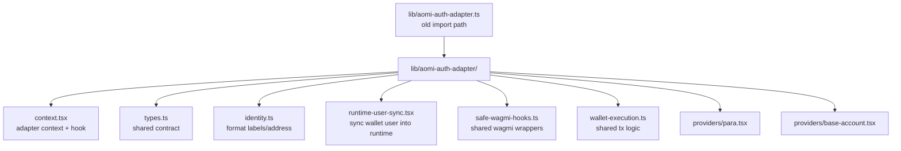

## File Responsibilities

### `lib/aomi-auth-adapter.ts`

Purpose: preserve the current public import path.

Used by:

- `ConnectButton`
- `NetworkSelect`
- `RuntimeTxHandler`
- existing consumers importing from `lib/aomi-auth-adapter`

Contains only:

```ts
export * from "./aomi-auth-adapter";
```

It should contain no Para imports, no wagmi hooks, and no provider logic.

### `lib/aomi-auth-adapter/index.ts`

Purpose: barrel export for the adapter module.

Exports:

- `AomiAuthAdapterProvider`
- `useAomiAuthAdapter`
- adapter types
- identity helpers
- `AomiAuthRuntimeUserSync`
- provider components if useful

Used by:

- `lib/aomi-auth-adapter.ts`
- registry provider entries

### `lib/aomi-auth-adapter/types.ts`

Purpose: shared adapter contract and result types.

Defines:

- `AomiAuthAdapter`
- `AomiAuthIdentity`
- `AomiAuthStatus`
- `AomiTxResult`
- AA/native wallet result metadata

The adapter should include:

```ts
export type AomiAuthAdapter = {
  identity: AomiAuthIdentity;
  isReady: boolean;
  isSwitchingChain: boolean;

  canConnect: boolean;
  canManageAccount: boolean;

  supportedChains?: readonly Chain[];

  connect: () => Promise<void>;
  manageAccount: () => Promise<void>;
  disconnect?: () => Promise<void>;

  switchChain?: (chainId: number) => Promise<void>;

  sendTransaction?: (payload: WalletTxPayload) => Promise<AomiTxResult>;
  signTypedData?: (
    payload: WalletEip712Payload,
  ) => Promise<{ signature: string }>;
};
```

Used by:

- `context.tsx`
- `runtime-user-sync.tsx`
- `providers/para.tsx`
- `providers/base-account.tsx`
- `wallet-execution.ts`

Important additions:

- `supportedChains` lets `NetworkSelect` avoid showing unsupported networks.
- `disconnect` gives Base Account a clean account-management fallback.

### `lib/aomi-auth-adapter/context.tsx`

Purpose: React context for the active adapter.

Defines:

- disconnected default adapter
- `AomiAuthAdapterProvider`
- `useAomiAuthAdapter`

Used by:

- `ConnectButton`
- `NetworkSelect`
- `RuntimeTxHandler`
- `AomiAuthRuntimeUserSync`
- provider components

Contains no Para or Base Account logic.

### `lib/aomi-auth-adapter/identity.ts`

Purpose: shared identity formatting only.

Defines:

- `AOMI_AUTH_DISCONNECTED_IDENTITY`
- `AOMI_AUTH_BOOTING_IDENTITY`
- `formatAddress`
- `formatAuthProvider`
- `inferAuthProvider`
- possibly shared helpers for connected identity labels

Used by:

- `providers/para.tsx`
- `providers/base-account.tsx`
- maybe UI display code

This replaces the current `lib/auth-identity.ts`. Keep `lib/auth-identity.ts` as a compatibility re-export if needed by registry items or existing consumers.

### `lib/aomi-auth-adapter/runtime-user-sync.tsx`

Purpose: sync adapter identity into the Aomi runtime user state.

Used by:

- `AomiFrame.Root`

Imports:

```ts
useUser from "@aomi-labs/react";
useAomiAuthAdapter from "./context";
```

Does:

```ts
setUser({
  address: adapter.identity.address ?? undefined,
  chainId: adapter.identity.chainId ?? undefined,
  isConnected: adapter.identity.isConnected,
});
```

Reason: `ConnectButton` currently performs this sync. That is fragile because the button can be hidden or replaced while `RuntimeTxHandler` still needs current user state for transaction simulation.

### `lib/aomi-auth-adapter/safe-wagmi-hooks.ts`

Purpose: shared safe wrappers around optional wagmi hooks.

This is not a provider. It is shared plumbing because both Para and Base Account use wagmi.

Defines wrappers such as:

- `useSafeWagmiAccount`
- `useSafeWagmiConfig`
- `useSafeSwitchChain`
- `useSafeSendTransaction`
- `useSafeSignTypedData`
- `useSafeCapabilities`
- `useSafeSendCallsSync`
- `useSafeWalletClient`
- `useSafeConnect`
- `useSafeDisconnect`
- `useSafeConnectors`

Used by:

- `providers/para.tsx`
- `providers/base-account.tsx`

Reason for safe wrappers: wagmi hooks throw if there is no `WagmiProvider` above them. The widget should render safely even when wallet providers are not installed/configured.

### `lib/aomi-auth-adapter/wallet-execution.ts`

Purpose: shared transaction/signing orchestration.

Defines:

- `executeAdapterTransaction`
- native wallet/EIP-5792 execution helpers
- `resolveRequestedAAMode`
- `normalizeAtomicCapabilities`
- `getPreferredRpcUrl`
- transaction result metadata normalization

Used by:

- `providers/para.tsx`
- `providers/base-account.tsx`

Imports shared runtime/client helpers:

- `executeWalletCalls`
- `toAAWalletCalls`
- `toViemSignTypedDataArgs`
- `DISABLED_PROVIDER_STATE`
- `aaModeFromExecutionKind`

Does not import:

- Para SDK
- Base Account SDK or connector

It should support:

- Para AA execution via supplied AA provider state.
- Native wallet execution via wagmi `sendTransaction` and `sendCallsSync`.
- EOA fallback.
- Clear metadata for native `wallet_sendCalls` batching.

Important improvement: if `sendCallsSyncAsync` returns no receipts or no transaction hash, fail clearly instead of returning an undefined `txHash`.

## Provider Responsibilities

### `lib/aomi-auth-adapter/providers/para.tsx`

Purpose: Para-specific adapter provider.

Used by:

- landing app by default
- registry entry `aomi-para-provider`
- consumers who want Para

Imports:

- `@getpara/react-sdk`
- `AomiAuthAdapterProvider`
- identity helpers
- `safe-wagmi-hooks.ts`
- `wallet-execution.ts`
- `createAAProviderState` from `@aomi-labs/client`

Owns:

- Para account state.
- Para session.
- Para modal connect behavior.
- Para account modal manage behavior.
- Para identity labels.
- Alchemy/Pimlico env resolution.
- Para AA owner creation.
- Existing 7702/4337 fallback attempts.

Renders:

```tsx
<AomiAuthAdapterProvider value={adapter}>
  {children}
</AomiAuthAdapterProvider>
```

Decision: make `AomiParaProvider` self-contained for registry usability if feasible. That means it should wrap the relevant Para SDK provider and query provider internally, similar to the existing landing provider. If that proves too invasive, keep a lower-level adapter provider and leave landing's existing `LandingParaProvider` as the outer SDK provider.

### `lib/aomi-auth-adapter/providers/base-account.tsx`

Purpose: Base Account-specific adapter provider.

Used by:

- registry entry `aomi-base-account-provider`
- consumers who want Base Account

Imports:

- `WagmiProvider`, `createConfig`, `http`
- `baseAccount` from `wagmi/connectors`
- `base`, optionally `baseSepolia`
- `QueryClientProvider`
- `AomiAuthAdapterProvider`
- identity helpers
- `safe-wagmi-hooks.ts`
- `wallet-execution.ts`

Owns:

- wagmi config creation.
- query client creation.
- Base Account connector setup.
- Base connect via wagmi `useConnect`.
- disconnect via wagmi `useDisconnect`.
- Base identity labels.
- Base-only default `supportedChains`.
- Native smart-wallet behavior through wagmi/EIP-5792.

Base Account provider shape:

```tsx
<WagmiProvider config={config}>
  <QueryClientProvider client={queryClient}>
    <BaseAccountAdapterInner>
      {children}
    </BaseAccountAdapterInner>
  </QueryClientProvider>
</WagmiProvider>
```

The inner component builds the adapter after wagmi context exists.

Base Account defaults:

- `chains`: `[base]`
- optionally allow `baseSepolia` via props for testing
- `multiInjectedProviderDiscovery: false`
- `ssr: true`
- `baseAccount({ appName, appLogoUrl })`

Do not route Base Account through Para AA owner/session code.

For now, leave paymaster/payment sponsorship as a clear TODO, not active config.

## Account Abstraction Plan

There are two different AA meanings in play:

1. Current Aomi AA provider path: Aomi creates/uses AA provider state through Para session ownership and Alchemy/Pimlico.
2. Base Account native smart-wallet path: Base Account exposes smart-wallet behavior through wagmi and EIP-5792 methods such as `wallet_sendCalls`.

The execution layer is already partly reusable, but the owner/session creation layer is still Para-shaped today.

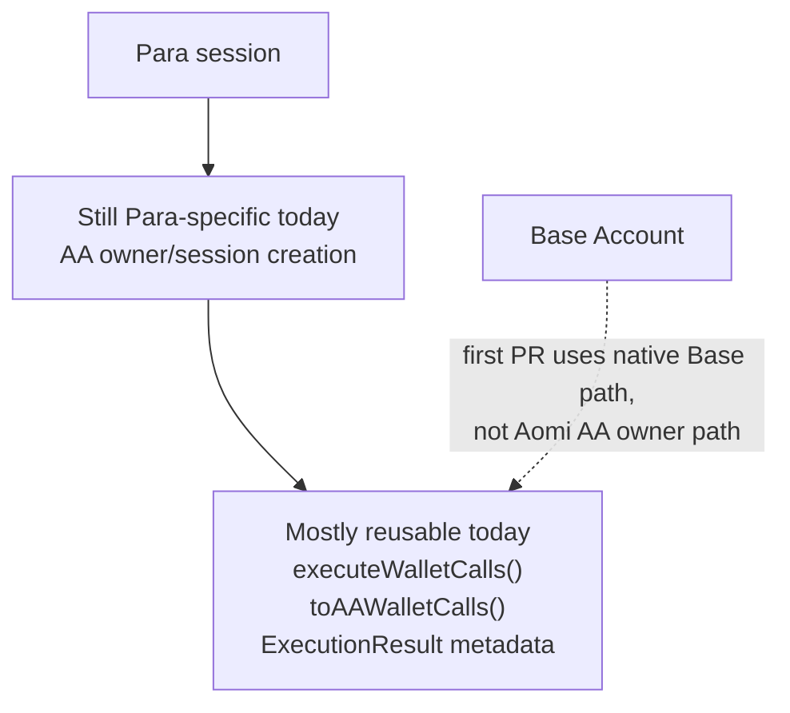

### First Implementation

Use the practical split:

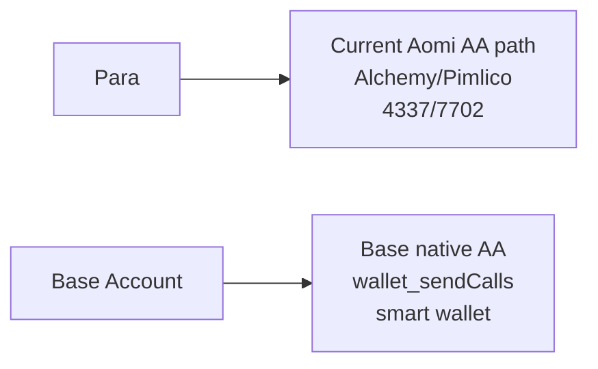

This means:

- Para keeps the current Aomi AA support.
- Base Account gets native Base smart-wallet behavior.
- Base Account does not go through Para session owner creation.
- Sponsorship/paymaster config remains a TODO.
- `packages/client/src/aa/owner.ts` does not need to change in the first pass.

### Future Unified AA Goal

The long-term goal can still be true provider-agnostic Aomi AA:

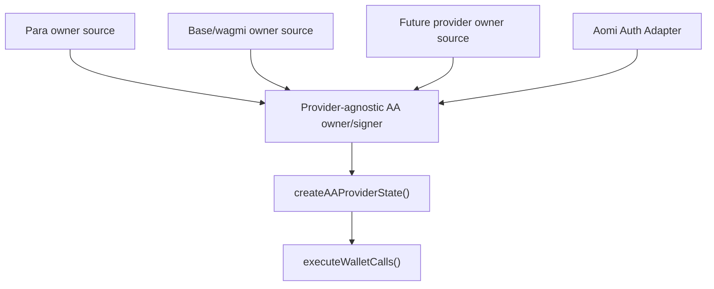

That follow-up would likely require changing `packages/client/src/aa/owner.ts` from a Para-specific owner/session model to a generic signer/source model, for example:

```ts
type AASigner = {
  address: Hex;
  signMessage: (message: string | Uint8Array) => Promise<Hex>;
  signTypedData: (payload: unknown) => Promise<Hex>;
};
```

or a discriminated union such as:

```ts
type AAOwnerSource =
  | { kind: "session"; adapter: "para"; session: ParaWeb; address?: Hex }
  | { kind: "walletClient"; adapter: "wagmi"; walletClient: WalletClient; address: Hex }
  | { kind: "custom"; adapter: string; signer: AASigner };
```

That is intentionally a second-phase design unless the first Base Account PR needs it.

## UI Component Responsibilities

### `components/control-bar/connect-button.tsx`

Purpose: display and action button only.

Uses:

```ts
useAomiAuthAdapter()
```

Reads:

- `identity`
- `canConnect`
- `canManageAccount`

Calls:

- `adapter.connect()`
- `adapter.manageAccount()`

Remove:

- `useUser`
- runtime user-state syncing

### `components/control-bar/network-select.tsx`

Purpose: chain picker.

Uses:

```ts
useAomiAuthAdapter()
```

Reads:

- `adapter.identity.chainId`
- `adapter.identity.isConnected`
- `adapter.supportedChains`
- `adapter.switchChain`
- `adapter.isSwitchingChain`

Chain list:

```ts
const chains = props.chains ?? adapter.supportedChains ?? SUPPORTED_CHAINS;
```

For Base Account, this shows only Base by default.

### `components/runtime-tx-handler.tsx`

Purpose: invisible runtime bridge for backend wallet requests.

Uses:

```ts
useAomiAuthAdapter()
useAomiRuntime()
```

Reads:

- current runtime user
- pending wallet requests
- adapter identity chain
- adapter transaction/signing methods

Calls:

- `adapter.sendTransaction(payloadWithFee)`
- `adapter.signTypedData(payload)`
- `adapter.switchChain(chainId)` before signing when needed

Does not know whether the provider is Para or Base Account.

### `components/aomi-frame.tsx`

Purpose: frame/layout root.

Mount inside `AomiRuntimeProvider`:

```tsx
<AomiAuthRuntimeUserSync />
<RuntimeTxHandler />
```

This keeps runtime user state current even if wallet UI is hidden.

Before:

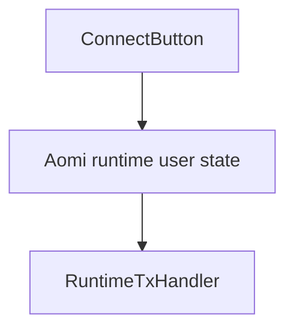

After:

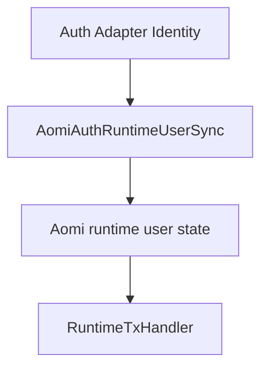

## Execution Flows

### Para Flow

```txt
AomiParaProvider
  -> reads Para SDK state
  -> reads wagmi state through safe-wagmi-hooks
  -> builds AomiAuthAdapter
  -> AomiAuthAdapterProvider
  -> AomiFrame
  -> ConnectButton / NetworkSelect / RuntimeTxHandler
```

### Base Account Flow

```txt
AomiBaseAccountProvider
  -> creates wagmi Base Account config
  -> connects through baseAccount connector
  -> reads wagmi state through safe-wagmi-hooks
  -> builds AomiAuthAdapter
  -> AomiAuthAdapterProvider
  -> AomiFrame
  -> ConnectButton / NetworkSelect / RuntimeTxHandler
```

### Transaction Flow

```txt
RuntimeTxHandler
  -> hydrates tx payload
  -> simulates fee
  -> appends fee call
  -> adapter.sendTransaction
  -> provider-specific adapter chooses execution path
```

Para execution:

```txt
Para provider
  -> wallet-execution
  -> Para AA state if requested/configured
  -> executeWalletCalls
  -> 7702 / 4337 / EOA fallback
```

Base execution:

```txt
Base provider
  -> wallet-execution
  -> native wallet_sendCalls for batches when supported
  -> wagmi sendTransaction fallback
```

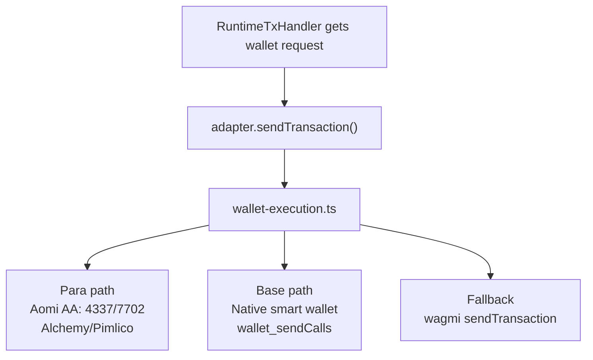

## Registry Changes

Add explicit entries:

```txt
aomi-auth-adapter
aomi-para-provider
aomi-base-account-provider
```

Before:

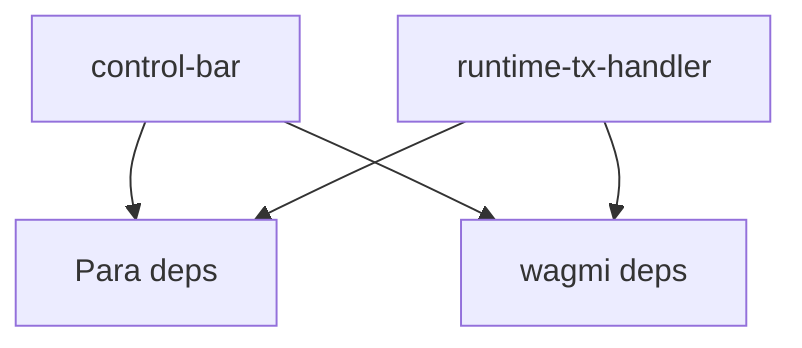

After:

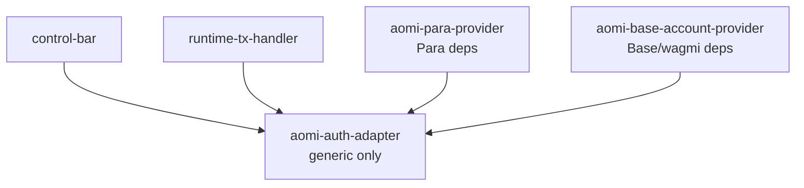

### `aomi-auth-adapter`

Includes:

```txt
lib/aomi-auth-adapter.ts
lib/aomi-auth-adapter/index.ts
lib/aomi-auth-adapter/context.tsx
lib/aomi-auth-adapter/types.ts
lib/aomi-auth-adapter/identity.ts
lib/aomi-auth-adapter/runtime-user-sync.tsx
```

Dependencies:

```txt
@aomi-labs/react
```

### `control-bar`

Includes:

```txt
components/control-bar/*
```

Registry dependencies:

```txt
aomi-auth-adapter
```

Dependencies:

```txt
@aomi-labs/react
lucide-react
```

No Para dependency. No wagmi dependency.

### `runtime-tx-handler`

Includes:

```txt
components/runtime-tx-handler.tsx
```

Registry dependencies:

```txt
aomi-auth-adapter
```

Dependencies:

```txt
@aomi-labs/react
```

No Para dependency. No wagmi dependency.

### `aomi-para-provider`

Includes:

```txt
lib/aomi-auth-adapter/providers/para.tsx
lib/aomi-auth-adapter/safe-wagmi-hooks.ts
lib/aomi-auth-adapter/wallet-execution.ts
```

Registry dependencies:

```txt
aomi-auth-adapter
```

Dependencies:

```txt
@aomi-labs/client
@aomi-labs/react
@getpara/react-sdk
@tanstack/react-query
wagmi
viem
```

### `aomi-base-account-provider`

Includes:

```txt
lib/aomi-auth-adapter/providers/base-account.tsx
lib/aomi-auth-adapter/safe-wagmi-hooks.ts
lib/aomi-auth-adapter/wallet-execution.ts
```

Registry dependencies:

```txt
aomi-auth-adapter
```

Dependencies:

```txt
@aomi-labs/client
@aomi-labs/react
@tanstack/react-query
wagmi
viem
```

Consider explicitly adding or documenting `@base-org/account` if the current wagmi connector package does not provide a fresh enough SDK version.

## Documentation Updates

Update wallet integration docs to show two paths.

Para default:

```tsx
<AomiParaProvider>
  <AomiFrame />
</AomiParaProvider>
```

Base Account optional:

```tsx
<AomiBaseAccountProvider appName="Aomi">
  <AomiFrame />
</AomiBaseAccountProvider>
```

Mention:

- Para remains default.
- Base Account starts Base-only by default.
- Base Account uses native smart-wallet behavior through wagmi/EIP-5792.
- Sponsorship/paymaster config is intentionally not enabled yet.

## Implementation Order

1. Create generic adapter folder and root re-export.
2. Move identity helpers.
3. Add adapter context and disconnected default adapter.
4. Add runtime user sync and mount it in `AomiFrame.Root`.
5. Simplify `ConnectButton` so it no longer syncs runtime user state.
6. Update `NetworkSelect` to use `adapter.supportedChains`.
7. Move safe wagmi wrappers into `safe-wagmi-hooks.ts`.
8. Move reusable transaction execution logic into `wallet-execution.ts`.
9. Implement `AomiParaProvider`.
10. Implement `AomiBaseAccountProvider`.
11. Update registry entries.
12. Update landing to use `AomiParaProvider` if the provider is self-contained.
13. Rebuild registry and verify generated JSON.
14. Update docs.

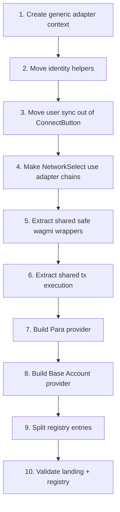

## Validation

Run:

```sh
npm exec -- pnpm run build:lib
npm exec -- pnpm run build:registry
npm exec -- pnpm run lint
```

Then verify:

- Landing still works with Para.
- Generated registry JSON includes generic adapter files.
- `control-bar` no longer pulls Para directly.
- `runtime-tx-handler` no longer pulls Para directly.
- Base provider installs without Para dependencies.
- Base provider only shows Base in the network selector by default.
- Hiding `ConnectButton` does not break runtime simulation user state.
- Native `wallet_sendCalls` batching returns clear metadata and never resolves with an undefined `txHash`.

## Non-Goals For This PR

- No giant plugin system.
- No broad `packages/react` rewrite.
- No Base Account support in `packages/client/src/aa/owner.ts` unless later needed for a different Base-specific AA/session model.
- No provider toggle in the landing demo.
- No active Base paymaster/sponsorship config yet.
- No promise that Base Account uses the current Para-style Aomi AA owner path in this first PR. Base gets native smart-wallet behavior first; provider-agnostic Aomi AA owner support is a future track.

## One-Sentence Summary

Split the registry auth adapter into a generic context contract, move Para and Base Account behind provider wrappers, reuse current tx/AA execution logic, sync runtime user state outside the wallet button, constrain networks per provider, and make registry entries explicit so consumers only install the provider stack they choose.
