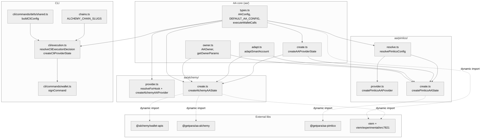
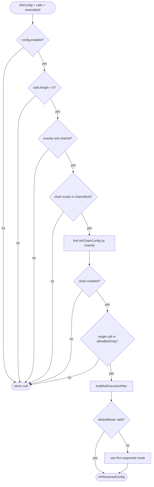
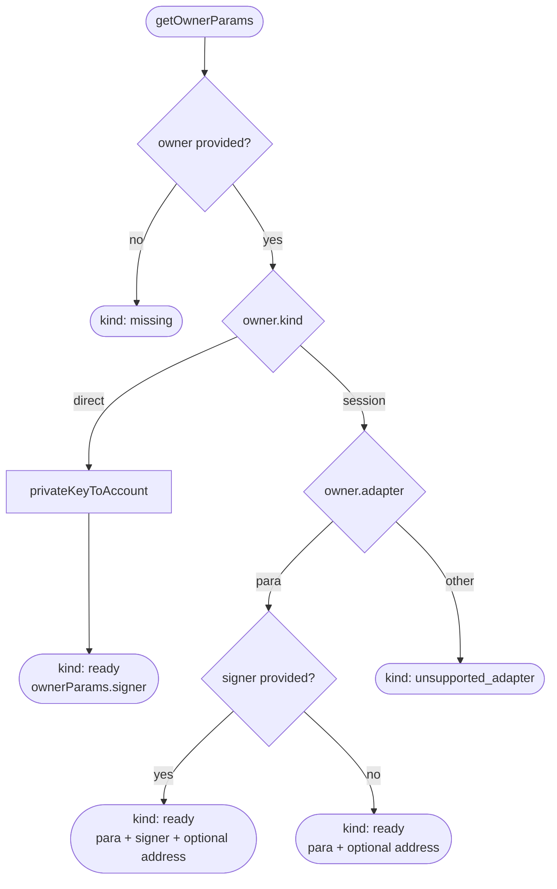
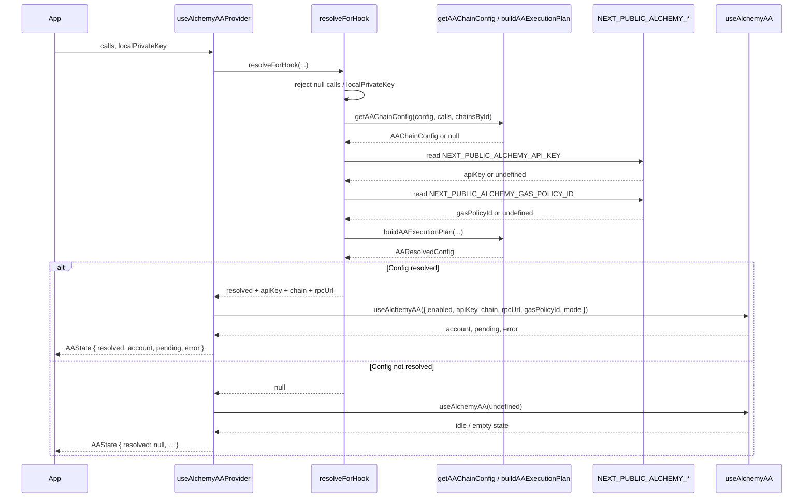
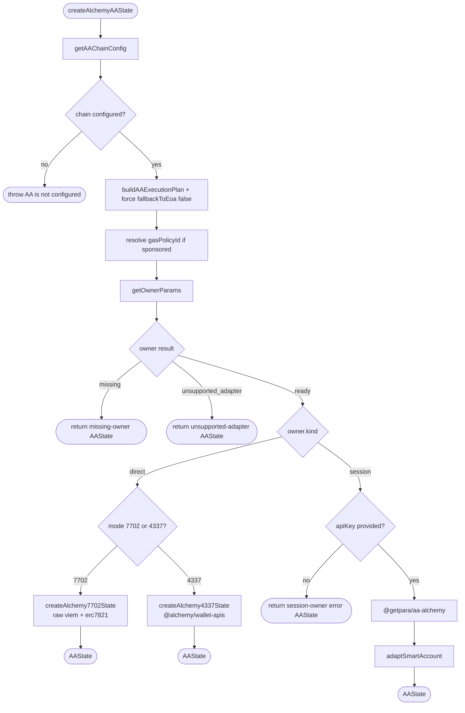
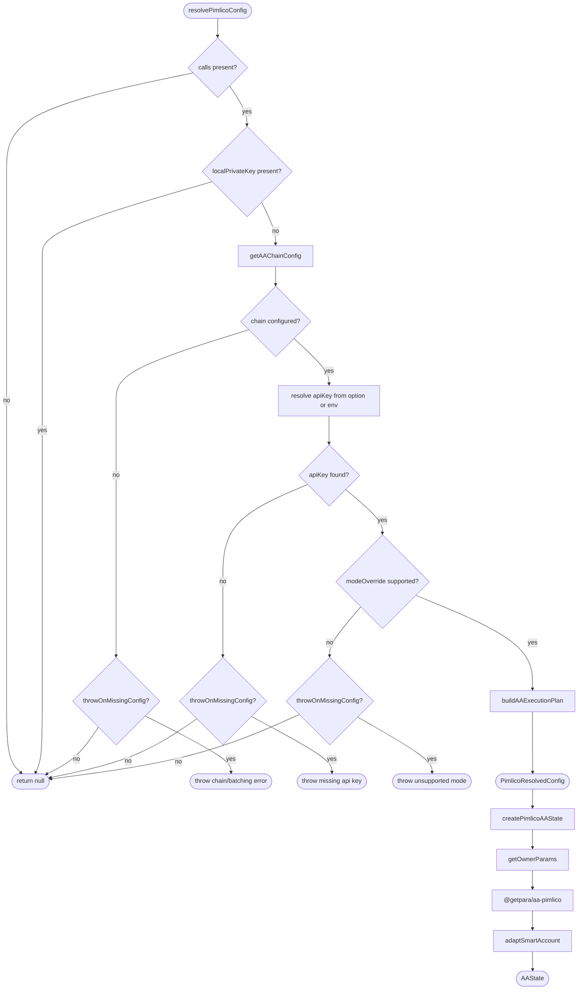
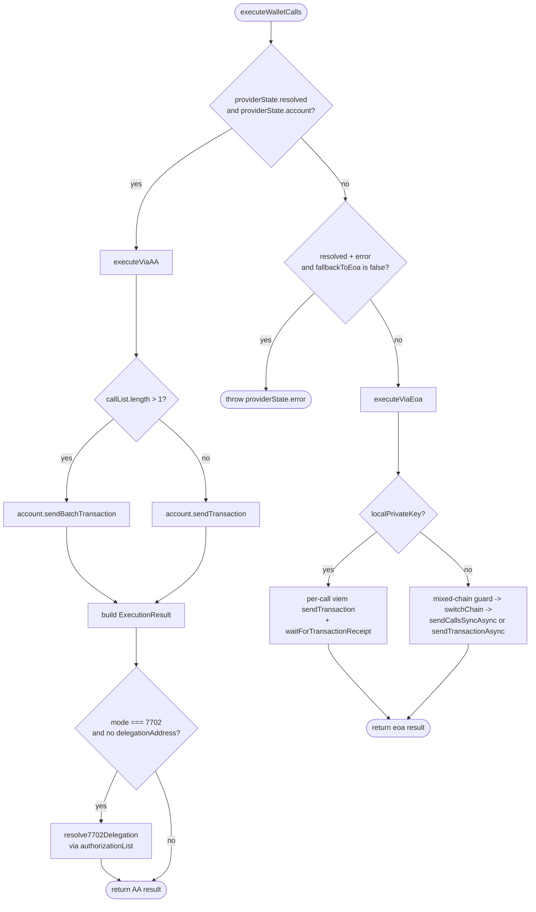
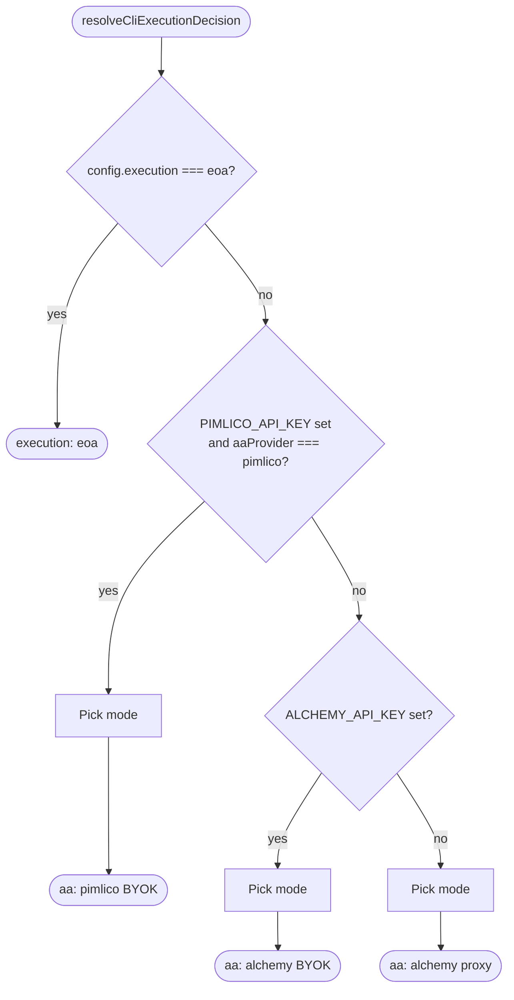
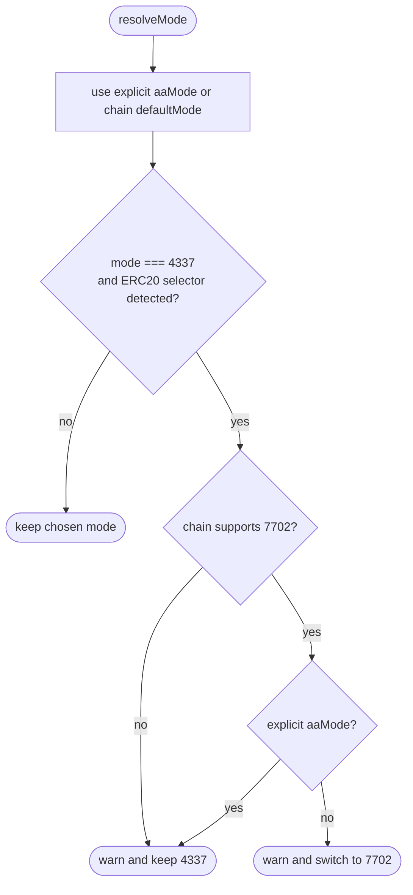

# Account Abstraction Architecture

This document describes the current AA architecture in this repository.
It is based on the live code under `packages/client/src/aa` and
`packages/client/src/cli`.

The older persisted-config model is gone. There is no `aa/env.ts`,
`aa/alchemy/resolve.ts`, `aa/resolve.ts`, `cli/aa-config.ts`, or `aomi aa`
subcommand in the current codebase.

**Layout:** All paths below are under `packages/client/src/` unless noted.

---

## Current Model

- `aa/types.ts` owns the shared AA config model, default chain matrix,
  execution planning, and the generic `executeWalletCalls()` router.
- `aa/create.ts` is the provider-neutral async facade that dispatches to
  Alchemy or Pimlico.
- Alchemy has two different direct-owner execution implementations:
  - `4337` uses `@alchemy/wallet-apis`.
  - `7702` uses raw `viem` plus `viem/experimental/erc7821`.
- Pimlico still uses a classic `resolve -> create` split.
- React hook factories only resolve browser-safe config and forward it to
  caller-provided hooks such as `useAlchemyAA` / `usePimlicoAA`.
- The CLI now defaults to AA. With no BYOK credentials it uses the backend
  Alchemy proxy; `--eoa` is the only way to force plain EOA execution.

---

## Module Dependency Graph



**Provider SDK boundary:** provider-specific SDK imports only happen in the
async creator files:

- `aa/alchemy/create.ts`
- `aa/pimlico/create.ts`

The hook factories do not import SDKs themselves. They only resolve config and
hand it to the caller's hook.

`aa/types.ts` also uses lazy `viem` imports at execution time for:

- EOA submission with a local private key
- best-effort 7702 delegation lookup from the on-chain transaction

---

## Shared Types And Defaults

### Core types

`aa/types.ts` defines the shared model:

- `AAProvider = "alchemy" | "pimlico"`
- `AAMode = "4337" | "7702"`
- `AASponsorship = "disabled" | "optional" | "required"`
- `AAConfig`
- `AAChainConfig`
- `AAResolvedConfig`
- `AAState`
- `SmartAccount`
- `ExecutionResult`

`AAConfig` is still the generic contract used by hook factories and planning:

```ts
type AAConfig = {
  enabled: boolean;
  provider: "alchemy" | "pimlico";
  fallbackToEoa: boolean;
  chains: AAChainConfig[];
};
```

### Default chain matrix

`DEFAULT_AA_CONFIG` currently enables AA on five chains:

| Chain | ID | defaultMode | supportedModes | allowBatching | sponsorship |
| --- | --- | --- | --- | --- | --- |
| Ethereum | `1` | `7702` | `4337`, `7702` | `true` | `optional` |
| Polygon | `137` | `4337` | `4337`, `7702` | `true` | `optional` |
| Arbitrum One | `42161` | `4337` | `4337`, `7702` | `true` | `optional` |
| Optimism | `10` | `4337` | `4337`, `7702` | `true` | `optional` |
| Base | `8453` | `4337` | `4337`, `7702` | `true` | `optional` |

Two important details:

- `DEFAULT_AA_CONFIG.fallbackToEoa` is still `true`.
- The CLI chain registry also includes Sepolia (`11155111`), but Sepolia is
  not present in `DEFAULT_AA_CONFIG`, so AA resolution fails there.

### Planning helpers

`getAAChainConfig(config, calls, chainsById)` returns `null` unless all of the
following are true:

- AA is enabled.
- The call list is non-empty.
- All calls target the same chain.
- The target chain exists in `chainsById`.
- The chain is enabled in `config.chains`.
- Batching is allowed when `calls.length > 1`.

`buildAAExecutionPlan(config, chainConfig)` chooses:

- `chainConfig.defaultMode` when it appears in `supportedModes`
- otherwise the first supported mode

and returns:

```ts
type AAResolvedConfig = {
  provider: "alchemy" | "pimlico";
  chainId: number;
  mode: "4337" | "7702";
  batchingEnabled: boolean;
  sponsorship: "disabled" | "optional" | "required";
  fallbackToEoa: boolean;
};
```

`getWalletExecutorReady(providerState)` treats AA as "ready enough" when:

- no AA plan is active, or
- the provider has finished loading and now has either:
  - an account,
  - an error, or
  - `fallbackToEoa === true`



---

## Owner Model

Smart-account creation takes an `AAOwner`, not a bare key:

- `{ kind: "direct", privateKey }`
- `{ kind: "session", adapter: "para", session, signer?, address? }`

`owner.ts` resolves this into the SDK owner shape:

- direct owner -> `privateKeyToAccount(privateKey)` signer
- Para session owner -> `{ para: session, signer?, address? }`

Current adapter support is narrow by design:

- `para` is implemented
- any other `adapter` returns an `unsupported_adapter` result

The owner helpers also produce consistent error states:

- `getMissingOwnerState(...)`
- `getUnsupportedAdapterState(...)`

These return an `AAState` with `account: null`, `pending: false`, and a clear
error message instead of throwing synchronously.



---

## Alchemy Implementation

### Hook path: `aa/alchemy/provider.ts`

`createAlchemyAAProvider()` is the browser-facing factory. It does not know how
to build a smart account by itself; it only resolves config and passes
`AlchemyHookParams` into a caller-provided `useAlchemyAA` hook.

The internal `resolveForHook()` behavior is:

- returns `null` when `calls` is `null`
- returns `null` when `localPrivateKey` is present
- builds a chain plan from `AAConfig`
- reads only:
  - `NEXT_PUBLIC_ALCHEMY_API_KEY`
  - `NEXT_PUBLIC_ALCHEMY_GAS_POLICY_ID`
- returns `null` when the public API key is missing

The hook resolver is intentionally simpler than the old architecture:

- there is no shared `resolveAlchemyConfig()`
- there is no `publicOnly` flag for Alchemy anymore
- there is no proxy mode in the React hook path

`CreateAlchemyAAProviderOptions` still includes `chainSlugById`,
`apiKeyEnvVar`, and `gasPolicyEnvVar`, but the current resolver reads the fixed
`NEXT_PUBLIC_*` env vars directly.



### Async create path: `aa/alchemy/create.ts`

`createAlchemyAAState()` is the real Alchemy constructor. It:

1. Resolves the chain from `DEFAULT_AA_CONFIG`.
2. Applies an explicit `mode` override when one is passed.
3. Resolves `gasPolicyId` from:
   - `options.gasPolicyId`, else
   - `process.env.ALCHEMY_GAS_POLICY_ID`
4. Builds a resolved plan and forces `fallbackToEoa: false`.
5. Splits by owner type and AA mode.



#### Direct owner, `4337`

Direct-owner `4337` uses `@alchemy/wallet-apis`, not `@getpara/aa-alchemy`.

Key behaviors:

- transport is:
  - `alchemyWalletTransport({ url: proxyBaseUrl })` when proxy mode is active
  - otherwise `alchemyWalletTransport({ apiKey })`
- signer is created from `privateKeyToAccount(...)`
- paymaster config is included only when `gasPolicyId` exists
- the account ID is derived deterministically from the signer address by
  `deriveAlchemy4337AccountId()`
- account creation uses:
  - `requestAccount({ signerAddress, id, creationHint: { accountType: "sma-b", createAdditional: true } })`
- if Alchemy reports `Account with address 0x... already exists`, the code
  retries with `requestAccount({ accountAddress })`
- sends happen through `alchemyClient.sendCalls(...)` +
  `waitForCallsStatus(...)`
- the returned transaction hash comes from `status.receipts?.[0]?.transactionHash`

This path produces a `SmartAccount` whose `AAAddress` is the 4337 account
address returned by Wallet APIs.

#### Direct owner, `7702`

Direct-owner `7702` bypasses Wallet APIs and uses raw `viem`.

Key behaviors:

- fixed delegation target:
  - `0x69007702764179f14F51cdce752f4f775d74E139`
- RPC selection prefers:
  - `proxyBaseUrl`, then
  - `alchemyRpcUrl(chainId, apiKey)`, then
  - default transport fallback
- authorization is signed with `walletClient.signAuthorization(...)`
- call bundles are encoded with `encodeExecuteData(...)`
- gas is estimated with `authorizationList` included
- the code adds a hard-coded `25000` gas overhead for the 7702 authorization
- the raw transaction is sent to the signer's own EOA
- receipt status is checked and a reverted receipt throws

This path returns a `SmartAccount` with:

- `provider: "alchemy"`
- `mode: "7702"`
- `AAAddress = signer.address`
- `delegationAddress = 0x6900...E139`

If a gas policy is configured, the 7702 path prints a warning that raw 7702 is
not paymaster-sponsored and the EOA pays gas directly.

#### Session owner

Alchemy session-owner creation still uses `@getpara/aa-alchemy`.

Current rule:

- session owners require a real `apiKey`
- proxy mode is not supported for session owners

If `options.apiKey` is missing for a session owner, `createAlchemyAAState()`
returns an `AAState` with an error:

```text
Alchemy AA with session/adapter owner requires ALCHEMY_API_KEY.
```

---

## Pimlico Implementation

`aa/pimlico/resolve.ts` is the only remaining provider-specific resolve module.

`resolvePimlicoConfig()` does all of the following:

- disables AA when `calls` is `null`
- disables AA when `localPrivateKey` is present
- builds a chain plan from `AAConfig`
- validates `modeOverride` against `supportedModes`
- resolves the API key from:
  - `options.apiKey`, else
  - `PIMLICO_API_KEY`, else
  - `NEXT_PUBLIC_PIMLICO_API_KEY` when `publicOnly === true`

When `throwOnMissingConfig` is true, Pimlico resolution throws on:

- unsupported / disabled chain
- missing API key
- unsupported mode override

`createPimlicoAAProvider()` is the React-facing factory:

- it calls `resolvePimlicoConfig(... publicOnly: true)`
- it forwards `PimlicoHookParams` into a caller-provided `usePimlicoAA` hook

`createPimlicoAAState()` is the async creator:

- it calls `resolvePimlicoConfig(... throwOnMissingConfig: true)`
- it forces `fallbackToEoa: false`
- it dynamically imports `@getpara/aa-pimlico`
- it uses the shared owner-resolution path from `owner.ts`
- it adapts the SDK smart account through `adaptSmartAccount(...)`

Unlike Alchemy, Pimlico does not have a proxy transport path in the current
code.



---

## Smart Account Adapter

`adaptSmartAccount()` is the bridge from provider SDK return values into the
library-level `SmartAccount` interface consumed by `executeWalletCalls()`.

The important normalization is the 7702 guard:

- if the SDK reports the same value for `smartAccountAddress` and
  `delegationAddress`, the adapter drops that delegation address as bogus

---

## Generic Execution Routing

`executeWalletCalls()` in `aa/types.ts` is still the single runtime router for
both the React/widget path and the CLI private-key path.



### AA path

When `providerState.resolved` and `providerState.account` are both present:

- single call -> `account.sendTransaction(...)`
- multi-call -> `account.sendBatchTransaction(...)`

The returned `ExecutionResult` contains:

- `txHash`
- `txHashes`
- `executionKind = "${provider.toLowerCase()}_${mode}"`
- `batched`
- `sponsored = resolved.sponsorship !== "disabled"`
- `AAAddress`
- `delegationAddress`

For `7702`, delegation metadata is best-effort:

- first use `account.delegationAddress`
- if it is missing, fetch the on-chain transaction and read
  `authorizationList[0].address` or `authorizationList[0].contractAddress`

That fallback only knows these chains:

- Ethereum `1`
- Polygon `137`
- Arbitrum `42161`
- Optimism `10`
- Base `8453`

### EOA path

When AA is unavailable, or when `fallbackToEoa` remains enabled, the router
falls back to plain EOA execution.

There are two sub-paths:

#### Local private key path

When `localPrivateKey` is present:

- each call is sent with a chain-specific `viem` wallet client
- the code waits for every transaction receipt
- mixed-chain batches are supported because each call is executed separately

#### External wallet path

When `localPrivateKey` is absent:

- mixed-chain bundles are rejected
- the wallet is switched to the call chain when needed
- if wallet capabilities expose atomic batching as `supported` or `ready`,
  the code uses `sendCallsSyncAsync({ capabilities: { atomic: { required: true }}})`
- otherwise it sends each call individually with `sendTransactionAsync(...)`

### `fallbackToEoa` in current code

The generic router still honors `AAResolvedConfig.fallbackToEoa`.

That matters for app/widget usage where callers may want:

- "try AA if available"
- "drop to EOA if AA resolves with an error"

It does **not** drive the CLI's behavior. CLI-created AA states explicitly set
`fallbackToEoa: false`.

---

## CLI Execution Model

The relevant CLI files are:

- `cli/commands/defs/shared.ts`
- `cli/execution.ts`
- `cli/commands/wallet.ts`

The active command surface is `aomi tx sign`, not the old top-level `aomi sign`
alias described by older docs.

### Config parsing

`buildCliConfig(args)` creates a `CliConfig` directly from citty args + env:

- `execution` is:
  - `"eoa"` when `--eoa` is passed
  - `"aa"` when `--aa`, `--aa-provider`, or `--aa-mode` is passed
  - `undefined` otherwise
- `aaProvider` comes from:
  - `--aa-provider`, else
  - `AOMI_AA_PROVIDER`
- `aaMode` comes from:
  - `--aa-mode`, else
  - `AOMI_AA_MODE`

`--eoa` cannot be combined with `--aa-provider` or `--aa-mode`.

### Provider decision tree

`resolveCliExecutionDecision()` currently uses this order:

| Condition | Result |
| --- | --- |
| `config.execution === "eoa"` | plain EOA |
| `PIMLICO_API_KEY` is set and `config.aaProvider === "pimlico"` | Pimlico BYOK |
| `ALCHEMY_API_KEY` is set | Alchemy BYOK |
| otherwise | Alchemy proxy |

So the zero-config default is now:

```ts
{ execution: "aa", provider: "alchemy", aaMode, proxy: true }
```

There is no persisted AA JSON config anymore.



### Mode selection and ERC-20 guardrail

`resolveMode()` uses `DEFAULT_AA_CONFIG` for the chain's default mode, then
passes the result through `maybeOverride4337ForTokenOps(...)`.

That helper inspects calldata selectors for:

- `approve(address,uint256)` -> `0x095ea7b3`
- `transfer(address,uint256)` -> `0xa9059cbb`
- `transferFrom(address,address,uint256)` -> `0x23b872dd`

Behavior:

- if the chosen mode is `4337`
- and the call list contains ERC-20 operations
- and the chain supports `7702`
- and the user did **not** explicitly force `--aa-mode 4337`

then the CLI logs a warning and auto-switches to `7702`.

If the user explicitly requested `4337`, the CLI keeps `4337` and warns that
tokens must already be in the smart account.



### Provider state creation

`createCliProviderState()` turns the decision into a concrete `AAState`:

- `eoa` -> `DISABLED_PROVIDER_STATE`
- `aa` -> `createAAProviderState(...)`

For Alchemy proxy mode it derives:

```text
${baseUrl}/aa/v1/${ALCHEMY_CHAIN_SLUGS[chain.id]}
```

and passes that as `proxyBaseUrl`.

CLI AA always uses a direct owner:

```ts
owner: { kind: "direct", privateKey }
```

### `signCommand()` flow

```mermaid
sequenceDiagram
    participant User as User
    participant Sign as signCommand
    participant Sim as session.client.simulateBatch
    participant Exec as resolveCliExecutionDecision
    participant Create as createCliProviderState
    participant AA as createAAProviderState
    participant Router as executeWalletCalls
    participant Backend as session.client.sendSystemMessage

    User->>Sign: aomi tx sign <tx-id>...
    Sign->>Sim: simulate pending tx batch
    Sim-->>Sign: batch_success + optional fee
    Sign->>Sign: append fee transfer when present
    Sign->>Exec: resolve provider + mode
    Exec-->>Sign: CliExecutionDecision

    Sign->>Create: build provider state
    Create->>AA: create Alchemy/Pimlico AA state
    AA-->>Create: AAState
    Create-->>Sign: providerState
    Sign->>Router: executeWalletCalls(...)

    alt primary mode succeeds
        Router-->>Sign: ExecutionResult
    else primary mode fails
        Sign->>Sign: getAlternativeAAMode()
        Sign->>Create: rebuild provider state with opposite mode
        Sign->>Router: retry once
        Router-->>Sign: ExecutionResult or error
    end

    Sign->>Backend: wallet:tx_complete
    Sign-->>User: tx hash + AA metadata
```

Important runtime details:

- transaction batches are simulated first with `session.client.simulateBatch(...)`
- when simulation returns a fee, the CLI appends one extra native transfer call
- AA execution is attempted with the resolved mode
- if that AA attempt fails, the CLI retries once with the opposite mode:
  - `7702 -> 4337`
  - `4337 -> 7702`
- if both AA modes fail, the command exits with an error and suggests `--eoa`

There is **no** automatic AA -> EOA fallback in `signCommand()`.

Typed-data signing is separate:

- `kind === "eip712_sign"` bypasses the AA pipeline completely
- the CLI signs via `walletClient.signTypedData(...)`

---

## Public Surface

`packages/client/src/index.ts` re-exports the current AA API:

- `DEFAULT_AA_CONFIG`
- `getAAChainConfig`
- `buildAAExecutionPlan`
- `getWalletExecutorReady`
- `executeWalletCalls`
- `createAlchemyAAProvider`
- `createPimlicoAAProvider`
- `adaptSmartAccount`
- `isAlchemySponsorshipLimitError`
- `resolvePimlicoConfig`
- `createAAProviderState`

The generic AA facade is intentionally small now:

- planning lives in `aa/types.ts`
- provider-specific behavior lives in `aa/alchemy/*` and `aa/pimlico/*`
- CLI selection logic lives in `cli/execution.ts`

---

## Current Differences From Older Specs

These are the main corrections relative to stale documentation:

- No persisted `~/.aomi/aa.json` config remains.
- No `aomi aa status|set|test|reset` commands remain.
- No shared env-resolution layer remains for Alchemy.
- React Alchemy AA is driven by an inlined `resolveForHook()` that reads
  `NEXT_PUBLIC_*` env vars directly.
- CLI default execution is AA, not EOA.
- CLI zero-config AA uses the backend Alchemy proxy.
- CLI failure fallback is AA-mode-to-AA-mode, not AA-to-EOA.
- `fallbackToEoa` still exists in the generic AA config model, but CLI-created
  AA states force it to `false`.
