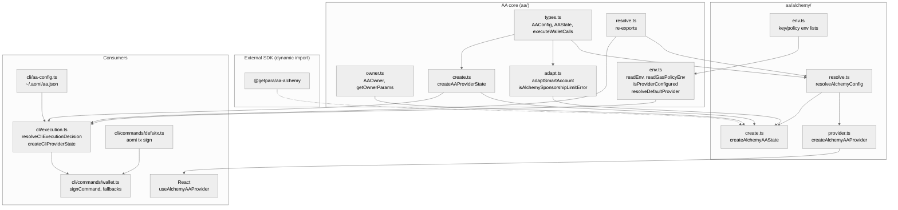
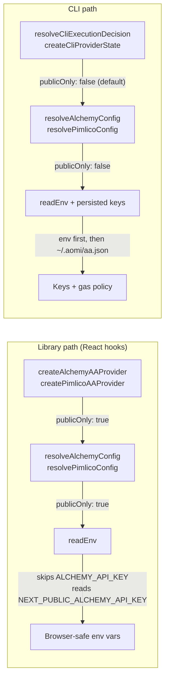
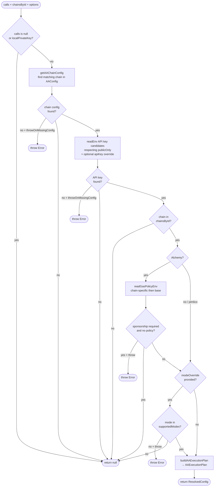
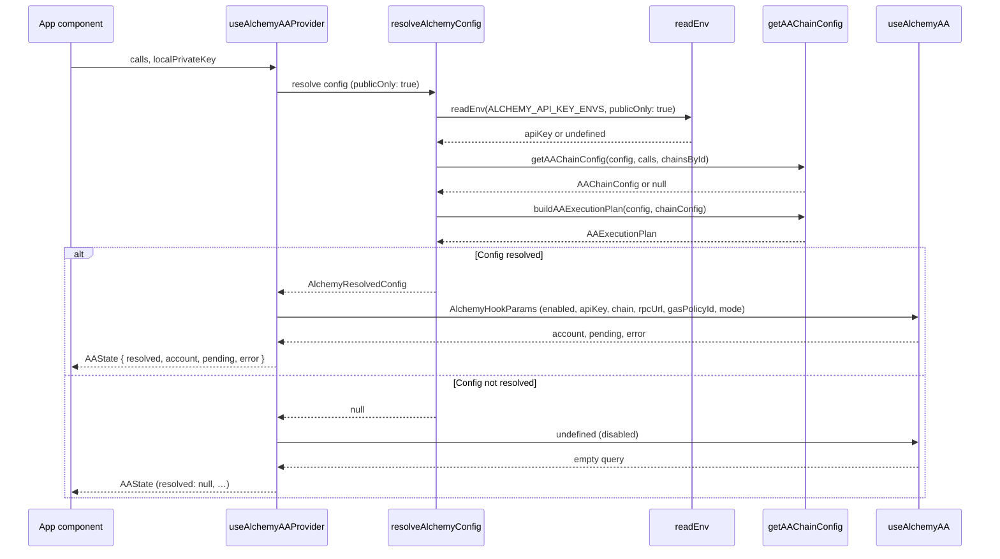
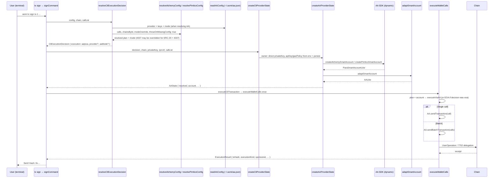
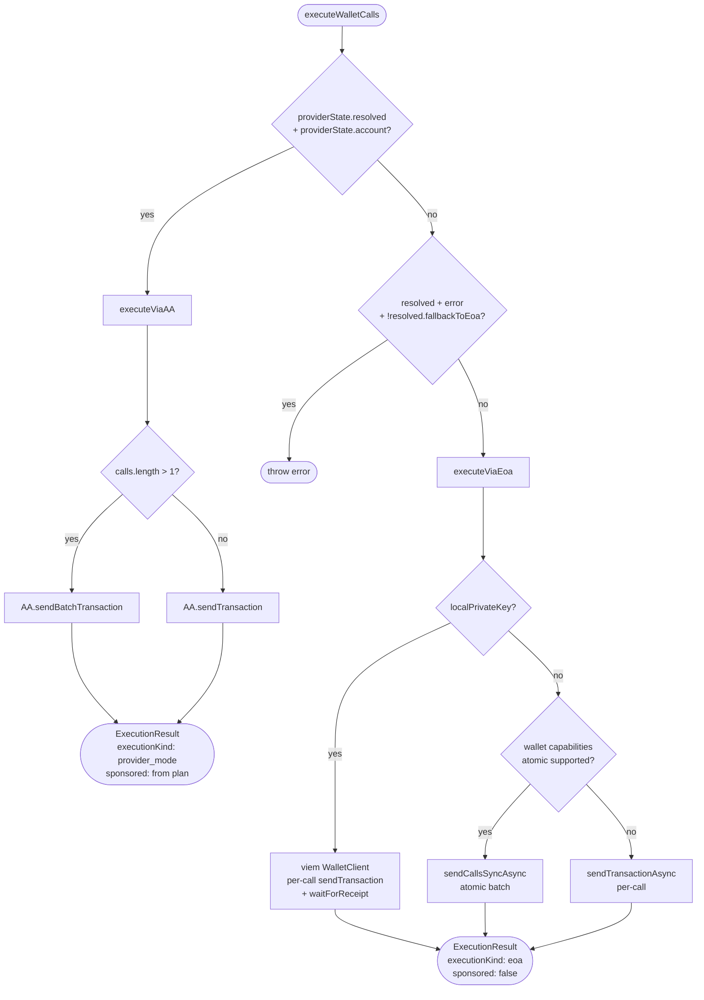
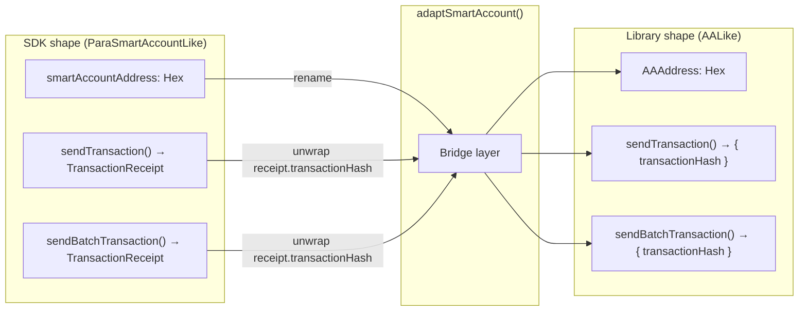

# Account Abstraction Architecture

This document describes the AA (Account Abstraction) module structure, how configuration flows through the system, and the execution paths for both the React library and the CLI.

**Layout:** All paths below are under `packages/client/src/` unless noted.

---

## Module Dependency Graph

Pimlico uses the same folder pattern under `aa/pimlico/` (`@getpara/aa-pimlico`); it is omitted here to keep the diagram small.

**SDK boundary:** `@getpara/aa-alchemy` and `@getpara/aa-pimlico` are loaded only inside `aa/alchemy/create.ts` and `aa/pimlico/create.ts` (dynamic `import()`). Other modules depend on the abstract `AALike` shape and `AAOwner` resolution from `owner.ts`.

---

## Owner model (`AAOwner`)

Smart-account creation takes an **`AAOwner`**, not a bare private key:

- **`{ kind: "direct", privateKey }`** — CLI path; viem `privateKeyToAccount` feeds the Para SDK.
- **`{ kind: "session", adapter: "para", session, signer?, address? }`** — session-backed signing (extensible; unsupported adapters yield a clear error state).

`getOwnerParams()` maps `AAOwner` into the shape expected by `createAlchemySmartAccount` / `createPimlicoSmartAccount`. The CLI wrapper `createCliProviderState` in `cli/execution.ts` always passes `owner: { kind: "direct", privateKey }`.

---

## CLI persistence

Config file: **`~/.aomi/aa.json`**. `cli/aa-config.ts` stores optional defaults: preferred `provider`, `mode` (4337 | 7702), `fallback` (`eoa` | `none`), and per-provider `apiKey` / `gasPolicyId` (Alchemy).

**Credential resolution (CLI):** For each provider, `readEnv(...)` is tried first; if missing, persisted keys from `aa.json` are used (`getPersistedAAApiKey`, `getPersistedAlchemyGasPolicyId`).

**Provider selection (CLI, `resolveAAProvider` in `execution.ts`):** when the user has forced AA mode (`--aa`, or `--aa-provider`, or `--aa-mode`, or env `AOMI_AA_PROVIDER` / `AOMI_AA_MODE` via `getConfig`): explicit `aaProvider` from flag/env (must have a key or an error is thrown) → else persisted `provider` (if that provider has a key) → else first env/persisted match for alchemy → pimlico. If nothing is configured, `resolveCliExecutionDecision` throws with a “configure AA” message.

**Persisted `fallback` (`eoa` | `none`):** Still read/written by `aa-config` and shown in **`aomi aa status`**. Signing does **not** read it anymore — there is no automatic EOA retry after AA failure.

Users manage this file via **`aomi aa status | set | test | reset`**.

---

## The `publicOnly` Flag

The single knob that separates browser-safe from CLI usage:

---

## Config resolution flow

---

## Library AA flow (React hooks)

---

## CLI AA flow (`aomi tx sign`)

**4337 + ERC-20:** If the planned mode is **4337** and calldata looks like ERC-20 `approve` / `transfer` / `transferFrom`, `execution.ts` may **auto-switch to 7702** when that mode is supported on the chain (tokens stay on the EOA). Otherwise it logs a warning and keeps 4337.

**Alchemy gas sponsorship (CLI):** `createCliProviderState` does not pass `sponsored`; `createAlchemyAAState` defaults to **`sponsored: true`**, so a gas policy is applied when configured. Failures surface to the user; there is no unsponsored retry or EOA fallback in `signCommand`.

---

## AA execution routing

`executeWalletCalls` (in `aa/types.ts`) still branches on **`resolved.fallbackToEoa`** when the hook/provider left an error on `AAState` without a usable account. That flag comes from **`AAConfig`** in app/widget usage. The CLI Alchemy creator sets **`fallbackToEoa: false`** on the resolved plan, so the CLI private-key path normally goes AA or EOA based on `CliExecutionDecision`, not this branch.

---

## CLI execution model

No silent fallbacks and no AA↔EOA retry chain. `signCommand` in `wallet.ts`:

1. `resolveCliExecutionDecision()` → `CliExecutionDecision`: `{ execution: "eoa" }` or `{ execution: "aa", provider, aaMode }` (no `fallbackToEoa` field).
2. `createCliProviderState()` builds `AAState` or `DISABLED_PROVIDER_STATE` for EOA.
3. `executeCliTransaction()` → `executeWalletCalls()` **once**. Errors propagate.

**Execution mode (`args.ts` → `CliConfig.execution`):**

- `--eoa` → always EOA.
- `--aa`, or **`--aa-provider`**, or **`--aa-mode`** (or `AOMI_AA_PROVIDER` / `AOMI_AA_MODE`) → AA; throws if no provider credentials.
- Otherwise → **EOA**, even when AA keys exist — users must pass one of the AA triggers above to use AA.

| Keys in env / `aa.json`? | Flags / env forcing AA | Result |
|---|---|---|
| Yes | `--aa` (or `--aa-provider` / `--aa-mode` / env equivalents) | AA; fail on error |
| Yes | `--eoa` | EOA |
| Yes | (none) | EOA |
| No | AA forced | Error: configure provider + key |
| No | (none) or `--eoa` | EOA |

Users typically run `aomi aa set provider <name>` and `aomi aa set key <key>`, then pass **`--aa`** (or set provider/mode flags) on `aomi tx sign`.

---

## Smart account adapter

The `adaptSmartAccount` function bridges the SDK-specific `ParaSmartAccountLike` shape into the library's abstract `AALike` interface:

---

## Env var resolution order

| Provider | Env var (private-first) | Env var (`publicOnly`) |
|----------|-------------------------|-------------------------|
| **Alchemy API key** | `ALCHEMY_API_KEY` → `NEXT_PUBLIC_ALCHEMY_API_KEY` | `NEXT_PUBLIC_ALCHEMY_API_KEY` |
| **Alchemy gas policy** | `ALCHEMY_GAS_POLICY_ID_{CHAIN}` → `ALCHEMY_GAS_POLICY_ID` → `NEXT_PUBLIC_*` variants | `NEXT_PUBLIC_ALCHEMY_GAS_POLICY_ID_{CHAIN}` → `NEXT_PUBLIC_ALCHEMY_GAS_POLICY_ID` |
| **Pimlico API key** | `PIMLICO_API_KEY` → `NEXT_PUBLIC_PIMLICO_API_KEY` | `NEXT_PUBLIC_PIMLICO_API_KEY` |

**Default provider (`resolveDefaultProvider` in `env.ts`, env only):** alchemy (if configured) → pimlico (if configured) → throw.

**CLI** additionally uses `~/.aomi/aa.json` and flags; see [CLI persistence](#cli-persistence) above.

---

## Key files

| File | Purpose | Imports SDK? |
|------|---------|----------------|
| `aa/types.ts` | Core types, `executeWalletCalls`, plans | No |
| `aa/owner.ts` | `AAOwner`, `getOwnerParams` for creators | No |
| `aa/env.ts` | `readEnv`, gas policy helpers, provider detection; re-exports env name lists | No |
| `aa/alchemy/env.ts` | Alchemy env name constants | No |
| `aa/pimlico/env.ts` | Pimlico env name constants | No |
| `aa/adapt.ts` | Adapter + sponsorship error helper | No |
| `aa/resolve.ts` | Re-exports `resolveAlchemyConfig`, `resolvePimlicoConfig` | No |
| `aa/alchemy/resolve.ts` | Alchemy config resolution | No |
| `aa/pimlico/resolve.ts` | Pimlico config resolution | No |
| `aa/create.ts` | `createAAProviderState` facade | No |
| `aa/alchemy/create.ts` | `createAlchemyAAState` | **Yes** (dynamic `@getpara/aa-alchemy`) |
| `aa/pimlico/create.ts` | `createPimlicoAAState` | **Yes** (dynamic `@getpara/aa-pimlico`) |
| `aa/alchemy/provider.ts` | `createAlchemyAAProvider` hook factory | No |
| `aa/pimlico/provider.ts` | `createPimlicoAAProvider` | No |
| `cli/execution.ts` | `resolveCliExecutionDecision`, `createCliProviderState`, ERC-20 mode guard | No |
| `cli/args.ts` | `getConfig`, `resolveExecutionMode` (`--aa` / `--eoa` / implied AA) | No |
| `cli/aa-config.ts` | Persistent AA JSON config | No |
| `cli/commands/wallet.ts` | `signCommand`, single-shot `executeCliTransaction` | No |
| `cli/commands/aa.ts` | `aomi aa` handlers (incl. test path to `createAAProviderState`) | No |
