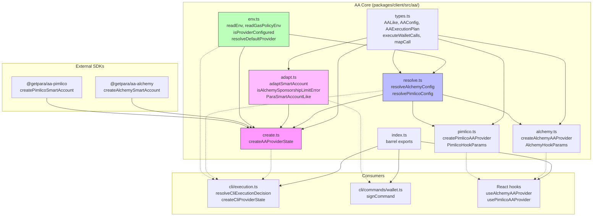
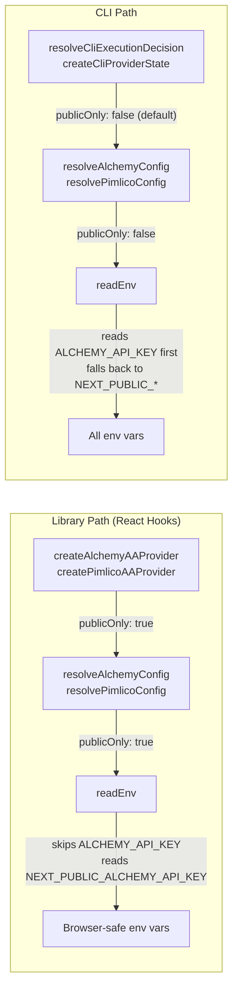
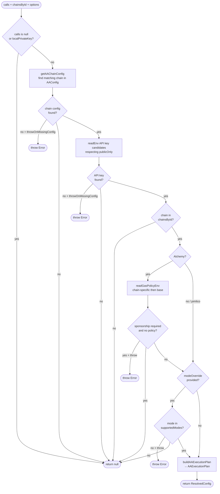
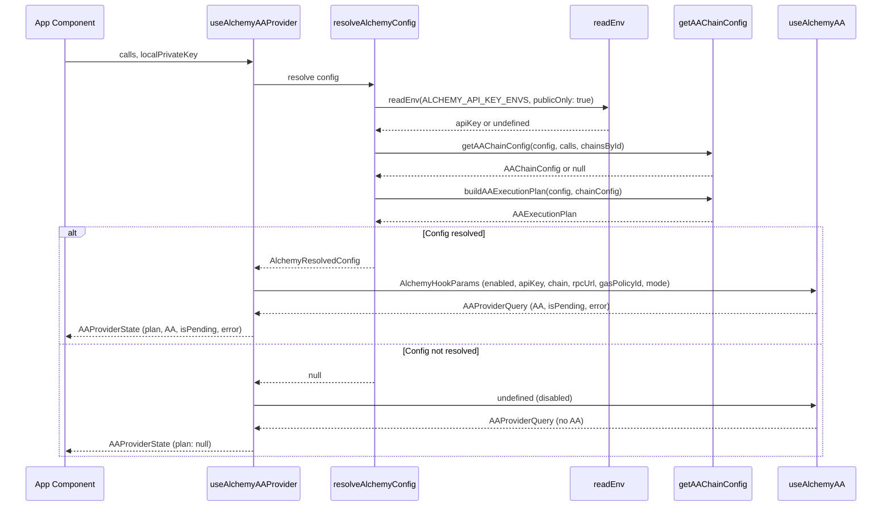
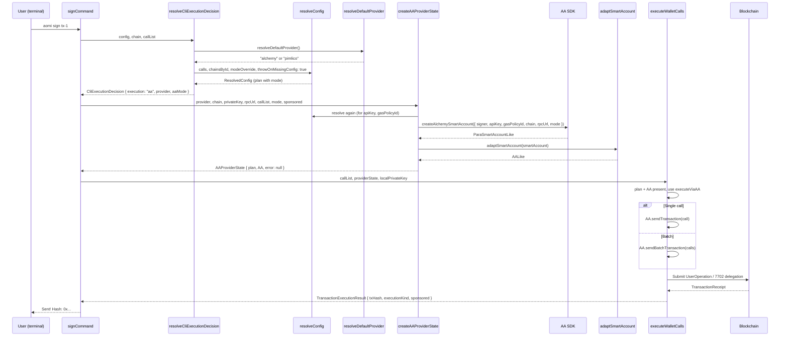
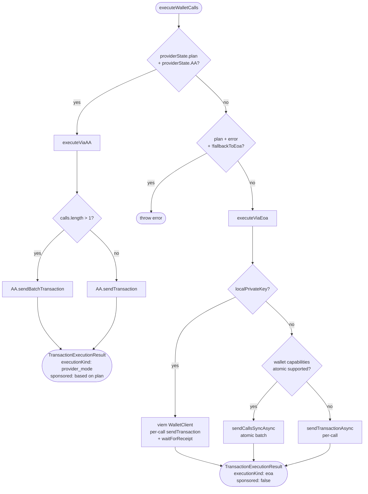
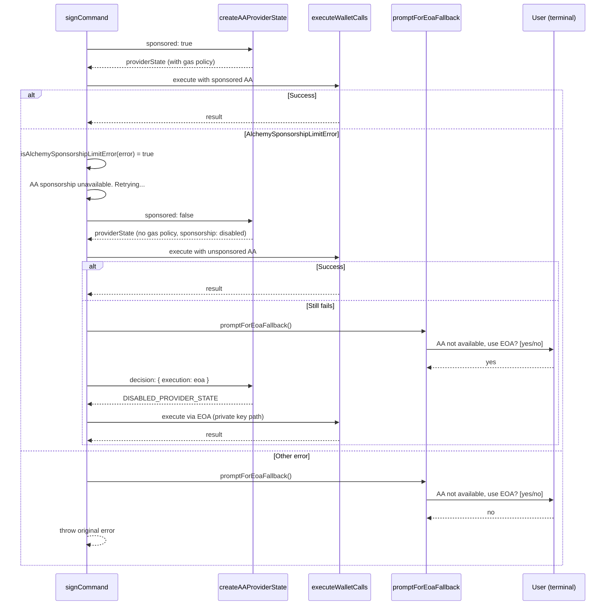

# Account Abstraction Architecture

This document describes the AA (Account Abstraction) module structure, how configuration flows through the system, and the execution paths for both the React library and the CLI.

---

## Module Dependency Graph

**Key constraint:** Only `create.ts` imports `@getpara/aa-alchemy` and `@getpara/aa-pimlico`. All other modules work with the abstract `AALike` interface.

---

## The `publicOnly` Flag

The single knob that separates browser-safe from CLI usage:

---

## Config Resolution Flow

---

## Library AA Flow (React Hooks)

---

## CLI AA Flow (Sign Command)

---

## AA Execution Routing

---

## CLI Sponsorship Fallback

---

## Smart Account Adapter

The `adaptSmartAccount` function bridges the SDK-specific `ParaSmartAccountLike` shape
into the library's abstract `AALike` interface:

---

## Env Var Resolution Order

| Provider | Env Var (private-first) | Env Var (publicOnly) |
|----------|------------------------|---------------------|
| **Alchemy API Key** | `ALCHEMY_API_KEY` → `NEXT_PUBLIC_ALCHEMY_API_KEY` | `NEXT_PUBLIC_ALCHEMY_API_KEY` |
| **Alchemy Gas Policy** | `ALCHEMY_GAS_POLICY_ID_{CHAIN}` → `ALCHEMY_GAS_POLICY_ID` → `NEXT_PUBLIC_*` variants | `NEXT_PUBLIC_ALCHEMY_GAS_POLICY_ID_{CHAIN}` → `NEXT_PUBLIC_ALCHEMY_GAS_POLICY_ID` |
| **Pimlico API Key** | `PIMLICO_API_KEY` → `NEXT_PUBLIC_PIMLICO_API_KEY` | `NEXT_PUBLIC_PIMLICO_API_KEY` |

**Default provider resolution:** alchemy (if configured) > pimlico (if configured) > throw error.

---

## Key Files

| File | Purpose | Imports SDK? |
|------|---------|-------------|
| `types.ts` | Core types, execution logic (`executeWalletCalls`) | No |
| `env.ts` | Env var reading, provider detection | No |
| `adapt.ts` | Smart account adapter, error classification | No |
| `resolve.ts` | Config resolution for both providers | No |
| `create.ts` | Async smart account instantiation | **Yes** (`@getpara/aa-*`) |
| `alchemy.ts` | React hook factory (`createAlchemyAAProvider`) | No |
| `pimlico.ts` | React hook factory (`createPimlicoAAProvider`) | No |
| `cli/execution.ts` | CLI orchestration layer | No (delegates to `../aa`) |
