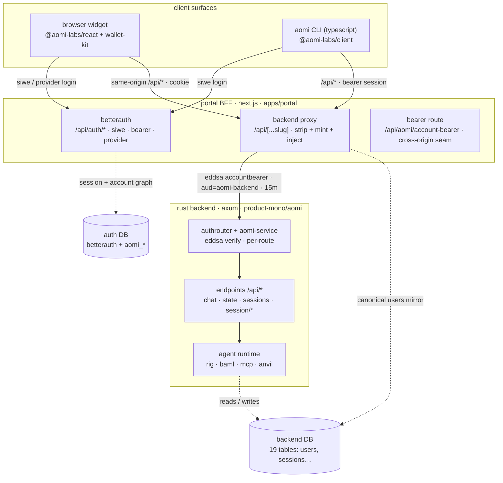
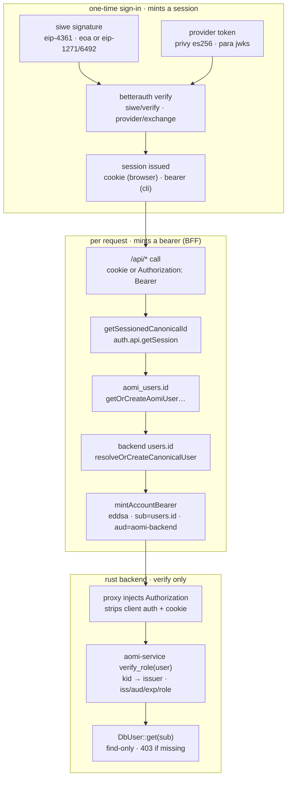
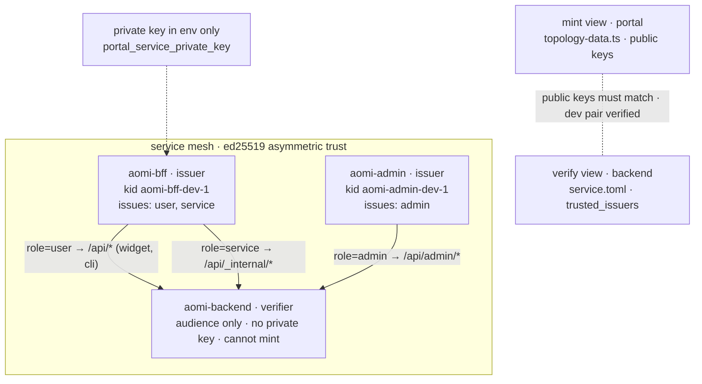
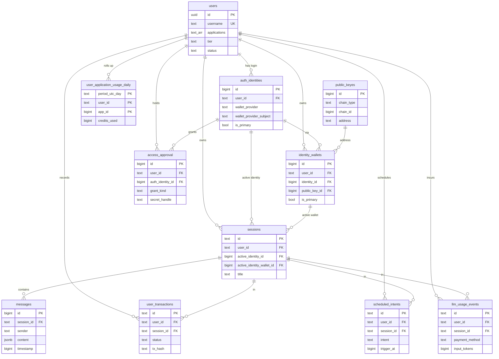
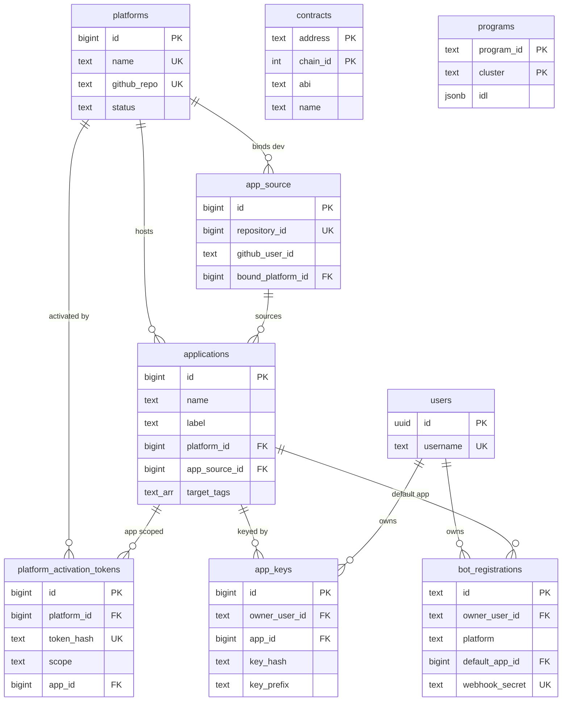
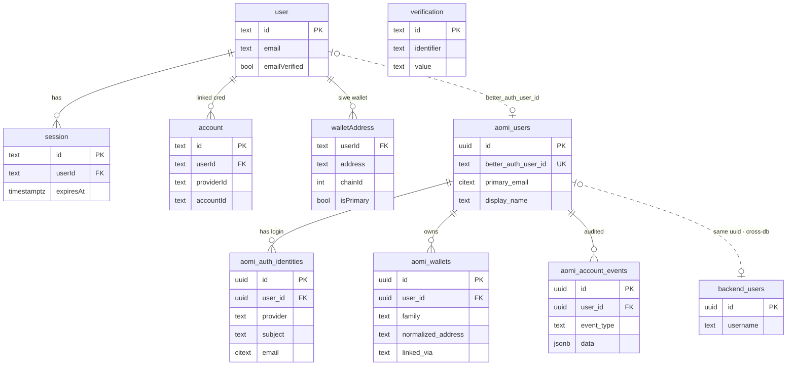
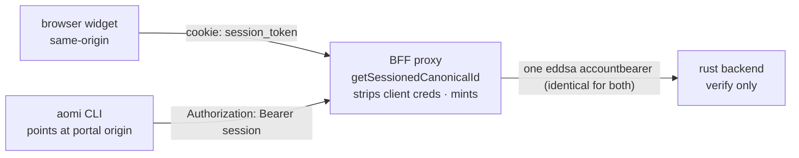
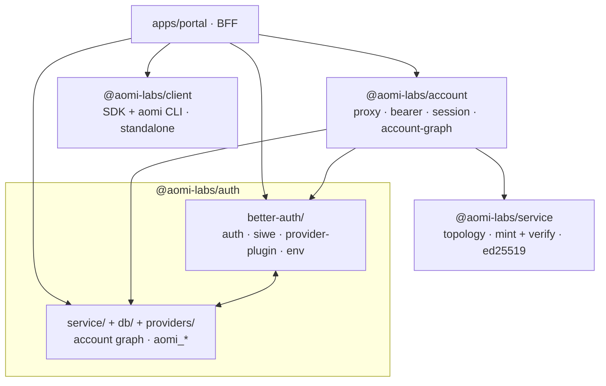

# Aomi Auth / Stack — Deep Branch Review

> Branch: `codex/merge-bff-betterauth` · Date: 2026-07-01 · Scope: full auth/token/DB/stack
> review across `aomi` (BFF + packages) and `../product-mono` (Rust backend). **Rev 2** folds in
> product-mono PR #615 (schema-alignment review), the corrected dev-key map, and §11–§13.
> Companion to `specs/MERGE-BFF-BETTERAUTH-FIXES.md` (the fix checklist) and the
> `bff-betterauth-merge-review` memory. Diagrams are mermaid (render on GitHub).

This is a reference map: what the stack is, what tokens exist, how the two databases
look and relate, which files own auth and why they're split, plus every finding /
cleanup item noticed during the review.

## Table of contents

1. [Executive summary + branch verdict](#1-executive-summary--branch-verdict)
2. [Stack overview](#2-stack-overview)
3. [Tokens + the auth pipeline](#3-tokens--the-auth-pipeline)
4. [Service mesh (keys, kid/iss/aud)](#4-service-mesh-keys-kidissaud)
5. [Databases — two schemas, one UUID](#5-databases--two-schemas-one-uuid)
6. [BetterAuth vs. our own tables](#6-betterauth-vs-our-own-tables)
7. [Frontend widget + CLI](#7-frontend-widget--cli)
8. [Auth files — what lives where and why](#8-auth-files--what-lives-where-and-why)
9. [Findings + cleanup backlog](#9-findings--cleanup-backlog)
10. [Merge readiness](#10-merge-readiness)
11. [Inbound schema review — product-mono PR #615](#11-inbound-schema-review--product-mono-pr-615)
12. [product-mono backend: main already has the contract](#12-product-mono-backend-main-already-has-the-contract)
13. [Execution checklist (tickable)](#13-execution-checklist-tickable)

---

## 1. Executive summary + branch verdict

This branch replaces the old Rust-side HS256 token exchange with a **BetterAuth-fronted,
EdDSA service-mesh** auth model. The **contract shape is correct end-to-end** and the
**product-mono Rust `main` has already merged the verifier half** (`AomiBearer` + `new BFF
account bearer`, Jun 2026 — see §12): `crates/service::verify_role` checks exactly the
`iss=aomi-bff` / `aud=aomi-backend` claims the BFF mints.

**Resolved after Rev 2:** the dev key contract has been reconciled. The live portal topology,
`product-mono/aomi/service.dev.toml`, the Rust cross-language proof token, the root backend
`service.toml` snapshot, and the portal documentation-only snapshot all now use the same
`RK6H6…` `aomi-bff-dev-1` key (§13-C).

One-sentence mental model:

> A user proves identity **once** (SIWE signature, or a Privy/Para provider token) →
> BetterAuth mints a **session** (cookie for browsers, opaque bearer for the CLI) → the
> **portal BFF proxy** resolves that session to a canonical `users.id` and mints a
> short-lived **EdDSA `AccountBearer`** (`iss=aomi-bff`, `aud=aomi-backend`, 15-min TTL) →
> the **Rust backend only verifies** it (holds no signing key, never mints).

Scale: **96 commits** over merge-base `dc73bad4`; **396 files changed** (+38,674 / −8,615).

**Verdict:** internally done and contract-correct; the three former blockers are fixed in
the working tree. The real risk is entirely the **merge to `main`**, not the code:
`origin/main` has advanced **244 commits** past this branch's base and renamed
`apps/registry → apps/shadcn-registry`, so the PR is a large reconciliation with a
directory-rename conflict, not a fast-forward. Nothing outstanding is a redesign.

Former blockers, re-verified in the working tree:

| Prior blocker | Status | Evidence |
|---|---|---|
| `/api/chat` URL overflow | ✅ Fixed | `stripBulkyPendingFields` guards both send paths (`packages/client/src/client.ts:303,352`) |
| Stale `publicKey` test | ✅ Fixed | assertion removed from `packages/react/src/runtime/__tests__/control.test.tsx` |
| Committed dev signing key | ⚠️ Partial | rotated + scrubbed from the working tree, but **still in git history** at `7e03d36a` |
| Dev key ≠ verifier key + misleading test | ✅ Fixed | `service.dev.toml`, the Rust proof token, and stale doc/config snapshots now use live `RK6H6…`; `cargo test -p aomi-service` green |

---

## 2. Stack overview

Three tiers with a hard trust boundary in the middle. **Clients never hold a backend
credential**; the portal BFF is the only minter; the Rust backend is a pure verifier. In
local dev the two Postgres schemas are the same physical DB (`aomi_local`); in prod they
can diverge. The portal writes to **both** (it mirrors the canonical `users` row into the
backend DB so the bearer's `sub` resolves).

**Backend crate map (auth-relevant):** `backend` (axum server) → `aomi-service` (EdDSA
verify; pure leaf, no DB/net) + `aomi-database` (diesel-async/deadpool pool + 19 tables) +
`aomi-runtime`/`aomi-core` (agent loop via rig-core + BAML + MCP + Anvil). Auth is a
**per-route** `AuthRouter` (no global middleware); a compile-time test rejects any route
added without it. Multi-class routes (e.g. `[account, session]`) are **AND** (every class
must pass).

---

## 3. Tokens + the auth pipeline

Two credentials matter; everything else is plumbing:

1. A **session** — proof the user signed in once. Two carriers: an HttpOnly cookie
   (browser) and an opaque **bearer-plugin token** (`Authorization: Bearer …`, CLI). Both
   resolve via `auth.api.getSession`.
2. The **EdDSA `AccountBearer`** (a.k.a. `AomiBearer` in Rust — same token) — minted by the
   BFF **per request**, verified by the backend. The **only** thing the backend trusts.

Key property: the proxy **strips** the client's `Authorization`/`cookie` and **re-mints**
server-side from the session. The signing key (`PORTAL_SERVICE_PRIVATE_KEY`, Ed25519) lives
only in the BFF env; the backend holds only public keys and cannot mint.

### Token catalogue

System A = the live account path; System B = the deprecated MCP-approvals island.

| # | Token / credential | Format | Carrier / key claims | Minted at | Verified at | TTL |
|---|---|---|---|---|---|---|
| 1 | SIWE message + signature | EIP-4361 text + sig | EOA `ecrecover`, else EIP-1271/6492 | wallet signs | `auth/better-auth/siwe.ts::verifySiweMessage` | nonce single-use |
| 2 | **Session — cookie** | opaque HttpOnly (`better-auth.session_token`) | `{user.id,email,…}` | BetterAuth (`auth.ts`) | `auth.api.getSession` | 7d rolling / 1d refresh |
| 3 | **Session — bearer token** | opaque bearer (`bearer()` plugin) | same session, headless | BetterAuth `bearer()` | `auth.api.getSession` | tied to session |
| 4 | **EdDSA `AccountBearer` (user)** | JWT EdDSA/Ed25519 `{alg,kid}` | `sub`=`users.id`, `iss=aomi-bff`, `aud=aomi-backend`, `role=user` | `service/topology.ts::mint` ← `account/bearer.ts` | Rust `crates/service::verify_role` | **15 min** |
| 5 | AccountBearer (service) | same JWT, `role=service` | `/api/_internal/*`, `/metrics` | `topology.ts::mint` | `require_bearer_role(…,service)` | 15 min |
| 6 | AccountBearer (admin) | same JWT, `iss=aomi-admin`, `role=admin` | `/api/admin/*` | ops (`aomi-admin` key) | `require_bearer_role(…,admin)` | short |
| 7 | Privy provider token | JWT ES256, `iss=privy.io` | `sub=did:privy:…`, `aud=appId` | Privy | `providers/privy.ts::verifyPrivyToken` | ~1h |
| 8 | Para provider token | JWT via remote JWKS | `sub`=Para uid, `aud`=Para appId | Para | `providers/para.ts::verifyParaJwt` | Para |
| 9 | Wallet-link nonce | `base64url(payload).HMAC-SHA256` | `{userId,address,chainId,domain}` | `service/wallet-linking.ts` | same file (`timingSafeEqual`) | 5 min |
| 10 | `Aomi-App-Key` | opaque header, DB-hashed | gates non-public apps | app registration | Rust `authenticator.rs::resolve_app_key` | rotated |
| 11 | `X-Thread-Id` | opaque id (not auth) | conversation id | client-generated | Rust `Session` extractor | n/a |
| 12 | Platform activation token | opaque, DB-hashed | scope + platform binding | Rust `mint_token` | `platform_activation.rs` | DB-managed |
| — | System B (deprecated) | `stateToken` (24B) + `X-Aomi-Auth` secret + provider secrets | MCP-approvals OAuth capture | `mcp-approvals/*` | backend `/api/_internal/approvals` | state 1h |

---

## 4. Service mesh (keys, kid/iss/aud)

Asymmetric (Ed25519) mesh, modeled identically in TS (`@aomi-labs/service`) and Rust
(`crates/service`). Each service node has a name (its `iss`, others' `aud`), a `kid`, a
public key, the **roles it may issue**, and the **audiences it may sign for**. Role authz
is enforced **from config**, not the caller. Three committed topologies
(`default`/`staging`/`production`) with distinct keypairs; the portal selects by backend
host / `VERCEL_ENV`. Rotation = add a new `(name,kid)` trust record. The backend gets verify
keys from a committed `service.toml` (copied per-env at deploy), **not** a live JWKS.

**Corrected key map (Rev 2; §13-C applied 2026-07-01).** The dev `kid = aomi-bff-dev-1`
now has one public key across the live portal, backend dev verifier config, and doc/config
snapshots:

| Location | Key (short) | Role / status |
|---|---|---|
| `packages/account/src/topology-data.ts` | `RK6H6…` | **live portal mint key** (source of truth) |
| `product-mono/aomi/service.dev.toml` — **working tree** | `RK6H6…` | verifier config ready to commit |
| `product-mono/aomi/crates/service/src/lib.rs` (`NODE_TOKEN`, `DEV_PUB_PEM`) | `RK6H6…` | proof test now verifies the live pair |
| `product-mono/aomi/service.toml` | `RK6H6…` | ok |
| `product-mono/service.toml` (repo root) | `RK6H6…` | aligned local snapshot |
| `apps/portal/service.portal.toml` | `RK6H6…` | aligned documentation-only portal snapshot |

- ✅ `committed_dev_config_verifies_bff_token` now mints `NODE_TOKEN` with the same `RK6H6`
  dev key used by the portal and loads `service.dev.toml` through the production parse path.
- ✅ Copying the wrong `service.toml` no longer introduces a third BFF dev key in this workspace.
- ⚠️ Committed test-fixture Ed25519 **private** keys exist in the Rust tree (all `#[cfg(test)]`,
  never loaded in prod) — low risk, but real usable dev keypairs in VCS.

---

## 5. Databases — two schemas, one UUID

There are **two logically separate Postgres schemas**, stitched by a single UUID.

- **Backend DB** (Rust): **19 live tables**, authoritative source = Diesel
  `product-mono/aomi/crates/database/src/schema.rs` (verified). Timestamps are
  epoch-seconds **`bigint`**, not `timestamptz`.
- **Auth DB** (Node portal): BetterAuth tables + Aomi's `aomi_*` graph (see §6).
- Bridge: `aomi_users.id` is copied verbatim into backend `users.id`, so a bearer's `sub`
  resolves via a **find-only** lookup (backend never creates users).

### The 19 backend tables — why each exists

| Table | Domain | Why it exists |
|---|---|---|
| `users` | Identity | Canonical account (UUID); wallet identity moved to `auth_identities` |
| `auth_identities` | Identity | Every login credential (wallet/oauth/email) per user |
| `public_keyes` | Identity | Normalized wallet addresses (evm/svm), one per (family, chain, address) |
| `identity_wallets` | Identity | Links an `auth_identity` to a `public_keyes` address for a user |
| `access_approval` | Access | Durable OAuth / third-party grants tied to an identity |
| `sessions` | Chat | A conversation, owned by a user, pinned to an active identity + wallet |
| `messages` | Chat | Persisted chat turns per session (`content` jsonb) |
| `applications` | Apps | App/namespace catalog — chat apps + hosted GitHub apps |
| `platforms` | Hosting | Platform routing (GitHub repo → deployment) |
| `app_source` | Hosting | GitHub App installation/repo source for hosted apps |
| `platform_activation_tokens` | Hosting | Hashed activation tokens, platform- or app-scoped |
| `bot_registrations` | Bots | Registered telegram/x/discord bots + webhook routing |
| `app_keys` | API keys | Hashed per-app programmatic keys owned by a user (was `api_keys`) |
| `llm_usage_events` | Billing | Raw per-turn LLM usage/billing log (payment method, paid credits) |
| `user_application_usage_daily` | Billing | Daily usage rollup per (day, user, app) |
| `user_transactions` | Tx | On-chain tx intents/submissions per session |
| `scheduled_intents` | Scheduling | Deferred/recurring user intents |
| `contracts` | Cache | EVM contract source/ABI/metadata cache (standalone) |
| `programs` | Cache | Solana program/IDL cache (standalone) |

History: `namespaces → applications`, `api_keys → app_keys`, monthly→daily usage were
**renames**; `user_identities`, `pending_auths`, `signup_challenges`, `user_provider_keys`,
`user_entitlement_claims` were **dropped**. `db-master/migrations` is a **stale subset**
(stops 2026-06-01, before identity-wallets/platforms/bots/billing) — treat
`product-mono/supabase/migrations` as canonical.

### ERD — identity, sessions & activity (users + sessions hub)

### ERD — apps, hosting, keys & bots (applications + platforms hub)

`contracts` and `programs` are standalone on-chain caches (no FKs). Text `application`
columns on `messages`/`llm_usage_events`/`scheduled_intents`/`user_transactions`/
`auth_identities` are **denormalized** (no FK — app names stopped being globally unique).

---

## 6. BetterAuth vs. our own tables

The auth DB holds two families, distinguishable by naming:

- **BetterAuth-managed** (quoted camelCase; DDL generated by BetterAuth's migrator, **not**
  in this repo): `user`, `session`, `account`, `verification`, `walletAddress` (SIWE
  plugin). Enabled plugins: `siwe`, `bearer`, custom `aomiProviderAuthPlugin`, `nextCookies`.
- **Dead `jwks` table** — removed in §13-B. Its DDL used to live in
  `packages/auth/src/db/schema.sql` (hand-rolled to match BetterAuth's jwt-plugin shape), but
  there is **no `jwt()` plugin** and **nothing reads or writes it** (the backend bearer is signed
  from an env key; Para's remote JWKS in `providers/para.ts` is a different thing). Any live auth
  DB drop is a deploy/migration task, not a local cleanup command.
- **Aomi's own** (`aomi_*`; DDL in `packages/auth/src/db/schema.sql`): `aomi_users`,
  `aomi_auth_identities`, `aomi_wallets`, `aomi_account_events`.

Why mirror: `aomi_*` is the **rich canonical identity** (citext email, jsonb metadata,
soft-delete, partial-unique, timestamptz); backend `users`/`auth_identities` is a **minimal
find-only mirror** (bigint epoch). Deliberately parallel so a future cutover is a
store-swap, not a contract change.

Identity model: an `aomi_auth_identities` row is keyed `(provider, subject)` (globally
unique among active); an `aomi_wallets` row `(family, normalized_address, chain_scope)`. A
SIWE login writes **both** an `aomi_wallets` row and a paired `aomi_auth_identities`
(`provider='siwe'`, `subject='eip155:*:<addr>'`), **plus** BetterAuth `walletAddress` +
`account(providerId='siwe')`. Unlink = soft `revoked_at`; `better_auth`/`siwe`/`email` are
protected; a "last factor" guard blocks removing your only way back in. The provider/
`linked_via` CHECKs were dropped for extensibility; `capability` (read/write) exists only in
the TS type — **not** a persisted column.

---

## 7. Frontend widget + CLI

**Widget runtime** (`packages/react`): the HTTP client (`AomiClient`) and per-thread polling
state machine (`ClientSession`) actually live in **`@aomi-labs/client`** (not
`packages/react/src/backend/*` as the stale specs say). A user turn is `POST /api/chat` →
poll `GET /api/state` (500ms, stops when `is_processing=false` and no pending wallet
requests); only the visible thread holds an `/api/updates` SSE stream. In same-origin mode
the widget relies **purely on the cookie** (`credentials` default same-origin) — no client
`Authorization` header — and the proxy mints the bearer. The portal's client token provider
is `null` in same-origin (`createPortalAccountAccessTokenProvider`).

**Wallet → auth bridge:** wallet connection (wagmi/Privy/Para, tracked in `wallet-kit/registry/*`)
is orthogonal to backend auth. `account/aomi-backend-runtime.ts` drives sign-in: auto-SIWE
for a bare wallet, or `providerExchange` (create → `POST /api/auth/aomi/provider/exchange`;
link → `POST /api/aomi/provider/exchange`). `identity.isConnected` flips true on wallet
connect, **before** the `better-auth.session_token` cookie lands — the root cause of the thread-list race
(fixed with a bounded exponential 401-retry backoff in `user-state-provider.tsx`).

**CLI (two of them!):**
- **TS `aomi`** (`@aomi-labs/client`, `bin: aomi`) — remote client, **does SIWE login**
  (`cli/auth.ts`), stores state under `~/.aomi/` (`AOMI_STATE_DIR`). Carries the **BetterAuth
  session token** as `Authorization: Bearer` and lets the BFF proxy mint the EdDSA bearer —
  it does **not** call `/api/aomi/account-bearer`.
- **Rust `aomi-cli`** (`product-mono/aomi/bin/cli`) — runs the agent **in-process**, no auth
  (local env signer keys gated by `FULL_TESTNETS`). Same `~/.aomi/` layout, no `auth` field.

---

## 8. Auth files — what lives where and why

Four packages, four boundaries:

- **`@aomi-labs/service`** — cross-language crypto boundary (TS twin of Rust `aomi-service`;
  only minter/verifier of mesh JWTs; browser-guard for the private key). Pure leaf.
- **`@aomi-labs/account`** — backend-canonical-identity + transport boundary (who is this
  user **to the backend** = `users.id`; the proxy + `/api/aomi/account-bearer`). Targets backend DB.
- **`@aomi-labs/auth`** — BetterAuth session + account-graph + provider-verification boundary
  (who is this user **to us** = `aomi_users.id`; login). Targets auth DB. The former
  deprecated, self-contained `mcp-approvals/` island has been removed.
- **`@aomi-labs/client`** — consumer SDK boundary (runs in browsers; no `@aomi-labs/*` deps,
  no server secrets; only *attaches* a bearer someone else mints).

The one seam between `auth` and `account` is `packages/account/src/session.ts` — it maps
`aomi_users.id` → backend `users.id`. That single file is *why* the two packages exist
separately during the merge.

### File reference (load-bearing auth files)

**`@aomi-labs/service`:** `topology.ts` (mint/verify), `server-only.ts` (browser guard), `index.ts`.

**`@aomi-labs/account`:** `session.ts` (the bridge), `proxy.ts` (strip+mint+inject), `bearer.ts`
(EdDSA mint, 15m), `token.ts` (`/api/aomi/account-bearer`), `account-graph.ts`
(`resolveOrCreateCanonicalUser`), `topology.ts`+`topology-data.ts` (mesh), `db.ts` (backend-DB pool).

**`@aomi-labs/auth` better-auth/:** `auth.ts` (server + plugins), `siwe.ts` (the one true SIWE
verifier), `provider-plugin.ts` (`/aomi/provider/exchange`), `env.ts`, `auth-client.ts`.

**`@aomi-labs/auth` account graph:** `service/account-service.ts` (the graph brain),
`service/provider-exchange.ts`, `service/wallet-linking.ts`, `db/queries.ts`, `db/pool.ts`
(auth-DB pool), `db/schema.sql` (aomi_* DDL), `providers/{privy,para,account-credentials,
wallet-attestation,default-wallet-attesters}.ts`, `account.ts` (façade), `types.ts`.

**`@aomi-labs/client`:** `client.ts` (`AomiClient` + `wrapFetchWithAccountBearer`),
`account-session.ts` (browser bearer provider; first-mint `subscribe` bug), `cli/auth.ts`
(CLI SIWE), `cli/state.ts` (`~/.aomi/`, stores raw private keys), `cli/cli-session.ts`.

**`apps/portal`:** `api/[...slug]/route.ts` (proxy), `api/auth/[...all]/route.ts` (BetterAuth),
`api/bff/auth/token/route.ts`, `api/aomi/{account,identities,wallets,provider,sign-out}/**`,
`lib/aomi-account/session.ts`, `lib/account-access-token.ts` (conditional provider),
`components/portal-aomi-frame.tsx` (embeds widget + x402 fetch).

**Test coverage** exists for `service/topology`, `account/{account-graph,token,topology}`,
and `auth` providers/credentials/wallet-linking. **Gap:** no direct unit tests for
`better-auth/auth.ts`, `siwe.ts` (the verifier itself), `provider-plugin.ts`,
`account-service.ts` (the merge/signal ladder), `db/queries.ts`, or `mcp-approvals/`.

---

## 9. Findings + cleanup backlog

### Verified-correct (do not touch)

EdDSA mesh + TS-mint↔Rust-verify (cross-lang test); proxy strip+inject (allowlist,
traversal-safe, cookie never forwarded, client `Authorization` stripped); two-DB canonical
UUID bridge; backend find-only `DbUser::get` (never creates); multi-class routes are AND;
`ensureAccountSchema` memo; SIWE EOA→EIP-1271/6492 + RPC timeout fix; role authz from config.

### Prioritized backlog

| Priority | Item | Why | Where |
|---|---|---|---|
| 🔴 Merge gate | Reconcile with `origin/main` (244 commits; `apps/registry → apps/shadcn-registry` rename; fold #277/#281; dedupe CLI auth on main) | The real risk; contract-first, not blind-merge | git |
| 🔴 Merge gate | Run the §10 final gate — full typecheck/lint/vitest/build + CLI↔GUI parity incl. open "same wallet → same `users.id`" row | Proves green end-to-end | `MERGE-BFF-BETTERAUTH-FIXES.md` |
| 🟠 Hygiene | Purge dev Ed25519 private key from git history (`7e03d36a`) if public PR | Dev-only + rotated, but mints valid dev bearers | git history |
| ✅ Done | Fix `apps/portal/service.portal.toml` stale key; collapse duplicate dev BFF key in `product-mono/service.toml` | Wrong key silently 401s a fresh dev | `service.portal.toml`, `product-mono/service.toml` |
| 🟠 Hygiene | Decide committed `packages/react/dist/` policy (build-on-install vs keep) | Churns committed artifacts every lib change | `packages/react/dist` |
| ✅ Done | Delete deprecated `mcp-approvals/` island | Self-contained dead weight with no active source consumers | `packages/auth/src` |
| 🟡 Cleanup | Tech-debt: `is_connected` conflates wallet-connected vs backend-authenticated; first-mint `subscribe` never fires (`previous===null`) | Retry-backoff is a workaround for #1; SSE misses first auth-ready | `user-state-provider.tsx`, `account-session.ts` |
| 🟡 Cleanup | Deferred perf: proxy hot-path cache (`getSession` + 2 DB writes per proxied call); thread-list refetch storm (`wasConnectedRef`) | Every `/api/state` poll re-resolves the session | `session.ts`, `user-state-provider.tsx` |
| 🟡 Cleanup | CLI: default `baseUrl` to portal (or add explicit portal flag); friendly `whoami`/`wallet whoami` 401; consider encrypting stored keys | Login silently needs a portal override; keys in plaintext | `packages/client/src/cli` |
| 🟡 Cleanup | Vestigial: `capability` field (type-only); `AomiAccountCredential` has 4 shapes, only privy+para live; `packages/auth/src/index.ts` exports only `./types` | Low-grade cruft / near-empty package root | `packages/auth/src/types.ts`, `index.ts` |
| 📘 Docs | Refresh `DOMAIN.md`/`METADATA.md` (endpoints `/api/session/*`; `AomiClient`/`ClientSession` in `@aomi-labs/client`; real cookie name `better-auth.session_token`; no polling/message-controller files) | The "read on session start" docs are stale | `specs/` |
| ✅ Done | Empty stale scaffolding in portal: `src/app/auth/`, `src/app/auth/privy/`, `src/app/api/mcp-auth/**` | Verified absent in this worktree; live auth routes are `/api/auth/[...all]`, `/api/aomi/*`, and product BFF routes under `/api/bff/*` | `apps/portal/src/app` |
| ✅ Done | Stale content docs: `docs/topics/clients/facts/ts-client.md`, `rust-cli.md`, `docs/topics/auth/facts/*` | Old client docs are absent; auth facts now describe the BetterAuth session -> BFF AccountBearer path and Base Account as compatibility wallet-kit surface | `docs/topics` |
| 📘 Docs | Remaining optional docs pruning: executed wallet/refactor plan specs can still be deleted or archived after merge if desired | This pass consolidated the local stack docs and fixed dead links/indexes, but did not delete broader wallet-history specs | repo-wide |

---

## 10. Merge readiness

> **Two separate `origin/main`s — do not conflate.** This section is the **aomi TS monorepo**.
> The **product-mono Rust backend** is a different repo, covered in §12 (its `main` already has the
> verifier half; **no rebase needed**).

**Contract-correct and internally verified; the gate is the reconciliation.**

- Branch: 96 commits over merge-base `dc73bad4`.
- `origin/main`: **+244 commits** past that base, with `apps/registry → apps/shadcn-registry`
  and bff-unification (#277) + one-click deploy (#281) already merged.
- `MERGE-BFF-BETTERAUTH-FIXES.md` checklist ~95% ticked; open: origin/main reconcile (§8.2),
  the final gate (§10), the "same wallet → same `users.id`" CLI↔GUI parity row (§6), the
  optional history key-purge, and the §9 docs consolidation.

The merge must resolve the `apps/registry` rename **contract-first**, reconcile any CLI auth
already present on the bff-unification side against the BetterAuth CLI client built here
(avoid two CLI auth paths), then re-run the gate.

---

## 11. Inbound schema review — product-mono PR #615

Source: **CeciliaZ030**, comment on `product-mono` PR #615 (2026-07-01) — an "Account-model
alignment note" parked on the provider-error branch because that's where BetterAuth meets the
backend account model. **Verdict: keep-with-changes.** She endorses the split (canonical account /
linked provider credentials / separate key capabilities) and asks for naming + provenance changes
so the model lines up with the Rust backend.

### What she asks for

| Our current (auth DB) | Proposed | Rationale |
|---|---|---|
| `aomi_users` | `users` | it's the canonical product account; `id` is the stable Aomi user id |
| `aomi_auth_identities` | `auth_providers` | "identity" is overloaded — these are sign-in credentials (BetterAuth/Privy/Para/SIWE/GitHub/email) |
| `aomi_wallets` | `public_keys` | they're addresses the account can operate, not the identity root |
| `jwks` | **remove** | signing keys don't belong in the app DB — trust comes from `service.toml`/`service.portal.toml` |

Plus:

- **Add a nullable FK** `public_keys.auth_provider_id → auth_providers(id)` to record *which login
  derived which key* (Para/Privy embedded keys point at their provider row; SIWE/manual imports stay
  `null`) — **without** a separate wallet-attestations table.
- **Invariant:** if `auth_provider_id` is set, that provider row must share the key's `user_id`
  (enforce in code, or a composite FK / trigger).
- **Keep `sub = users.id`** for the AccountBearer; backend stays verify-only + find-only. (Already true.)

### How it maps onto what we actually have

- Our schema is still `aomi_*` prefixed (`packages/auth/src/db/schema.sql`). The rename is mechanical
  but reaches `db/queries.ts`, `service/*`, and `types.ts`.
- `aomi_wallets` today has **no** provider FK — provenance is inferred from loose text columns
  (`provider`, `provider_wallet_id`, `linked_via`). Her critique is accurate; the nullable FK is the fix.
- `jwks` is already dead here (see §6) — DDL removed in §13-B; live DB drop remains a migration/deploy task.

### ⚠️ Clarify back before renaming

Her target names **don't match the current backend either**. Backend (Diesel `schema.rs`, §5) has
`auth_identities` (not `auth_providers`), and `public_keyes` (sic) **plus** a separate
`identity_wallets` join table — not a single `public_keys` with a nullable FK. So "align with the
backend account model" actually means **pick one canonical shape for *both* sides** (portal auth DB
*and* backend DB), which is bigger than a portal-only rename; her single-table + FK shape is also
structurally simpler than the backend's current address/link split.

**Status: accepted in principle, but DEFERRED (2026-07-01)** — parked as a **later task**, not part
of the current merge push. When picked up, two things reconcile with Cecilia first: (1) the final
canonical names (`auth_providers` vs backend's `auth_identities`; `public_keys` vs `public_keyes`),
and (2) portal-only (Tier 1) vs portal+backend convergence (Tier 3). Blast radius mapped in §13-A.

---

## 12. product-mono backend: main already has the contract

> **Two separate `origin/main`s.** §10 is the **aomi TS monorepo**. This is the **product-mono Rust
> backend** — a different repo, in better shape than §10 might imply.

### What landed on product-mono `main` (verified)

product-mono `main` (tip `9657d6a3b`, PR #726) already merged the **backend half** of this merge:

| Commit | Date | What it did |
|---|---|---|
| `2dd82b8b8` **new BFF account bearer** | Jun 21 | backend now verifies the BFF-issued `AomiBearer`; **deleted** `endpoint/account/sessions.rs` (`exchange_verified_identity_endpoint`, which called `DbUser::create_for_verified_identity`) → backend is now **verify-only + find-only** (no backend-side user creation from a provider identity) |
| `5ad1c1aba` **AomiBearer** | Jun 22 | consolidated the account-bearer concept across `crates/service`, `service.{dev,staging,production}.toml`, docs, + a `mint_bearer.py` dev helper |
| `7d1b40c0d` **perf + AomiThread + ThreadState** | Jun 18 | **runtime-internal** thread/state refactor + perf (`crates/runtime/*`); **not** an auth change (only 4 lines in `threads.rs`) — orthogonal to our work |

**Contract matches ours.** `auth/canonical_user.rs` opens with *"Backend-side verification of
BFF-issued AomiBearers"* and verifies via `AomiService::verify_role(token, "user")` with
`iss=aomi-bff` / `aud=aomi-backend` — exactly what the BFF mints. The backend contract is done and
agrees with the TS side (modulo the stale **dev key**, §4).

### No rebase needed

The `product-mono` checkout is on `main` at `origin/main`'s tip (**behind 0 / ahead 0**); every
other local branch is *behind* main. **There is no feature branch carrying stale backend work to
rebase.** The only thing outside `main` is **7 uncommitted working-tree files** (+ untracked
`run-local-backend.sh`), which already apply cleanly on the newest main. The task is *triage*, not rebase.

### The 7 uncommitted files — triage

| File | Kind | Verdict |
|---|---|---|
| `endpoint/session/model.rs` (Gemini pin) | local-dev hack | **keep local, never commit** — `.env.dev` only has `OPENROUTER_API_KEY` |
| `crates/baml/src/model.rs` (Gemini default) | local-dev hack | **keep local, never commit** |
| `bin/backend/src/main.rs` (honor `DATABASE_URL`) | local-dev override / latent fix | **keep local for now**; upstream later only as a proper opt-in for `--db local` |
| `service.dev.toml` (`Xx7J0`→`RK6H6`) | real fix | **ready to commit via §13-C** (test token regenerated; cross-lang test green) |
| `crates/database/src/entities/session.rs` (`control:` filter) | real gap | **upstream** — hides widget control sessions from the thread list |
| `endpoint/session/threads.rs` (anonymous/cold-start `POST /api/sessions`) | resolved behavior | **keep anon mode**; optionally bind to AccountBearer when present |
| `endpoint/tests/routes.rs` (route manifest) | ties to `threads.rs` | keep `POST /api/sessions [session]` and assert session-only cold-start create |

### The one decision to make

**Decision (2026-07-02): keep anonymous/cold-start create.** `POST /api/sessions` remains
`[session]` so the widget can create a durable session before an account bearer exists. The endpoint
now accepts an optional AccountBearer: when present it passes the canonical user into
`canonical_auth`; when absent it preserves anonymous mode. `GET /api/sessions` and
`GET/DELETE/PATCH /api/sessions/:id` stay `[account, session]` because listing and ownership
operations require a real account. The route manifest test now asserts session-only create.

---

## 13. Execution checklist (tickable)

Ordered roughly by dependency; rationale is in the linked section. An agent should tick these off as
it goes and update `specs/STATE.md`.

### A. Schema alignment — product-mono PR #615 (§11) · **DEFERRED — later task (decided 2026-07-01)**

> **Parked — do NOT execute this section in the current merge push.** Accepted *in principle*
> (rename `aomi_*` → `users` / `auth_providers` / `public_keys`, add the provenance FK), but
> scheduled as a **separate later task**. The tier breakdown below is kept only as the scoping
> reference for when it's picked up; both the scope (portal-only vs portal+backend) and the final
> canonical names still need to be locked with Cecilia first.

**Tier 1 — portal auth-DB rename (the contained part — the grep says ~6 files):**

- [ ] `packages/auth/src/db/schema.sql` (24 refs): rename tables `aomi_users`→`users`,
  `aomi_auth_identities`→`auth_providers`, `aomi_wallets`→`public_keys`,
  `aomi_account_events`→`account_events` (her ERD implies it — confirm); rename every `aomi_*`
  index/constraint (`aomi_users_primary_email_idx`, `aomi_auth_identities_active_unique`,
  `aomi_auth_identities_active_email_unique`, `aomi_wallets_active_unique`,
  `aomi_account_events_user_idx`, `aomi_wallets_{family,kind}_check`, …); repoint all
  `references aomi_users(id)` FKs.
- [ ] `packages/auth/src/db/queries.ts` (39 refs) — the bulk of the SQL strings.
- [ ] `packages/auth/src/service/account-service.ts` (2), `providers/wallet-attestation.ts` (2),
  `packages/account/src/db.ts` (1), `apps/registry/.../account/aomi-backend-runtime.ts` (1) —
  verify each (some may be comments/constants; note `apps/registry` becomes `apps/shadcn-registry`
  after the §10 reconcile).
- [ ] Add nullable FK `public_keys.auth_provider_id uuid references auth_providers(id)`; backfill from `provider` / `provider_wallet_id` / `linked_via`.
- [ ] Enforce the same-user invariant on `auth_provider_id` (code guard or composite FK / trigger).
- [ ] Include the live auth-DB `jwks` drop in the later migration if the table exists.
- [ ] Migration for any live auth DB (rename + add FK + optional live `jwks` drop).
- [ ] Add/keep a test asserting `sub = users.id` on the minted AccountBearer.

**Tier 2 — TS entity types (optional consistency — decide):**

- [ ] Decide whether to rename the DB-entity TS types (`AomiUser*` ≈100 refs, `AomiAuthIdentity` 10,
  `AomiWallet`/`AomiWalletFamily`/`AomiWalletKind` ≈15) to match the new table names.
- [ ] ⚠️ **Do NOT sweep in `AomiWalletKit*` / `AomiWalletOption` / `AomiWalletNetworkPreferences`
  (90+ refs)** — that's the frontend wallet-kit, unrelated to the `aomi_wallets` table. Easy to grep-rename by mistake.

**Tier 3 — backend convergence (only if scope = both sides — bigger):**

- [ ] Diesel `product-mono/aomi/crates/database/src/schema.rs` (`users` / `auth_identities` /
  `public_keyes` / `identity_wallets` + `joinable!` macros), entities, and queries — ~5 files/table.
- [ ] Fix the `public_keyes` typo while renaming; decide `identity_wallets`' fate vs Cecilia's single `public_keys` + nullable FK.
- [ ] Backend SQL migration (`product-mono/supabase/migrations`).

### B. Delete the dead `jwks` table (§6, §11)

> Independent dead code — safe to do anytime. But if you'd rather drop it in the *same* migration as
> the deferred rename (§13-A), it rides along and defers with it.

- [x] Remove the `jwks` DDL (`packages/auth/src/db/schema.sql`).
- [x] Confirm no `jwt()` plugin exists in `better-auth/auth.ts` (Para's remote JWKS is unrelated — leave it).
- [x] Grep remaining `jwks` refs: live DDL is gone; remaining live code is Para remote JWKS verification/tests, and remaining docs are historical/planning notes.
- [x] Verification: direct `tsc -p packages/auth/tsconfig.json --noEmit` and `vitest run packages/auth` pass. The requested pnpm wrappers were attempted but blocked by pnpm's unapproved-builds preflight (`pnpm approve-builds` required).
- [x] Drop the `jwks` table in any live auth DB: not applicable yet because no auth DB has been deployed.

### C. Reconcile the dev service key + the misleading test (§4)

- [x] Choose `RK6H6…` (the live `topology-data.ts` key) as the one `aomi-bff-dev-1` dev key.
- [x] Update `product-mono/aomi/service.dev.toml` to `RK6H6…`.
- [x] Regenerate `NODE_TOKEN` + `DEV_PUB_PEM` in `crates/service/src/lib.rs` with the `RK6H6` dev key so `committed_dev_config_verifies_bff_token` proves the **live** key (not the stale `Xx7J0` pair).
- [x] Align/remove the **third** key from `product-mono/service.toml` (root) + `apps/portal/service.portal.toml`.
- [x] `cargo test -p aomi-service` green after the swap.
- [ ] (public PR only) purge the rotated dev private key from history at `7e03d36a`.

### D. Triage the 7 uncommitted product-mono files (§12)

- [x] Keep local, do **not** commit: `session/model.rs`, `crates/baml/src/model.rs` (Gemini pins).
- [x] Keep local for now: `main.rs` `DATABASE_URL` honoring (possible future opt-in upstream).
- [x] Upstream: `crates/database/src/entities/session.rs` `control:` filter.
- [x] **Decide** widget-creates-session-pre-auth: keep anon/cold-start mode; retain `POST /api/sessions [session]` with optional AccountBearer binding; keep/update `tests/routes.rs`.
- [ ] Later: create a product-mono branch and commit the `service.dev.toml` key fix + Rust test fixture via item C (no git ops for now).
- [ ] Decide `run-local-backend.sh` (untracked): document as a helper or fold into `scripts/`.

### E. Dead-code / slop (§9)

- [x] Delete the deprecated `mcp-approvals/` island.
- [x] Trim the wallet-attestation indirection (`providers/wallet-attestation.ts`, `default-wallet-attesters.ts`) — fetch/error handling now lives with provider-wallet reconciliation in `account-service`; the deferred nullable FK still covers future provenance.
- [x] Remove the type-only `capability` field; collapse `AomiAccountCredential` to the live privy+para shapes.
- [x] Decide committed `packages/react/dist/` policy (build-on-install vs keep) — keep committed for now; package exports/files point at `dist/`, `packages/client/dist` is also tracked, and there is no install-time build hook.

### F. Docs (§9)

- [x] Refresh `DOMAIN.md` / `METADATA.md` (endpoints; `AomiClient` / `ClientSession` in `@aomi-labs/client`; real cookie name `better-auth.session_token`).
- [x] Delete empty stale scaffolding (`apps/portal/src/app/auth/*`, `api/mcp-auth/**`) + stale content docs (ts-client Privy login, rust-cli, `docs/topics/auth/facts/*`). Verified 2026-07-02: the scaffold paths plus `ts-client.md`/`rust-cli.md` are already absent; remaining auth fact docs are repowiki-indexed and now describe the live BetterAuth/BFF/wallet-kit architecture.
- [x] Consolidate `HANDOFF-LOCAL-BACKEND.md` and `docs/local-merged-bff-betterauth-stack.md` into `docs/local-dev-stack.md`; remove the stale HS256 `aomi_session` / `bff-unification` handoff.
- [x] Refresh `WIDGET-AUTH-PLAN.md` stale BetterAuth JWT/JWKS and legacy provider-exchange sections so it matches the live BFF AccountBearer architecture.
- [x] Fix repowiki/index references for moved local stack docs and old auth code globs (`aomi-auth` / `aomi-wallet-kit`).
- [ ] Optional later cleanup: delete or archive broader executed wallet/refactor plan specs after merge.

### G. Merge gate — two repos (§10, §12)

- [ ] aomi TS repo: reconcile with `origin/main` (+244; `apps/registry → apps/shadcn-registry`; fold #277/#281; dedupe CLI auth).
- [ ] product-mono Rust repo: **no rebase** — land D + C on `main`.
- [ ] Final gate: typecheck / lint / vitest / build green + CLI↔GUI parity incl. "same wallet → same `users.id`".
