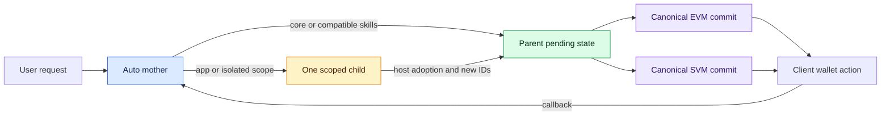

# Auto and Direct Execution Plan

Status: PROPOSED FOR REVIEW (2026-09-03)

This plan replaces the user-facing Auto/Direct/Coordinate proposal in
`CAPABILITY-LIBRARY-AND-MENTIONS.md`. It keeps the capability Library and `@`
mention work from that proposal, but changes execution to two user-facing modes:

- **Auto** is the default Aomi experience. One capable mother performs ordinary
  Aomi Core and compatible skill work itself and delegates only when an app,
  isolated guard scope, or genuinely complex subtask requires a child.
- **Direct** targets exactly one explicitly selected app and has no child-agent
  surface.

The current `default` and `orchestrator` app selections and public Agent endpoint
remain available for legacy clients. Updated SDK, CLI, widgets, and Portal use
the new mode contract.

Related review documents:

- [`AUTO-DIRECT-CONTRACT-AND-ROLLOUT.md`](./AUTO-DIRECT-CONTRACT-AND-ROLLOUT.md)
- [`AUTO-DIRECT-EVAL-PLAN.md`](./AUTO-DIRECT-EVAL-PLAN.md)

## Review legend

- 🟦 **Product contract** — user-visible behavior we are choosing.
- 🟩 **Required invariant** — implementation and tests must enforce it.
- 🟨 **Compatibility seam** — retained while callers migrate.
- 🟥 **Removal** — obsolete path to delete rather than adapt.

## Locked decisions

### 🟦 Modes

1. Portal and configurable widgets offer **Auto** and **Direct** only.
2. Auto is the default for every updated first-party client.
3. Selecting Direct reveals an app picker and requires exactly one app.
4. Auto does not reveal an app, skill, chain, or child choice before the turn.
   Natural language must work without an `@` reference.
5. `@app`, `@skill`, and `@chain` references are optional model hints. They do
   not make the frontend a router and do not override backend compatibility,
   entitlement, wallet, or safety checks.
6. The activity header remains **Working**. Delegation is visible through the
   existing child rows rather than a different top-level status.

### 🟦 Auto mother behavior

The Auto mother is Aomi Core plus orchestration capability. It is not the
current restricted orchestrator with more aliases.

The mother should normally perform these itself:

- plain conversation and reasoning;
- Aomi Core reads and writes;
- one-chain transaction staging, optional simulation, and commit;
- one compatible skill;
- multiple compatible skills when their tool and guard scopes can coexist;
- sequential work on more than one chain when no app or isolated skill scope
  requires a child.

The mother should use a child for:

- any selected or inferred third-party app;
- multiple apps, with one app scope per child;
- skill sets whose guards, chains, tool namespaces, or context budgets cannot
  coexist safely in the mother;
- independent or complex subtasks where isolating context materially improves
  reliability;
- an explicitly requested specialist or child.

The prompt policy is intentionally firm and server-owned, but routing remains a
model decision. The frontend must not claim that it deterministically resolved
which skill, app, chain, or child will be used.

### 🟩 Child boundary

A foreground child may read, activate its assigned skills, call its one app,
stage transactions, and simulate. A child may not:

- commit, sign, or broadcast;
- spawn another child;
- schedule background work;
- change authorization;
- bypass its assigned app, skills, or chain scope.

The child returns a result and staged intents. The host adopts each staged intent
into the mother's authoritative pending state with a new parent-owned ID. Raw
transaction payloads never need to be copied through model prose.

### 🟩 One parent transaction boundary

Mother-created and child-created work enters the same pending queue. From that
point forward, provenance is useful metadata rather than a separate execution
lane.



The model-facing commit surface has one EVM path and one SVM path:

- EVM resolves an ordered list of parent pending transaction IDs, requires one
  signer and one chain, and emits one Action.
- SVM resolves parent pending IDs plus stored assembly/broadcast metadata,
  requires one payer and one cluster, and emits one Action. The present
  `svm_commit_ix` and `svm_commit_tx` distinction becomes an internal dispatch
  detail rather than two choices the mother must reason about.

### 🟥 Remove staged-commit specialization

Delete the orchestrator-only transaction subsystem rather than moving it into
Auto:

- `commit_staged` and its host-only tool wrapper;
- `CommitStagedBatch`;
- `simulation_verdicts` as a commit eligibility mechanism;
- `staged_simulation_blockers`;
- `staged_commit_batches`;
- child instructions that make simulation mandatory before handoff;
- orchestrator-only commit dispatch and result re-wrapping.

Keep parent adoption, parent-owned ID allocation, staged provenance, ordinary
simulation results, Action creation, and wallet callbacks.

Simulation remains ID-based and optional:

- a child may simulate its own proposed batch;
- the mother may simulate any final parent batch, including a mix of mother and
  adopted child IDs;
- the prompt should recommend simulation when it adds confidence;
- commit must not require a stored simulation verdict;
- simulation evidence may remain observable for UI and eval reporting without
  becoming an authorization gate.

### 🟩 Chain switching

A single Auto mother can work across chains. “Switch” has two distinct meanings:

1. The mother selects a target chain in staged work and guard evaluation.
2. The client wallet switches its actual network immediately before executing
   the corresponding Action.

`sync_chain` only refreshes the local EVM simulation fork. It is not a wallet
network switch.

Cross-chain invariants:

- each EVM Action contains one signer and one `chain_id`;
- each SVM Action contains one payer and one cluster;
- transactions for different chains are committed as separate sequential
  Actions;
- each wallet result callback resumes the same mother before the next leg;
- EVM-to-SVM work uses the respective wallet capabilities; it is not one wallet
  changing chain family;
- a missing switch capability or unsupported chain fails explicitly and leaves
  unrelated pending work intact.

The current skill engine starts from the connected EVM chain. Auto must make
activation and guard evaluation target-chain-aware. A tool call carrying
`chain_id` already receives a scoped user-state snapshot; the activation path
must use the intended target chain too. If two skills still cannot share one
guard/tool scope, Auto delegates those scopes rather than weakening the guard.

## Runtime design

### 🟩 Add one internal Auto runtime

Add an internal `auto` AppSpec composed from:

- the complete default runtime namespaces (`aomi-core`, `evm-core`, and
  `svm-core`);
- skill discovery and activation;
- `task` and short `sleep` orchestration tools;
- no third-party app tools in the mother.

Do not key capabilities solely from `state.app == "orchestrator"`. Introduce one
runtime role/capability predicate used consistently by builder, completion,
dispatch, timeout accounting, callback resume, metrics, and child creation.
Both the new Auto runtime and the legacy orchestrator can own children during
migration, while only Auto has the default namespaces and local skill
activation.

The Auto preamble should express this policy in a compact order:

1. solve normal Aomi/Core and compatible skill work locally;
2. use a child for an app or an incompatible/complex isolated scope;
3. give each child one app, one chain scope, and a compatible skill set;
4. inspect adopted parent IDs and commit through the ordinary chain tool;
5. split mixed chains into sequential homogeneous commits;
6. simulate when useful, not as a prerequisite;
7. never claim completion before Action callbacks or equivalent terminal
   evidence.

### 🟨 Preserve legacy selection

The public Agent routes remain unchanged. Existing callers continue to work:

- omitted mode plus `app: "default"` selects the current default runtime;
- `app: "orchestrator"` selects the current legacy orchestrator;
- an existing builtin or dynamic app selection remains direct;
- `applicationId` retains its current stable hosted-app semantics.

Updated clients send an explicit new mode field. This lets Auto become the
product default without silently changing old clients that omit it.

## Widget product contract

Widgets configure which choices they expose in code. The proposed shape binds
Direct apps to Direct mode instead of maintaining unrelated allowlists:

```ts
type AgentTarget =
  | { mode: "auto" }
  | {
      mode: "direct";
      apps: readonly (
        | { app: string }
        | { applicationId: number; app?: string }
      )[];
    };

type AomiRoutingConfig = {
  targets?: readonly AgentTarget[];
  defaultMode?: "auto" | "direct";
};
```

Examples:

```tsx
// Product default: Auto plus every entitled Direct app.
<AomiWidget routing={{ targets: [{ mode: "auto" }, { mode: "direct", apps }] }} />

// Partner surface: one fixed app, Direct only.
<AomiWidget
  routing={{
    targets: [{ mode: "direct", apps: [{ applicationId: 42 }] }],
    defaultMode: "direct",
  }}
/>
```

Rendering rules:

- one permitted mode: hide the mode selector;
- Direct with one permitted app: fix the app and hide its dropdown;
- Direct with multiple apps: show the app dropdown after Direct is selected;
- Auto plus Direct: default to Auto unless the host explicitly chooses Direct;
- invalid empty Direct configuration fails during development and degrades to
  no-send with a clear host error in production;
- URL/project locks intersect with host configuration and never broaden it.

## Delivery order

Implementation must stop at each green gate before moving to the next layer:

1. **Backend/runtime** — Auto behavior, canonical pending/commit paths, chain
   scope, legacy compatibility, OpenAPI, and backend tests.
2. **TypeScript SDK and CLI** — typed target contract, Auto default, explicit
   Direct app, CLI persistence/help/errors, and real backend smoke.
3. **Eval gate** — Luna behavior, routing, chain switching, commit ownership,
   and token/cost comparison pass and are reported.
4. **Frontend/widget** — port the already committed capability UI onto the
   verified SDK contract and add host routing configuration.
5. **Manual Portal review** — the user verifies the final Portal behavior.

No frontend routing implementation should be used as evidence that the backend
or SDK contract works.

## Definition of done

- Auto is the default in updated SDK, CLI, Portal, and default widget config.
- Direct always names exactly one app and cannot call `task`.
- Auto handles core and compatible skill work without a child.
- Auto delegates app work and guard-separated work with correct child scope.
- Mother and child transactions share parent IDs and canonical commit tools.
- No special staged-commit or simulation-verdict gate remains.
- Mother-only and child-assisted chain switching pass for EVM; SVM cluster and
  EVM/SVM family transitions have dedicated coverage.
- Legacy callers selecting `default`, `orchestrator`, or an app still work.
- The Luna comparison report quantifies token, credit, request, child, tool, and
  latency impact.
- Working traces keep the **Working** label and existing child rows.
- Widget hosts can expose Auto only, Auto plus Direct, Direct with many apps, or
  Direct locked to one app.
