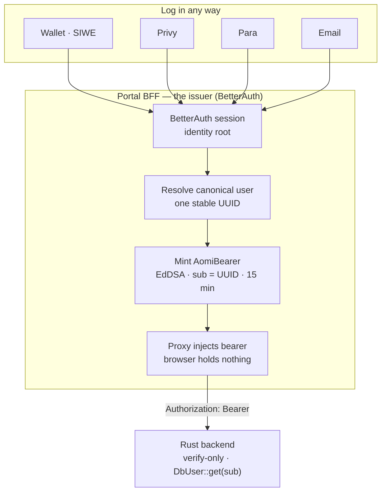
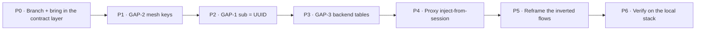

# Merge plan — BetterAuth + UI polish ⨯ bff-unification → one branch

> Status: 2026-06-29. Goal: fold Cecilia's shipped, backend-verified BFF account-auth
> (`bff-unification` / `@aomi-labs/account`) into **our** `codex/widget-auth-pre-rust`
> (BetterAuth identity + wallet-kit + account-management UI) so that a user can **log
> in any way** → resolve to **one canonical user** → the BFF **mints a token** → the
> Rust backend **verifies it**. End state proven on the local stack in
> `HANDOFF-LOCAL-BACKEND.md`.

This is the merge/workflow plan. The login decisions are locked in
`specs/WIDGET-AUTH-PLAN.md`; the contract we must match is product-mono
`docs/topics/account-authentication/facts/service-identity.md`. The three Cecilia
handoffs live in `../aomi-bff-unification/docs/handoffs/`.

---

## 1. The end state (what "done" looks like)

One sentence: **identity is ours (BetterAuth session → canonical UUID); the provider
is a linked credential, not the identity; the BFF mints an EdDSA bearer with the
canonical UUID in `sub`; the backend only verifies and looks the user up find-only.**

---

## 2. Where the two branches stand today (verified in code)

| Piece | `codex/widget-auth-pre-rust` (ours, the base) | `bff-unification` (Cecilia, the contract) |
|---|---|---|
| Identity / session | **BetterAuth** — `packages/auth/src/better-auth/{auth,siwe,provider-plugin}.ts`, session + account graph | HS256 `aomi_session` cookie stand-in (`@aomi-labs/account/session`) — explicitly "your lane to replace" |
| Account graph | `getOrCreateAomiUserForBetterAuthSession` writing **`aomi_users` / `aomi_auth_identities` / `aomi_wallets`** (`db/schema.sql`) | `resolveOrCreateCanonicalUser` / `resolveOrCreateByWallet` writing the backend-read **`users` / `auth_identities`** |
| Token mint | BetterAuth **JWT plugin + JWKS**; `backend-jwt.ts` → `sub` = BetterAuth id, `aomi_user_id` = canonical | `mintAccountBearer(userId)` — EdDSA via **static mesh** (`@aomi-labs/service`, `service.portal.toml`); `sub` = canonical UUID |
| Proxy `[...slug]` | **forwards** the browser `authorization` header upstream (no mint) | `createBackendProxy` — **mints + injects** from session, strips `cookie` + client `authorization` |
| Backend bearer selector | `NEXT_PUBLIC_AOMI_AUTH_MODE` (`legacy` \| `better-auth`, default legacy) — `apps/portal/src/lib/backend-auth.ts` | n/a — always proxy-inject |
| Providers / verify | `packages/auth/src/providers/*` (privy, para, wallet-attestation) | `packages/account/src/providers.ts` — **same `ProviderTokenCredential` → `VerifiedProviderToken`** shapes |
| SIWE verify | `@aomi-labs/auth/better-auth/siwe` | `@aomi-labs/account/siwe` — **copied to match ours** |
| MCP approvals (System B) | already relocated to `packages/auth/src/mcp-approvals/` + portal `/api/mcp-auth/*` | (n/a) |
| Wallet-kit + account UI | full `apps/registry/src/lib/wallet-kit/` + account-management UI | (n/a — doesn't touch the backend contract) |

**Backend (product-mono `origin/main`)** is already deployed against Cecilia's
contract: verify-only, EdDSA, `sub` = canonical UUID, **static-mesh** trust
(`service.toml` `[[trusted_issuers]]`, kid `aomi-bff`), find-only `DbUser::get`. The
old Rust HS256 mint is **removed** — so our `legacy` proxy-through to Rust is rejected
by prod, and our `better-auth` `/api/auth/token` JWKS token is a different shape than
the backend trusts. **Neither of our current modes loads threads against prod as-is.**
That is exactly what this merge fixes.

---

## 3. The only real work: three bridges (GAP-1/2/3)

The architectures already agree. The merge is three small, mechanical alignments —
each keeps the **already-deployed** backend working. None is a redesign.

| Gap | Ours today | Backend requires | Bridge |
|---|---|---|---|
| **GAP-1** | `sub` = BetterAuth user id; canonical UUID in `aomi_user_id` (`backend-jwt.ts:73`) | `sub` = **canonical UUID** (keyed for `DbUser::get`) | Put the canonical UUID in `sub`. Keep `aomi_user_id`/`sid`/`scope` as *extra* claims. **1-line slot swap; until done, every authed request 401s.** |
| **GAP-2** | EdDSA via BetterAuth **JWKS** endpoint | EdDSA verified by **static mesh** per `kid` (no JWKS fetch yet) | Register our signing key + `kid` as the `aomi-bff` issuer in **both** `service.toml` (backend) and `service.portal.toml` (portal). JWKS migration is a separate, coordinated change later. |
| **GAP-3** | writes `aomi_users` / `aomi_auth_identities` | reads `users` / `auth_identities` (id = canonical UUID) | `resolveOrCreate*` must write the tables the backend reads — **or** ship a UUID-preserving migration. **Alice invariant:** a returning user must resolve to her *existing* `users.id`, or her sessions/history detach. |

**The one gate that proves the merge survived:** a BetterAuth-signed token with
`sub` = a known canonical UUID **verifies in the Rust backend** and `DbUser::get(sub)`
resolves the user. Green = the contract held.

### Two decisions — LOCKED (2026-06-29)

1. **Mint mechanism (GAP-2 resolution) — LOCKED: mesh signer + proxy-inject.** Mint via
   `@aomi-labs/account`'s `mintAccountBearer` (EdDSA, key from
   `PORTAL_SERVICE_PRIVATE_KEY`, `service.portal.toml`) and **proxy-inject** it.
   BetterAuth supplies the *session + account graph*, **not** the backend token. This is
   what production already trusts and what the local stack proves. The BetterAuth JWT
   plugin / JWKS `/api/auth/token` path is demoted to "future, not against prod".
2. **Account-graph tables (GAP-3 resolution) — LOCKED: write `users` / `auth_identities`
   directly.** Clean-start environment, no `aomi_*` data to preserve, so point
   resolve-or-create at the backend-read tables now; the gate passes immediately. If real
   `aomi_*` data ever exists, switch to the UUID-preserving backfill (on first BetterAuth
   login, adopt any existing `wallet`-keyed `auth_identities.user_id` for that address
   instead of minting a new UUID).

---

## 4. The merge workflow (phased)

Direction is settled by the handoff: **our branch is the mechanical base** (it carries
the most code), and **Cecilia's contract wins the seams**. Don't cherry-pick her stack
into ours, and don't blind `git merge` (both branches edited `[...slug]` + the exchange
routes and did opposing renames — ours `apps/registry → wallet-kit` lib move, hers
`apps/registry → apps/shadcn-registry` — so a naive merge conflicts hard and could ship
GAP-1 minting to the live backend). Reconcile contract-first.

### P0 — New branch + import the contract layer
- [ ] Branch off `codex/widget-auth-pre-rust` (e.g. `merge/bff-betterauth`). **Don't lose its diff.**
- [ ] Bring Cecilia's small, authoritative contract layer on top (`@aomi-labs/account`:
      `bearer.ts`, `account-graph.ts`, `topology.ts`, `createBackendProxy`,
      `getSessionedCanonicalId`) — as the *target shapes*, not a parallel stack.
- [ ] Take her non-contract code wholesale where it doesn't conflict; keep all of our
      wallet-kit, account-management UI, mcp-approvals, BetterAuth scaffolding.
- [ ] Resolve the `apps/registry` rename collision deliberately (pick one app name).

### P1 — GAP-2: register the signing key in the mesh
- [ ] Generate / choose the BFF signing keypair (local dev pair already in `HANDOFF-LOCAL-BACKEND.md` §5).
- [ ] Add public key + `kid` = `aomi-bff` to `product-mono/.../service.toml` (backend) **and** `service.portal.toml` (portal).
- [ ] Confirm: a hand-signed token with `sub` = a known UUID verifies in the backend (no `untrusted kid`).

### P2 — GAP-1: mint with the canonical UUID in `sub`
- [ ] Converge minting onto `mintAccountBearer(canonicalUserId, "user")` (mesh signer).
- [ ] Claim set: `sub` = canonical UUID, `iss` = `aomi-bff`, `aud` = `aomi-backend`, `role` = `user`, `iat`, `exp` (15 min); `aomi_user_id`/`sid`/`scope` allowed as extras.
- [ ] Demote the JWKS `/api/auth/token` path to "future, not against prod" (keep `NEXT_PUBLIC_AOMI_AUTH_MODE` for the cutover, default to the new inject path).

### P3 — GAP-3: write the tables the backend reads
- [ ] Re-point `getOrCreateAomiUserForBetterAuthSession` / SIWE / provider link so the
      canonical user lands in `users` / `auth_identities` (or the UUID-preserving migration).
- [ ] Keep the stable-UUID contract (Alice invariant) and the 4 `account-graph` unit tests green.

### P4 — Proxy: inject-from-session (browser holds nothing)
- [ ] Replace the forward-the-browser-bearer `[...slug]` proxy with the inject variant:
      read session → `getSessionedCanonicalId(req)` → mint → set `Authorization`, strip `cookie` + client `authorization`.
- [ ] Re-implement `getSessionedCanonicalId` on top of the **BetterAuth** session (replace the HS256 `session.ts` stand-in). Header-first read (`Authorization: Bearer <session>`) keeps the headless/CLI path working.
- [ ] Keep our allowlist breadth (the `ALLOWED_ROUTES` table already in our proxy).

### P5 — Reframe the inverted (🔴) flows
- [ ] Provider exchange: provider-first "verify → create session" → **session-first link** (`exchangeProviderForExistingSession`). The verify sub-seam is a literal swap; only the flow changes.
- [ ] SIWE exchange: delete the TMP nonce/verify bridge routes; **BetterAuth SIWE plugin** owns nonce + session. `verifySiweMessage` survives verbatim.
- [ ] Account read: reconcile `/api/aomi/account` (local) vs `/api/account` (proxied) — one owner, one payload.
- [ ] CLI: SIWE session + present `Authorization: Bearer <session>` → proxy mints. Confirm `bearer()`/`jwt()` aren't browser-origin gated.

### P6 — Verify on the local stack (the gate)
- [ ] Bring up backend + portal + `aomi_local` per `HANDOFF-LOCAL-BACKEND.md` (§3/§4/§8).
- [ ] Run the gate: BetterAuth login (each method) → `/api/account` 200 → `/api/sessions` 200 → `/api/state` 200 → chat streams. `DbUser::get(sub)` resolves the canonical user.
- [ ] Smoke the secondary gates: proxy strips client auth + cookie; SIWE creates one canonical user; relogin returns the *same* UUID (Alice).

---

## 5. Seam scorecard (from `bff-betterauth-integration.md` §1)

- 🟢 **literal swap (3):** proxy-via-session-seam, provider-credential verify, SIWE verify.
- 🟡 **replace-body (4):** session (`getSessionedCanonicalId`), account-graph (provider), bearer mint, session cookie.
- 🔴 **reframe (4):** wallet account-graph keying, provider-exchange flow, SIWE-exchange flow, account read.
- ➕ **fold-in (1):** CLI / headless — 🔴 today → 🟢 once BetterAuth plugins land.

Most of the surface is swap/replace-body. The 🔴 set is the provider/SIWE *flow*
inversion (session-first), which is P5.

## 6. References
- Contract (source of truth): product-mono `docs/topics/account-authentication/facts/service-identity.md`
- Handoffs: `../aomi-bff-unification/docs/handoffs/{arixoneth-account-auth,bff-betterauth-integration,base-siwe-betterauth-dropin}.md`
- Local stack bring-up: `HANDOFF-LOCAL-BACKEND.md`
- Our login decisions: `specs/WIDGET-AUTH-PLAN.md`, draft contract to reconcile: `specs/AUTH-BACKEND-JWT-CONTRACT.md`
- Key code: `packages/auth/src/better-auth/backend-jwt.ts` (GAP-1), `db/schema.sql` (GAP-3), `apps/portal/src/app/api/[...slug]/route.ts` (proxy), `apps/portal/src/lib/backend-auth.ts` (mode switch)
