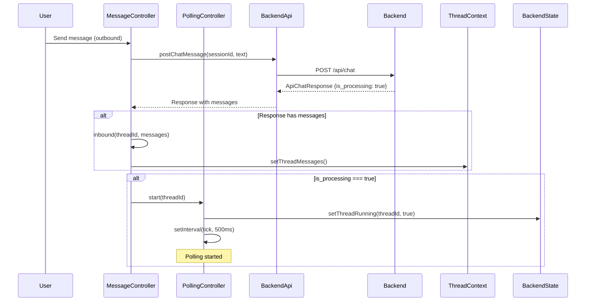
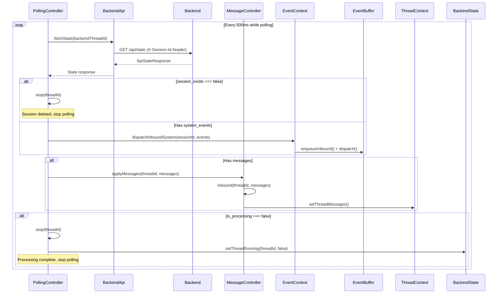
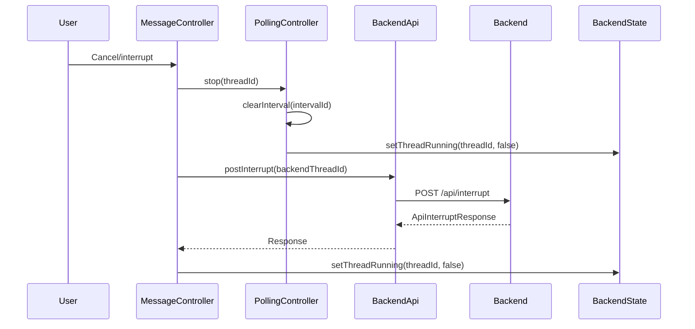
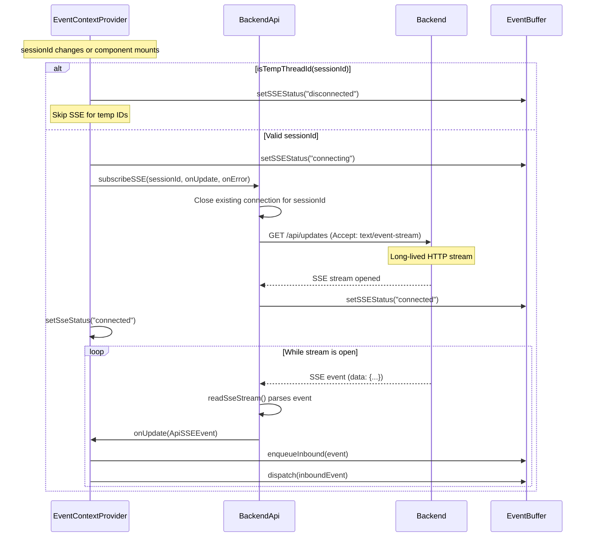
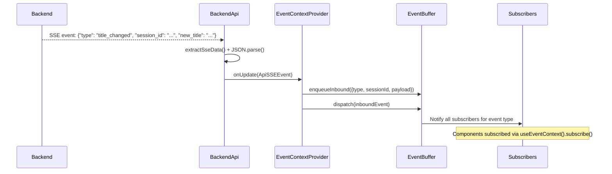
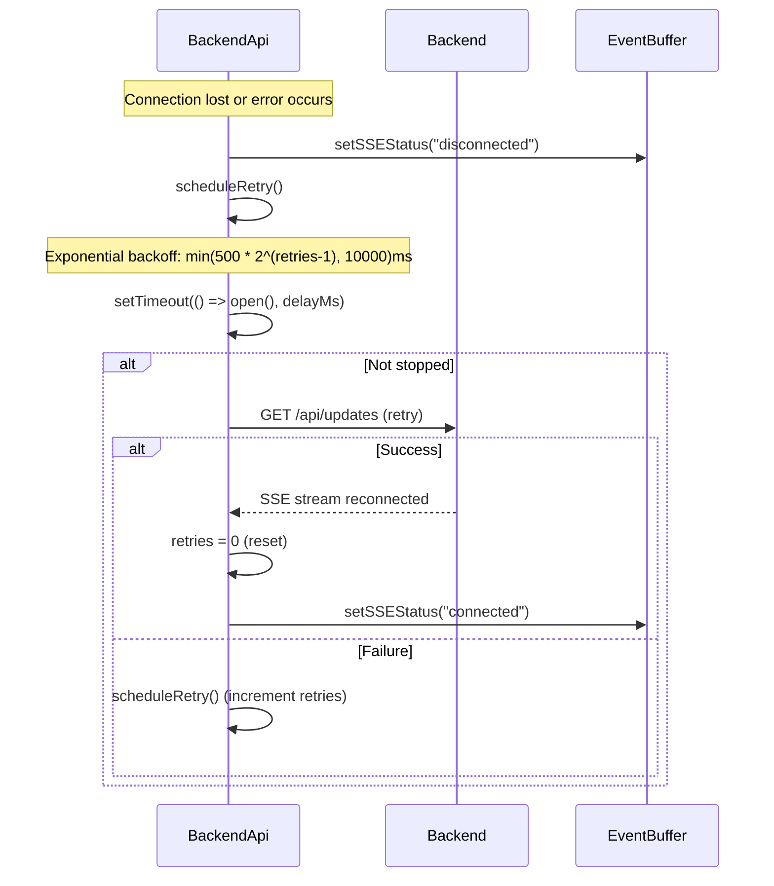
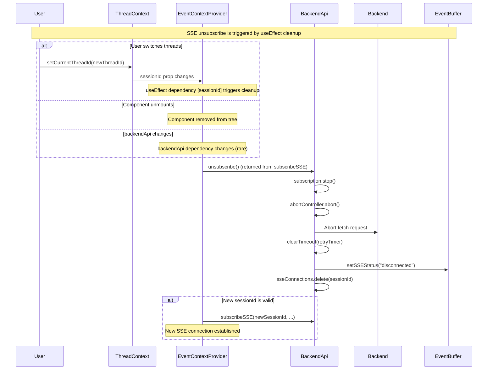
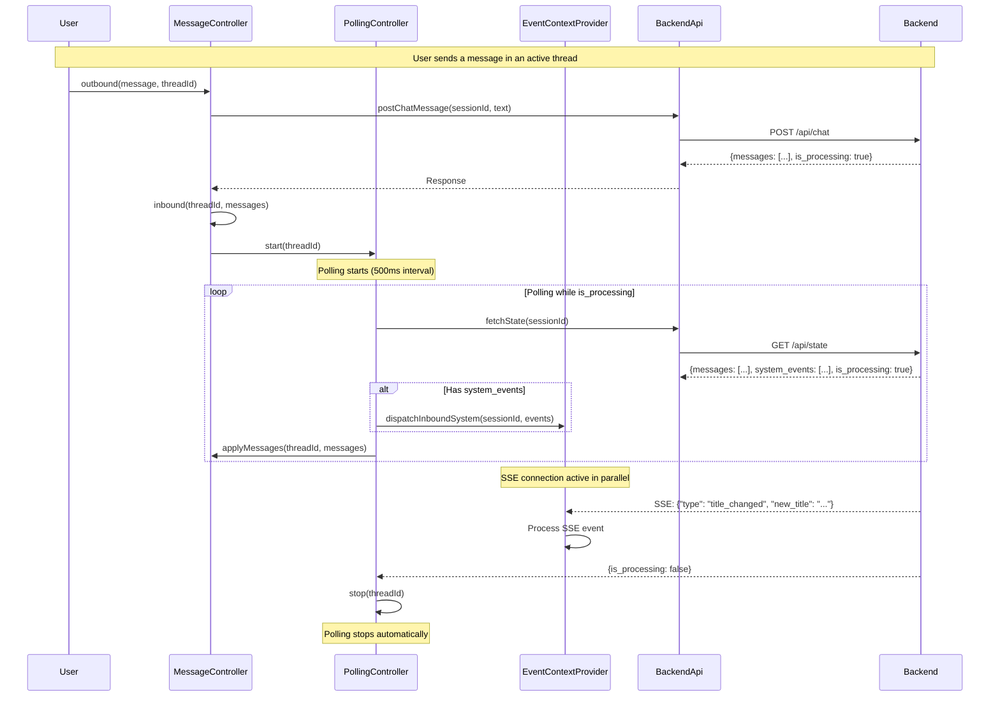
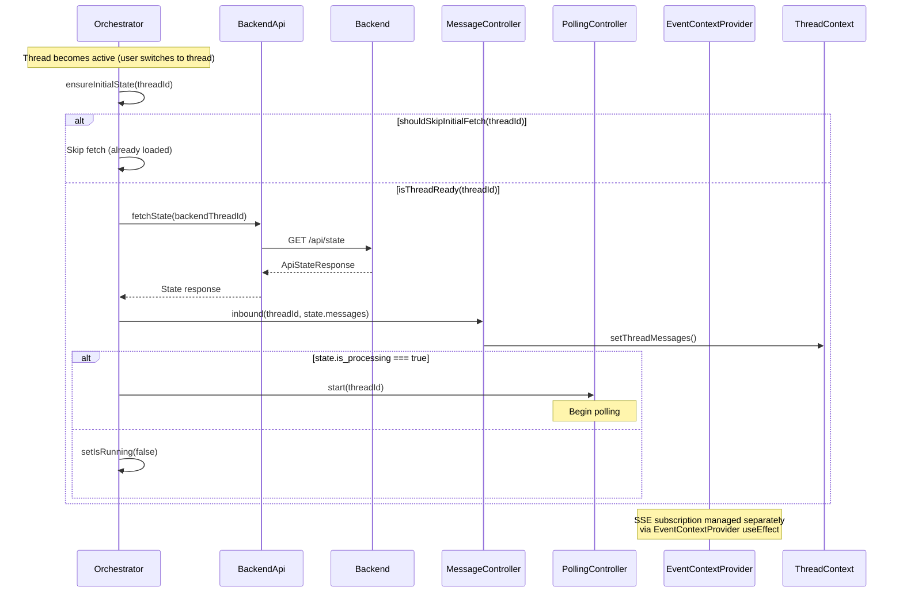
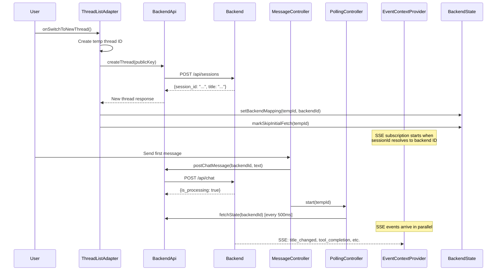

# Polling and SSE Workflow Documentation

This document describes the workflow for polling messages and subscribing to Server-Sent Events (SSE) updates for each chat thread in the Aomi widget runtime.

## Overview

The runtime uses two complementary mechanisms to keep chat threads synchronized with the backend:

1. **Polling**: Periodic HTTP requests to fetch state updates when a thread is actively processing
2. **SSE (Server-Sent Events)**: Long-lived streaming connection for real-time updates (title changes, tool completions, etc.)

Both mechanisms operate per-thread and are managed by the runtime orchestrator.

## Architecture Components

- **PollingController**: Manages interval-based polling for active threads
- **MessageController**: Handles inbound/outbound message processing
- **BackendApi**: Provides HTTP and SSE client methods
- **EventContextProvider**: Manages SSE subscriptions and event buffering
- **Orchestrator**: Coordinates polling and message handling

---

## Sequence Diagram: Polling Workflow

### Starting Polling

### Polling Loop

### Stopping Polling

---

## Sequence Diagram: SSE Subscription Workflow

### Establishing SSE Connection

### SSE Event Processing

### SSE Reconnection Logic

### Unsubscribing from SSE

**When Unsubscribe is Called:**

The SSE `unsubscribe()` function is called automatically by React's `useEffect` cleanup function in `EventContextProvider`. Specifically, it's triggered when:

1. **User switches threads** (most common):
   - User calls `threadContext.setCurrentThreadId(newThreadId)`
   - This changes the `sessionId` prop passed to `EventContextProvider`
   - The `useEffect` dependency array includes `sessionId`, so React runs the cleanup function
   - Cleanup calls `unsubscribe()` for the old session, then sets up a new SSE connection for the new session

2. **Component unmounts**:
   - When `EventContextProvider` is removed from the React tree
   - React runs the cleanup function, which calls `unsubscribe()`

3. **backendApi changes** (rare):
   - If the `backendApi` instance changes (dependency in `useEffect`)
   - Cleanup runs and re-establishes connection with new API instance

4. **buffer changes** (rare):
   - If the event buffer reference changes (dependency in `useEffect`)
   - Cleanup runs and re-establishes connection

**Important Notes:**
- The unsubscribe happens **before** the new subscription is established (when switching threads)
- This ensures only one SSE connection exists per session at a time
- The cleanup function is guaranteed to run by React before the effect runs again or the component unmounts

---

## Sequence Diagram: Combined Workflow (Polling + SSE)

### Thread Lifecycle: From Message Send to Completion

### Initial Thread State Fetch

### Thread Creation and First Message

---

## Key Behaviors

### Polling Behavior

1. **Automatic Start**: Polling starts automatically when:
   - A message is sent and `is_processing === true`
   - Initial state fetch shows `is_processing === true`
   - Pending messages are flushed after thread creation

2. **Automatic Stop**: Polling stops automatically when:
   - `is_processing === false` in state response
   - `session_exists === false` (session deleted)
   - Polling error occurs
   - User cancels/interrupts the thread

3. **Polling Interval**: Default 500ms (configurable via `PollingController` constructor)

4. **Per-Thread**: Each thread has its own polling interval, managed independently

### SSE Behavior

1. **Per-Session**: One SSE connection per `sessionId` (backend thread ID)

2. **Automatic Reconnection**: Exponential backoff on disconnect:
   - Initial delay: 500ms
   - Max delay: 10s
   - Formula: `min(500 * 2^(retries-1), 10000)`

3. **Event Types**: Handles various SSE event types:
   - `title_changed`: Thread title updates
   - `tool_completion`: Tool execution completion
   - Custom event types as needed

4. **Temp Thread Handling**: SSE connections are skipped for temporary thread IDs until they resolve to backend session IDs

5. **Event Buffering**: All SSE events are buffered in `EventBuffer` and dispatched to subscribers

6. **Automatic Unsubscribe**: SSE connections are automatically unsubscribed when:
   - User switches to a different thread (`sessionId` prop changes)
   - `EventContextProvider` component unmounts
   - `backendApi` or `buffer` dependencies change (rare)
   - The cleanup function in `useEffect` ensures proper cleanup before new connections are established

### Coordination

- **Polling** handles message synchronization and system events during active processing
- **SSE** handles real-time updates (title changes, tool completions) regardless of processing state
- Both mechanisms can operate simultaneously for the same thread
- System events can arrive via both polling (`system_events` array) and SSE (as `ApiSSEEvent`)

---

## State Management

### BackendState

Tracks per-thread state:
- `runningThreads`: Set of thread IDs currently being polled
- `tempToBackendId`: Mapping from UI thread IDs to backend session IDs
- `pendingChat`: Queue of messages waiting for thread creation
- `skipInitialFetch`: Set of thread IDs that should skip initial state fetch

### ThreadContext

Manages UI state:
- `threads`: Map of thread ID → messages
- `threadMetadata`: Map of thread ID → metadata (title, status, lastActiveAt)
- `currentThreadId`: Currently active thread

### EventBuffer

Manages event flow:
- Inbound events from polling and SSE
- Outbound events to backend
- Subscriber notifications
- SSE connection status

---

## Error Handling

### Polling Errors

- On polling error: Polling stops automatically, thread marked as not running
- Network errors: Logged, polling stops
- Invalid session: Polling stops when `session_exists === false`

### SSE Errors

- Connection errors: Logged, reconnection scheduled with exponential backoff
- Parse errors: Logged, event skipped
- Abort errors: Ignored (expected during unsubscribe)

---

## Performance Considerations

1. **Polling Frequency**: 500ms interval balances responsiveness with server load
2. **SSE Reconnection**: Exponential backoff prevents connection storms
3. **Per-Thread Isolation**: Each thread's polling/SSE is independent, preventing cross-thread interference
4. **Event Buffering**: Centralized event buffer prevents duplicate processing
5. **Skip Initial Fetch**: Avoids redundant fetches when thread state is already known

---

## API Endpoints

### Polling Endpoints

- `GET /api/state` - Fetch current thread state (messages, system_events, is_processing)
- `POST /api/chat` - Send message and get immediate response
- `POST /api/interrupt` - Cancel current processing

### SSE Endpoints

- `GET /api/updates` - Server-Sent Events stream (requires `X-Session-Id` header)

### Event Endpoints

- `GET /api/events` - Fetch system events for a session
- `GET /api/events?after_id=X&limit=Y` - Fetch events after a specific ID
- `POST /api/system` - Send outbound system message
