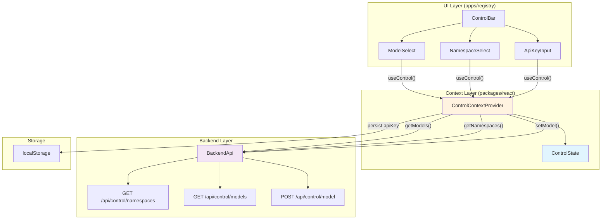
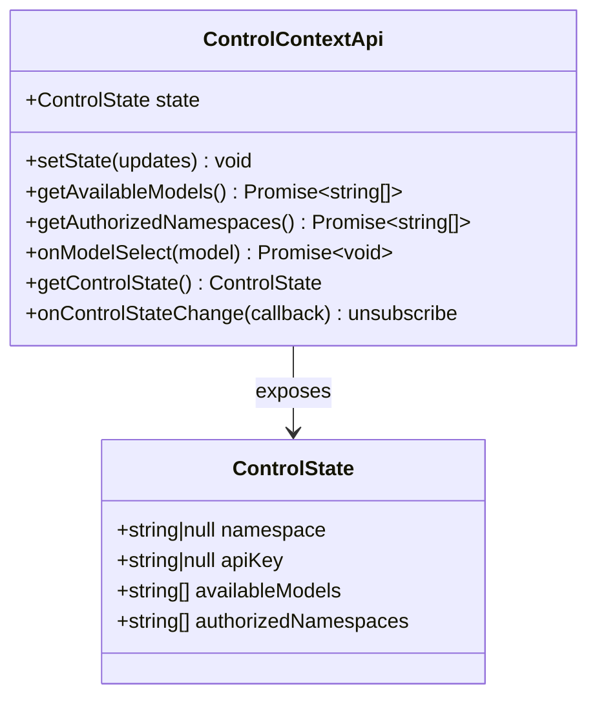
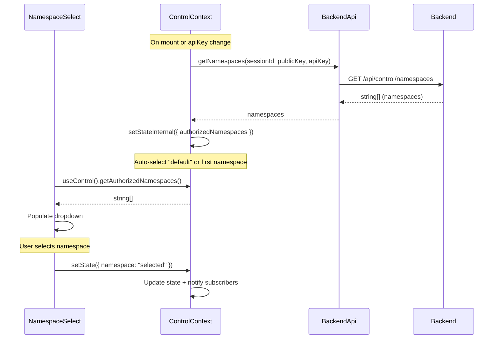
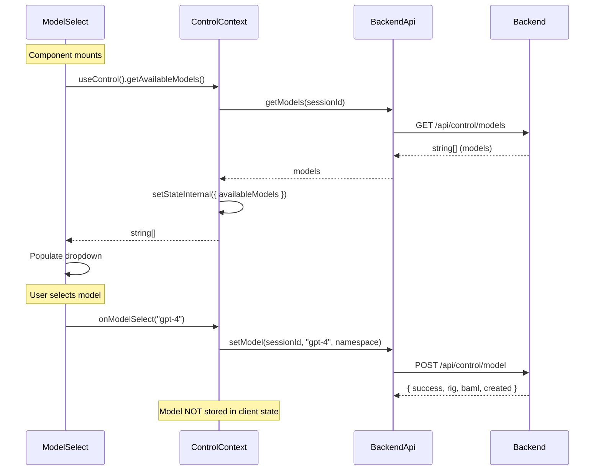
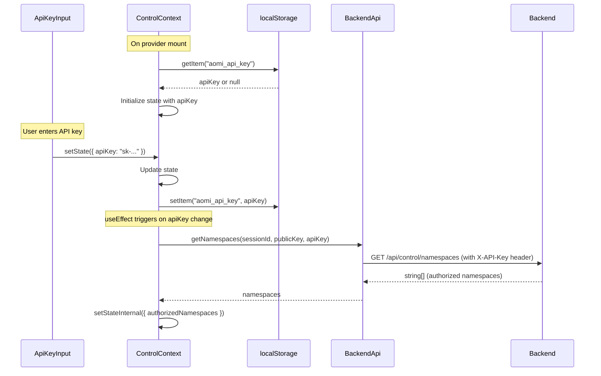

# Progress Tracker

## Current Sprint Goal

Control Context refactor: Simplified model/namespace selection with backend-driven architecture

## Branch Status

- **Current Branch:** `component-improve`
- **Focus:** ControlContext architecture for model/namespace/apiKey management

### Recent Commits

| Hash    | Description                                      |
| ------- | ------------------------------------------------ |
| e3d9183 | initThreadControl                                |
| fb89802 | isProcessing in ThreadControlState               |
| a13315a | Working state                                    |
| 1caba26 | Small UI fixes                                   |
| a1534a7 | fix: add UUID polyfill for Safari/older browsers |

## Control System Architecture

### Component & Context Design



### ControlState Shape



### Namespace Fetch Sequence



### Model Fetch & Selection Sequence



### API Key Flow



## Recently Completed Work

| Task                          | Description                                                              | Key Changes                                                                                               |
| ----------------------------- | ------------------------------------------------------------------------ | --------------------------------------------------------------------------------------------------------- |
| ThreadControl Init            | Added initThreadControl for thread initialization                        | `runtime/core.tsx`, `contexts/control-context.tsx` - thread control state management                      |
| isProcessing State            | Added isProcessing to ThreadControlState                                 | Tracks processing state per thread for UI feedback                                                        |
| UUID Polyfill                 | Safari/older browser compatibility                                       | `packages/react/src/utils/uuid.ts` - crypto.randomUUID polyfill                                           |
| UI Fixes                      | Small UI improvements to control bar components                          | `control-bar/*.tsx` - model-select, namespace-select, api-key-input                                       |
| ControlContext Refactor       | Simplified model/namespace/apiKey management                             | `packages/react/src/contexts/control-context.tsx` - unified setState, backend-driven model selection      |
| Control API Endpoints         | Backend API for control operations                                       | `BackendApi.getNamespaces()`, `getModels()`, `setModel()` in `backend/client.ts`                          |
| Control Bar Components        | UI components for model/namespace selection                              | `apps/registry/src/components/control-bar/` - simplified, no more props                                   |
| Test Mock Updates             | Added control API to test harness                                        | `test-harness.tsx` - getNamespaces, getModels, setModel mocks                                             |
| Runtime Architecture Refactor | New controller-handler architecture with EventBuffer for event streaming | Complete rewrite of runtime layer with clear separation of concerns                                       |
| EventBuffer Implementation    | Mutable ref-based event queue for inbound/outbound events                | `packages/react/src/state/event-buffer.ts` - Queues, subscribers, SSE status tracking                     |
| EventContextProvider          | React context for event management and SSE subscription                  | `packages/react/src/contexts/event-context.tsx` - Wraps EventBuffer with React context                    |
| Wallet Handler Hook           | Hook for wallet integration via event system                             | `packages/react/src/handlers/wallet-handler.ts` - sendTxComplete, sendConnectionChange, pendingTxRequests |
| Notification Handler Hook     | Hook for notification display via event system                           | `packages/react/src/handlers/notification-handler.ts` - notifications, unhandledCount, markHandled        |
| UserContext Primitive         | Refactored user context as a core primitive                              | `packages/react/src/contexts/user-context.tsx` - User identity and wallet state                           |
| Directory Restructure         | Moved files to logical locations                                         | api/ → backend/, hooks.ts → contexts/runtime-actions.ts, state/thread-context.tsx → contexts/             |
| Legacy Cleanup                | Removed old system event handling                                        | Deleted: api/types.ts, utils/conversion.ts, utils/wallet.ts, lib/utils.ts, state/types.ts                 |
| RuntimeOrchestrator Refactor  | Simplified orchestration with controller pattern                         | Uses MessageController + PollingController                                                                |
| ThreadListAdapter             | New adapter for thread list operations                                   | `packages/react/src/runtime/threadlist-adapter.ts`                                                        |
| Core Runtime Module           | Extracted core runtime utilities                                         | `packages/react/src/runtime/core.tsx`                                                                     |
| Landing Compatibility         | Updated AomiFrame components for new architecture                        | apps/registry components updated for new context providers                                                |

## Files Modified This Sprint

### New Files

- `packages/react/src/contexts/control-context.tsx` - ControlContextProvider and useControl hook
- `packages/react/src/contexts/event-context.tsx` - EventContextProvider and hooks
- `packages/react/src/contexts/notification-context.tsx` - NotificationContext
- `packages/react/src/contexts/user-context.tsx` - UserContext primitive
- `packages/react/src/handlers/wallet-handler.ts` - useWalletHandler hook
- `packages/react/src/handlers/notification-handler.ts` - useNotificationHandler hook
- `packages/react/src/state/event-buffer.ts` - EventBuffer class
- `packages/react/src/runtime/threadlist-adapter.ts` - ThreadListAdapter
- `packages/react/src/runtime/core.tsx` - Core runtime utilities
- `packages/react/src/utils/uuid.ts` - UUID polyfill for Safari/older browsers
- `specs/RUNTIME-ARCH.md` - Comprehensive architecture documentation

### Refactored Files

- `packages/react/src/backend/client.ts` - Added Control API (getNamespaces, getModels, setModel)
- `packages/react/src/backend/types.ts` - Renamed from api/types.ts, expanded types
- `packages/react/src/contexts/runtime-actions.ts` - Renamed from runtime/hooks.ts
- `packages/react/src/contexts/thread-context.tsx` - Moved from state/
- `packages/react/src/runtime/aomi-runtime.tsx` - Added ControlContextProvider nesting
- `packages/react/src/runtime/core.tsx` - Uses getControlState().apiKey
- `packages/react/src/runtime/orchestrator.ts` - Simplified coordination
- `packages/react/src/runtime/polling-controller.ts` - Updated for new architecture
- `packages/react/src/runtime/message-controller.ts` - Updated for new architecture
- `packages/react/src/runtime/utils.ts` - Expanded utility functions
- `packages/react/src/runtime/__tests__/test-harness.tsx` - Added control API mocks
- `packages/react/src/state/backend-state.ts` - Moved from runtime/
- `packages/react/src/state/thread-store.ts` - Updated for new types
- `packages/react/src/index.ts` - Updated exports (removed useBackendApi)

### Deleted Files

- `packages/react/src/api/client.ts` - Moved to backend/
- `packages/react/src/api/types.ts` - Merged into backend/types.ts
- `packages/react/src/lib/utils.ts` - Removed
- `packages/react/src/runtime/event-controller.ts` - Replaced by EventContext
- `packages/react/src/runtime/wallet-handler.ts` - Replaced by handlers/wallet-handler.ts
- `packages/react/src/services/session-service.ts` - Removed (simplified architecture)
- `packages/react/src/hooks/use-session-service.ts` - Removed
- `packages/react/src/state/types.ts` - Merged elsewhere
- `packages/react/src/utils/conversion.ts` - Merged into runtime/utils.ts
- `packages/react/src/utils/wallet.ts` - Replaced by handlers

### UI Components

- `apps/registry/src/components/aomi-frame.tsx` - Updated for new providers
- `apps/registry/src/components/aomi-frame-collapsible.tsx` - Updated for new providers
- `apps/registry/src/components/control-bar/index.tsx` - Simplified (no props needed)
- `apps/registry/src/components/control-bar/model-select.tsx` - Uses useControl(), UI fixes
- `apps/registry/src/components/control-bar/namespace-select.tsx` - Uses useControl(), UI fixes
- `apps/registry/src/components/control-bar/api-key-input.tsx` - Uses setState({ apiKey }), UI fixes
- `apps/landing/app/sections/hero.tsx` - Updated for new architecture

## Pending Tasks

### Control System

- [ ] E2E test: apiKey → namespaces fetch → model selection flow
- [ ] Add loading states to ModelSelect and NamespaceSelect
- [ ] Handle error states in control bar components

### Event System

- [ ] Add SSE reconnection status indicator to UI
- [ ] Test high-priority event flushing behavior
- [ ] Add event deduplication if needed

### Handler Hooks

- [ ] Add unit tests for useWalletHandler
- [ ] Add unit tests for useNotificationHandler
- [ ] Document handler hook usage in README

### Testing

- [ ] Add unit tests for ControlContextProvider
- [ ] Add integration tests for event flow
- [ ] Test wallet transaction flow end-to-end
- [ ] Test notification flow end-to-end

### Documentation

- [x] Update DOMAIN.md with control context architecture
- [x] Update STATE.md with control context changes
- [x] Add mermaid diagrams to PROGRESS.md
- [ ] Add code examples to RUNTIME-ARCH.md

## Known Issues

None currently - build and dev server working correctly after landing compatibility updates.

## Notes for Next Agent

### Architecture Overview

The runtime uses an event-driven architecture with a new Control Context for model/namespace management:

```
Provider Layer:
ThreadContextProvider → AomiRuntimeProvider → EventContextProvider → RuntimeActionsProvider
  → AomiRuntimeCore → ControlContextProvider → AssistantRuntimeProvider

Controllers:
RuntimeOrchestrator → MessageController + PollingController

State:
- ThreadContext (reactive) - UI-facing thread/message data
- BackendState (mutable ref) - Backend sync coordination
- EventBuffer (mutable ref) - Inbound/outbound event queues
- ControlState (reactive) - namespace, apiKey, availableModels, authorizedNamespaces
- ThreadControlState (reactive) - per-thread state including isProcessing
```

### Control Context Pattern

```typescript
// ControlState - what's stored in state
type ControlState = {
  namespace: string | null;
  apiKey: string | null;
  availableModels: string[];
  authorizedNamespaces: string[];
};

// ThreadControlState - per-thread control state
type ThreadControlState = {
  isProcessing: boolean;
  // ... other per-thread state
};

// Usage in components
const {
  state,
  setState,
  getAvailableModels,
  onModelSelect,
  initThreadControl,
} = useControl();

// Initialize thread control (called when switching threads)
initThreadControl(threadId);

// Update namespace or apiKey
setState({ namespace: "production" });
setState({ apiKey: "sk-..." });

// Fetch models (updates state.availableModels)
const models = await getAvailableModels();

// Select model (backend-only, not stored in state)
await onModelSelect("gpt-4");
```

### Key Patterns

1. **Event Handlers as Hooks**: Wallet and notification handling are now React hooks (`useWalletHandler`, `useNotificationHandler`) that subscribe to EventBuffer via EventContext.

2. **Outbound Events**: Use `enqueueOutbound()` from EventContext. High priority events flush immediately, normal priority batch on timer.

3. **Inbound Events**: SSE events go to EventBuffer → dispatch to subscribers → handler hooks process them.

4. **ID Resolution**: Temp IDs (`temp-{uuid}`) are used for optimistic UI. `resolveThreadId()` in BackendState maps to backend IDs.

5. **Control State**: Model selection is backend-only (not stored in client state). Namespaces auto-fetch on mount and when apiKey changes. ApiKey persists to localStorage.

### Key Commands

```bash
pnpm run build:lib              # Build library to dist/
pnpm --filter landing dev       # Run demo at localhost:3000
pnpm run test                   # Run tests (41 tests)
pnpm lint                       # Lint check
```

### File Locations

- Backend API: `packages/react/src/backend/`
- Contexts: `packages/react/src/contexts/` (User, Event, Thread, Notification, Control)
- Event handlers: `packages/react/src/handlers/`
- Event state: `packages/react/src/state/event-buffer.ts`
- Control bar UI: `apps/registry/src/components/control-bar/`
