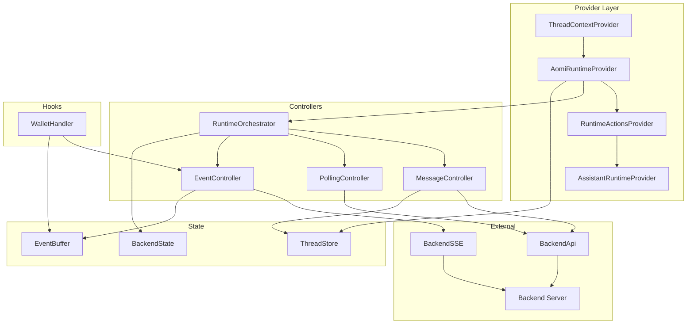
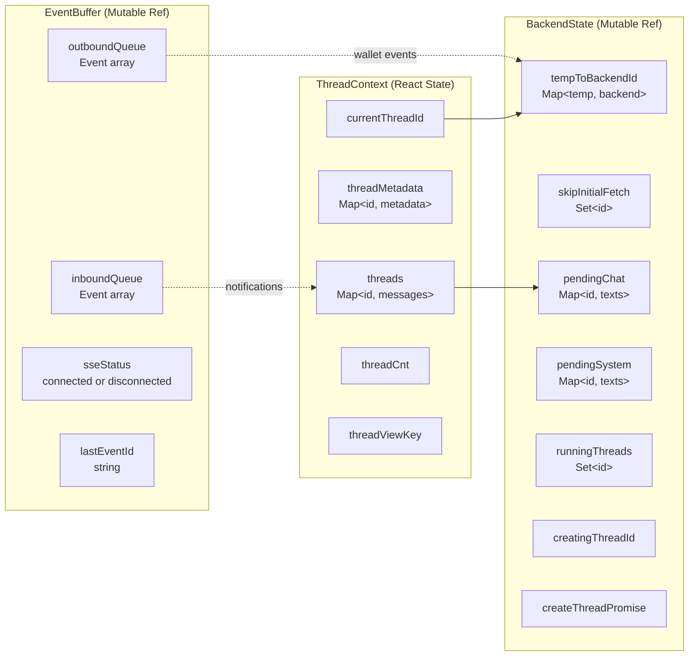
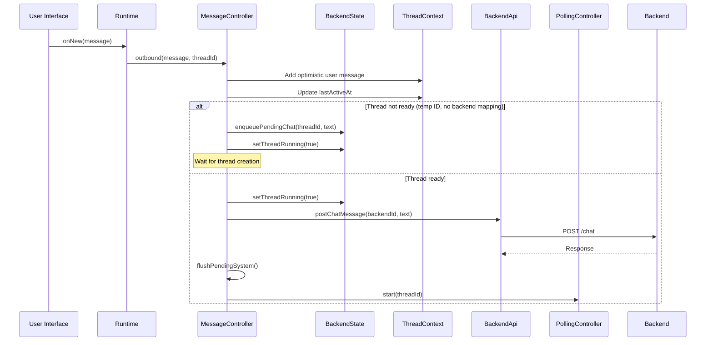
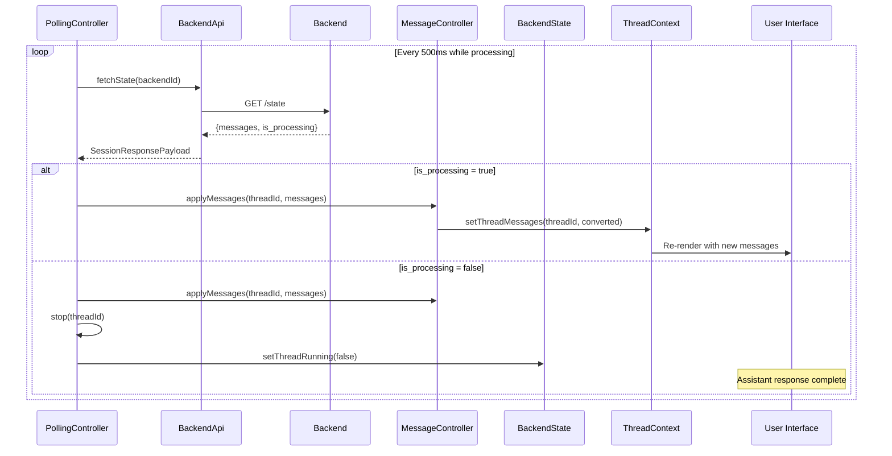
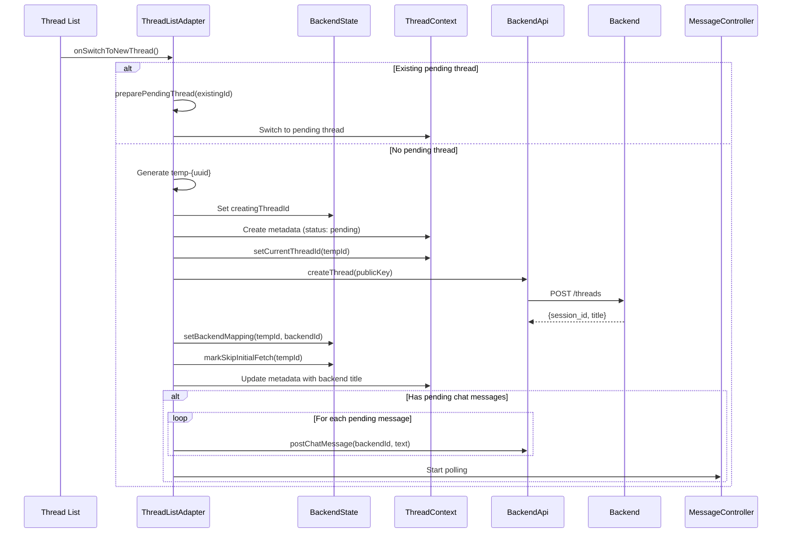
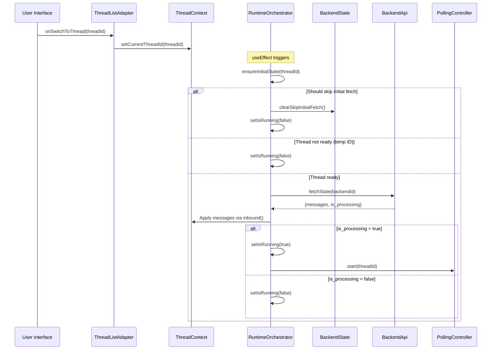
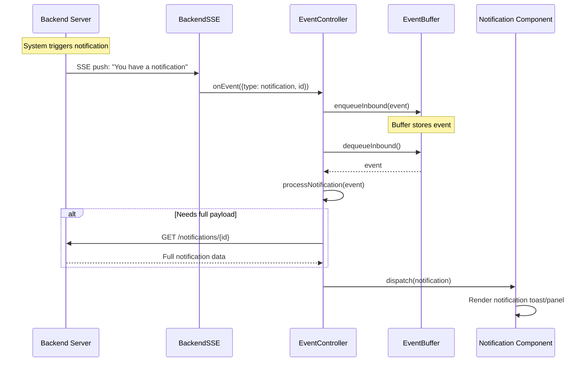
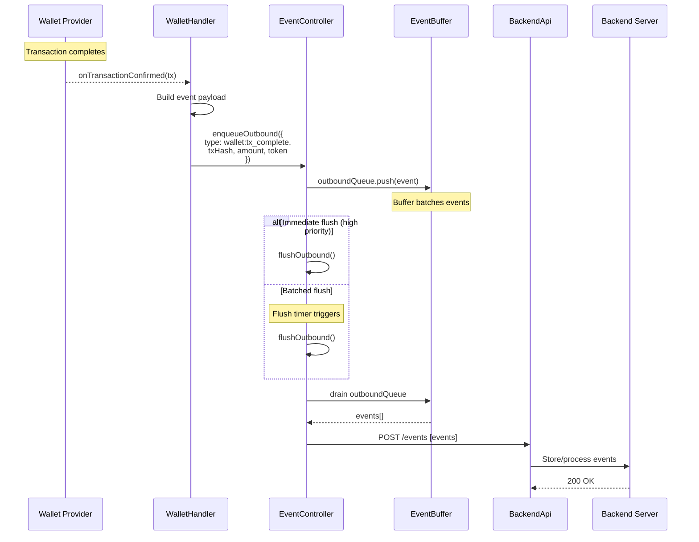
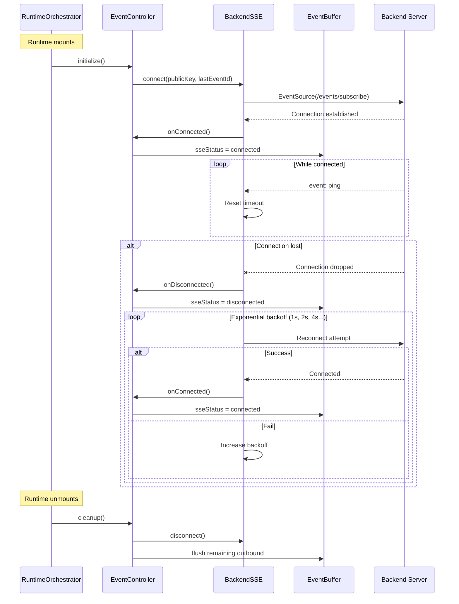
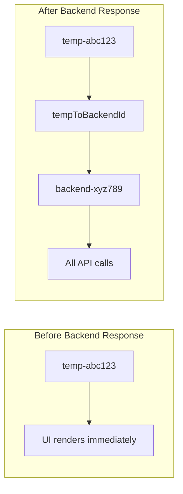

# Runtime Architecture

This document explains how the Aomi runtime system works, including component structure, state management, and message flow.

## Overview

The runtime is built on `@assistant-ui/react`'s external store pattern. It bridges React UI components with a backend chat API through a layered architecture of controllers and state managers.

---

## Component Structure

---

## State Architecture

### State Responsibilities

| State | Purpose | Reactivity |
|-------|---------|------------|
| `ThreadContext` | UI-facing thread/message data | Reactive (triggers re-renders) |
| `BackendState` | Backend sync coordination | Non-reactive (mutable ref) |
| `EventBuffer` | Inbound/outbound event queues | Non-reactive (mutable ref) |

---

## Message Flow - Outbound (User Sends Message)

---

## Message Flow - Inbound (Polling for Response)

---

## Thread Creation Flow

---

## Thread Switch Flow

---

## Event Flow - Inbound Notification (SSE)

---

## Event Flow - Outbound Wallet Event

---

## SSE Connection Lifecycle

---

## Key Components

### AomiRuntimeProvider

Main provider component that:
- Initializes the runtime orchestrator
- Connects to `@assistant-ui/react` via `useExternalStoreRuntime`
- Manages thread list operations (create, switch, rename, archive, delete)
- Subscribes to backend title updates

### RuntimeOrchestrator

Hook that creates and coordinates:
- `BackendApi` instance
- `BackendState` ref
- `MessageController` instance
- `PollingController` instance
- `ensureInitialState()` for loading thread data on switch

### MessageController

Handles all message operations:
- `outbound()` - Send user messages
- `outboundSystem()` - Send system messages
- `inbound()` - Process messages from backend
- `flushPendingChat()` / `flushPendingSystem()` - Send queued messages
- `cancel()` - Interrupt processing

### PollingController

Manages backend polling:
- `start(threadId)` - Begin polling at 500ms intervals
- `stop(threadId)` - Stop polling for a thread
- `stopAll()` - Stop all active polls
- Auto-stops when `is_processing` becomes false

### EventController

Manages bidirectional event streaming:
- `connect()` - Establish SSE connection to backend
- `disconnect()` - Close SSE connection
- `enqueueOutbound(event)` - Add event to outbound queue
- `flushOutbound()` - Send queued events to backend
- `processInbound()` - Dequeue and handle inbound events
- Handles auto-reconnect with exponential backoff

### WalletHandler

Hook for wallet integration:
- Listens to wallet provider events (tx confirm, connect, disconnect)
- Converts wallet events to outbound event format
- Enqueues events to EventBuffer via EventController

### BackendSSE

SSE client for real-time server events:
- Maintains persistent connection to `/events/subscribe`
- Parses SSE event types (notification, title_changed, etc.)
- Forwards events to EventController for buffering
- Supports `lastEventId` for resuming missed events

### EventBuffer

Non-reactive state for event streaming:

| Field | Type | Purpose |
|-------|------|---------|
| `inboundQueue` | Event[] | Buffered events from SSE |
| `outboundQueue` | Event[] | Buffered events to send |
| `sseStatus` | string | Connection status |
| `lastEventId` | string | For SSE resume |

### BackendState

Non-reactive state for backend coordination:

| Field | Type | Purpose |
|-------|------|---------|
| `tempToBackendId` | Map | Maps temporary UI IDs to real backend IDs |
| `skipInitialFetch` | Set | Threads that shouldn't fetch on switch |
| `pendingChat` | Map | User messages queued before thread ready |
| `pendingSystem` | Map | System messages queued before user message |
| `runningThreads` | Set | Threads currently processing |
| `creatingThreadId` | string | Thread being created |
| `createThreadPromise` | Promise | Active thread creation promise |

### ThreadContext

Reactive state for UI:

| Field | Type | Purpose |
|-------|------|---------|
| `currentThreadId` | string | Active thread |
| `threadMetadata` | Map | Title, status, lastActiveAt per thread |
| `threads` | Map | Messages per thread |
| `threadCnt` | number | Counter for "Chat N" naming |
| `threadViewKey` | number | Force re-render key |

---

## ID Resolution

The runtime uses temporary IDs (`temp-{uuid}`) for optimistic UI during thread creation:

The `resolveThreadId()` function always checks `tempToBackendId` first, allowing the UI to work with stable IDs while the backend uses its own IDs.

---

## Cleanup

On unmount, the runtime:
1. Calls `polling.stopAll()` to clear all intervals
2. Calls `eventController.cleanup()` to close SSE and flush outbound
3. React handles cleanup of refs and state

On thread delete:
1. Removes from `threadMetadata` and `threads`
2. Clears all backend state entries for that thread
3. Switches to another thread or creates a default
