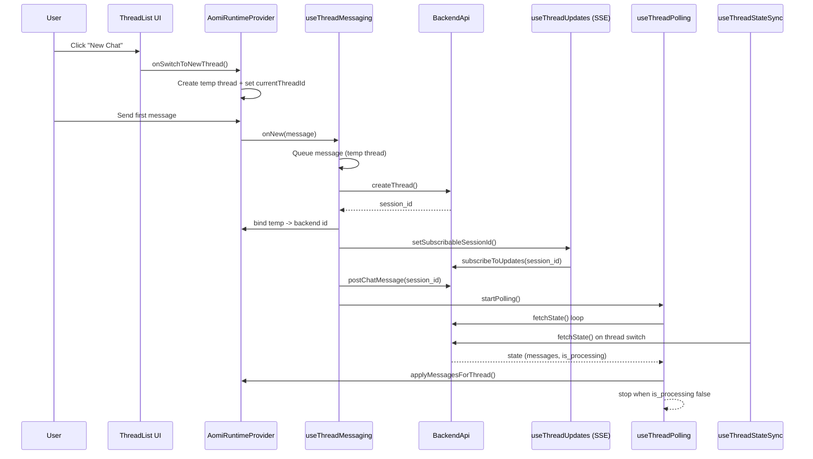

# Runtime Orchestration

This document explains how `AomiRuntimeProvider` composes runtime hooks and how the main flows work.

## Overview

`src/components/assistant-ui/runtime.tsx` is the orchestration layer. It:
- Pulls thread state from `useThreadContext()`.
- Creates shared refs (current thread id, pending queues, temp thread flags).
- Composes focused hooks in `src/hooks/runtime/`.
- Builds the Assistant UI runtime via `useExternalStoreRuntime()`.

## Hook Responsibilities

- `useBackendApi`: stable `BackendApi` ref, swapped on backend URL change.
- `useThreadIdMapping`: temp <-> backend id mapping and readiness checks.
- `useThreadMessageStore`: apply backend messages into thread state, skipping when user messages are queued.
- `useWalletTx`: wallet tx queue + notifications + post system updates.
- `useBackendSystemEvents`: parse backend system events and dispatch wallet tx or notifications.
- `useThreadPolling`: polling loop for `/api/state` when backend is processing.
- `useThreadUpdates`: SSE subscription + event drain for the active session.
- `useThreadMessaging`: send user/system messages, ensure backend session creation for temp threads.
- `useThreadStateSync`: fetch initial state on thread switch and set active subscription.
- `useThreadListSync`: fetch thread list for the current public key.
- `useThreadLifecycle`: thread list actions (new, switch, rename, archive, delete).
- `useThreadListAdapter`: data adapter for the thread list UI.

## Main Flow: New Chat -> First Message -> Backend Session

## Other Key Flows (Short Form)

**Thread switch**
1. User clicks a thread in the list.
2. `useThreadStateSync` fetches `/api/state` for that thread.
3. `useThreadUpdates` subscribes to SSE for that session.
4. `useThreadPolling` starts only if backend is processing.

**Wallet tx request**
1. Backend emits system event (`InlineDisplay` wallet_tx_request).
2. `useBackendSystemEvents` forwards to `useWalletTx`.
3. `useWalletTx` prompts wallet, posts system message with result, and refreshes state.

## Notes

- Temp threads allow immediate UI updates before backend session creation.
- Only the active thread is subscribed to SSE updates.
- Polling is used only while the backend reports `is_processing=true`.
