# Wallet And AA Flow Explainer

This document explains the auth adapter changes, transaction handling, Para AA,
Base Account AA, and what "unified AA" would mean later.

It is written for visual learners and for people new to TypeScript, React,
wagmi, and account abstraction.

## One Sentence Summary

The branch moves wallet logic behind a generic Aomi auth adapter so the UI can
ask one simple thing:

```ts
adapter.sendTransaction(payload)
```

without knowing whether the active wallet provider is Para, Base Account, or
something else.

## The Core Mental Model

The UI does not talk directly to Para or Base Account anymore.

It talks to an adapter.

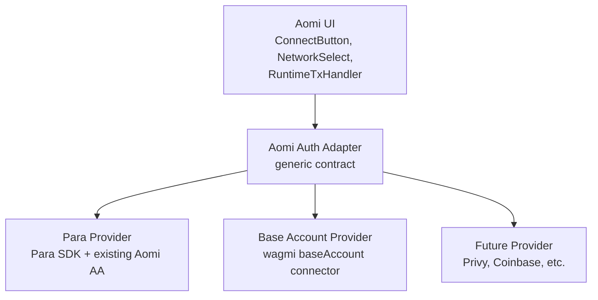

The important idea:

- UI components should be boring.
- Provider-specific code should live inside provider files.
- Transaction execution should return the same result shape no matter which
  provider handled it.

## What Changed On This Branch

Before this branch, `useAomiAuthAdapter()` was a large Para-shaped hook.
It knew about:

- Para account state
- Para modal behavior
- wagmi state
- transaction sending
- AA provider setup
- identity display labels

Now it is split into smaller pieces.

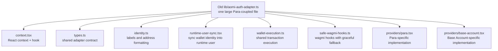

The old import path still exists:

```ts
export * from "./aomi-auth-adapter/index";
```

That is a compatibility trick. Existing code can keep importing from
`lib/aomi-auth-adapter`, but the implementation now lives in a folder.

## The Adapter Contract

The adapter is just a TypeScript shape. It says: "Any wallet provider must
provide these fields and functions."

Simplified:

```ts
type AomiAuthAdapter = {
  identity: {
    isConnected: boolean;
    address?: string;
    chainId?: number;
    primaryLabel: string;
  };

  canConnect: boolean;
  canManageAccount: boolean;

  connect: () => Promise<void>;
  manageAccount: () => Promise<void>;
  switchChain?: (chainId: number) => Promise<void>;

  sendTransaction?: (payload: WalletTxPayload) => Promise<AomiTxResult>;
  signTypedData?: (payload: WalletEip712Payload) => Promise<{ signature: string }>;
};
```

Visual version:

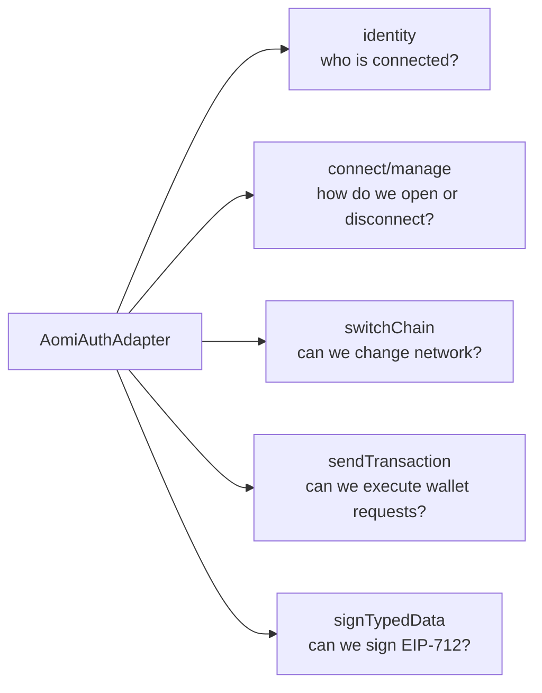

## Why Safe Wagmi Hooks Exist

wagmi hooks only work when there is a `WagmiProvider` above the component tree.

This can crash:

```ts
const account = useAccount();
```

if no `WagmiProvider` exists.

So provider plumbing uses safe wrappers:

```ts
const account = useSafeWagmiAccount();
```

The safe version catches provider setup errors and returns a disconnected
fallback.

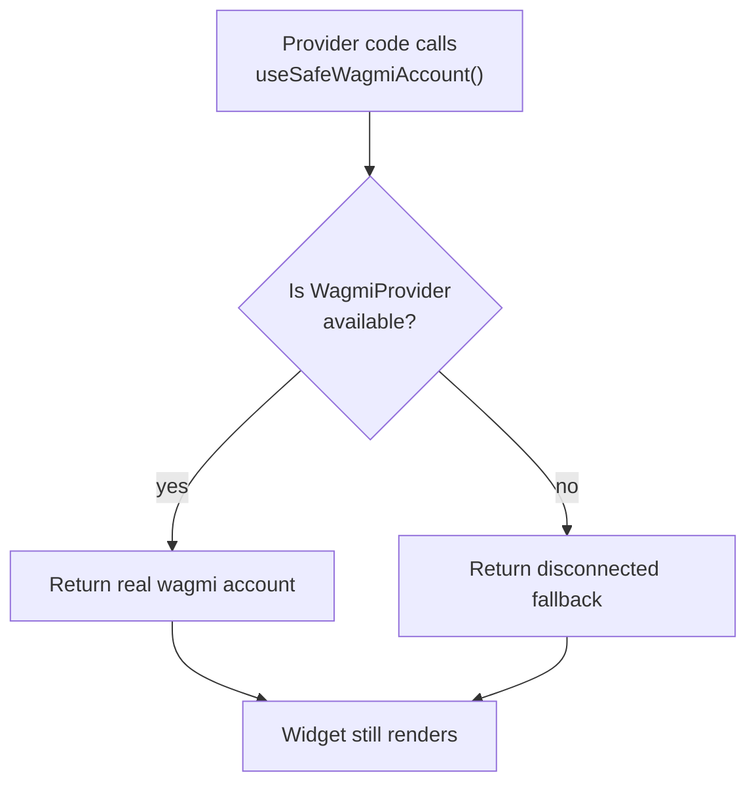

This is useful because the registry widget should not crash if someone installs
the UI but has not wired wallet providers yet.

## General Transaction Flow

The AI/backend does not directly call the wallet.

It creates a pending wallet request. The invisible React bridge
`RuntimeTxHandler` processes that request.

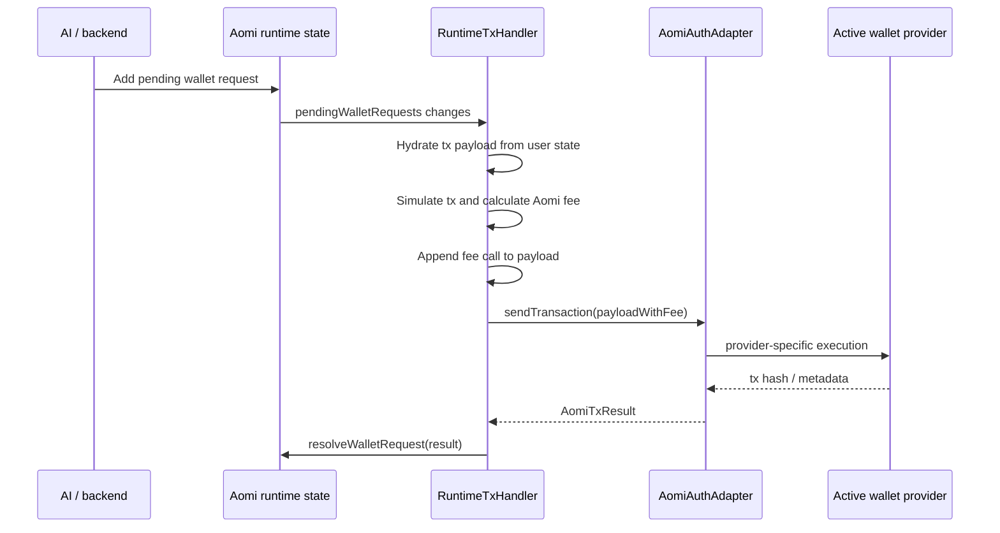

Important detail: `RuntimeTxHandler` is generic. It should not know whether the
active provider is Para or Base Account.

## RuntimeTxHandler As A Flowchart

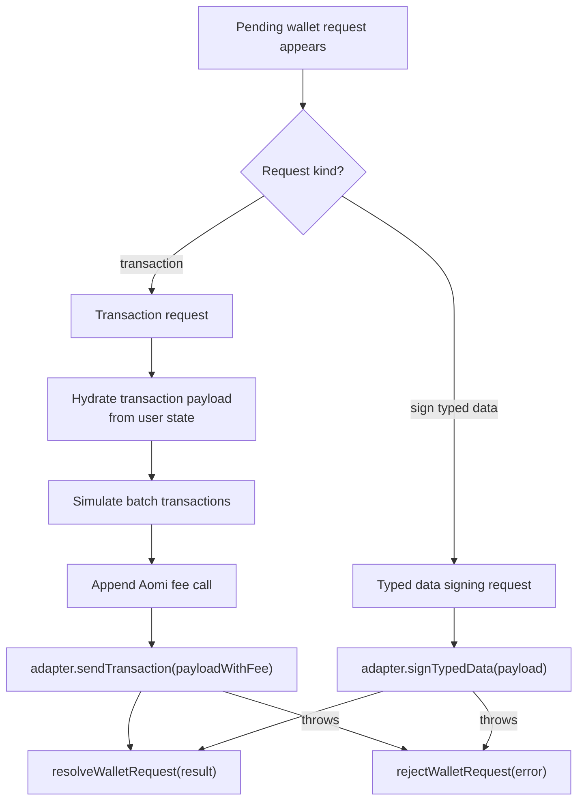

## What Is In AomiTxResult

```ts
export type AomiTxResult = {
  txHash: string;
  amount?: string;
  aaRequestedMode?: "4337" | "7702" | "none";
  aaResolvedMode?: "4337" | "7702" | "none";
  aaFallbackReason?: string;
  executionKind?: string;
  batched?: boolean;
  callCount?: number;
  sponsored?: boolean;
  smartAccountAddress?: string;
  delegationAddress?: string;
};
```

Beginner translation:

| Field | Meaning |
| --- | --- |
| `txHash` | The onchain transaction hash. This is the most important output. |
| `amount` | Optional original value from the payload. |
| `aaRequestedMode` | What kind of AA the app wanted. |
| `aaResolvedMode` | What actually happened. |
| `aaFallbackReason` | Why we fell back from AA to another route. |
| `executionKind` | Honest implementation detail, such as `wallet_sendTransaction`, `base_account_send_calls`, or `alchemy_4337`. |
| `batched` | Whether multiple calls were sent as one wallet operation. |
| `callCount` | Number of calls in the final call list. |
| `sponsored` | Whether gas sponsorship/paymaster was used. |
| `smartAccountAddress` | Address of the smart account, if known. |
| `delegationAddress` | EIP-7702 delegation address, if used. |

## Current Para Flow

Para currently has the richest Aomi AA path.

It can use Aomi's existing AA provider setup with Alchemy or Pimlico.

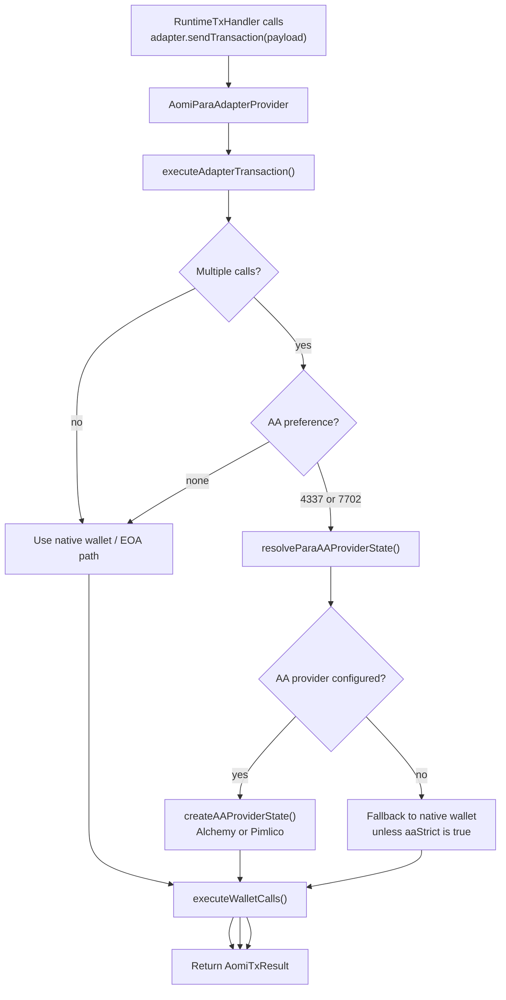

Para-specific responsibilities:

- Read Para account/session.
- Open Para connect/account modal.
- Infer identity label from Para auth methods.
- Create an AA provider state through Alchemy/Pimlico when requested.
- Support existing `4337` and `7702` attempts.

## Para AA Attempt Logic

When AA is requested, the shared execution helper decides which attempts to try.

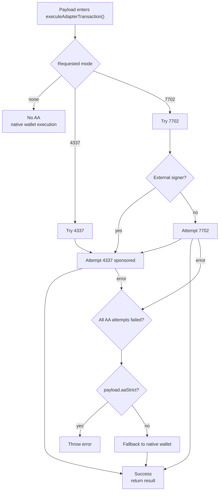

Plain English:

- If we do not need AA, use the normal wallet route.
- If the app asked for `4337`, try `4337`.
- If the app asked for `7702`, try `7702`, then `4337` as fallback.
- If AA fails and `aaStrict` is false, fall back to normal wallet execution.
- If AA fails and `aaStrict` is true, reject the request.

## Base Account If We Add Batching And Sponsorship Now

For Base Account, the recommended first implementation is Base-native AA:

- Batching through `wallet_sendCalls`.
- Sponsorship through `paymasterService` capability.
- No Para session.
- No `createAAProviderState()` yet.

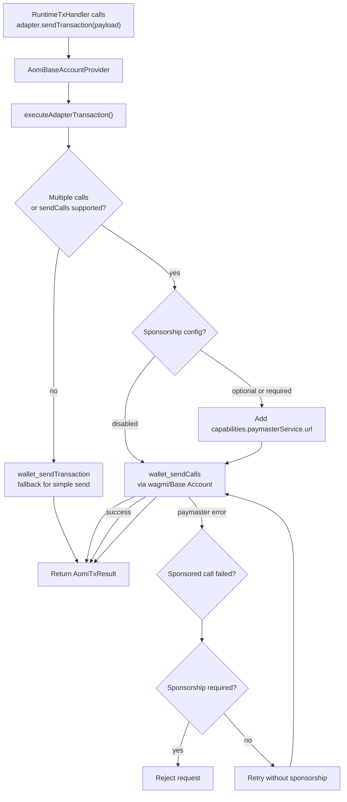

Suggested Base sponsorship config:

```ts
type BaseAccountSponsorshipMode = "disabled" | "optional" | "required";

type AomiBaseAccountProviderProps = {
  sponsorship?: {
    mode: BaseAccountSponsorshipMode;
    paymasterProxyUrl?: string;
  };
  batching?: {
    atomicRequired?: boolean;
  };
};
```

Behavior:

- `disabled`: no paymaster, but batching can still work.
- `optional`: try sponsored, retry unsponsored if sponsorship fails.
- `required`: try sponsored, reject if sponsorship fails.

Security rule:

Do not sponsor arbitrary AI-generated transactions just because the frontend
asks for sponsorship. The paymaster backend or CDP policy should allowlist
contracts and functions.

## Base Result Examples

Sponsored batched Base Account execution:

```ts
{
  txHash: "0x...",
  aaRequestedMode: "4337",
  aaResolvedMode: "4337",
  executionKind: "base_account_sponsored_send_calls",
  batched: true,
  callCount: 2,
  sponsored: true,
  smartAccountAddress: address,
}
```

Unsponsored batched Base Account execution:

```ts
{
  txHash: "0x...",
  aaRequestedMode: "4337",
  aaResolvedMode: "4337",
  executionKind: "base_account_send_calls",
  batched: true,
  callCount: 2,
  sponsored: false,
  smartAccountAddress: address,
}
```

Sponsorship optional, paymaster failed, fallback worked:

```ts
{
  txHash: "0x...",
  aaRequestedMode: "4337",
  aaResolvedMode: "4337",
  aaFallbackReason: "base_paymaster_failed_fallback_unsponsored",
  executionKind: "base_account_send_calls",
  batched: true,
  callCount: 2,
  sponsored: false,
  smartAccountAddress: address,
}
```

Note: using `4337` for Base Account is a practical fit with the current result
type, but it is not perfectly precise. A future type should distinguish
`eip5792` from Aomi's Alchemy/Pimlico `erc4337` route.

## What Unified AA Means Later

Unified AA should not mean every provider is forced through the same SDK.

It should mean:

1. The runtime asks the same adapter API.
2. Each provider reports what it supports.
3. Each provider chooses the best route internally.
4. All providers return one normalized result shape.

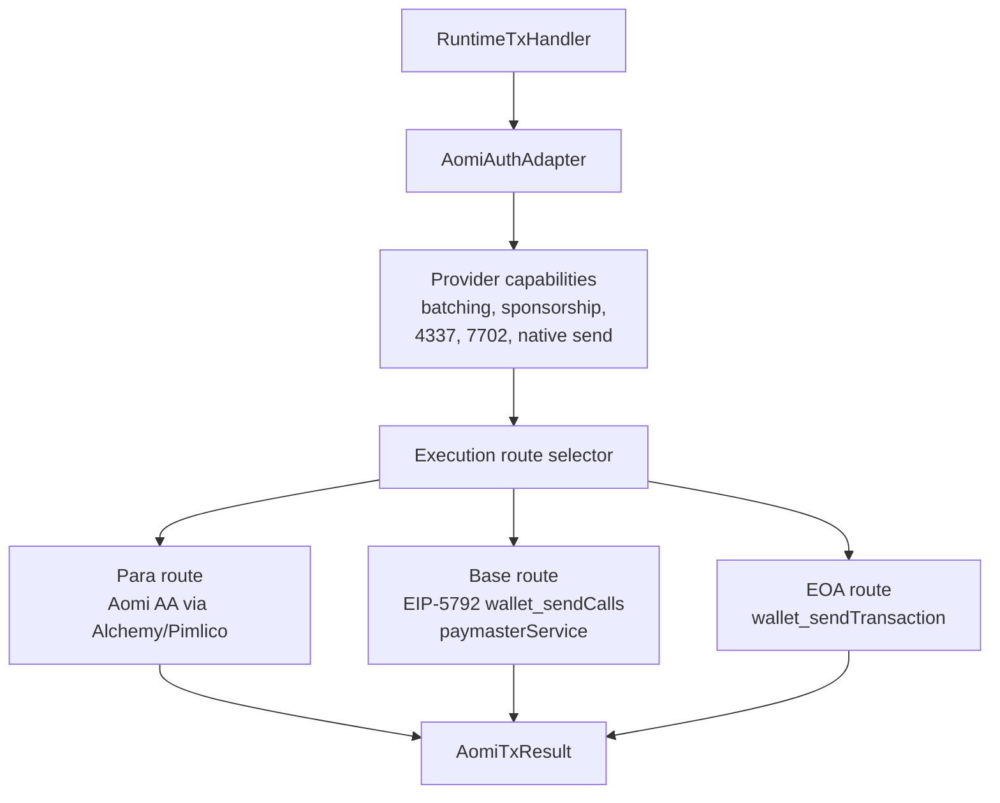

In a future unified model, the adapter could expose capabilities:

```ts
type AomiAuthAdapter = {
  identity: AomiAuthIdentity;

  capabilities: {
    nativeSend: boolean;
    batchCalls: boolean;
    sponsorship: boolean;
    erc4337: boolean;
    eip7702: boolean;
    eip5792: boolean;
    signTypedData: boolean;
  };

  sendTransaction: (payload: WalletTxPayload) => Promise<AomiTxResult>;
};
```

Provider examples:

| Provider | Native send | Batching | Sponsorship | 4337 | 7702 | EIP-5792 |
| --- | --- | --- | --- | --- | --- | --- |
| Para | yes | yes | depends on AA provider | yes | yes | maybe via wallet |
| Base Account | yes | yes | yes if paymaster configured | conceptually smart wallet | no for now | yes |
| Plain EOA | yes | usually no | no | no | no | maybe if wallet supports it |

## Future Result Type

The current result type works, but it mixes a few concepts.

Future-friendly shape:

```ts
type AomiAAProviderKind =
  | "aomi-aa"
  | "base-account"
  | "native-wallet";

type AomiAAExecutionRoute =
  | "erc4337"
  | "eip7702"
  | "eip5792"
  | "eoa";

type AomiTxResult = {
  txHash: string;
  amount?: string;

  aaProviderKind?: AomiAAProviderKind;
  aaRequestedRoute?: AomiAAExecutionRoute;
  aaResolvedRoute?: AomiAAExecutionRoute;
  aaFallbackReason?: string;

  executionKind?: string;
  batched?: boolean;
  callCount?: number;
  sponsored?: boolean;
  smartAccountAddress?: string;
  delegationAddress?: string;
};
```

Then Base can say:

```ts
{
  aaProviderKind: "base-account",
  aaResolvedRoute: "eip5792",
  sponsored: true,
  batched: true,
}
```

Para can say:

```ts
{
  aaProviderKind: "aomi-aa",
  aaResolvedRoute: "erc4337",
  sponsored: true,
  batched: true,
}
```

That is clearer than pretending every smart-wallet route is exactly the same.

## Should Base Use packages/client/src/aa/owner.ts?

Not yet.

That file is currently about creating Aomi-managed AA provider state. It is
Para-shaped today because it knows how to resolve a Para session owner.

Base Account already exposes smart-wallet behavior through wallet RPC methods,
so the first Base implementation should use that.

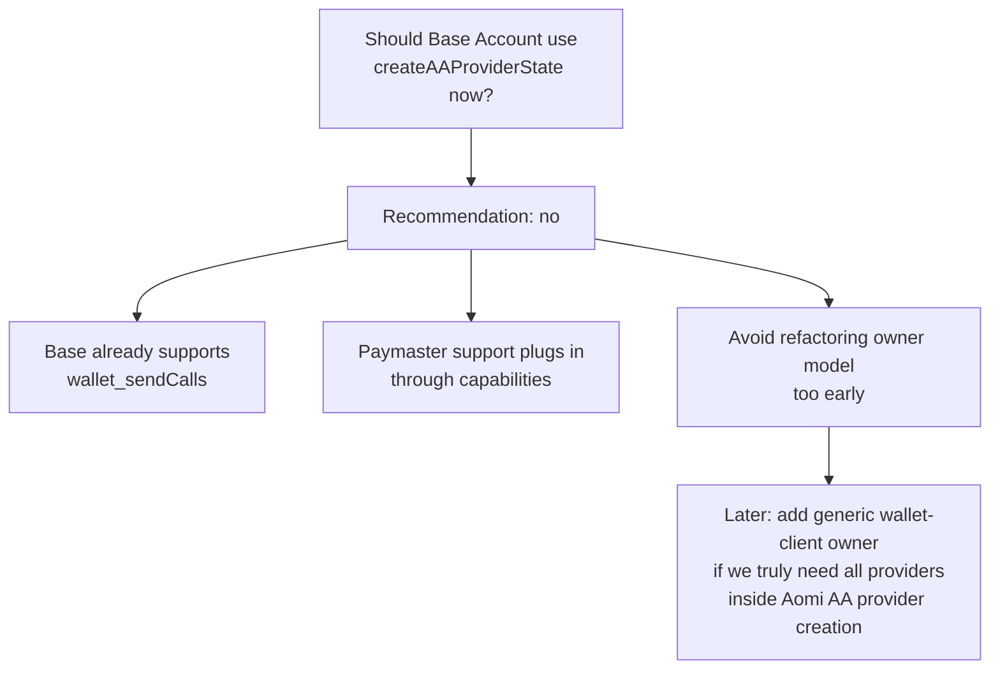

Later, if the team wants every provider to use Aomi's Alchemy/Pimlico account
creation path, then refactor the owner model:

```ts
type AAOwner =
  | { kind: "direct"; privateKey: Hex }
  | { kind: "para-session"; session: ParaWeb; signer?: WalletClient }
  | { kind: "wallet-client"; address: Hex; signer: WalletClient };
```

That is a larger project than adding Base batching and sponsorship.

## How To Explain This In A Review

Short review explanation:

> This branch decouples wallet UI from Para by introducing a generic auth
> adapter. Para remains the default provider and keeps the current Aomi
> Alchemy/Pimlico AA path. Base Account can be added as another provider using
> Base-native `wallet_sendCalls` for batching and `paymasterService` for
> sponsorship. The runtime keeps calling the same adapter API either way.

If someone asks whether Base Account is "real AA":

> Yes, but it is Base-native smart-wallet execution through EIP-5792 wallet
> calls, not our Para-backed Aomi AA provider creation path.

If someone asks why not unify everything immediately:

> The clean first step is to unify the adapter API and result shape. Forcing
> Base through the Para-shaped owner model now would create a larger refactor
> before we need it.

If someone asks about sponsoring AI-generated transactions:

> The frontend only requests sponsorship. The paymaster proxy and CDP allowlist
> must enforce which contracts and functions can actually be sponsored.

## Recommended Implementation Order

1. Finish the adapter split and make sure Para still works.
2. Add Base Account connection and native send.
3. Add Base Account batching through `wallet_sendCalls`.
4. Add Base Account sponsorship through `paymasterService`.
5. Add explicit metadata in `AomiTxResult.executionKind`.
6. Add capability reporting to the adapter.
7. Later, evolve result fields from `4337 | 7702 | none` to route names like
   `erc4337 | eip7702 | eip5792 | eoa`.
8. Much later, refactor `packages/client/src/aa/owner.ts` if the team wants
   all providers to use Aomi-managed AA account creation.

## Tiny Glossary

| Term | Meaning |
| --- | --- |
| EOA | A normal wallet account controlled by a private key or wallet app. |
| AA | Account abstraction. Smart-wallet style execution with features like batching and sponsorship. |
| ERC-4337 | Smart account standard using UserOperations and bundlers. |
| EIP-7702 | Lets an EOA temporarily behave more like a smart account through delegation. |
| EIP-5792 | Wallet RPC methods like `wallet_sendCalls` for sending multiple calls. |
| Paymaster | Service that can pay gas for eligible user operations/calls. |
| Sponsorship | App pays gas for the user, usually through a paymaster. |
| Batching | Multiple onchain calls submitted as one wallet operation. |
| wagmi | React hooks for wallets, chains, signing, and transactions. |
| Adapter | Our generic wrapper that hides provider-specific details from the UI. |

## Layer Map: Registry vs React vs Client

There are three major code areas involved.

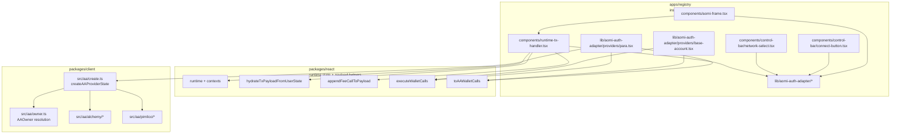

Short version:

- `apps/registry` owns the widget UI and provider adapters.
- `packages/react` owns runtime state, pending wallet requests, and shared
  transaction execution helpers.
- `packages/client` owns Aomi AA provider creation with Alchemy/Pimlico.

Base Account, in the recommended first pass, stays mostly in `apps/registry`
plus shared helpers from `packages/react`. It does not need
`packages/client/src/aa/owner.ts` yet.

## Past State Before This Branch

Before this branch, `apps/registry/src/lib/aomi-auth-adapter.ts` did almost
everything in one file.

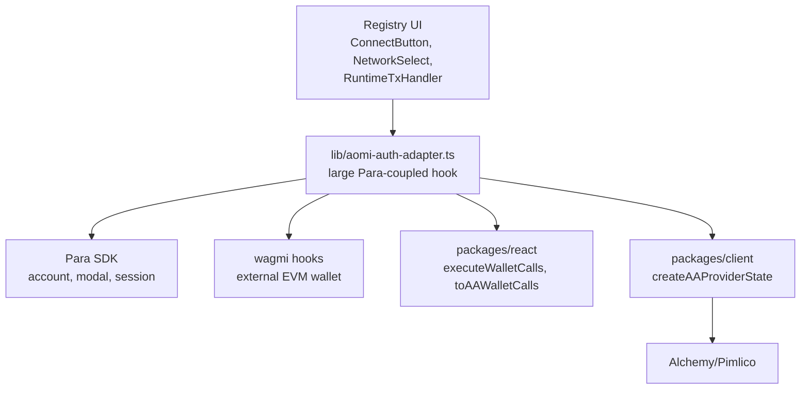

What was coupled in that file:

- account identity
- connect/manage modal behavior
- wagmi transaction sending
- Para session handling
- AA owner creation

This made Para the implicit default and the implicit AA path.

## Current Branch State

The branch splits generic code from provider-specific code.

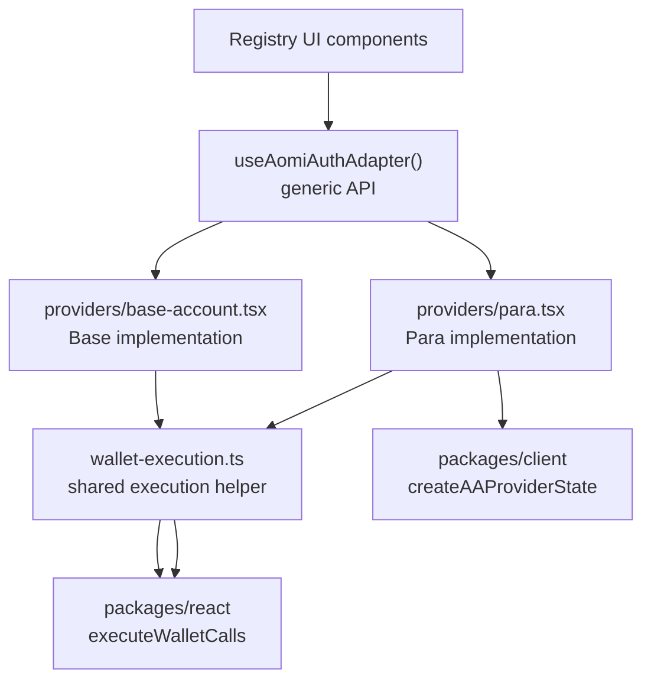

Important:

- The UI is provider-agnostic.
- Para provider still knows Para.
- Base provider still knows Base Account.
- `packages/client` is only needed for the Para Aomi AA path right now.

## Connection Timeline: Past Para-Only Shape

This is roughly how connect worked before the split.

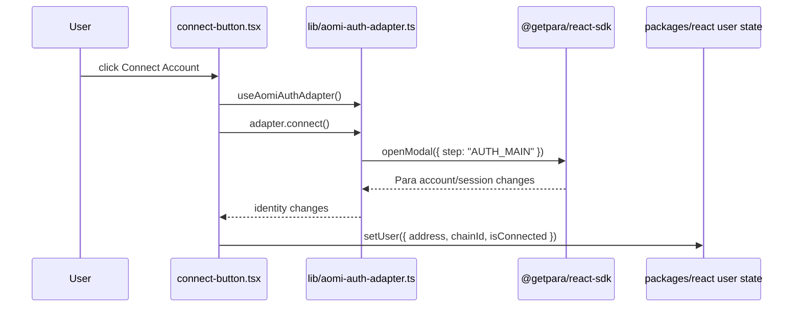

Notice the old issue: `ConnectButton` was also syncing runtime user state. If
the button was hidden or replaced, runtime user state could become stale.

## Connection Timeline: Current Branch With Adapter Split

Now connection state sync lives in `AomiAuthRuntimeUserSync`, mounted from
`AomiFrame.Root`.

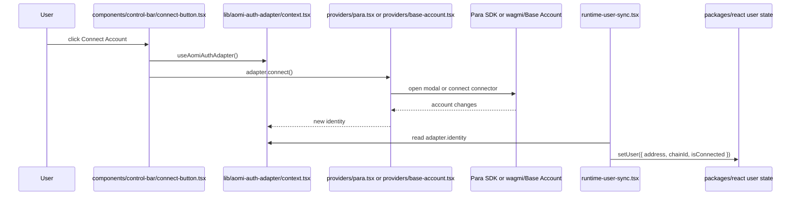

Provider-specific detail:

- Para connect calls Para modal.
- Base Account connect calls wagmi `connectAsync()` with the Base Account
  connector.

The UI button does not care.

## Para Connection Timeline: Current Branch

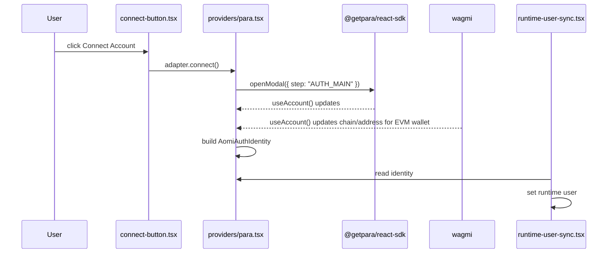

Para provider consumes:

- Para SDK hooks
- wagmi hooks
- identity helpers
- adapter context

Para provider can also consume `packages/client` later during transaction
execution, but not just to connect.

## Base Connection Timeline: Current Branch

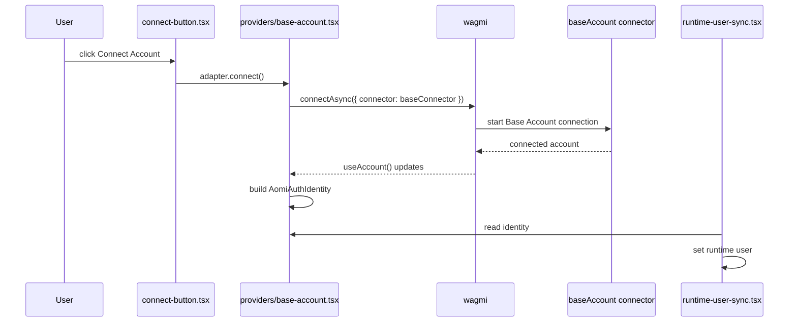

Base provider consumes:

- wagmi `WagmiProvider`
- wagmi `baseAccount` connector
- adapter context
- shared transaction helpers later

Base does not need `packages/client/src/aa/owner.ts` for connection.

## Transaction Timeline: Past Para-Coupled Shape

Before the split, the tx bridge called the large `aomi-auth-adapter.ts`, which
held Para and AA logic directly.

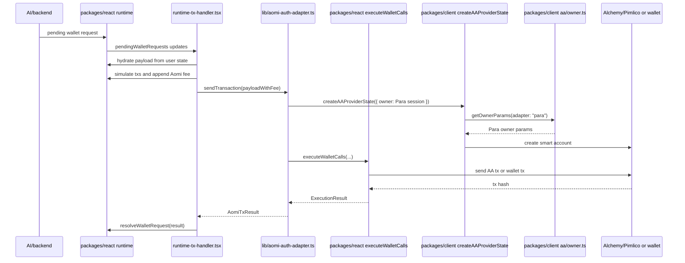

The important coupling:

- `BigAdapter` knew Para.
- `packages/client/src/aa/owner.ts` knew only Para session adapters.

## Transaction Timeline: Current Para AA

On the current branch, `RuntimeTxHandler` is generic, but Para provider still
owns the Para-specific AA setup.

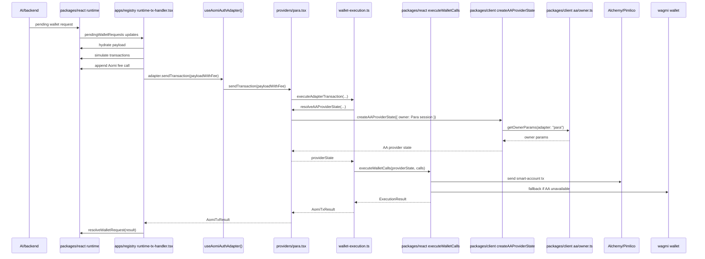

Where `packages/client` is involved:

- `providers/para.tsx` imports `createAAProviderState`.
- `createAAProviderState` dispatches to Alchemy/Pimlico.
- `aa/owner.ts` resolves the Para session owner.

Where `packages/react` is involved:

- `RuntimeTxHandler` reads runtime state.
- `RuntimeTxHandler` hydrates/simulates/appends fee through runtime helpers.
- `wallet-execution.ts` calls `executeWalletCalls`.

## Transaction Timeline: Base Account Without Sponsorship

Base Account can execute through wagmi and wallet RPCs without going into
`packages/client` AA owner creation.

```mermaid
sequenceDiagram
  participant Backend as AI/backend
  participant Runtime as packages/react runtime
  participant Handler as runtime-tx-handler.tsx
  participant Adapter as useAomiAuthAdapter()
  participant BaseProvider as providers/base-account.tsx
  participant WalletExec as wallet-execution.ts
  participant ReactExec as packages/react executeWalletCalls
  participant Wagmi as wagmi
  participant BaseWallet as Base Account wallet

  Backend->>Runtime: pending wallet request
  Runtime->>Handler: pendingWalletRequests updates
  Handler->>Runtime: hydrate payload
  Handler->>Runtime: simulate transactions
  Handler->>Runtime: append Aomi fee call
  Handler->>Adapter: adapter.sendTransaction(payloadWithFee)
  Adapter->>BaseProvider: sendTransaction(payloadWithFee)
  BaseProvider->>WalletExec: executeAdapterTransaction(...)
  WalletExec->>ReactExec: executeWalletCalls(DISABLED_PROVIDER_STATE, calls)
  ReactExec->>Wagmi: sendCallsSyncAsync or sendTransactionAsync
  Wagmi->>BaseWallet: wallet_sendCalls or wallet_sendTransaction
  BaseWallet-->>Wagmi: tx hash
  Wagmi-->>ReactExec: result
  ReactExec-->>WalletExec: ExecutionResult
  WalletExec-->>BaseProvider: AomiTxResult
  BaseProvider-->>Handler: AomiTxResult
  Handler->>Runtime: resolveWalletRequest(result)
```

Where `packages/client` is involved:

- Not involved for the recommended first Base Account path.

Where `packages/react` is involved:

- Runtime state and tx request handling.
- Shared conversion/execution helpers.

## Transaction Timeline: Base Account With Sponsorship Later

When adding Base sponsorship, the timeline stays almost the same. The main new
thing is that Base provider passes paymaster capabilities into the
`wallet_sendCalls` call.

```mermaid
sequenceDiagram
  participant Handler as runtime-tx-handler.tsx
  participant BaseProvider as providers/base-account.tsx
  participant WalletExec as wallet-execution.ts
  participant ReactExec as packages/react executeWalletCalls
  participant Wagmi as wagmi sendCalls
  participant BaseWallet as Base Account wallet
  participant Paymaster as Paymaster proxy/CDP policy

  Handler->>BaseProvider: adapter.sendTransaction(payloadWithFee)
  BaseProvider->>BaseProvider: read sponsorship config
  BaseProvider->>WalletExec: executeAdapterTransaction({ paymaster capability })
  WalletExec->>ReactExec: executeWalletCalls(...)
  ReactExec->>Wagmi: sendCallsSyncAsync({ calls, capabilities })
  Wagmi->>BaseWallet: wallet_sendCalls + paymasterService
  BaseWallet->>Paymaster: ask if gas can be sponsored
  Paymaster-->>BaseWallet: approved or rejected
  BaseWallet-->>Wagmi: tx hash or error
  Wagmi-->>ReactExec: result
  ReactExec-->>WalletExec: ExecutionResult
  WalletExec-->>BaseProvider: AomiTxResult with sponsored true/false
```

Optional sponsorship fallback:

```mermaid
flowchart TD
  Start["Base sponsored sendCalls"]
  Success["Success<br/>sponsored: true"]
  Fail["Paymaster failed"]
  Mode{"sponsorship mode"}
  Required["required<br/>reject request"]
  Optional["optional<br/>retry without sponsorship"]
  Unsponsored["Success<br/>sponsored: false<br/>fallback reason set"]

  Start -->|success| Success
  Start -->|error| Fail --> Mode
  Mode --> Required
  Mode --> Optional --> Unsponsored
```

## Unified vs Not Unified: File-Level Meaning

Not unified means higher layers or shared logic need to know provider-specific
details.

Bad future shape:

```mermaid
flowchart TD
  Handler["runtime-tx-handler.tsx"]
  Ifs["if provider is Para<br/>if provider is Base<br/>if provider is X"]
  Para["do Para AA"]
  Base["do Base AA"]
  Result["result"]

  Handler --> Ifs
  Ifs --> Para --> Result
  Ifs --> Base --> Result
```

Unified means provider-specific details stay inside provider files.

Good shape:

```mermaid
flowchart TD
  Handler["runtime-tx-handler.tsx<br/>generic"]
  Adapter["adapter.sendTransaction(payload)"]
  ParaFile["providers/para.tsx<br/>Para-specific"]
  BaseFile["providers/base-account.tsx<br/>Base-specific"]
  Result["AomiTxResult<br/>same shape"]

  Handler --> Adapter
  Adapter --> ParaFile --> Result
  Adapter --> BaseFile --> Result
```

The key rule:

> RuntimeTxHandler should not grow provider-specific branches.

It should never become:

```ts
if (provider === "para") {
  // Para AA
} else if (provider === "base") {
  // Base sponsorship
}
```

It should stay:

```ts
const result = await adapter.sendTransaction(payload);
```

## Unified AA Today vs Future Unified AA

The current branch is partially unified.

```mermaid
flowchart TD
  UI["UI/runtime layer"]
  Generic["Generic adapter API"]
  ParaOnlyAA["Only mature Aomi AA path is Para-shaped"]
  BaseNative["Base provider can be added<br/>with native wallet execution"]

  UI --> Generic
  Generic --> ParaOnlyAA
  Generic --> BaseNative
```

Current branch gives us:

- unified UI calls
- unified connection API
- unified transaction method name
- shared `AomiTxResult`

It does not yet give us:

- one provider-agnostic AA owner model
- capability-based route selection
- precise result routes like `erc4337`, `eip7702`, `eip5792`, `eoa`

Future unified AA adds those.

```mermaid
flowchart TD
  Handler["RuntimeTxHandler"]
  Adapter["AomiAuthAdapter"]
  Caps["adapter.capabilities"]
  Route["Route selection"]
  ParaRoute["Para route<br/>erc4337/eip7702 via packages/client"]
  BaseRoute["Base route<br/>eip5792 via wallet_sendCalls"]
  EOARoute["EOA route<br/>wallet_sendTransaction"]
  Result["Expanded AomiTxResult"]

  Handler --> Adapter --> Caps --> Route
  Route --> ParaRoute --> Result
  Route --> BaseRoute --> Result
  Route --> EOARoute --> Result
```

## Who Consumes Whom

### Connection

```mermaid
flowchart LR
  Button["connect-button.tsx"]
  Hook["useAomiAuthAdapter"]
  Provider["Para or Base provider"]
  WalletSDK["Para SDK or wagmi"]
  Sync["runtime-user-sync.tsx"]
  UserState["packages/react user state"]

  Button --> Hook
  Hook --> Provider
  Provider --> WalletSDK
  Sync --> Hook
  Sync --> UserState
```

### Transaction

```mermaid
flowchart LR
  Handler["runtime-tx-handler.tsx"]
  Runtime["packages/react runtime"]
  Hook["useAomiAuthAdapter"]
  Provider["Para or Base provider"]
  WalletExec["wallet-execution.ts"]
  ReactExec["packages/react executeWalletCalls"]
  ClientAA["packages/client AA<br/>Para only for now"]
  Wallet["Wallet / AA provider"]

  Handler --> Runtime
  Handler --> Hook
  Hook --> Provider
  Provider --> WalletExec
  WalletExec --> ReactExec
  Provider -. "Para AA only" .-> ClientAA
  ClientAA -. "Alchemy/Pimlico" .-> Wallet
  ReactExec --> Wallet
```

## Why We Are Not Changing packages/react First

Han's direction was to avoid modifying `packages/react` unless there is a
strong reason.

That makes sense because the main problem is currently in the registry boundary:

- registry components were dragging Para-specific dependencies
- registry auth adapter was Para-coupled
- provider choices were not separated

So this PR should mostly change:

```txt
apps/registry
```

and only use existing shared helpers from:

```txt
packages/react
packages/client
```

Future unified AA might need deeper changes, but Base connection and Base-native
batching/sponsorship do not require starting there.
