# Wallet Adapter Architecture

This document describes the current widget wallet adapter architecture. It
covers the registry wallet kit, provider implementations, runtime transaction
bridge, and client AA executor.

**Last Updated:** 2026-05-03

---

## Overview

The widget wallet layer is provider-based. UI components consume a single
`AomiWalletKit` interface from context, while wallet-specific providers own
connection, identity, signing, transaction submission, and account-abstraction
details.

The current architecture supports:

- Para-backed auth through `AomiParaPluginProvider` / `AomiParaProvider`.
- Base Account auth through `AomiBaseAccountProvider`.
- Provider-neutral runtime user sync through `AomiWalletKitSync`.
- Provider-neutral transaction routing through `executeWalletKitTransaction`.
- Client-side execution through `executeWalletCalls`, including smart-account
  execution, native wallet `wallet_sendCalls`, atomic batching, paymaster
  sponsorship, and native fallback rules.

The UI layer is intentionally provider-agnostic. The active provider supplies
the adapter, and the widget reads only the shared adapter contract.

---

## Design Goals

### Provider isolation

Each wallet family owns its connection details. Para-specific SDK state stays in
the Para provider. Base Account connector state stays in the Base Account
provider. Shared UI components consume only `AomiWalletKit`.

### Runtime user-state consistency

Wallet identity is synchronized from the active adapter inside `AomiFrame.Root`.
The runtime no longer depends on `ConnectButton` being mounted in order to keep
`useUser()` current.

### Shared transaction orchestration

Transaction payload conversion, AA attempt ordering, native wallet fallback, and
result metadata formatting are centralized in `wallet-execution.ts`.

### Fallback and sponsorship semantics

AA-preferring batches first try the configured Para AA paths, then preserve the
`origin/main` native fallback for unresolved AA provider setup. Strict AA still
fails closed when a resolved AA execution path fails and no unresolved-provider
fallback path remains. Required sponsorship also fails closed and never silently
downgrades to user-paid sequential sends. Native atomic batching is optional by
default and only becomes fail-closed when `requiresAtomicForBatch` is set by the
execution policy, including required sponsored batch execution.

### Modular registry installation

The shadcn registry exposes the generic wallet kit, Para provider, Base
Account provider, runtime transaction handler, control bar, and frame as
separate installable units.

---

## Architecture Transition

### Legacy Para-shaped adapter hook

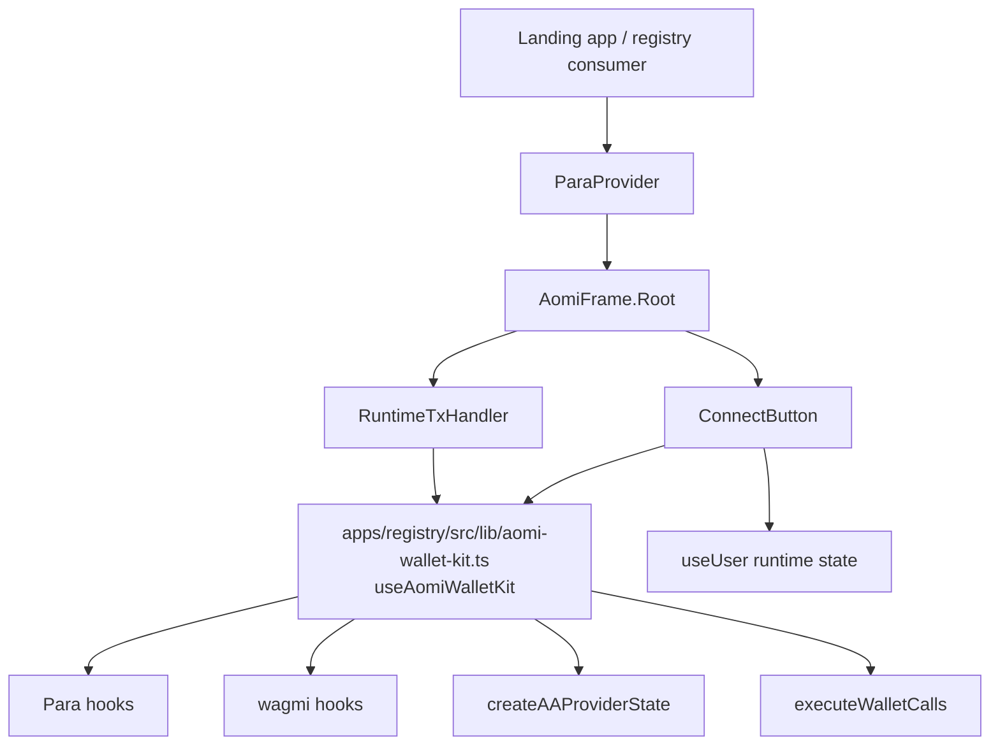

In the previous model, `ConnectButton` synchronized runtime user state and the
adapter was a hook rather than a provider-supplied context value.

### Current adapter context and providers

```mermaid
graph TD
  App["App / registry consumer"]
  ProviderChoice{"Wallet provider mounted by app"}
  ParaProvider["AomiParaProvider<br/>or AomiParaPluginProvider"]
  BaseProvider["AomiBaseAccountProvider"]
  AdapterContext["AomiWalletKitContext"]
  AomiFrame["AomiFrame.Root"]
  UserSync["AomiWalletKitSync"]
  ConnectButton["ConnectButton"]
  NetworkSelect["NetworkSelect"]
  RuntimeTxHandler["RuntimeTxHandler"]
  SharedExecution["executeWalletKitTransaction"]
  ClientExecution["executeWalletCalls"]
  RuntimeUser["useUser runtime state"]

  App --> ProviderChoice
  ProviderChoice --> ParaProvider
  ProviderChoice --> BaseProvider
  ParaProvider --> AdapterContext
  BaseProvider --> AdapterContext
  App --> AomiFrame
  AomiFrame --> UserSync
  AomiFrame --> RuntimeTxHandler
  ConnectButton --> AdapterContext
  NetworkSelect --> AdapterContext
  UserSync --> AdapterContext
  UserSync --> RuntimeUser
  RuntimeTxHandler --> AdapterContext
  RuntimeTxHandler --> SharedExecution
  SharedExecution --> ClientExecution
```

---

## Implementation Layout

### Wallet kit core

| File                                                            | Responsibility                                                                                                             |
| --------------------------------------------------------------- | -------------------------------------------------------------------------------------------------------------------------- |
| `apps/registry/src/lib/aomi-wallet-kit.ts`                    | Compatibility re-export shim to the adapter directory. Existing imports keep working.                                      |
| `apps/registry/src/lib/aomi-wallet-kit/context.tsx`           | Adds `AomiWalletKitContextProvider` and `useAomiWalletKit` context hook.                                                      |
| `apps/registry/src/lib/aomi-wallet-kit/types.ts`              | Adds the shared adapter, identity, and transaction-result interfaces.                                                      |
| `apps/registry/src/lib/aomi-wallet-kit/identity.ts`           | Moves identity constants and formatting helpers into the adapter module. Adds `baseAccount` label support.                 |
| `apps/registry/src/lib/aomi-wallet-kit/runtime-user-sync.tsx` | Adds the runtime user-state sync component now mounted by `AomiFrame.Root`.                                                |
| `apps/registry/src/lib/aomi-wallet-kit/safe-wagmi-hooks.ts`   | Extracts safe wagmi hook wrappers and adds connect/disconnect/connectors helpers plus extended `sendCallsSync` forwarding. |
| `apps/registry/src/lib/aomi-wallet-kit/wallet-execution.ts`   | Adds shared transaction execution orchestration used by provider implementations.                                          |

### Provider implementations

| File                                                                 | Responsibility                                                                                                                              |
| -------------------------------------------------------------------- | ------------------------------------------------------------------------------------------------------------------------------------------- |
| `apps/registry/src/lib/aomi-wallet-kit/providers/para.tsx`         | Para implementation with `AomiParaProvider` / `AomiParaPluginProvider`.                                                                    |
| `apps/registry/src/lib/aomi-wallet-kit/providers/base-account.tsx` | Adds Base Account provider with wagmi `baseAccount` connector, connect/disconnect, signing, transaction execution, and sponsorship options. |
| `apps/landing/app/components/landing-para-provider.tsx`              | Wraps the existing demo Para setup in `AomiParaPluginProvider`, so the landing demo uses the adapter context.                              |

### Widget components

| File                                                          | Responsibility                                                                                                                    |
| ------------------------------------------------------------- | --------------------------------------------------------------------------------------------------------------------------------- |
| `apps/registry/src/components/aomi-frame.tsx`                 | Mounts `AomiWalletKitSync` inside `AomiFrame.Root`.                                                                         |
| `apps/registry/src/components/control-bar/connect-button.tsx` | Removes direct `useUser` sync, respects `adapter.canConnect` / `adapter.canManageAccount`, and only delegates to adapter actions. |
| `apps/registry/src/components/control-bar/network-select.tsx` | Allows provider-specific supported chain lists via `adapter.supportedChains`.                                                     |
| `apps/registry/src/components/runtime-tx-handler.tsx`         | Routes runtime transaction and signing requests through the active adapter.                                                       |

### Client AA execution

| File                                                       | Responsibility                                                                                                                                                                            |
| ---------------------------------------------------------- | ----------------------------------------------------------------------------------------------------------------------------------------------------------------------------------------- |
| `packages/client/src/aa/types.ts`                          | Adds `WalletCapabilities`, `NativeWalletExecutionPolicy`, `NativeWalletSponsorship`, `SponsorshipPaymasterServiceContext`; extends `AtomicBatchArgs`; extends `ExecuteWalletCallsParams`. |
| `packages/client/src/aa/execute.ts`                        | Adds wallet-native send-calls planning, paymaster service support, required atomic behavior, sponsorship fail-closed behavior, debug logging, and safer receipt extraction.               |
| `packages/client/src/aa/index.ts`                          | Re-exports AA/native wallet types.                                                                                                                                                        |
| `packages/client/src/index.ts`                             | Re-exports AA/native wallet types from the package root.                                                                                                                                  |
| `packages/react/src/index.ts`                              | Re-exports client types through `@aomi-labs/react`.                                                                                                                                       |
| `packages/client/test/aa/aa-eoa-capabilities.unit.test.ts` | Adds focused tests for EOA/native wallet capabilities, atomic behavior, paymaster behavior, and fail-closed paths.                                                                        |

### Registry and generated artifacts

| File                            | Responsibility                                                                                                               |
| ------------------------------- | ---------------------------------------------------------------------------------------------------------------------------- |
| `apps/registry/src/registry.ts` | Adds registry entries for `aomi-wallet-kit`, `aomi-para-provider`, and `aomi-base-account-provider`; updates dependencies. |
| `apps/registry/dist/*.json`     | Regenerated registry output reflecting the current component/provider graph.                                                 |
| `packages/client/package.json`  | Bumps client package version from `0.1.31` to `0.1.32`.                                                                      |
| `packages/react/package.json`   | Bumps React package version from `0.3.14` to `0.3.15`.                                                                       |
| `apps/registry/package.json`    | Bumps widget registry package version from `1.2.10` to `1.2.11`.                                                             |
| `packages/client/dist/*`        | Built client artifacts updated to match source changes.                                                                      |
| `packages/react/dist/*`         | React package declaration/source map artifacts updated to match source changes.                                              |
| `apps/landing/tsconfig.json`    | Adds local path aliases for `@aomi-labs/client` so the landing app can consume workspace source during dev.                  |

---

## Layer Model

The widget now has three layers:

1. Adapter interface: "what the widget needs from a wallet."
2. Provider implementation: "how a wallet family actually connects/signs/sends."
3. Execution core: "how a wallet transaction request becomes on-chain tx hashes."

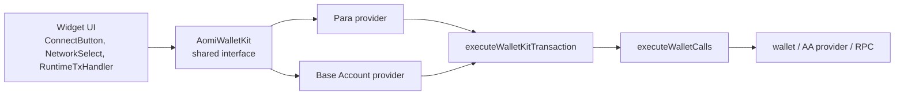

---

## Core Interfaces

### `AomiWalletKit`

Defined in `apps/registry/src/lib/aomi-wallet-kit/types.ts`.

This is the shared contract the widget consumes.

```ts
export type AomiWalletKit = {
  identity: AomiSessionIdentity;
  isReady: boolean;
  isSwitchingChain: boolean;

  canConnect: boolean;
  canManageAccount: boolean;

  supportedChains?: readonly Chain[];

  connect: () => Promise<void>;
  manageAccount: () => Promise<void>;
  disconnect?: () => Promise<void>;

  switchChain?: (chainId: number) => Promise<void>;

  sendTransaction?: (payload: WalletTxPayload) => Promise<AomiTxResult>;
  signTypedData?: (
    payload: WalletEip712Payload,
  ) => Promise<{ signature: string }>;
};
```

Behavior:

- `identity` is what the UI displays and what runtime user state syncs from.
- `canConnect` and `canManageAccount` let the button disable itself when actions are unavailable.
- `supportedChains` lets `NetworkSelect` show the provider-specific chain list.
- `connect`, `manageAccount`, `disconnect`, `switchChain`, `sendTransaction`, and `signTypedData` are provider-specific behavior hidden behind one widget-facing API.

### `AomiTxResult`

Defined in `apps/registry/src/lib/aomi-wallet-kit/types.ts`.

This is what adapter transaction execution returns to the runtime request resolver.

```ts
export type AomiTxResult = {
  txHash: string;
  amount?: string;
  aaRequestedMode?: "4337" | "7702" | "none";
  aaResolvedMode?: "4337" | "7702" | "none";
  aaFallbackReason?: string;
  executionKind?: string;
  batched?: boolean;
  callCount?: number;
  sponsored?: boolean;
  SmartAccount4337?: string;
  Delegation7702?: string;
};
```

Behavior:

- `txHash` is the primary/latest hash.
- `executionKind` explains which path actually sent it, for example `eoa`, `alchemy_7702`, `pimlico_4337`, or `base_account_4337`.
- `aaRequestedMode` is what the payload asked for after batching/fee injection.
- `aaResolvedMode` is what actually happened based on `executionKind`.
- `aaFallbackReason` explains a downgrade or fallback.
- `sponsored` says whether the execution path used sponsorship/paymaster support.

### `WalletCapabilities`

Defined in `packages/client/src/aa/types.ts`.

This replaces the narrower `WalletAtomicCapability` shape while keeping `WalletAtomicCapability` as an alias for compatibility.

```ts
export type WalletCapabilities = {
  atomic?: {
    status?: string;
  };
  paymasterService?: {
    supported?: boolean;
  };
  [key: string]: unknown;
};

export type WalletAtomicCapability = WalletCapabilities;
```

Behavior:

- The executor used to only look for `atomic.status`.
- Base Account also needs `paymasterService.supported`.
- The open index signature keeps room for additional wallet capability fields.

### `AtomicBatchArgs`

Defined in `packages/client/src/aa/types.ts`.

This is what `executeWalletCalls` passes into wagmi's `sendCallsSyncAsync`.

```ts
export interface AtomicBatchArgs {
  calls: AACallPayload[];
  chainId?: number;
  capabilities?: {
    atomic?: {
      required?: boolean;
      optional?: boolean;
    };
    paymasterService?: {
      context?: Record<string, unknown>;
      optional?: boolean;
      url: string;
    };
    [key: string]: unknown;
  };
  forceAtomic?: boolean;
  pollingInterval?: number;
  status?: (status: unknown) => boolean;
  throwOnFailure?: boolean;
  timeout?: number;
  version?: string;
}
```

Behavior:

- `paymasterService` capability can now be passed.
- `forceAtomic` can force atomic treatment.
- `status`, `throwOnFailure`, `timeout`, and `version` are forwarded for wallet-native send calls.

### `NativeWalletExecutionPolicy`

Defined in `packages/client/src/aa/types.ts` and adapted in registry `wallet-execution.ts`.

Client-level shape:

```ts
export interface NativeWalletExecutionPolicy {
  executionKind?: string;
  requiresAtomicForBatch?: boolean;
  sendCallsTimeoutMs?: number;
  sendCallsVersion?: string;
  sponsorship?: NativeWalletSponsorship;
}
```

Registry provider shape:

```ts
export type NativeWalletExecutionPolicy = Omit<
  ClientNativeWalletExecutionPolicy,
  "sponsorship"
> & {
  sponsorship?:
    | { mode: "disabled" }
    | {
        mode: "optional";
        getPaymasterServiceContext?: (
          chainId: number,
        ) => SponsorshipPaymasterServiceContext | undefined;
        getPaymasterServiceUrl?: (chainId: number) => string | undefined;
      }
    | {
        mode: "required";
        getPaymasterServiceContext?: (
          chainId: number,
        ) => SponsorshipPaymasterServiceContext | undefined;
        getPaymasterServiceUrl?: (chainId: number) => string | undefined;
      };
};
```

Behavior:

- The client executor needs concrete values.
- The registry provider can accept callbacks that resolve URL/context per chain.
- `executeWalletKitTransaction` converts the registry provider shape into the client shape right before execution.

### `BaseAccountSponsorshipOptions`

Defined in `apps/registry/src/lib/aomi-wallet-kit/providers/base-account.tsx`.

This lets Base Account consumers configure whether sponsorship is disabled, optional, or required.

Important behavior:

- `disabled`: normal direct sends or atomic send-calls without paymaster.
- `optional`: include `paymasterService` only when the wallet says it supports it and the URL exists.
- `required`: fail if the paymaster URL is missing or wallet capabilities do not support paymaster service.

Required sponsorship is intentionally strict to prevent silent fallback to
user-paid transactions.

---

## Connection Flow

### Legacy connection flow

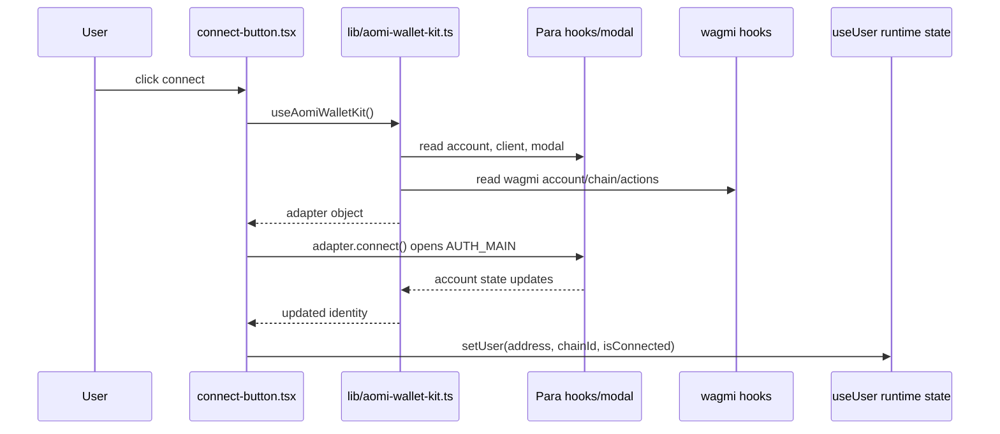

In the legacy flow, connection handling and runtime user-state sync were both
coupled to `ConnectButton`.

### Current connection flow

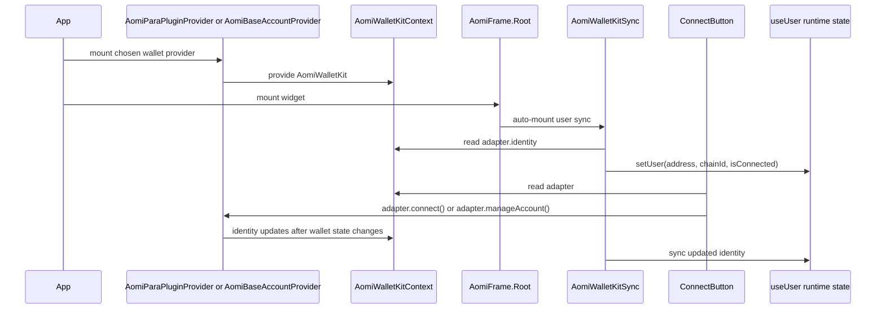

In the current flow, the provider owns wallet details and the frame owns runtime
user sync.

### Base Account connection order

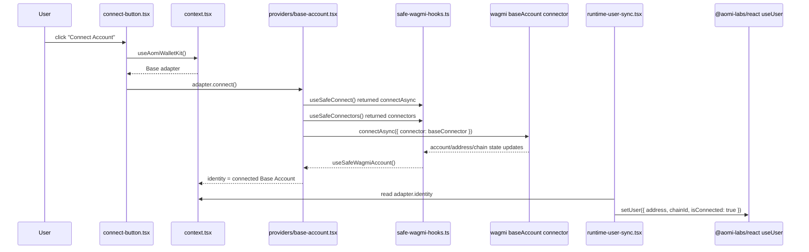

Function order:

| Order | File                                                                 | Function or code path                                | Role                                                                                 |
| ----- | -------------------------------------------------------------------- | ---------------------------------------------------- | ------------------------------------------------------------------------------------ |
| 1     | `apps/registry/src/components/control-bar/connect-button.tsx`        | `handleClick`                                        | Decides connect vs manage based on adapter state.                                    |
| 2     | `apps/registry/src/lib/aomi-wallet-kit/context.tsx`                | `useAomiWalletKit`                                 | Reads the active adapter from context.                                               |
| 3     | `apps/registry/src/lib/aomi-wallet-kit/providers/base-account.tsx` | `BaseAccountAdapterInner` memoized `adapter.connect` | Calls wagmi `connectAsync` with the Base Account connector.                          |
| 4     | `apps/registry/src/lib/aomi-wallet-kit/safe-wagmi-hooks.ts`        | `useSafeConnect`, `useSafeConnectors`                | Safely exposes wagmi connect helpers.                                                |
| 5     | `apps/registry/src/lib/aomi-wallet-kit/providers/base-account.tsx` | `createBaseAccountConfig`                            | Creates wagmi config with `baseAccount({ appName, appLogoUrl, paymasterUrls: {} })`. |
| 6     | `apps/registry/src/lib/aomi-wallet-kit/providers/base-account.tsx` | identity construction                                | Formats connected Base Account identity.                                             |
| 7     | `apps/registry/src/lib/aomi-wallet-kit/runtime-user-sync.tsx`      | `AomiWalletKitSync`                            | Pushes identity into runtime user state.                                             |

### Para connection order

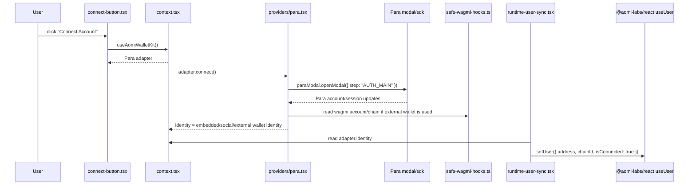

Function order:

| Order | File                                                            | Function or code path                                         | Role                                                                     |
| ----- | --------------------------------------------------------------- | ------------------------------------------------------------- | ------------------------------------------------------------------------ |
| 1     | `apps/registry/src/components/control-bar/connect-button.tsx`   | `handleClick`                                                 | Decides connect vs manage based on adapter state.                        |
| 2     | `apps/registry/src/lib/aomi-wallet-kit/context.tsx`           | `useAomiWalletKit`                                          | Reads the active adapter from context.                                   |
| 3     | `apps/registry/src/lib/aomi-wallet-kit/providers/para.tsx`    | `AomiParaPluginProvider` memoized `adapter.connect`          | Opens the Para auth modal at `AUTH_MAIN`.                                |
| 4     | `apps/registry/src/lib/aomi-wallet-kit/providers/para.tsx`    | `useSafeParaAccount`, `useSafeParaClient`, `useSafeParaModal` | Safely reads Para SDK state.                                             |
| 5     | `apps/registry/src/lib/aomi-wallet-kit/safe-wagmi-hooks.ts`   | `useSafeWagmiAccount`, `useSafeWalletClient`                  | Reads external wallet state when Para uses an external EVM wallet.       |
| 6     | `apps/registry/src/lib/aomi-wallet-kit/providers/para.tsx`    | identity construction                                         | Chooses embedded email/social label, external address, or wagmi address. |
| 7     | `apps/registry/src/lib/aomi-wallet-kit/runtime-user-sync.tsx` | `AomiWalletKitSync`                                     | Pushes identity into runtime user state.                                 |

---

## Transaction Flow

### Legacy transaction flow

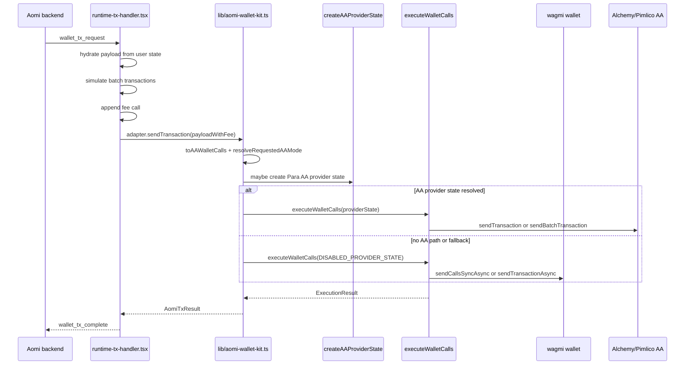

In the legacy flow, most orchestration lived in the Para-shaped adapter file.

### Current transaction flow

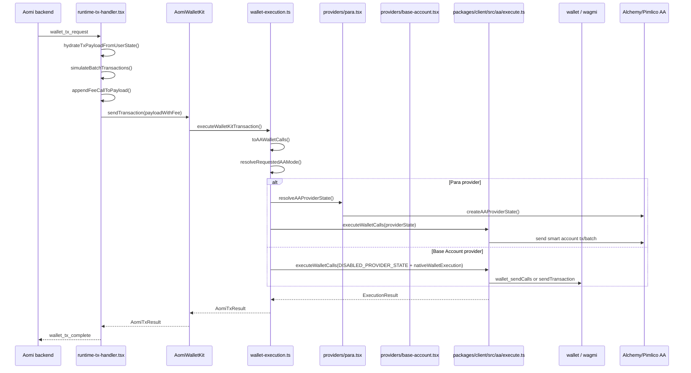

In the current flow, `RuntimeTxHandler` prepares the request,
`executeWalletKitTransaction` performs provider-neutral transaction planning,
provider files supply wallet-specific state, and the client executor submits the
calls.

### Runtime transaction request flow

This part is provider-independent.

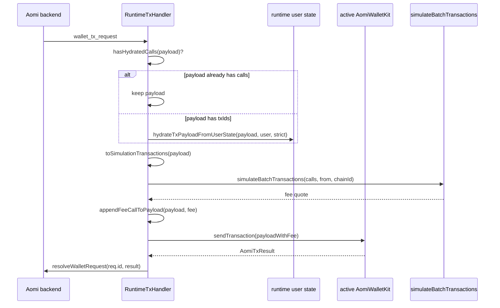

Key detail: `appendFeeCallToPayload` defaults to:

- `aaPreference: "eip7702"`
- `aaStrict: true`

So after fee injection, a single user transaction becomes a multi-call batch and
prefers AA execution. If AA provider setup is unresolved, the adapter can still
fall back to the native wallet path like `origin/main`; if a resolved AA
execution path fails under `aaStrict`, the adapter fails closed unless an
unresolved-provider fallback path remains.

### Shared transaction execution flow

This happens in `apps/registry/src/lib/aomi-wallet-kit/wallet-execution.ts`.

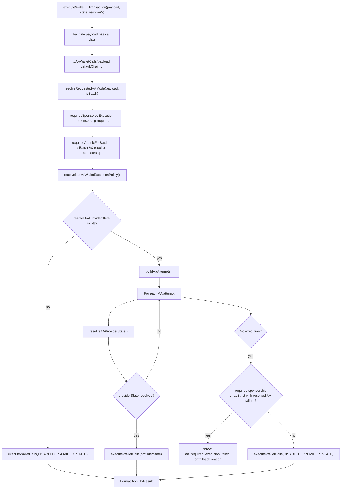

### Para transaction flow

Para can use an Aomi-created smart account through Alchemy or Pimlico. It can run 7702 or 4337 depending on the request and signer shape.

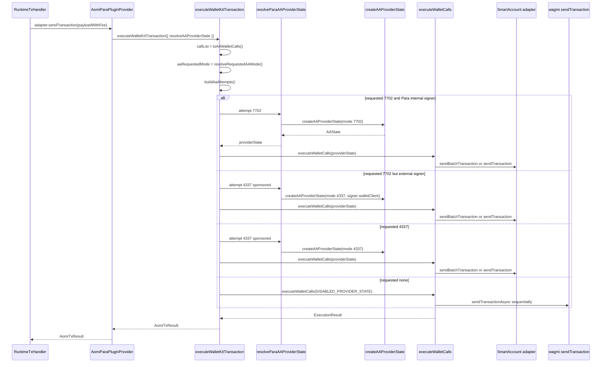

Para fallback logic:

| Situation                                                             | Behavior                                                                                                                       |
| --------------------------------------------------------------------- | ------------------------------------------------------------------------------------------------------------------------------ |
| Requested `7702`, Para internal signer                                | Try 7702 first, then 4337 sponsored.                                                                                           |
| Requested `7702`, external wallet signer                              | Skip 7702 and try 4337 sponsored because the external signer path cannot use the Para session as a 7702 owner in the same way. |
| Requested `4337`                                                      | Try 4337 sponsored.                                                                                                            |
| Requested `none`                                                      | No AA attempts; use native wallet send path.                                                                                   |
| AA provider state is unresolved                                       | Skip that AA attempt. If no attempt executes, fall back once to native wallet/EOA execution.                                   |
| AA attempt resolves but fails                                         | Try the next AA attempt. If all remaining paths are also resolved AA failures, `aaStrict` fails closed.                        |
| Resolved AA attempt fails, then later AA provider state is unresolved | Fall back once to native wallet/EOA execution, matching the previous `origin/main` fallback shape.                             |
| Payload has `aaStrict: true`                                          | Still prefers AA. It allows unresolved-provider fallback, but blocks native fallback after resolved AA execution failures.     |

### Base Account transaction flow

Base Account is handled as wallet-native execution. It does not create an Aomi `AAState.account` through Alchemy/Pimlico. Instead, the Base Account wagmi connector exposes wallet capabilities and `wallet_sendCalls`.

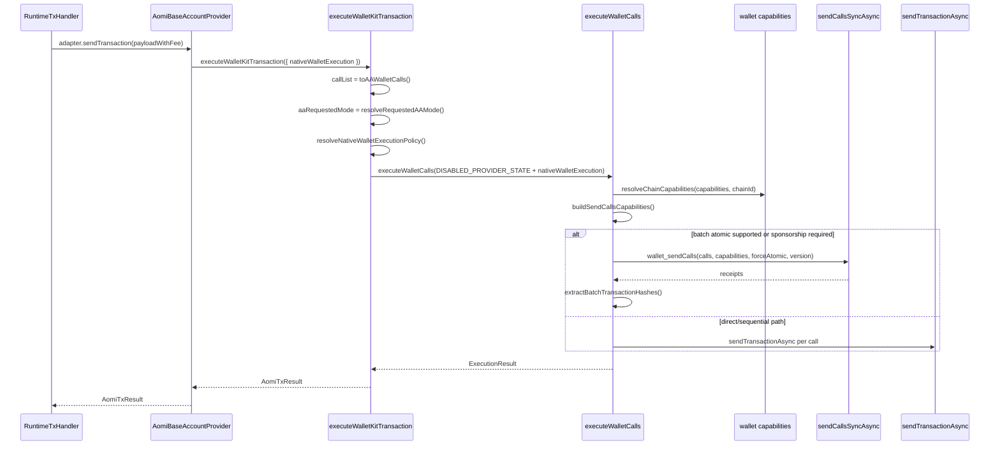

Base Account execution decisions:

| Situation                                               | Behavior                                                                                                                                     |
| ------------------------------------------------------- | -------------------------------------------------------------------------------------------------------------------------------------------- |
| Single call, sponsorship disabled or optional           | Use normal `sendTransactionAsync`; optional sponsorship does not force `sendCalls`.                                                          |
| Single call, sponsorship required                       | Use `sendCallsSyncAsync` with required `paymasterService`.                                                                                   |
| Batch, atomic supported, sponsorship disabled/optional  | Use `sendCallsSyncAsync` with `atomic: { optional: true }`; unsupported atomic can fall back to sequential sends, even when `aaStrict` true. |
| Batch, required sponsorship                             | Use `sendCallsSyncAsync` with required `paymasterService`, `atomic: { required: true }`, and `forceAtomic: true`.                            |
| Explicit `requiresAtomicForBatch` policy                | Use `sendCallsSyncAsync` with `atomic: { required: true }` and `forceAtomic: true`; unsupported atomic fails instead of sequential fallback. |
| Required sponsorship with missing paymaster URL         | Throw `wallet_paymaster_service_url_required`.                                                                                               |
| Required sponsorship with unsupported wallet capability | Throw `wallet_paymaster_service_unsupported`.                                                                                                |
| Required sponsorship send-calls rejected                | Throw, do not silently charge user through regular sends.                                                                                    |
| Optional sponsorship with supported paymaster           | Include optional `paymasterService`; result is marked `sponsored: true` if it was sent through paymaster service.                            |

---

## Client Executor

### Legacy `executeWalletCalls`

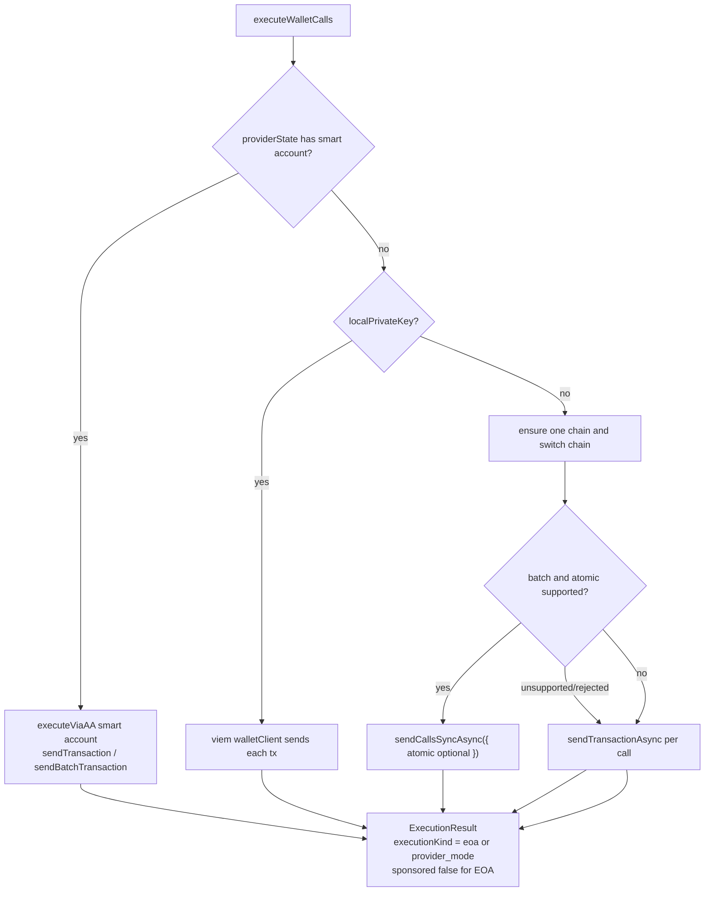

The legacy EOA path only understood atomic batching. It did not model native
wallet sponsorship, paymaster service capabilities, atomic-required batches,
send-calls version/timeouts, or missing receipt hash errors.

### Current `executeWalletCalls`

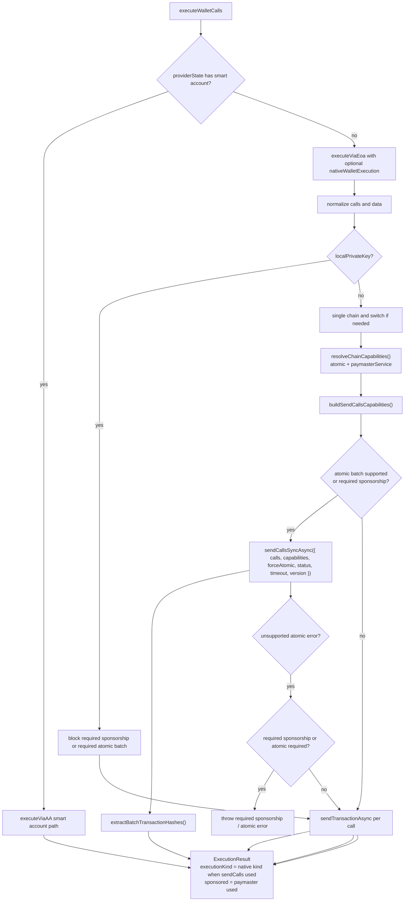

### `wallet_sendCalls` capability construction

This client-side planner lives in `packages/client/src/aa/execute.ts`.

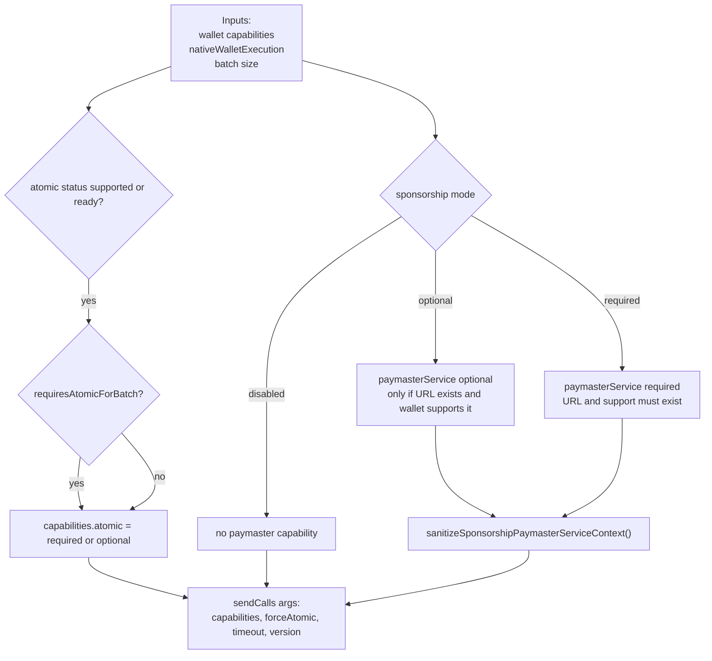

Important paymaster context behavior:

- `erc20` and `paymasterAddress` are stripped from sponsorship context.
- The type marks those keys as `never`.
- Runtime also warns if those keys are present.

This prevents accidentally forwarding ERC20 payment context on a sponsorship request.

---

## Signing Flow

Signing did not need as much behavioral change as transactions, but it now travels through the provider adapter interface instead of being part of one Para-specific hook.

### Generic signing flow

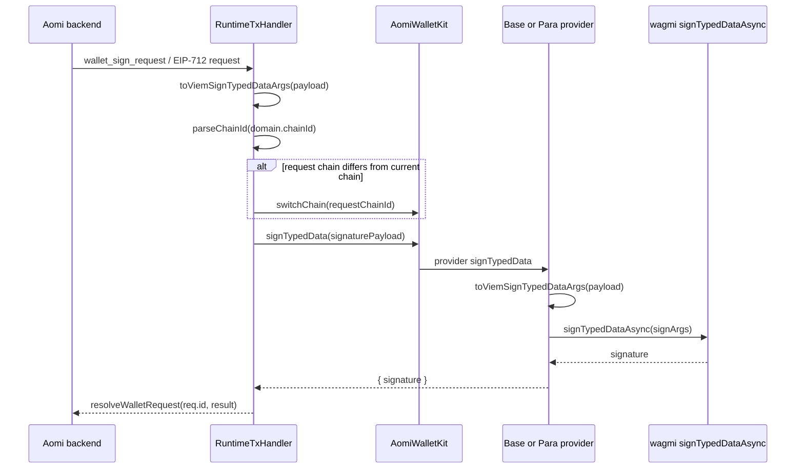

### Base Account signing order

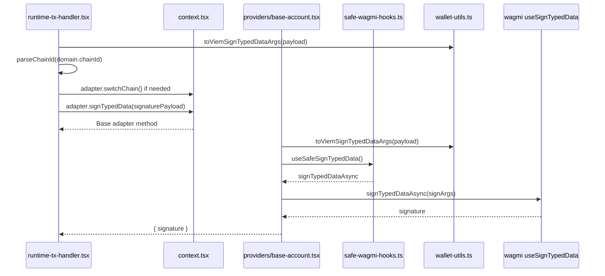

Function order:

| Order | File                                                                 | Function or code path        | Role                                                        |
| ----- | -------------------------------------------------------------------- | ---------------------------- | ----------------------------------------------------------- |
| 1     | `apps/registry/src/components/runtime-tx-handler.tsx`                | `processRequest` sign branch | Handles non-transaction wallet requests.                    |
| 2     | `packages/client/src/wallet-utils.ts`                                | `toViemSignTypedDataArgs`    | Normalizes EIP-712 payload into viem shape.                 |
| 3     | `packages/client/src/wallet-utils.ts`                                | `parseChainId`               | Parses domain chain id.                                     |
| 4     | `apps/registry/src/lib/aomi-wallet-kit/providers/base-account.tsx` | `adapter.switchChain`        | Uses wagmi `switchChainAsync` when request chain differs.   |
| 5     | `apps/registry/src/lib/aomi-wallet-kit/providers/base-account.tsx` | `adapter.signTypedData`      | Converts payload again defensively and calls wagmi signing. |
| 6     | `apps/registry/src/lib/aomi-wallet-kit/safe-wagmi-hooks.ts`        | `useSafeSignTypedData`       | Safely exposes `signTypedDataAsync`.                        |

### Para signing order

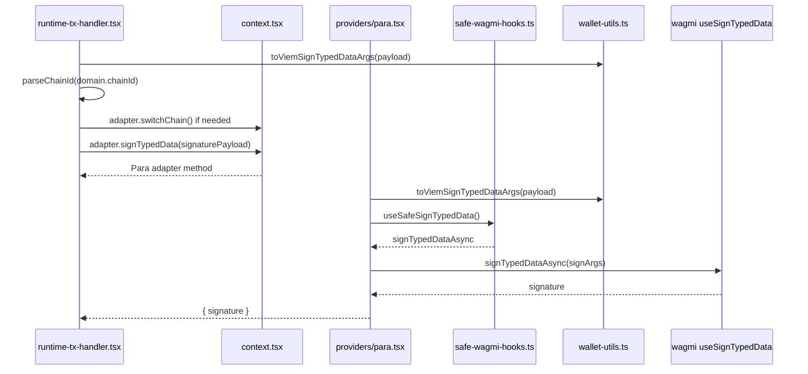

Function order:

| Order | File                                                          | Function or code path        | Role                                                        |
| ----- | ------------------------------------------------------------- | ---------------------------- | ----------------------------------------------------------- |
| 1     | `apps/registry/src/components/runtime-tx-handler.tsx`         | `processRequest` sign branch | Handles non-transaction wallet requests.                    |
| 2     | `packages/client/src/wallet-utils.ts`                         | `toViemSignTypedDataArgs`    | Normalizes EIP-712 payload into viem shape.                 |
| 3     | `packages/client/src/wallet-utils.ts`                         | `parseChainId`               | Parses domain chain id.                                     |
| 4     | `apps/registry/src/lib/aomi-wallet-kit/providers/para.tsx`  | `adapter.switchChain`        | Uses wagmi `switchChainAsync` when request chain differs.   |
| 5     | `apps/registry/src/lib/aomi-wallet-kit/providers/para.tsx`  | `adapter.signTypedData`      | Converts payload again defensively and calls wagmi signing. |
| 6     | `apps/registry/src/lib/aomi-wallet-kit/safe-wagmi-hooks.ts` | `useSafeSignTypedData`       | Safely exposes `signTypedDataAsync`.                        |

---

## Dependency Graphs

### Registry wallet kit module graph

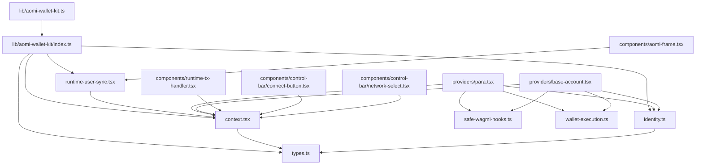

### Shared transaction dependency graph

```mermaid
graph TD
  Runtime["runtime-tx-handler.tsx"]
  Hydrate["hydrateTxPayloadFromUserState<br/>packages/client/src/wallet-utils.ts"]
  Sim["simulateBatchTransactions<br/>runtime API"]
  Fee["appendFeeCallToPayload<br/>packages/client/src/aa/fee.ts"]
  AdapterSend["adapter.sendTransaction"]
  Shared["executeWalletKitTransaction<br/>wallet-execution.ts"]
  Calls["toAAWalletCalls<br/>wallet-utils.ts"]
  Mode["resolveRequestedAAMode<br/>wallet-execution.ts"]
  Execute["executeWalletCalls<br/>packages/client/src/aa/execute.ts"]
  AA["executeViaAA"]
  Native["executeViaEoa"]

  Runtime --> Hydrate
  Runtime --> Sim
  Runtime --> Fee
  Runtime --> AdapterSend
  AdapterSend --> Shared
  Shared --> Calls
  Shared --> Mode
  Shared --> Execute
  Execute --> AA
  Execute --> Native
```

### Base Account provider dependencies

```mermaid
graph TD
  BaseProvider["AomiBaseAccountProvider"]
  WagmiProvider["WagmiProvider"]
  Query["QueryClientProvider"]
  Config["createBaseAccountConfig"]
  SyncStorage["syncPersistedBaseAccountConfig"]
  Connector["wagmi/connectors baseAccount"]
  Inner["BaseAccountAdapterInner"]
  SafeHooks["safe-wagmi-hooks.ts"]
  Context["AomiWalletKitContextProvider"]
  Exec["executeWalletKitTransaction"]
  ClientExec["executeWalletCalls"]

  BaseProvider --> Config
  Config --> SyncStorage
  Config --> Connector
  BaseProvider --> WagmiProvider
  WagmiProvider --> Query
  Query --> Inner
  Inner --> SafeHooks
  Inner --> Exec
  Inner --> Context
  Exec --> ClientExec
```

### Para provider dependencies

```mermaid
graph TD
  ParaProvider["AomiParaProvider"]
  SDK["ParaProvider from @getpara/react-sdk"]
  PluginProvider["AomiParaPluginProvider"]
  ParaHooks["useSafeParaAccount/useSafeParaClient/useSafeParaModal"]
  SafeHooks["safe-wagmi-hooks.ts"]
  ResolveAA["resolveParaAAProviderState"]
  CreateAA["createAAProviderState"]
  Context["AomiWalletKitContextProvider"]
  Exec["executeWalletKitTransaction"]
  ClientExec["executeWalletCalls"]

  ParaProvider --> SDK
  SDK --> PluginProvider
  PluginProvider --> ParaHooks
  PluginProvider --> SafeHooks
  PluginProvider --> ResolveAA
  ResolveAA --> CreateAA
  PluginProvider --> Exec
  PluginProvider --> Context
  Exec --> ClientExec
```

---

## Transaction Fallback Matrix

| Provider     | Request shape                                           | Preferred path                                                                     | Fallback path                                                            | Fail-closed condition                                              |
| ------------ | ------------------------------------------------------- | ---------------------------------------------------------------------------------- | ------------------------------------------------------------------------ | ------------------------------------------------------------------ |
| Para         | Single call, no AA requested                            | Native wallet `sendTransactionAsync`                                               | None                                                                     | Normal wallet errors bubble.                                       |
| Para         | Batch, `aaPreference: "eip7702"`                        | Para AA 7702 through Alchemy/Pimlico                                               | Para AA 4337 sponsored, then native wallet/EOA if AA setup is unresolved | `aaStrict: true` with only resolved AA execution failures.         |
| Para         | Batch, external signer, `eip7702`                       | Para AA 4337 sponsored                                                             | Native wallet/EOA if AA setup is unresolved                              | `aaStrict: true` with only resolved AA execution failures.         |
| Para         | Batch, `eip4337`                                        | Para AA 4337 sponsored                                                             | Native wallet/EOA if AA setup is unresolved                              | `aaStrict: true` with only resolved AA execution failures.         |
| Base Account | Single call, sponsorship disabled                       | `sendTransactionAsync`                                                             | None                                                                     | Normal wallet errors bubble.                                       |
| Base Account | Single call, sponsorship optional                       | `sendTransactionAsync`                                                             | None                                                                     | Optional sponsorship does not force send-calls.                    |
| Base Account | Single call, sponsorship required                       | `sendCallsSyncAsync` with `paymasterService`                                       | None                                                                     | Missing URL, unsupported paymaster, rejected required sponsorship. |
| Base Account | Batch, atomic supported, sponsorship disabled/optional  | `sendCallsSyncAsync` with `atomic.optional`                                        | Sequential `sendTransactionAsync` if atomic unsupported                  | Non-atomic wallet errors bubble.                                   |
| Base Account | Batch, required sponsorship                             | `sendCallsSyncAsync` with `paymasterService`, `atomic.required`, and `forceAtomic` | None                                                                     | Required sponsorship is never silently downgraded.                 |
| Base Account | Batch, explicit `requiresAtomicForBatch` policy         | `sendCallsSyncAsync` with `atomic.required` and `forceAtomic`                      | None                                                                     | Unsupported atomic throws `wallet_atomic_batch_required`.          |
| Base Account | Batch, optional paymaster supported and atomic required | `sendCallsSyncAsync` with required atomic plus optional `paymasterService`         | None                                                                     | Unsupported required atomic throws.                                |

---

## Validation Coverage

Primary test files:

- `packages/client/test/aa/aa-eoa-capabilities.unit.test.ts`
- `apps/registry/src/lib/aomi-wallet-kit/wallet-execution.test.ts`

Coverage added:

- Single direct EOA call does not use `sendCallsSyncAsync` just because atomic is available.
- Optional sponsorship does not force a single call through send-calls.
- Required sponsorship uses `sendCallsSyncAsync` even for one call.
- Required sponsorship fails when paymaster URL is missing.
- Required sponsorship passes an explicit empty paymaster context when no context is supplied.
- Required sponsorship fails when wallet capabilities do not support `paymasterService`.
- Atomic batches request `atomic: { optional: true }` unless native policy explicitly requires atomic execution.
- Atomic unsupported errors can fall back to sequential sends when atomic is optional.
- Wallet-native execution reports `executionKind: "eoa"` if it fell back to sequential EOA sends.
- Atomic-required batches send `atomic: { required: true }` and `forceAtomic: true` when `requiresAtomicForBatch` is set.
- Atomic-required batches do not sequentially send when atomic is unsupported.
- Optional paymaster service is passed for wallet-native smart wallet execution.
- ERC20 payment fields are stripped from paymaster service context.
- Adapter-level unresolved AA provider states fall back to native wallet execution once.
- Adapter-level `aaStrict` requests fail closed when resolved AA execution fails and no unresolved-provider fallback remains.
- Adapter-level Base Account execution keeps atomic optional unless sponsorship is required.
- Adapter-level timeout or wallet-native send-calls errors do not trigger a second native fallback submission.

---

## Function Glossary

### Runtime and UI

| Function / component       | File                                                            | What it does                                                                                                                                                |
| -------------------------- | --------------------------------------------------------------- | ----------------------------------------------------------------------------------------------------------------------------------------------------------- |
| `AomiFrame.Root`           | `apps/registry/src/components/aomi-frame.tsx`                   | Mounts the runtime provider, sidebar/frame layout, notifications, `AomiWalletKitSync`, and `RuntimeTxHandler`.                                        |
| `AomiWalletKitSync`  | `apps/registry/src/lib/aomi-wallet-kit/runtime-user-sync.tsx` | Reads `adapter.identity` and calls `setUser({ address, chainId, isConnected })`.                                                                            |
| `RuntimeTxHandler`         | `apps/registry/src/components/runtime-tx-handler.tsx`           | Processes pending runtime wallet requests, simulates tx fees, appends fee calls, sends transactions, and signs EIP-712 requests through the active adapter. |
| `hasHydratedCalls`         | `apps/registry/src/components/runtime-tx-handler.tsx`           | Checks whether a transaction payload already contains concrete call data.                                                                                   |
| `toSimulationTransactions` | `apps/registry/src/components/runtime-tx-handler.tsx`           | Converts payload calls into the shape expected by `simulateBatchTransactions`.                                                                              |
| `ConnectButton`            | `apps/registry/src/components/control-bar/connect-button.tsx`   | Displays wallet identity and delegates connect/manage clicks to the adapter.                                                                                |
| `NetworkSelect`            | `apps/registry/src/components/control-bar/network-select.tsx`   | Shows switchable chains from `chains` prop, `adapter.supportedChains`, or `SUPPORTED_CHAINS`.                                                               |

### Adapter context and identity

| Function / type                   | File                                                  | What it does                                                                                |
| --------------------------------- | ----------------------------------------------------- | ------------------------------------------------------------------------------------------- |
| `AomiWalletKitContextProvider`         | `apps/registry/src/lib/aomi-wallet-kit/context.tsx` | Provides an `AomiWalletKit` through React context.                                        |
| `useAomiWalletKit`              | `apps/registry/src/lib/aomi-wallet-kit/context.tsx` | Reads the active adapter from context, defaulting to a disconnected adapter if none exists. |
| `AOMI_SESSION_DISCONNECTED_IDENTITY` | `apps/registry/src/lib/aomi-wallet-kit/identity.ts` | Shared disconnected identity object.                                                        |
| `AOMI_SESSION_BOOTING_IDENTITY`      | `apps/registry/src/lib/aomi-wallet-kit/identity.ts` | Shared loading identity object.                                                             |
| `formatAddress`                   | `apps/registry/src/lib/aomi-wallet-kit/identity.ts` | Shortens an EVM address for display.                                                        |
| `formatAuthMethod`              | `apps/registry/src/lib/aomi-wallet-kit/identity.ts` | Converts provider ids like `google` or `baseAccount` into display labels.                   |
| `inferAuthMethod`               | `apps/registry/src/lib/aomi-wallet-kit/identity.ts` | Picks a Para embedded auth method label from a Set.                                         |

### Safe wagmi wrappers

| Function                 | File                                                          | What it does                                                                            |
| ------------------------ | ------------------------------------------------------------- | --------------------------------------------------------------------------------------- |
| `useSafeWagmiAccount`    | `apps/registry/src/lib/aomi-wallet-kit/safe-wagmi-hooks.ts` | Reads wagmi account state or returns disconnected defaults if no wagmi provider exists. |
| `useSafeWalletClient`    | `apps/registry/src/lib/aomi-wallet-kit/safe-wagmi-hooks.ts` | Reads wagmi wallet client or returns `undefined`.                                       |
| `useSafeWagmiConfig`     | `apps/registry/src/lib/aomi-wallet-kit/safe-wagmi-hooks.ts` | Reads wagmi chains or returns an empty list.                                            |
| `useSafeSwitchChain`     | `apps/registry/src/lib/aomi-wallet-kit/safe-wagmi-hooks.ts` | Reads `switchChainAsync` and pending state safely.                                      |
| `useSafeSendTransaction` | `apps/registry/src/lib/aomi-wallet-kit/safe-wagmi-hooks.ts` | Reads `sendTransactionAsync` safely.                                                    |
| `useSafeSignTypedData`   | `apps/registry/src/lib/aomi-wallet-kit/safe-wagmi-hooks.ts` | Reads `signTypedDataAsync` safely.                                                      |
| `useSafeCapabilities`    | `apps/registry/src/lib/aomi-wallet-kit/safe-wagmi-hooks.ts` | Reads wallet capabilities and normalizes `atomic.status: "ready"` to `"supported"`.     |
| `useSafeSendCallsSync`   | `apps/registry/src/lib/aomi-wallet-kit/safe-wagmi-hooks.ts` | Reads `sendCallsSyncAsync` and forwards extended send-calls args.                       |
| `useSafeConnect`         | `apps/registry/src/lib/aomi-wallet-kit/safe-wagmi-hooks.ts` | Reads wagmi `connectAsync` safely.                                                      |
| `useSafeDisconnect`      | `apps/registry/src/lib/aomi-wallet-kit/safe-wagmi-hooks.ts` | Reads wagmi `disconnectAsync` safely.                                                   |
| `useSafeConnectors`      | `apps/registry/src/lib/aomi-wallet-kit/safe-wagmi-hooks.ts` | Reads available wagmi connectors safely.                                                |

### Base Account provider

| Function / type                  | File                                                                 | What it does                                                                                                             |
| -------------------------------- | -------------------------------------------------------------------- | ------------------------------------------------------------------------------------------------------------------------ |
| `AomiBaseAccountProvider`        | `apps/registry/src/lib/aomi-wallet-kit/providers/base-account.tsx` | Top-level provider that creates wagmi Base Account config, query client, and adapter context.                            |
| `BaseAccountAdapterInner`        | `apps/registry/src/lib/aomi-wallet-kit/providers/base-account.tsx` | Builds the actual `AomiWalletKit` from wagmi account/connect/sign/send state.                                          |
| `createBaseAccountConfig`        | `apps/registry/src/lib/aomi-wallet-kit/providers/base-account.tsx` | Creates wagmi config using the `baseAccount` connector and Base/Base Sepolia chain set.                                  |
| `syncPersistedBaseAccountConfig` | `apps/registry/src/lib/aomi-wallet-kit/providers/base-account.tsx` | Updates persisted Base Account SDK metadata in localStorage so stale app metadata/chains do not survive connector setup. |
| `BaseAccountSponsorshipOptions`  | `apps/registry/src/lib/aomi-wallet-kit/providers/base-account.tsx` | Consumer-facing sponsorship configuration for Base Account native wallet execution.                                      |

### Para provider

| Function / type              | File                                                         | What it does                                                                                                                   |
| ---------------------------- | ------------------------------------------------------------ | ------------------------------------------------------------------------------------------------------------------------------ |
| `AomiParaProvider`           | `apps/registry/src/lib/aomi-wallet-kit/providers/para.tsx` | Optional full Para wrapper that configures `ParaProvider`, query client, networks, wallets, modal config, and adapter context. |
| `AomiParaPluginProvider`    | `apps/registry/src/lib/aomi-wallet-kit/providers/para.tsx` | Adapter-only provider used when a surrounding app already mounted `ParaProvider`.                                              |
| `useSafeParaAccount`         | `apps/registry/src/lib/aomi-wallet-kit/providers/para.tsx` | Reads Para account state safely.                                                                                               |
| `useSafeParaModal`           | `apps/registry/src/lib/aomi-wallet-kit/providers/para.tsx` | Reads Para modal opener safely.                                                                                                |
| `useSafeParaClient`          | `apps/registry/src/lib/aomi-wallet-kit/providers/para.tsx` | Reads Para client/session safely.                                                                                              |
| `resolveAAProvider`          | `apps/registry/src/lib/aomi-wallet-kit/providers/para.tsx` | Chooses Alchemy or Pimlico using env override/API-key availability.                                                            |
| `resolveParaAAProviderState` | `apps/registry/src/lib/aomi-wallet-kit/providers/para.tsx` | Creates a Para-backed AA provider state for 4337/7702 or returns a disabled state with fallback reason.                        |

### Shared adapter transaction execution

| Function / type                      | File                                                          | What it does                                                                                 |
| ------------------------------------ | ------------------------------------------------------------- | -------------------------------------------------------------------------------------------- |
| `executeWalletKitTransaction`          | `apps/registry/src/lib/aomi-wallet-kit/wallet-execution.ts` | Main provider-neutral transaction orchestrator used by Base and Para adapters.               |
| `resolveRequestedAAMode`             | `apps/registry/src/lib/aomi-wallet-kit/wallet-execution.ts` | Converts payload preference and batch-ness into requested `"none"`, `"4337"`, or `"7702"`.   |
| `normalizeAtomicCapabilities`        | `apps/registry/src/lib/aomi-wallet-kit/wallet-execution.ts` | Normalizes wallet capability data before it reaches the client executor.                     |
| `buildAaAttempts`                    | `apps/registry/src/lib/aomi-wallet-kit/wallet-execution.ts` | Decides which Para AA attempts to try and in what order.                                     |
| `resolveNativeWalletExecutionPolicy` | `apps/registry/src/lib/aomi-wallet-kit/wallet-execution.ts` | Converts provider callback-based native wallet policy into concrete client execution policy. |
| `hasResolvedAAProvider`              | `apps/registry/src/lib/aomi-wallet-kit/wallet-execution.ts` | Checks whether a provider state actually has an AA account before trying to execute it.      |
| `getPreferredRpcUrl`                 | `apps/registry/src/lib/aomi-wallet-kit/wallet-execution.ts` | Picks a chain RPC URL.                                                                       |

### Client wallet payload utilities

| Function                        | File                                  | What it does                                                                                 |
| ------------------------------- | ------------------------------------- | -------------------------------------------------------------------------------------------- |
| `hydrateTxPayloadFromUserState` | `packages/client/src/wallet-utils.ts` | Looks up backend `txIds` in runtime `user.pending_txs` and expands them into concrete calls. |
| `toAAWalletCalls`               | `packages/client/src/wallet-utils.ts` | Converts widget/backend tx payloads into `AAWalletCall[]`.                                   |
| `toAAWalletCall`                | `packages/client/src/wallet-utils.ts` | Single-call convenience wrapper over `toAAWalletCalls`.                                      |
| `toViemSignTypedDataArgs`       | `packages/client/src/wallet-utils.ts` | Converts EIP-712 payloads into viem `signTypedData` args.                                    |
| `parseChainId`                  | `packages/client/src/wallet-utils.ts` | Parses decimal/hex/string/number chain ids.                                                  |
| `appendFeeCallToPayload`        | `packages/client/src/aa/fee.ts`       | Appends the fee payment call and forces AA preference/strictness by default.                 |
| `buildFeeAAWalletCall`          | `packages/client/src/aa/fee.ts`       | Converts a simulated fee into an AA wallet call.                                             |
| `normalizeSimulatedFee`         | `packages/client/src/aa/fee.ts`       | Validates and normalizes simulated fee output.                                               |
| `aaModeFromExecutionKind`       | `packages/client/src/aa/policy.ts`    | Converts execution kind strings into `"4337"`, `"7702"`, or `"none"`.                        |

### Client AA execution

| Function                                     | File                                | What it does                                                                                                         |
| -------------------------------------------- | ----------------------------------- | -------------------------------------------------------------------------------------------------------------------- |
| `executeWalletCalls`                         | `packages/client/src/aa/execute.ts` | Public executor that chooses AA path when an AA account exists, otherwise native/EOA path.                           |
| `executeViaAA`                               | `packages/client/src/aa/execute.ts` | Sends through `SmartAccount.sendTransaction` or `sendBatchTransaction`; retries known transient bundler errors once. |
| `resolve7702Delegation`                      | `packages/client/src/aa/execute.ts` | Best-effort lookup of 7702 delegation address from transaction authorization list.                                   |
| `executeViaEoa`                              | `packages/client/src/aa/execute.ts` | Handles local private key, direct wallet sends, atomic `wallet_sendCalls`, and native wallet sponsorship.            |
| `extractBatchTransactionHashes`              | `packages/client/src/aa/execute.ts` | Pulls tx hashes from send-calls receipts and throws if none are present.                                             |
| `buildSendCallsCapabilities`                 | `packages/client/src/aa/execute.ts` | Builds `atomic` and `paymasterService` capabilities for `wallet_sendCalls`.                                          |
| `sanitizeSponsorshipPaymasterServiceContext` | `packages/client/src/aa/execute.ts` | Removes ERC20 payment keys from sponsorship paymaster context.                                                       |
| `isUnsupportedAtomicCapabilityError`         | `packages/client/src/aa/execute.ts` | Detects wallet errors that mean atomic batching is unsupported.                                                      |
| `resolveChainCapabilities`                   | `packages/client/src/aa/execute.ts` | Looks up capabilities by `eip155:chainId`, decimal chain id, or hex chain id.                                        |
| `isAADebugEnabled` / `debugAA`               | `packages/client/src/aa/execute.ts` | Optional debug logging controlled by global/localStorage flags.                                                      |

---

## Provider Comparison

```mermaid
flowchart LR
  Request["Runtime wallet request"]
  Adapter["AomiWalletKit"]
  Base["Base Account"]
  Para["Para"]
  BaseNative["Native wallet execution<br/>wallet_sendCalls / sendTransaction"]
  ParaAA["Aomi AA provider state<br/>Alchemy/Pimlico 4337/7702"]
  Result["AomiTxResult"]

  Request --> Adapter
  Adapter --> Base
  Adapter --> Para
  Base --> BaseNative --> Result
  Para --> ParaAA --> Result
```

Base Account:

- Connects through wagmi `baseAccount`.
- Uses the wallet's own capabilities.
- Uses `wallet_sendCalls` for atomic batches or required sponsorship.
- Reports native smart-wallet execution as `base_account_4337` when send-calls path is used.

Para:

- Connects through Para SDK and optionally external wagmi wallets.
- Builds an Aomi AA provider state through Alchemy/Pimlico.
- Can try 7702 then 4337, or 4337 directly.
- Reports execution as `alchemy_7702`, `pimlico_4337`, etc.

---

## Behavioral Notes

1. `ConnectButton` no longer syncs runtime user state.

   That responsibility moved to `AomiWalletKitSync`, which is mounted by `AomiFrame.Root`.

2. Adapter selection is now provider-based.

   Apps need to mount a provider like `AomiParaProvider`, `AomiParaPluginProvider`, or `AomiBaseAccountProvider`.

3. Para logic is mostly preserved but moved.

   The legacy Para hook logic now lives in `providers/para.tsx` plus shared pieces in `wallet-execution.ts`.

4. Base Account gets first-class support.

   `AomiBaseAccountProvider` wraps wagmi config, connector setup, identity creation, connect/disconnect, tx, and sign behavior.

5. Native wallet execution can be labeled.

   Base Account passes `executionKind: "base_account_4337"` so successful `wallet_sendCalls` executions are distinguishable from plain EOA sends.

6. `aaStrict` matches the previous main fallback split.

   Fee-injected batches still request AA first. If Para AA provider setup is
   unresolved, the adapter falls back to native wallet execution like
   `origin/main`; if resolved AA execution fails and no unresolved-provider
   fallback remains, the adapter throws instead of silently sending natively.

7. Required sponsorship fails closed.

   Missing paymaster URL, unsupported paymaster capability, or required sponsorship send-calls failure does not fall back to normal sends.

8. `sendCallsSyncAsync` now receives more args.

   The safe wagmi wrapper forwards `forceAtomic`, `pollingInterval`, `status`, `throwOnFailure`, `timeout`, and `version`.

9. Wallet capabilities now include paymaster support.

   The executor can check both `atomic.status` and `paymasterService.supported`.

10. Registry entries are more modular.

Consumers can install provider pieces separately instead of pulling Para details through the control bar/runtime transaction handler.

---

## Configuration

### Para

Relevant env vars:

- `NEXT_PUBLIC_PARA_API_KEY`
- `NEXT_PUBLIC_PARA_ENVIRONMENT`
- `NEXT_PUBLIC_WALLETCONNECT_PROJECT_ID`
- `NEXT_PUBLIC_PROJECT_ID`
- `NEXT_PUBLIC_AA_PROVIDER`
- `NEXT_PUBLIC_ALCHEMY_API_KEY`
- `NEXT_PUBLIC_ALCHEMY_GAS_POLICY_ID`
- `NEXT_PUBLIC_PIMLICO_API_KEY`

Provider options added through `AomiParaProvider`:

- `appName`
- `appDescription`
- `appUrl`
- `apiKey`
- `environment`
- `networks`
- `walletConnectProjectId`
- `externalWallets`
- `oAuthMethods`

### Base Account

Provider props:

- `appName` is required.
- `appLogoUrl` is optional.
- `chains` can override the default chain list.
- `includeBaseSepolia` adds Base Sepolia when custom chains are not passed.
- `sponsorship` configures disabled/optional/required paymaster behavior.

Default chains:

- Base mainnet by default.
- Base + Base Sepolia when `includeBaseSepolia` is `true`.

---

## Failure Modes

- `wallet_paymaster_service_url_required`: required sponsorship was requested but no paymaster URL was available.
- `wallet_paymaster_service_unsupported`: required sponsorship was requested but wallet capabilities do not advertise paymaster support.
- `wallet_sponsorship_required`: required sponsorship could not be satisfied.
- `wallet_atomic_batch_required`: required atomic batch could not safely fall back to sequential sends.
- `wallet_send_calls_missing_transaction_hash`: send-calls returned no usable tx hash.
- `aa_required_execution_failed`: required sponsored execution failed, or `aaStrict` had only resolved AA execution failures.

These errors prevent the widget from executing a transaction through a weaker
path than the transaction policy required.
