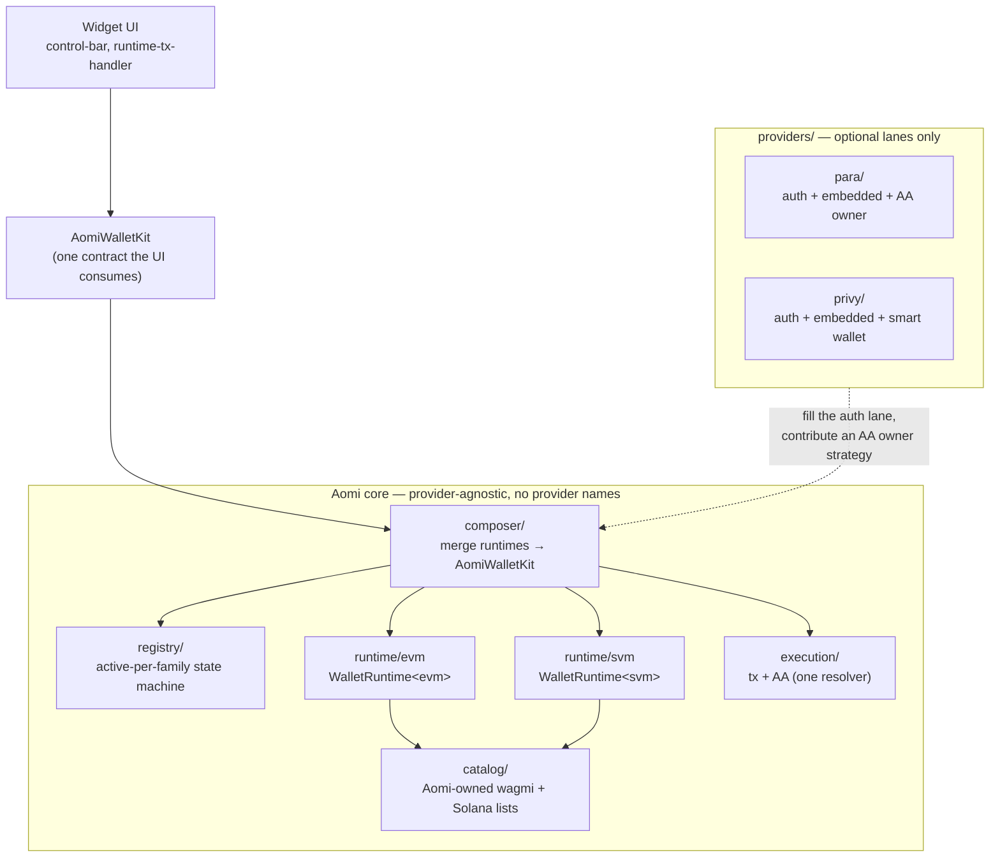
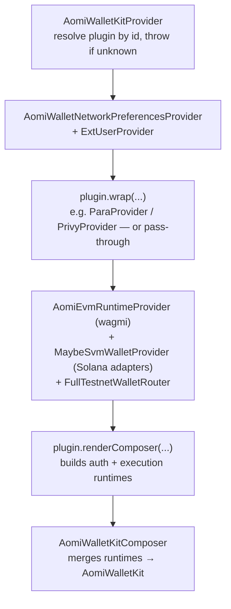
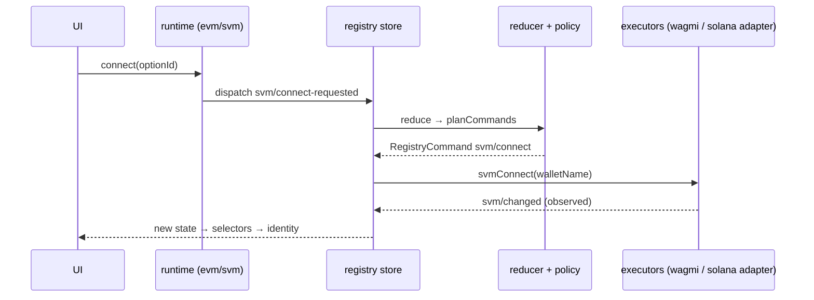
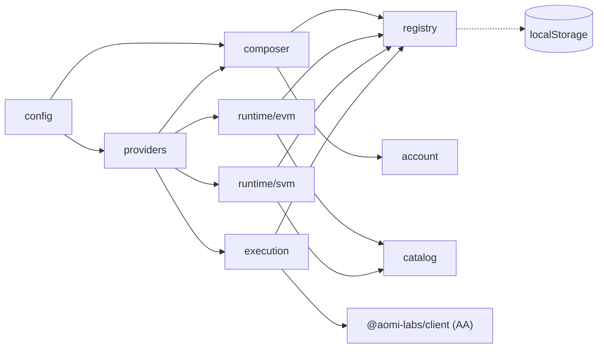

# Wallet Kit — PR Walkthrough (decoupling from Para)

> Presentation companion for the `polish-multi-wallet` PR. Explains **what changed,
> why, and how the kit works now** — the decoupling from Para, the main structs, the
> EVM/SVM symmetry, how consumers use it, how to add providers, and how this sets up
> Better Auth + a backend that remembers and links users.
>
> Every claim is anchored to real files (`path:line`) so you can open the code while
> presenting. Source of truth for design intent:
> [`WALLET-PROVIDER-PLUGIN-REFACTOR.md`](WALLET-PROVIDER-PLUGIN-REFACTOR.md) (target)
> + [`WALLET-KIT-CLEANUP.md`](WALLET-KIT-CLEANUP.md) (the finish-line sweep).

---

## 0. The one-paragraph story

We took a **Para-shaped wallet adapter** — one big hook where "the wallet" *was* Para,
and wagmi/Solana/AA logic was smeared through Para's file — and turned it into a
**provider-agnostic wallet kit** with a single public contract (`AomiWalletKit`), a
**state machine** that owns "who is the active wallet" (the `registry/`), two
**symmetric chain runtimes** (`runtime/evm`, `runtime/svm`), one **execution/AA**
engine, and a thin **plugin** layer where Para and Privy are just folders that
self-register. The core never asks *"is this Para?"* anymore. Adding a new auth
provider is a new folder; adding a new chain family is a new runtime. Para is now one
of N plugins instead of the foundation everything stands on.

---

## 1. Before → after, at a glance

| Dimension | Before (`main`, the Para-shaped kit) | After (this PR) |
|---|---|---|
| Where "the wallet" is defined | `lib/aomi-wallet-kit/providers/para.tsx` — Para hooks *are* the adapter | `lib/wallet-kit/` — a provider-neutral kit; Para is `providers/para/` |
| Public contract | `AomiWalletKit` (EVM-only: connect/sign/send/switchChain) | `AomiWalletKit` (multi-family: accounts, rows, EVM **and** SVM, account credential) |
| Who owns "active wallet" | Implicit — whatever Para/wagmi last reported | `registry/` reducer + policy: **active-per-family** state machine |
| EVM vs SVM | EVM is a real hook; SVM is glue assembled at call sites | Both are `WalletRuntime<F>` — same shape, same lifecycle |
| Provider coupling | `if (para) … else if (baseAccount) …` branches in core | Zero provider names in `runtime/ composer/ registry/ catalog/ execution/` |
| Account abstraction | Para AA logic duplicated (`para-aa.ts` ≈ `aa-provider-state.ts`) | **One** `resolveAAProviderState({ ownerStrategy })`; Para contributes a strategy |
| Adding a provider | Edit core, add branches, wire a side-effect register call | Drop a folder, implement the plugin contract, it self-registers on import |
| Consumer mount | `registerAomiParaWalletProvider()` bare side effect + hand-rolled SSR gate; deep relative imports | One `<AomiWalletKitProvider preset=… auth=… wallets=…>` from `@aomi-labs/widget-lib` |
| Forgetting to register | Silently degrades to wallets-only | **Throws** with a clear message |

---

## 2. The problem we were solving

The legacy architecture (still documented in
[`WALLET-ADAPTERS-ARCH.md`](WALLET-ADAPTERS-ARCH.md), updated 2026-05-03) had three
structural problems that made multi-wallet / multi-chain painful:

1. **Para was load-bearing.** The adapter the UI consumed was *built inside* the Para
   provider. wagmi reads, AA resolution, identity formatting, signing — all lived in
   or next to `providers/para.tsx`. Base Account had to **copy** the whole shape into
   `providers/base-account.tsx`. Every new provider = re-implement the adapter.

2. **Two public entry points that disagreed**, plus a dead second Para mount path
   (`para.tsx` + `paraPlugin.render`) reachable only from a dev driver. The landing
   Para demo used one path; the Privy demo used another.

3. **EVM was a real runtime; SVM was call-site glue.** There was no `useSvmWalletRuntime`;
   Solana connect/disconnect/identity were smeared across ~120 lines of the composer,
   and SVM connect bypassed the registry's command planner entirely.

4. **Duplication and leaks**: `para-aa.ts` was ~95% a copy of the shared AA resolver
   (with drifted Alchemy/Pimlico precedence); the barrel re-exported ~100 internal
   symbols; the consumer had to remember a bare `registerAomiParaWalletProvider()` call
   or the provider silently fell back to wallets-only.

The fix is **capability lanes**: core owns the chain-agnostic machinery; providers fill
optional lanes (auth, embedded wallet, AA owner) and nothing else.

---

## 3. The mental model: capability lanes



**Layer ownership** (the contract — who is allowed to know what):

| Layer | Owns | Must NOT contain |
|---|---|---|
| `config/` | Public `AomiWalletKitProvider`, config normalization, presets | Provider SDK calls, wagmi mounts |
| `providers/<id>/` | Provider auth, session, embedded wallet, AA owner strategy | Execution orchestration, connector catalog, registry logic |
| `composer/` | Merge the lane runtimes into one `AomiWalletKit` | Signing/execution impl, provider names |
| `runtime/<family>/` | A symmetric `WalletRuntime<F>` per chain family | Provider names, the other family's logic |
| `registry/` | Active-wallet-per-family state machine | Provider names, effects outside `planCommands` |
| `execution/` | `executeWalletKitTransaction`, AA resolution, owner bridge | Provider names (Para supplies only a strategy) |
| `catalog/` | Aomi-owned wagmi config + Solana wallet list + presets | Provider names beyond the `baseAccount` connector |
| `account/` | Account-runtime types + disabled stub | — (the Better Auth seam, deferred) |

The invariant that proves the decoupling worked:

```bash
# returns NOTHING — no provider name leaks into the core:
grep -riE "\bpara\b|\bprivy\b" \
  apps/registry/src/lib/wallet-kit/{runtime,composer,registry,catalog,execution}
```

---

## 4. The main structs (the contracts)

Five types carry the whole design. Internal family discriminant is always
`WalletFamily = "evm" | "svm"`; `"solana"` survives only at the **public adapter edge**
([`types.ts:13`](apps/registry/src/lib/wallet-kit/types.ts)).

### 4.1 `AomiWalletKit` — what the UI consumes

The single contract every widget component reads from context. Provider-neutral and
multi-family. ([`types.ts:268`](apps/registry/src/lib/wallet-kit/types.ts))

```ts
export type AomiWalletKit = {
  identity: AomiSessionIdentity;           // what the UI shows + what runtime user-state syncs from
  isReady; isSwitchingChain;
  canConnect; canOpenAccountUI; canDisconnect;

  accounts: readonly AomiAccount[];        // every known wallet, tagged by family
  walletModalRows?: readonly WalletModalRow[];  // unified picker rows (live + stored + options)
  selectAccount: (id) => Promise<void>;    // make accounts[id] active for its family

  // connectable surfaces, brand-first even when plumbing is Para/Privy/wagmi:
  evmWallets?; connectEvmWallet?;
  solanaWallets?; connectSolanaWallet?;
  socialLoginOptions?; connectSocial?;

  connect; disconnect?; openAccountUI?;     // family-aware ({ family?: "evm"|"svm"|"solana"|"all" })
  switchChain?; selectNetwork?;             // selectNetwork takes a family-tagged target

  // EVM execution:
  sendTransaction?; signTypedData?; signMessage?;
  // SVM execution (sign-only; host never broadcasts Solana):
  signSolanaTransaction?; signSolanaMessage?; sendSolanaTransaction?; signAndSendSolanaTransaction?;

  getAccountCredential?: () => Promise<AomiAccountCredential | null>;  // → exchange for an Aomi bearer
};
```

The headline changes vs `main`: `accounts[]` + `walletModalRows` (multi-wallet), the
whole `solana*` method block, family-aware `connect/disconnect/selectNetwork`, and
`getAccountCredential` (the Better Auth hook — §11).

### 4.2 `AomiSessionIdentity` — the flattened identity

What the UI displays and what syncs to runtime user state. One EVM address + one SVM
address can coexist under one session. Provider attribution is explicit:
`sessionProvider` (who authenticated) and `embeddedProvider` (who backs the embedded
wallet) instead of a single Para-shaped field.
([`types.ts:78`](apps/registry/src/lib/wallet-kit/types.ts))

### 4.3 `AomiAccount` — one wallet, tagged by family

The registry can hold several per family (MetaMask + Para-embedded EVM); exactly one
per family is `active`. `linked`/`linkedVia` are the forward hooks for backend wallet
linking. ([`types.ts:205`](apps/registry/src/lib/wallet-kit/types.ts))

### 4.4 `WalletRuntime<F>` — the symmetric chain runtime (the core of the refactor)

Both EVM and SVM implement the **same generic shape**. This is what makes adding a
third VM additive instead of a fork.
([`composer/types.ts:66`](apps/registry/src/lib/wallet-kit/composer/types.ts))

```ts
export type WalletRuntime<F extends WalletFamily> = {
  status: "ready" | "unavailable";
  registryStore: WalletRegistryStore;          // EVM creates it; SVM is fed the SAME store
  identity:   (now) => WalletRuntimeIdentity<F>; // from selectEvmIdentity / selectSvmIdentity
  accounts:   (now) => AomiAccount[];           // this family's rows only
  activeAccount?: AomiAccount;
  options:    readonly AomiWalletOption[];      // connectable wallets for this family
  connect:    (optionId?) => Promise<void>;
  disconnect: (accountId?) => Promise<void>;
  selectAccount: (accountId) => Promise<void>;
  selectNetwork: (id) => Promise<void>;
};
```

### 4.5 `WalletProviderPlugin` — the provider contract

The seam that decouples us from Para. A provider is an object with optional hooks; the
core resolves providers **by id** instead of branching on names.
([`providers/plugin-registry.ts:22`](apps/registry/src/lib/wallet-kit/providers/plugin-registry.ts))

```ts
export type WalletProviderPlugin = {
  id: string;                                  // "para" | "privy" | …
  authMode?: "additive" | "full";
  wrap?: (ctx) => ReactNode;                   // mount the provider's auth context around the shared stack
  isAvailable?: (ctx) => boolean;              // e.g. has an API key
  renderComposer?: (ctx) => ReactNode;         // build auth + execution lanes, render the composer
  detectSugar?: (input) => props | null;       // normalize ergonomic shorthand config
};
```

---

## 5. How a consumer uses it

One component, capability-shaped config, imported from the package — no registration
call, no SSR gate to hand-roll, no copy-pasted network arrays. Real current usage in
[`apps/landing/.../landing-wallet-kit-provider.tsx:181`](apps/landing/app/components/landing-wallet-kit-provider.tsx):

```tsx
import { AomiWalletKitProvider } from "@aomi-labs/widget-lib";

<AomiWalletKitProvider
  preset="wallets-only"
  auth={{ provider: "para", methods: ["google", "email", "wallet"] }}
  providers={{ para: { apiKey, environment, appName: "Aomi Labs" } }}
  execution={{ aa: "optional", provider: "auto", modes: ["4337"], owner: "external-wallet" }}
  wallets={{
    evm:     { chains: networks, wallets: ["metamask","coinbase","rainbow","rabby","walletconnect"], walletConnectProjectId },
    solana:  { networks: solanaNetworks, preferDirectSend: true },
    embedded:{ provider: "para" },
  }}
>
  {children}
</AomiWalletKitProvider>
```

The config is **capabilities**, not provider internals
([`config/types.ts:139`](apps/registry/src/lib/wallet-kit/config/types.ts)):
`auth` (who logs the user in), `wallets` (which EVM/SVM wallets + networks), `execution`
(AA policy + owner), `providers` (provider-specific keys), `account` (backend mode).

### Before → after (consumer)

```tsx
// BEFORE — deep relative import, bare side effect, hand-rolled SSR gate, copy-pasted nets
import { AomiWalletKitProvider, registerAomiParaWalletProvider } from "../../../registry/src";
registerAomiParaWalletProvider();                  // forget it → silent wallets-only
const [mounted, setMounted] = useState(false);     // SSR gate every consumer rewrites
useEffect(() => setMounted(true), []);
if (!mounted) return null;
// + 30-line solanaNetworks array duplicated across providers

// AFTER
import { AomiWalletKitProvider } from "@aomi-labs/widget-lib";
<AomiWalletKitProvider preset="wallets-only" auth={{ provider: "para", … }} … />
```

> Note: the landing demo still keeps a small `mounted` gate of its own because it’s a
> static-export marketing site that must render `null` on the server; the kit no longer
> *requires* it, and product consumers can drop it.

---

## 6. How it mounts — the provider tree

`AomiWalletKitProvider` resolves the auth plugin by id, then wraps a **shared** stack
(network prefs → wagmi catalog → Solana adapters → testnet router) and hands off to the
plugin's `renderComposer`, which builds the lane runtimes and renders the one composer.
([`config/AomiWalletKitProvider.tsx:425`](apps/registry/src/lib/wallet-kit/config/AomiWalletKitProvider.tsx))



Two things to point at when presenting:

- **Resolve, don't branch.** `requireWalletProvider(provider)` looks the plugin up in a
  `Map` and **throws** if it's missing
  ([`plugin-registry.ts:67`](apps/registry/src/lib/wallet-kit/providers/plugin-registry.ts)).
  No `if (provider === "para")` in the router.
- **Shared stack, provider-thin.** wagmi config, Solana adapters, and the testnet
  router are mounted once by the kit; the plugin only adds its **auth context**
  (`plugin.wrap`) and builds its **lane runtimes** (`plugin.renderComposer`). For
  `wallets-only` there's no plugin and `wrap` is a pass-through.

---

## 7. How the kit works at runtime — three flows

### 7.1 The composer only *merges* (the headline win)

`AomiWalletKitComposer` no longer re-implements signing or SVM control-flow. It reads
identity from the registry selectors, concatenates the two families' accounts, merges
picker rows, and wires actions — then returns the adapter.
([`composer/AomiWalletKitComposer.tsx:86`](apps/registry/src/lib/wallet-kit/composer/AomiWalletKitComposer.tsx))

```ts
const accounts = [ ...evm.accounts(now), ...(svm?.accounts(now) ?? []) ];        // :107
const walletModalRows = mergeWalletRows({ accounts, storedWallets, auth, options });// :126
const actions = buildWalletKitActions({ accounts, auth, evm, svm, execution, … }); // :132
return {
  identity: buildWalletKitIdentity({ auth, address, svm, aa, sponsorship, … }),
  sendTransaction: execution.evm.sendTransaction,            // straight from the lane
  signSolanaTransaction: svm?.execution.signSolanaTransaction,
  connect: actions.connect, disconnect: actions.disconnect, …
};
```

`grep "executeWalletKitTransaction\|svm\.wallet\." composer/` is now **empty** — the
composer holds no execution logic and no Solana plumbing.
[`build-wallet-kit-actions.ts`](apps/registry/src/lib/wallet-kit/composer/build-wallet-kit-actions.ts)
shows every action routing to a runtime by family — e.g. `selectNetwork` →
`evm.selectNetwork(chainId)` or `svm.selectNetwork(networkId)`
([`:124`](apps/registry/src/lib/wallet-kit/composer/build-wallet-kit-actions.ts)).

### 7.2 Connect → the registry plans the effect

User intent never pokes wagmi/Solana directly. It **dispatches an event**; the registry
reducer + policy compute a `RegistryCommand`; the store runs it through provider-supplied
executors. SVM connect now flows the same way EVM does.



Proof points: SVM `connect` only dispatches `svm/connect-requested`
([`runtime/svm/wallet-runtime.ts:305`](apps/registry/src/lib/wallet-kit/runtime/svm/wallet-runtime.ts));
the registry models `svm/connect` + `svm/disconnect` as first-class commands
([`registry/types.ts:148`](apps/registry/src/lib/wallet-kit/registry/types.ts)); the
SVM registry-source is a **pure observer** that only dispatches `svm/changed`.

### 7.3 Send transaction → one execution path, AA hidden inside

The UI calls `adapter.sendTransaction`. That's the EVM lane's `send`, built by
`buildEvmExecutionRuntime`, which runs the 7702→4337→EOA ladder via the **one** AA
resolver. The provider's only contribution is the owner strategy (§9).

---

## 8. EVM/SVM — how the two are symmetric *and* separated

The principle: **same shape, family-specific internals stay inside the hook.**

| Concern | EVM | SVM | Where the difference lives |
|---|---|---|---|
| Runtime type | `WalletRuntime<"evm">` | `WalletRuntime<"svm">` | identical surface |
| Connection plumbing | wagmi connectors | `@solana/wallet-adapter` | inside each `runtime/<family>/` |
| Network switch | `switchChain` | **disconnect + reconnect** to new cluster | inside `useSvmWalletRuntime.selectNetwork` ([`:347`](apps/registry/src/lib/wallet-kit/runtime/svm/wallet-runtime.ts)) |
| Connect dance | single connect | two-step `select()` → 400ms grace → `connect()` | inside `executeConnect` ([`:270`](apps/registry/src/lib/wallet-kit/runtime/svm/wallet-runtime.ts)) |
| Identity source | `selectEvmIdentity` ([`selectors.ts:60`](apps/registry/src/lib/wallet-kit/registry/selectors.ts)) | `selectSvmIdentity` ([`selectors.ts:99`](apps/registry/src/lib/wallet-kit/registry/selectors.ts)) | registry, per-family |
| Accounts | `selectAccounts(state,"evm",now)` | `selectAccounts(state,"svm",now)` | **one** family-parametrized selector ([`selectors.ts:115`](apps/registry/src/lib/wallet-kit/registry/selectors.ts)) |
| Execution | `sendTransaction/signTypedData/signMessage` | sign-only Solana methods | `execution.evm.*` vs `svm.execution.*` |

**Why this matters:** the family-agnostic `selectAccounts` was the root of a real bug —
the EVM runtime returned *both* families' accounts, so Solana rows duplicated. The fix
(C1) was to parametrize the selector by family so each runtime contributes **disjoint**
rows and the composer just concatenates them. That's the difference between "SVM bolted
on" and "SVM is a peer."

**They are separated** at three seams, deliberately:
- **Runtime** — different folders, no cross-imports; the SVM hook never touches wagmi.
- **Execution** — `execution.evm` (full AA ladder) vs `svm.execution` (sign-only; the
  host never decodes or broadcasts Solana txs — see the `signSolanaTransaction` doc in
  [`types.ts:367`](apps/registry/src/lib/wallet-kit/types.ts)).
- **Auth** — auth is a *third* lane (`AuthRuntime`), orthogonal to both families. A Para
  session can carry an EVM address and an SVM address at once; auth status is computed
  independently of which chains are connected.

---

## 9. Decoupling from Para — the concrete proof

This is the heart of the PR. Four moves:

**1. Para became a folder of optional lanes.** Everything Para-specific lives under
`providers/para/` — auth context, session source, embedded-wallet detection, AA owner
contribution, brand key. The plugin object is tiny and declarative
([`para-plugin.tsx:134`](apps/registry/src/lib/wallet-kit/providers/para/para-plugin.tsx)):

```tsx
export const paraPlugin: WalletProviderPlugin = {
  id: "para",
  authMode: "additive",
  isAvailable: ({ auth, providers }) => /* has Para key + auth.provider === "para" */,
  wrap: (props) => <ParaAuthLayer {...props} />,            // mounts <ParaProvider>
  renderComposer: (ctx) => <AomiParaPluginProvider {...ctx} />,  // builds auth + execution lanes
  detectSugar: (input) => /* normalize { auth:{ provider:"para", apiKey } } */,
};
```

**2. Self-registration on import — no consumer side effect.** The provider registers
itself when its module loads
([`para-plugin.tsx:196`](apps/registry/src/lib/wallet-kit/providers/para/para-plugin.tsx)),
and the kit eagerly registers the bundled defaults
([`config/AomiWalletKitProvider.tsx:64`](apps/registry/src/lib/wallet-kit/config/AomiWalletKitProvider.tsx)
→ [`providers/defaults.ts`](apps/registry/src/lib/wallet-kit/providers/defaults.ts)).
A forgotten/unknown provider **throws** instead of silently degrading.

**3. Para's AA logic collapsed into the shared resolver.** `para-aa.ts` (218 LOC of
near-duplicate) is gone. There is now **one** `resolveAAProviderState({ ownerStrategy })`
([`execution/aa-provider-state.ts:67`](apps/registry/src/lib/wallet-kit/execution/aa-provider-state.ts)).
Para's *entire* AA contribution is choosing an owner strategy
([`ParaPluginProvider.tsx:337`](apps/registry/src/lib/wallet-kit/providers/para/ParaPluginProvider.tsx)):

```ts
resolveAAProviderState: (params, ctx) => resolveAAProviderState({
  ...params,
  ownerStrategy: { kind: "provider-session", provider: "para", session: paraSession },
  walletClient: ctx.walletClient, address: ctx.address,
});
// wallets-only / Privy pass: ownerStrategy: { kind: "external-wallet" }
```

`grep -rin "para" execution/` is **empty**. The owner strategy is bridged to the client
AA owner in one place ([`execution/aa-owner.ts:24`](apps/registry/src/lib/wallet-kit/execution/aa-owner.ts)).

**4. The composer/runtime/registry stopped knowing Para exists.** Para influences the
core only through generic hooks it passes into the EVM runtime — e.g.
`providerLogout`, `isProviderInternalConnector`, `onConnectFallback`
([`ParaPluginProvider.tsx:146`](apps/registry/src/lib/wallet-kit/providers/para/ParaPluginProvider.tsx)).
The runtime calls "the provider," never "Para."

### Before → after (the mount tree)

```text
BEFORE: AomiParaProvider builds the adapter from Para hooks; Base Account COPIES it.
        + a dead second path (para.tsx + paraPlugin.render) reachable from a dev driver.

AFTER:  AomiWalletKitProvider → shared stack → plugin.wrap → plugin.renderComposer → composer
        Para and Privy are interchangeable plugins; one mount path; unknown provider throws.
```

---

## 10. Adding a new provider (seam #1) — worked example

Everything lives in one folder; **no core edit**. Privy already demonstrates the
symmetry — same contract, mirrored file layout
([`providers/privy/privy-plugin.tsx:55`](apps/registry/src/lib/wallet-kit/providers/privy/privy-plugin.tsx)).

```text
providers/dynamic/
  index.ts             registerWalletProvider(dynamicPlugin)   // self-register on import
  dynamic-plugin.tsx   { id:"dynamic", authMode, wrap, isAvailable, renderComposer, detectSugar }
  dynamic-auth.ts      login / methods / credential
  dynamic-embedded.ts  embedded wallet → AomiAccount[] (source:"embedded")
```

```tsx
export const dynamicPlugin: WalletProviderPlugin = {
  id: "dynamic",
  authMode: "additive",
  wrap: ({ children, providers }) => <DynamicAuthContext {...providers?.dynamic}>{children}</DynamicAuthContext>,
  renderComposer: (ctx) => (
    <AomiWalletKitComposer
      auth={buildDynamicAuthRuntime()}       // the lane it fills
      evm={ctx.evm} svm={ctx.svm}            // shared runtimes — unchanged
      execution={buildEvmExecutionRuntime(ctx.evm, { aaOwner: { kind: "external-wallet" } })}
      supportedChains={ctx.supportedChains}
    >{ctx.children}</AomiWalletKitComposer>
  ),
};
```

Consumer: `import "@aomi-labs/widget-lib/providers/dynamic"` + `auth={{ provider:"dynamic" }}`.
The registry, catalog, composer, runtimes, execution, and config types are untouched.

### Adding a new ecosystem / VM (seam #2)

Add `"tvm"` to `WalletFamily`, implement one `useTvmWalletRuntime(): WalletRuntime<"tvm">`,
add family-keyed registry commands (`tvm/connect`, `tvm/disconnect`, `selectTvmIdentity`,
`activeByFamily.tvm`). The composer already merges "all runtimes" generically, so it
doesn't change; the picker renders the new family from `accounts`/`walletModalRows` with
no special-casing. Symmetry is the payoff: a third VM is additive, not a fork.

---

## 11. How this sets up Better Auth + a backend that remembers & links users

Today the kit is **client-side and stateless across devices**: the registry persists
active-per-family to `localStorage`
([`registry/types.ts:175`](apps/registry/src/lib/wallet-kit/registry/types.ts)). The
refactor deliberately laid the seams so the backend can become the source of truth
without touching the runtimes or the UI:

1. **The `account/` lane is the Better Auth seam.** `AccountRuntime` already models a
   server-owned account: a user ref, **linked auth accounts**, **linked wallets**, and
   `linkWallet`/`unlinkWallet`/`refresh`
   ([`account/types.ts:33`](apps/registry/src/lib/wallet-kit/account/types.ts)). Today
   it's the `DISABLED_ACCOUNT_RUNTIME` stub; the deferred work is an
   `http-runtime.ts` that fetches from Better Auth. The composer **already** merges
   `account.wallets` into the picker rows
   ([`AomiWalletKitComposer.tsx:126`](apps/registry/src/lib/wallet-kit/composer/AomiWalletKitComposer.tsx)),
   so stored-but-not-connected wallets light up the moment the runtime returns data.

2. **Credential exchange is already wired.** `AomiWalletKit.getAccountCredential()`
   returns an upstream provider token the portal exchanges for a short-lived Aomi bearer
   ([`types.ts:383`](apps/registry/src/lib/wallet-kit/types.ts)); Para fills it via its
   JWT issuer ([`ParaPluginProvider.tsx:251`](apps/registry/src/lib/wallet-kit/providers/para/ParaPluginProvider.tsx)).
   That's the handoff point: provider login → credential → Better Auth session.

3. **Linking is modeled end-to-end.** `AomiAccount.linked/linkedVia`
   ([`types.ts:236`](apps/registry/src/lib/wallet-kit/types.ts)) and the registry's
   forward-looking `WalletLink` row (address + family + `linkedVia` + subject +
   `verifiedAt`, commented *"Future `GET /api/account/wallets` row"*,
   [`registry/types.ts:167`](apps/registry/src/lib/wallet-kit/registry/types.ts)) mean
   "this MetaMask belongs to user X via Para" is representable before the endpoint
   exists.

4. **Provider attribution is first-class** (`sessionProvider`, `embeddedProvider`,
   per-account `linkedVia`) so the backend can attribute each wallet to the auth path
   that proved it — exactly what a "remember & link my wallets across providers" feature
   needs.

The end state: Better Auth owns identity + the wallet graph; providers (Para/Privy/…)
become *ways to prove a wallet*; the client registry becomes a cache of the server's
truth. None of that requires changing `runtime/`, `composer/`, or the UI — only filling
the `account/` lane. (Deferred items are listed in
[`WALLET-PROVIDER-PLUGIN-REFACTOR.md §6`](WALLET-PROVIDER-PLUGIN-REFACTOR.md).)

---

## 12. Dependency map — what depends on what



Rules enforced by the cleanup sweep: **no `registry/` file imports from `runtime/`**
(identity-grace moved down into `registry/`); **no provider names** below `providers/`;
the public barrel is curated (~20 named exports, no `export *` of internals —
[`index.ts`](apps/registry/src/lib/wallet-kit/index.ts)).

---

## 13. Why the registry exists (the part that "earned its complexity")

The hard problem multi-wallet creates: wagmi connector `uid`s regenerate every page
load; hosted SDKs reconnect asynchronously; a Para login modal that's cancelled must not
wipe an already-connected MetaMask. So "who is the active wallet" can't be derived from
whatever fired last — it needs a **state machine**.

The `registry/` is a pure reducer + policy + command planner + store:
- **events in** (`wagmi/connections-changed`, `svm/changed`, `user/select-active`,
  `provider/auth-flow-started`, …) — [`registry/types.ts:83`](apps/registry/src/lib/wallet-kit/registry/types.ts)
- **state**: `activeByFamily`, `connections`, `connectionOrder`, grace windows, heal
  budget, auth-flow suppression — [`registry/types.ts:61`](apps/registry/src/lib/wallet-kit/registry/types.ts)
- **commands out** (`wagmi/connect`, `svm/connect`, `provider/logout`, `persist`) run by
  executors the runtimes register — [`registry/types.ts:148`](apps/registry/src/lib/wallet-kit/registry/types.ts)

This is the one place that survived from the pre-refactor code intact — it was the good
part, and the refactor made SVM a first-class citizen of it rather than reaching around
it.

---

## 14. Before / after cheat-sheet (for slides)

| # | Before | After | Anchor |
|---|---|---|---|
| 1 | Para hooks *are* the adapter | `AomiWalletKit` contract; Para is a plugin | [`types.ts:268`](apps/registry/src/lib/wallet-kit/types.ts) |
| 2 | SVM = call-site glue | `useSvmWalletRuntime(): WalletRuntime<"svm">` | [`runtime/svm/wallet-runtime.ts:240`](apps/registry/src/lib/wallet-kit/runtime/svm/wallet-runtime.ts) |
| 3 | Composer re-implements signing + SVM | Composer only merges | [`composer/AomiWalletKitComposer.tsx:86`](apps/registry/src/lib/wallet-kit/composer/AomiWalletKitComposer.tsx) |
| 4 | `para-aa.ts` ≈ `aa-provider-state.ts` | one `resolveAAProviderState({ ownerStrategy })` | [`execution/aa-provider-state.ts:67`](apps/registry/src/lib/wallet-kit/execution/aa-provider-state.ts) |
| 5 | `if (para) … else if (base) …` | resolve plugin by id, throw if unknown | [`plugin-registry.ts:67`](apps/registry/src/lib/wallet-kit/providers/plugin-registry.ts) |
| 6 | `registerAomiParaWalletProvider()` side effect | self-register on import | [`para-plugin.tsx:196`](apps/registry/src/lib/wallet-kit/providers/para/para-plugin.tsx) |
| 7 | `selectAccounts` returns both families (dup bug) | `selectAccounts(state, family, now)` | [`registry/selectors.ts:115`](apps/registry/src/lib/wallet-kit/registry/selectors.ts) |
| 8 | Deep `../../../registry/src` import + SSR gate | `@aomi-labs/widget-lib`, one component | [`landing-wallet-kit-provider.tsx:181`](apps/landing/app/components/landing-wallet-kit-provider.tsx) |
| 9 | Backend can't remember/link wallets | `account/` lane + `getAccountCredential` + `WalletLink` | [`account/types.ts:33`](apps/registry/src/lib/wallet-kit/account/types.ts) |

---

## 15. Talking points (the "why", in one breath each)

- **Why a contract + plugins?** So providers are interchangeable and the UI never learns
  a provider's name. Para being load-bearing was the original sin.
- **Why symmetric runtimes?** So a third chain family is additive. The asymmetry made
  SVM a second-class hack and caused real bugs (duplicate rows).
- **Why a registry state machine?** Because "active wallet" is genuinely stateful under
  multi-wallet + async reconnects; deriving it from "last event" is how wallets wipe
  each other.
- **Why one AA resolver + owner strategy?** Duplication drifts (Alchemy/Pimlico
  precedence had diverged). Providers should contribute *how to sign*, not re-own the
  whole AA ladder.
- **Why the `account/` lane now?** So Better Auth + backend wallet-linking slots in by
  filling one lane — no churn to runtimes, composer, or UI.
