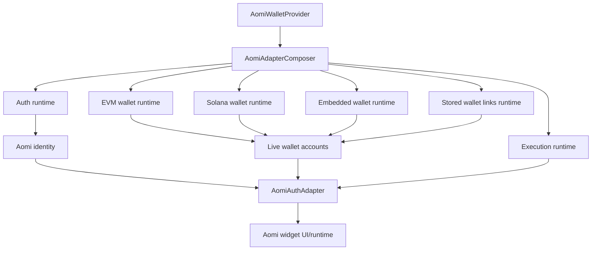
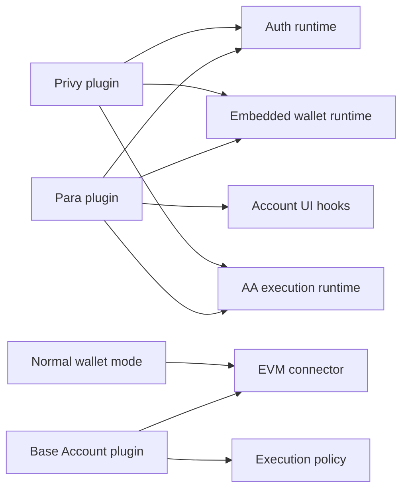
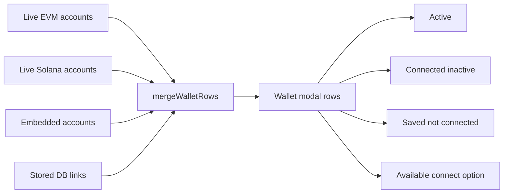

# Wallet Provider Plugin Refactor Plan

## Purpose

The wallet/auth layer should not be permanently shaped around Para. Para is a
valuable provider, but Aomi core should work with no hosted auth, normal EVM
wallets, Solana wallets, Base Account, Privy, Para, or a future custom auth
provider. This document describes the target design and a migration plan from
the current branch state toward a provider-neutral composer.

The goal is:

- Aomi widget users can choose whether they want hosted auth.
- Para, Privy, custom auth, and no-auth modes all plug into the same core.
- Normal wallets like MetaMask, Rabby, WalletConnect, Phantom, and Solflare are
  not conceptually owned by Para.
- Base Account fits as an EVM connector and execution option, not a hosted-auth
  provider.
- Account abstraction and sponsorship are execution capabilities, not Para-only
  concepts.
- Later DB-linked wallets can be merged into the same modal as live wallets.

## Current State

This branch has already extracted a generic EVM wallet runtime into:

```txt
apps/registry/src/lib/aomi-auth-adapter/runtime/evm/wallet-runtime.ts
```

That runtime owns generic wagmi concerns:

- wagmi connectors and live connections
- wallet option building
- active EVM account lookup
- active EVM account selection
- brand-correct wallet connect
- EVM account disconnect planning
- chain switching
- wagmi capability and signing hooks
- registry command execution for wagmi reconnect/connect/disconnect

The Para provider now composes that runtime instead of owning all wagmi details.
However, `providers/para/para.tsx` is still large because it remains the top
level adapter composer for:

- Para auth/session/modal
- EVM runtime
- Solana runtime-ish methods
- identity synthesis
- transaction/signing adapter methods
- Para AA owner/session resolution
- final `AomiAuthAdapter` object construction

So the branch is better, but not at the final architecture.

## Target Mental Model

The target is capability lanes, not vendor lanes.



Providers like Para and Privy can supply multiple lanes, but Aomi core should
consume generic lane interfaces.



## Core Responsibilities

### Aomi Core

Aomi core should own:

- final `AomiAuthAdapter` construction
- identity merge
- account row merge
- active wallet selection
- wallet modal data model
- connect/disconnect routing
- transaction/signature routing
- UserState sync through `AomiAuthAdapterProvider`
- backend wallet link merge when available
- graceful behavior when optional lanes are absent

Aomi core should not ask "is this Para?" except in provider plugin code.

### Auth Runtime

Auth answers: who is the app/user subject?

It should not be responsible for normal external wallet connections.

Examples:

- Para social/email auth
- Privy social/email auth
- custom app auth
- no hosted auth

### EVM Wallet Runtime

EVM runtime answers: what EVM wallets are live and what can wagmi do?

It should own:

- MetaMask/Rabby/WalletConnect/Base Account connectors
- active EVM account
- EVM connect/disconnect
- EVM chain switching
- EVM sign/send primitives
- wagmi capability discovery

### Solana Runtime

Solana runtime answers: what SVM wallets are live and what can they sign?

It should own:

- Phantom/Solflare/Backpack/Glow options
- active Solana wallet
- Solana network selection
- Solana transaction/message signing
- Solana send/direct-send support

### Embedded Wallet Runtime

Embedded wallet runtime answers: what wallets are managed by a hosted provider?

Examples:

- Para embedded EVM/Solana wallet
- Privy embedded wallet
- future Aomi-managed embedded wallet

Embedded wallets may depend on auth, but they should still be represented as
wallet accounts, not as auth itself.

### Execution Runtime

Execution answers: how do we execute a requested transaction?

It should combine:

- EVM plain wallet send
- EVM EIP-5792/sendCalls behavior
- 4337/7702 AA provider state
- sponsorship/paymaster config
- Base Account smart account behavior
- Solana sign/send methods

Para-specific AA owner resolution belongs in the Para execution plugin. The
composer should only see a generic AA runtime.

### Wallet Links Runtime

Wallet links answer: what wallets does the backend know belong to this user?

This enables modal rows like:

- active now
- connected but inactive
- saved in DB but not connected in this browser
- linked via Para/Privy/challenge/import

## Proposed Public Configuration

The top-level provider should make lanes explicit and optional.

```ts
type AomiWalletProviderProps = {
  auth?: AuthConfig | false;
  evm?: EvmRuntimeConfig | false;
  solana?: SolanaRuntimeConfig | false;
  embeddedWallet?: EmbeddedWalletConfig | false;
  execution?: ExecutionConfig;
  walletLinks?: WalletLinksConfig | false;
  requirements?: AppWalletRequirements;
  children: React.ReactNode;
};
```

Examples:

```tsx
<AomiWalletProvider
  auth={{ provider: "para" }}
  embeddedWallet={{ provider: "para" }}
  evm={{ connectors: ["metamask", "rabby", "walletconnect"] }}
  solana={{ wallets: ["phantom", "solflare"] }}
  execution={{ aa: "optional", sponsorship: "optional" }}
/>
```

```tsx
<AomiWalletProvider
  auth={false}
  embeddedWallet={false}
  evm={{ connectors: ["metamask", "rabby", "walletconnect"] }}
  solana={false}
  execution={{ mode: "wallet" }}
/>
```

```tsx
<AomiWalletProvider
  auth={false}
  evm={{ connectors: ["baseAccount"] }}
  solana={false}
  execution={{ provider: "baseAccount", sponsorship: "optional" }}
/>
```

```tsx
<AomiWalletProvider
  auth={{ provider: "custom", getSession, login, logout }}
  evm={{ connectors: ["metamask", "rabby"] }}
  walletLinks={{ source: "aomi-backend" }}
/>
```

## Proposed Interfaces

### Auth Runtime

```ts
type AuthProviderId = "none" | "para" | "privy" | "custom";

type AuthRuntime = {
  status: "booting" | "connected" | "disconnected";
  provider: AuthProviderId;
  subject?: string;
  claims?: AuthClaims;
  methods: AuthMethodOption[];
  login?: (methodId?: string) => Promise<void>;
  logout?: () => Promise<void>;
  openAccountUI?: () => Promise<void>;
  getCredential?: () => Promise<AomiAccountCredential | null>;
};

type AuthClaims = {
  email?: string;
  phone?: string;
  username?: string;
  verifiedAt?: number;
};

type AuthMethodOption = {
  id: string;
  label: string;
  provider: AuthProviderId;
  kind: "social" | "email" | "phone" | "passkey" | "custom";
  iconUrl?: string;
};
```

Para maps to this by exposing subject, email/auth method, login modal, logout,
account UI, and `issueJwt`.

Privy maps to this by exposing Privy user id, linked account claims, login,
logout, access token, and account UI if available.

Custom auth maps to this from the host app's own session.

### Embedded Wallet Runtime

```ts
type EmbeddedWalletRuntime = {
  provider: "para" | "privy" | "custom";
  status: "ready" | "unavailable";
  accounts: EmbeddedWalletAccount[];
  createOrConnect?: (family?: WalletFamily) => Promise<void>;
  openWalletUI?: () => Promise<void>;
};

type EmbeddedWalletAccount = {
  id: string;
  family: "evm" | "solana";
  address: string;
  walletKind: "eoa" | "smart-account";
  ownerSubject?: string;
  label?: string;
  manageable?: boolean;
};
```

This keeps "logged in with Para" separate from "using a Para embedded wallet".

### Wallet Runtime

```ts
type WalletRuntime<Family extends WalletFamily> = {
  family: Family;
  status: "ready" | "unavailable";
  accounts: WalletAccount[];
  options: WalletConnectOption[];
  activeAccount?: WalletAccount;
  supportedNetworks: NetworkOption[];

  connect: (optionId?: string) => Promise<void>;
  disconnect: (accountId?: string) => Promise<void>;
  selectAccount: (accountId: string) => Promise<void>;
  selectNetwork?: (networkId: string | number) => Promise<void>;
};

type WalletAccount = {
  id: string;
  family: "evm" | "solana";
  address: string;
  walletName?: string;
  chainId?: number;
  networkId?: string;
  active: boolean;
  source: "external" | "embedded" | "stored";
  provider?: "wagmi" | "para" | "privy" | "baseAccount" | "custom";
  manageable?: boolean;
};

type WalletConnectOption = {
  id: string;
  label: string;
  family: "evm" | "solana" | "multichain";
  kind: "evm" | "solana" | "walletconnect" | "social" | "embedded";
  status: "installed" | "available" | "qr" | "unavailable";
  iconUrl?: string;
};
```

The current `useEvmWalletRuntime` is a first step toward the EVM implementation.
Solana should get an equivalent runtime instead of living inside Para.

### Execution Runtime

```ts
type ExecutionRuntime = {
  evm?: EvmExecutionRuntime;
  solana?: SolanaExecutionRuntime;
};

type EvmExecutionRuntime = {
  sendTransaction: (payload: WalletTxPayload) => Promise<AomiTxResult>;
  signTypedData: (
    payload: WalletEip712Payload,
  ) => Promise<{ signature: string }>;
  signMessage: (payload: WalletEip712Payload) => Promise<{ signature: string }>;
  aa?: AARuntime;
};

type SolanaExecutionRuntime = {
  signTransaction: (
    payload: WalletSolanaSignPayload,
  ) => Promise<{ signedTx: string }>;
  signMessage?: (
    payload: WalletSolanaSignMessagePayload,
  ) => Promise<{ signature: string }>;
  sendTransaction?: (
    payload: WalletSolanaSignPayload,
  ) => Promise<{ signature: string; signedTx?: string }>;
  signAndSendTransaction?: (
    payload: WalletSolanaSignPayload,
  ) => Promise<{ signature: string; signedTx?: string }>;
};
```

### AA Runtime

```ts
type AARuntime = {
  modes: Array<"4337" | "7702">;
  sponsorship: SponsorshipState;
  resolveProviderState: ResolveAAProviderState;
};

type SponsorshipState = {
  enabled: boolean;
  provider?: "alchemy" | "pimlico" | "coinbase" | "self";
  account?: string;
};
```

Para can resolve AA state using the Para session as owner. Base Account can
resolve execution through Coinbase smart account behavior. Normal EOA wallets
can omit `aa` unless a separate AA flow is configured.

### Wallet Links Runtime

```ts
type WalletLinksRuntime = {
  status: "loading" | "ready" | "disabled" | "error";
  links: StoredWalletLink[];
  refresh: () => Promise<void>;
  linkCurrentWallet?: (accountId: string) => Promise<void>;
  unlinkWallet?: (walletId: string) => Promise<void>;
};

type StoredWalletLink = {
  id: string;
  family: "evm" | "solana";
  address: string;
  linkedVia: "para" | "privy" | "challenge" | "import";
  authSubject: string;
  label?: string;
  verifiedAt: number;
};
```

## Account Row Merge

The composer should merge live wallets, embedded wallets, and stored links into
a single modal model.



Suggested row shape:

```ts
type WalletModalRow = {
  id: string;
  family: "evm" | "solana";
  address?: string;
  label: string;
  walletName?: string;
  source: "live" | "embedded" | "stored" | "option";
  status: "active" | "connected" | "stored" | "available" | "unavailable";
  provider?: string;
  actions: WalletRowAction[];
};

type WalletRowAction =
  | { kind: "select"; label: string }
  | { kind: "connect"; label: string }
  | { kind: "disconnect"; label: string }
  | { kind: "manage"; label: string }
  | { kind: "link"; label: string }
  | { kind: "unlink"; label: string };
```

## Desired Folder Structure

```txt
lib/aomi-auth-adapter/
  composer/
    AomiAdapterComposer.tsx
    build-identity.ts
    build-accounts.ts
    build-methods.ts
    merge-wallet-rows.ts
    types.ts

  runtime/
    evm/
      EvmRuntimeProvider.tsx
      use-evm-wallet-runtime.ts
      wallet-options.ts
      registry-source.ts
      disconnect-plan.ts
      safe-hooks.ts
    solana/
      SolanaRuntimeProvider.tsx
      use-solana-wallet-runtime.ts
      transactions.ts
      networks.ts
      registry-source.ts

  registry/
    reducer.ts
    policy.ts
    store.ts
    selectors.ts
    persistence.ts
    types.ts

  providers/
    para/
      ParaPluginProvider.tsx
      para-auth.ts
      para-embedded-wallet.ts
      para-aa.ts
      para-evm-config.ts
      index.ts
    privy/
      PrivyPluginProvider.tsx
      privy-auth.ts
      privy-embedded-wallet.ts
      privy-aa.ts
      index.ts
    base-account/
      BaseAccountPluginProvider.tsx
      base-account-connector.ts
      base-account-execution.ts
      index.ts
```

## Provider Roles

### Para

Para plugin should provide:

- hosted auth
- auth claims and subject
- Para JWT credential
- hosted account modal
- embedded wallet account discovery
- optional embedded wallet connect/create
- AA owner/session resolver
- optional Para EVM connector config

Para should not own:

- normal EVM active wallet selection
- generic EVM wallet options
- generic EVM disconnect
- generic chain switching
- final adapter construction
- Solana generic signing implementation

### Privy

Privy plugin should provide:

- hosted auth
- auth claims and subject
- access token credential
- embedded wallet accounts
- optional smart wallet/AA capabilities
- account UI if available

Privy should plug into the same interfaces as Para.

### Base Account

Base Account should fit as:

- EVM connector config
- smart account wallet runtime through wagmi
- execution/sponsorship policy

It is not primarily an auth provider.

### No Hosted Auth

No-auth mode should still support:

- MetaMask/Rabby/WalletConnect EVM
- Base Account if configured
- Solana wallets if configured
- plain wallet execution
- challenge-based wallet linking later

## Migration Plan

### Phase 1: Stabilize Current Extraction

Status: mostly complete in this branch.

- Keep `runtime/evm/wallet-runtime.ts`.
- Keep Para consuming the EVM runtime through provider hooks.
- Keep tests passing.
- Keep registry artifacts updated.
- Document current compatibility debt.

Compatibility debt:

- Registry command still says `para/logout`.
- Disconnect plan still exposes `isParaAccount`.
- Para file still composes identity, account rows, methods, Solana, and AA.

### Phase 2: Extract Generic Composer

Create:

```txt
lib/aomi-auth-adapter/composer/AomiAdapterComposer.tsx
```

Move out of Para:

- identity synthesis
- account merge
- `connect` routing
- `disconnect` routing
- `selectNetwork` routing
- final `AomiAuthAdapter` object construction

The composer consumes:

```ts
type AomiAdapterComposerProps = {
  auth: AuthRuntime;
  evm?: EvmWalletRuntime;
  solana?: SolanaWalletRuntime;
  embedded?: EmbeddedWalletRuntime;
  execution: ExecutionRuntime;
  walletLinks?: WalletLinksRuntime;
  children: React.ReactNode;
};
```

### Phase 3: Extract Solana Runtime

Move Solana work out of Para:

- `useSafeSolanaWallet`
- wallet descriptors
- `connectPreferredSolanaWallet`
- Solana pending connect handling
- Solana sign/send methods
- base64 tx helpers

Target:

```txt
runtime/solana/use-solana-wallet-runtime.ts
runtime/solana/transactions.ts
```

Para can still provide a Para Solana provider wrapper, but generic Solana
runtime owns the wallet behavior.

### Phase 4: Split Para Plugin

Replace large `para.tsx` with smaller files:

```txt
providers/para/ParaPluginProvider.tsx
providers/para/para-auth.ts
providers/para/para-embedded-wallet.ts
providers/para/para-aa.ts
providers/para/para-evm-config.ts
```

The Para component should mostly mount providers and pass plugin runtimes into
the composer.

### Phase 5: Make Base Account a Connector/Execution Plugin

Refactor Base Account so it contributes:

- EVM connector runtime config
- execution policy
- sponsorship metadata

Avoid treating it as equivalent to Para/Privy hosted auth.

### Phase 6: Add Wallet Links Runtime

Add backend-linked wallet rows keyed by auth subject/email/user id.

Flow:

```mermaid
sequenceDiagram
  participant Auth
  participant Links as WalletLinksRuntime
  participant API as Aomi Backend
  participant Modal

  Auth->>Links: subject/credential available
  Links->>API: GET /account/wallets
  API-->>Links: stored wallet links
  Links-->>Modal: saved wallet rows
  Modal->>Links: link/unlink actions
```

### Phase 7: Provider-Neutral Naming Cleanup

Rename compatibility concepts:

- `para/logout` command to `provider/logout`
- `paraDetached` to `embeddedDetached` or provider-scoped metadata
- `preferParaOnConnect` to `preferProviderEmbeddedOnConnect`
- `isParaAccount` to `isProviderOwnedAccount`

This should be done after the composer exists so tests can be rewritten around
generic behavior instead of Para-specific reducer events.

## Testing Strategy

Required test groups:

- registry reducer/policy/store
- EVM runtime hook behavior with mocked wagmi
- Solana runtime behavior with mocked wallet adapter
- composer identity building
- account row merging
- no-auth wallet-only mode
- Para auth + external EVM mode
- Para auth + embedded wallet mode
- Privy auth equivalent mode
- Base Account mode
- DB-linked wallet rows

Manual/browser flows:

- connect MetaMask without Para
- connect Rabby without Para
- connect WalletConnect without Para
- connect Para social auth
- connect Para embedded EVM
- connect Para auth while active wallet is Rabby
- disconnect only embedded account
- disconnect all
- connect Phantom/Solflare
- switch EVM chain
- switch Solana network
- execute plain EVM tx
- execute AA EVM tx
- sign EIP-712
- sign Solana message/tx

## Success Criteria

The refactor is done when:

- `AomiParaProvider` is small and only Para-specific.
- Normal EVM wallet mode works without Para mounted.
- Normal Solana wallet mode works without Para mounted.
- Base Account works as an EVM connector/execution option.
- Para and Privy can both provide social sign-in rows through the same modal
  interface.
- Embedded wallets are represented as wallet accounts, not as auth itself.
- The composer owns final `AomiAuthAdapter` assembly.
- Provider-specific code is isolated under `providers/<provider>/`.
- Registry JSON installs include all imported files.
- Existing current behavior is preserved.

## Open Questions

- Should `AomiWalletProvider` expose low-level runtime props, or only named
  presets such as `mode="wallets-only"` and `authProvider="para"`?
- Should embedded wallets be shown in the same "wallets" section or a separate
  "account wallets" section?
- Should Base Account appear as a wallet option, an execution mode, or both?
- Should DB-linked wallets require hosted auth, or also support challenge-based
  wallet-only accounts?
- Should `walletProvider` in `AomiAuthIdentity` mean auth provider, active
  signer provider, or execution provider? It may need to split into multiple
  fields.
