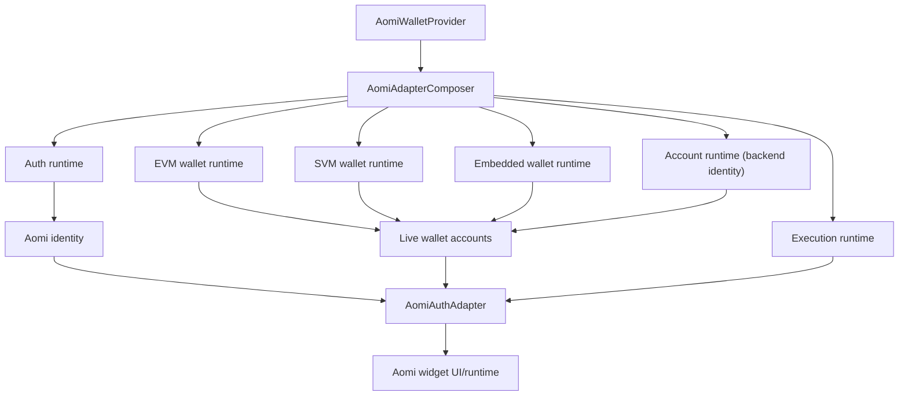
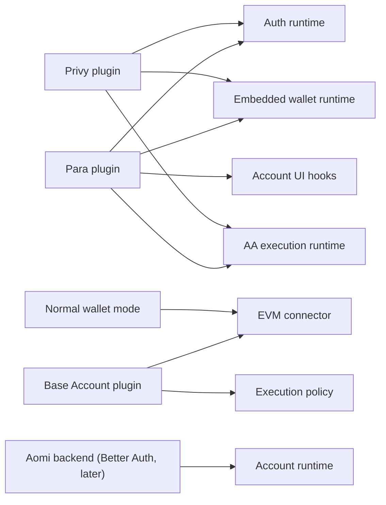
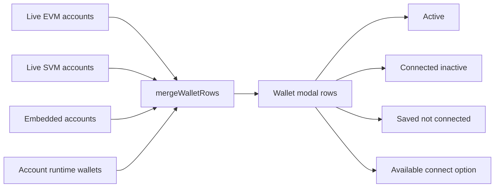

# Wallet Provider Plugin Refactor Plan

## Purpose

The wallet/auth layer should not be permanently shaped around Para. Para is a
valuable provider, but Aomi core should work with no hosted auth, normal EVM
wallets, SVM wallets, Base Account, Privy, Para, or a future custom auth
provider. This document describes the target design and the migration plan from
the current branch state toward a provider-neutral composer.

The end state of **this PR** is "frontend-complete, backend-ready":

- Everything that works today keeps working: Para auth, MetaMask/Rabby/
  WalletConnect, Phantom/Solflare, wallet switching, AA, network switching.
- Persistence stays the localStorage registry key. "Remembering" wallets is
  per-browser only — there is no DB yet.
- A typed, stubbed **Account Runtime** seam exists so that when the backend
  (Next.js server functions + Better Auth) lands, stored/linked wallets light
  up in the same modal with zero composer changes.
- Para, Privy, custom auth, and no-auth modes all plug into the same core.
- Normal wallets are not conceptually owned by Para.
- Account abstraction and sponsorship are execution capabilities, not Para-only
  concepts.

## Relationship to Other Documents

This plan supersedes the refactor sections of `WALLET-ARCHITECTURE.md` (§12–13)
and continues where `WALLET-REFACTOR-PLAN.md` (registry extraction, executed)
left off. `WALLET-FOLLOWUP-FIXES.md` items landed on this branch before this
plan executes (baseline verified 2026-06-12: 110 registry tests green, F1 fix
present in `context.tsx`). The backend identity model references
`meeting-2026-06-10-wallet-auth-backend-frontend.md`.

## Decisions (locked 2026-06-12)

These were open questions; they are now decisions. Do not re-litigate during
execution.

1. **Auth is singular per deployment.** Exactly one `AuthRuntime` mounts at a
   time (`para` | `privy` | `custom` | none). Multiplicity lives in
   `methods[]` — one runtime exposes many sign-in methods (email, Google,
   later wallet-sign-in). Two hosted-auth SDKs mounted simultaneously means
   two modal stacks and two opinions about the wagmi config; there is no
   product pull for it, and the Better Auth future inverts the hierarchy
   anyway (Better Auth becomes *the* auth; Para/Privy demote to login
   front-ends + embedded-wallet providers).
2. **Canonical identity is minted by the backend, not by providers.** The
   provider subject (Para subject, Privy user id) is a *linked account under*
   the canonical Aomi user, never the root identity. Until Better Auth lands,
   the widget keeps provider-subject identity and the existing
   `POST /api/account/sessions/exchange` seam.
3. **Aomi session transport will be same-origin cookie** (Next.js server
   functions + Better Auth). The Account Runtime is specified as same-origin
   fetch with `credentials: "include"`; no bearer-token assumption is baked
   into the widget. `getCredential()` exists only for the provider-token
   exchange step, which moves server-side later.
4. **Users are keyed by email for now.** Wallet-only (challenge/SIWE) signup is
   not built in this PR. We reserve `kind: "wallet"` in `AuthMethodOption` so
   it can become a method of the Better-Auth-backed runtime later.
5. **Approval granularity is deferred.** A wallet being in the DB must not
   imply write authority (impersonation risk from the 2026-06-10 meeting).
   Whether consent is per-wallet, per-session, or per-action is decided with
   the backend work. This PR only reserves an optional `capability` field on
   the stored wallet type so the row model never needs reshaping.
6. **Stored-row click behaviors**: a stored external wallet that is not
   connected in this browser → clicking attempts connect via the matching
   connector. A stored embedded wallet whose provider is signed out →
   clicking triggers `auth.login`. `WalletRowAction` gains
   `{ kind: "authenticate" }`.
7. **Connector supply stays Para-branded in Para mode for this PR.** The
   runtime layer is already connector-source-agnostic (generic EIP-6963
   detection, brand sniffing, dedupe; Privy mode builds its own plain wagmi
   config), but in Para mode MetaMask/Rabby are still supplied by
   `@getpara/evm-wallet-connectors`. Migrating them to plain 6963 connectors
   would destabilize flows that just got stable — it is a named deferred
   phase, not part of this PR.
8. **Bring-your-own connect UI (RainbowKit etc.) is compatible by
   construction** and costs us a spec note, not a build: any wagmi-based
   connect modal writes connections into the same wagmi config the registry
   sources observe. A config hook to replace the picker's connect-options
   section is deferred work.
9. **Low-level lane props are the real public API.** Named presets
   (`mode="wallets-only"`) are future sugar that compiles down to lane config.
10. **Embedded wallets render in the same wallets section** as external ones
    (current behavior), carrying their provider on the row. Revisit with
    design later if needed.
11. There is no "preview wallet" concept (transcription artifact — it was
    "Privy wallet"). Privy embedded wallets are covered by the embedded lane.

## Current State

This branch already has:

```txt
apps/registry/src/lib/aomi-auth-adapter/
  registry/            # WalletRegistry pure core: reducer, policy, commands,
                       # store, selectors, persistence, use-wallet-registry
  runtime/evm/         # generic EVM runtime: provider.tsx, wallet-runtime.ts,
                       # brands.ts, disconnect-plan.ts, identity-grace.ts,
                       # registry-source.ts, safe-hooks.ts
  runtime/solana/      # partial: networks.ts, registry-source.ts
  providers/para/      # para.tsx (~1.2k lines), para-sol.tsx, para-aa.ts,
                       # para-evm-runtime.tsx, sources/para-session-source.ts
  providers/privy/     # adapter-contract implementation, own wagmi config
  providers/base-account/
```

The EVM runtime owns generic wagmi concerns (connectors/connections, wallet
option building, active account lookup/selection, brand-correct connect,
disconnect planning, chain switching, capability/signing hooks, registry
command execution). The registry owns active-wallet-per-family, heal, and
disconnect intent as reducer transitions.

`providers/para/para.tsx` is still the top-level composer for:

- Para auth/session/modal
- EVM runtime consumption
- SVM wallet methods (via `para-sol.tsx`)
- identity synthesis
- transaction/signing adapter methods
- Para AA owner/session resolution
- final `AomiAuthAdapter` object construction

Compatibility debt carried into this plan:

- Registry command still says `para/logout`.
- Disconnect plan still exposes `isParaAccount`.
- Para file still composes identity, account rows, methods, SVM, and AA.
- In Para mode, MetaMask/Rabby connectors are Para-branded (decision 7).

## Target Mental Model

The target is capability lanes, not vendor lanes.



Providers like Para and Privy can supply multiple lanes, but Aomi core consumes
generic lane interfaces.



## Session & Credential Model

There are two sessions, and the plan keeps them distinct:

1. **Provider session** — the Para/Privy/custom session living in the browser.
   It is a *credential source*: `getCredential()` yields a provider token.
2. **Aomi session** — the canonical user resolved by the Aomi backend.
   - **Today**: the widget exchanges the provider token via
     `createAccountAccessTokenProvider` →
     `POST /api/account/sessions/exchange` (shipped; accepts both providers).
   - **Later**: the host Next.js app runs Better Auth. The Aomi session is a
     same-origin cookie; the exchange happens server-side; the Account Runtime
     fetches same-origin with `credentials: "include"`. The Para/Privy modal
     remains the browser-side login front end whose token the server exchanges
     into a Better Auth session.

The canonical user owns *linked accounts* (Para identity, Google, Privy, …)
and *wallets* (external, embedded), per the meeting's data model
(`users` / `linked_accounts` / `wallet_links` / `wallet_approvals`). Linking a
wallet is **not** authorization to act with it — approvals are a separate,
backend-owned concern (decision 5).

```ts
type AomiAccountCredential =
  | { kind: "token"; provider: AuthProviderId; token: string }
  | { kind: "cookie" }; // same-origin session; nothing to attach client-side
```

## Core Responsibilities

### Aomi Core

Aomi core should own:

- final `AomiAuthAdapter` construction
- identity merge
- account row merge (live + embedded + stored)
- active wallet selection
- wallet modal data model
- connect/disconnect/authenticate routing
- transaction/signature routing
- UserState sync through `AomiAuthAdapterProvider`
- backend account merge when the Account Runtime is enabled
- graceful behavior when optional lanes are absent

Aomi core should not ask "is this Para?" except in provider plugin code.

### Auth Runtime

Auth answers: which provider session exists in this browser, and what
credential can it yield? It is **not** the canonical identity (decision 2) and
is not responsible for normal external wallet connections.

Examples: Para social/email auth, Privy social/email auth, custom app auth,
no hosted auth.

### EVM Wallet Runtime

EVM runtime answers: what EVM wallets are live and what can wagmi do?

It owns: MetaMask/Rabby/WalletConnect/Base Account connectors, active EVM
account, EVM connect/disconnect, chain switching, sign/send primitives, wagmi
capability discovery. (Largely exists: `runtime/evm/`.)

### SVM Wallet Runtime

SVM runtime answers: what SVM wallets are live and what can they sign?

It owns: Phantom/Solflare/Backpack/Glow options, active SVM wallet, SVM
network selection, SVM transaction/message signing, send/direct-send support.
(`runtime/solana/` exists for networks + registry source; wallet behavior
still lives in `para-sol.tsx` — Phase 3 moves it.)

### Embedded Wallet Runtime

Embedded wallet runtime answers: what wallets are managed by a hosted
provider? (Para embedded EVM/SVM, Privy embedded, future Aomi-managed.)

Embedded wallets may depend on auth, but they are represented as wallet
accounts, not as auth itself.

### Execution Runtime

Execution answers: how do we execute a requested transaction? It combines EVM
plain send, EIP-5792/sendCalls, 4337/7702 AA provider state,
sponsorship/paymaster config, Base Account smart-account behavior, and SVM
sign/send. Para-specific AA owner resolution belongs in the Para execution
plugin; the composer only sees a generic AA runtime.

### Account Runtime

The Account Runtime answers: **what does the Aomi backend know about this
user?** Canonical user, linked auth accounts, stored wallets, and (later)
approval state. This is deliberately broader than "wallet links" — the backend
resolves identity across providers, not just wallet rows.

In this PR it ships as **types + a `disabled` stub**. The composer's merge
path consumes it from day one but always receives empty data. When Better Auth
lands, one runtime implementation against the Next.js server functions makes
stored rows appear — no composer changes.

This enables modal rows like: active now; connected but inactive; saved in DB
but not connected in this browser; embedded wallet known to the DB while its
provider is signed out (clicking prompts auth).

## Proposed Public Configuration

```ts
type AomiWalletProviderProps = {
  auth?: AuthConfig | false;            // exactly one provider (decision 1)
  evm?: EvmRuntimeConfig | false;
  svm?: SvmRuntimeConfig | false;
  embeddedWallet?: EmbeddedWalletConfig | false;
  execution?: ExecutionConfig;
  account?: AccountConfig | false;      // backend identity; false until backend exists
  requirements?: AppWalletRequirements;
  children: React.ReactNode;
};
```

Examples:

```tsx
<AomiWalletProvider
  auth={{ provider: "para" }}
  embeddedWallet={{ provider: "para" }}
  evm={{ connectors: ["metamask", "rabby", "walletconnect"] }}
  svm={{ wallets: ["phantom", "solflare"] }}
  execution={{ aa: "optional", sponsorship: "optional" }}
/>
```

```tsx
<AomiWalletProvider
  auth={false}
  embeddedWallet={false}
  evm={{ connectors: ["metamask", "rabby", "walletconnect"] }}
  svm={false}
  execution={{ mode: "wallet" }}
/>
```

```tsx
<AomiWalletProvider
  auth={{ provider: "custom", getSession, login, logout }}
  evm={{ connectors: ["metamask", "rabby"] }}
  account={{ source: "aomi-backend" }}
/>
```

## Proposed Interfaces

### Auth Runtime

```ts
type AuthProviderId = "none" | "para" | "privy" | "custom";

type AuthRuntime = {
  status: "booting" | "authenticated" | "unauthenticated";
  provider: AuthProviderId;
  subject?: string; // provider-scoped subject — NOT the canonical Aomi user id
  claims?: AuthClaims;
  methods: AuthMethodOption[];
  login?: (methodId?: string) => Promise<void>;
  logout?: () => Promise<void>;
  openAccountUI?: () => Promise<void>;
  getCredential?: () => Promise<AomiAccountCredential | null>;
};

type AuthClaims = {
  email?: string;
  phone?: string;
  username?: string;
  verifiedAt?: number;
};

type AuthMethodOption = {
  id: string;
  label: string;
  provider: AuthProviderId;
  kind: "social" | "email" | "phone" | "passkey" | "wallet" | "custom";
  // "wallet" is reserved for future SIWE/challenge sign-in (decision 4);
  // no implementation in this PR.
  iconUrl?: string;
};
```

Para maps to this via subject, email/auth method, login modal, logout, account
UI, and `issueJwt`. Privy maps via Privy user id, linked account claims,
login/logout, access token, account UI. Custom auth maps from the host app's
session (with Better Auth this becomes the cookie-session runtime).

### Embedded Wallet Runtime

```ts
type EmbeddedWalletRuntime = {
  provider: "para" | "privy" | "custom";
  status: "ready" | "unavailable";
  accounts: EmbeddedWalletAccount[];
  createOrConnect?: (family?: WalletFamily) => Promise<void>;
  openWalletUI?: () => Promise<void>;
};

type EmbeddedWalletAccount = {
  id: string;
  family: "evm" | "svm";
  address: string;
  walletKind: "eoa" | "smart-account";
  ownerSubject?: string;
  label?: string;
  manageable?: boolean;
};
```

This keeps "logged in with Para" separate from "using a Para embedded wallet".

### Wallet Runtime

```ts
type WalletRuntime<Family extends WalletFamily> = {
  family: Family;
  status: "ready" | "unavailable";
  accounts: WalletAccount[];
  options: WalletConnectOption[];
  activeAccount?: WalletAccount;
  supportedNetworks: NetworkOption[];

  connect: (optionId?: string) => Promise<void>;
  disconnect: (accountId?: string) => Promise<void>;
  selectAccount: (accountId: string) => Promise<void>;
  selectNetwork?: (networkId: string | number) => Promise<void>;
};

type WalletAccount = {
  id: string;
  family: "evm" | "svm";
  address: string;
  walletName?: string;
  chainId?: number;
  networkId?: string;
  active: boolean;
  source: "external" | "embedded" | "stored";
  provider?: "wagmi" | "para" | "privy" | "baseAccount" | "custom";
  manageable?: boolean;
};

type WalletConnectOption = {
  id: string;
  label: string;
  family: "evm" | "svm" | "multichain";
  kind: "evm" | "svm" | "walletconnect" | "social" | "embedded";
  status: "installed" | "available" | "qr" | "unavailable";
  iconUrl?: string;
};
```

`runtime/evm/wallet-runtime.ts` is the EVM implementation. SVM gets the
equivalent in `runtime/solana/` (Phase 3) instead of living inside Para.

### Execution Runtime

```ts
type ExecutionRuntime = {
  evm?: EvmExecutionRuntime;
  svm?: SvmExecutionRuntime;
};

type EvmExecutionRuntime = {
  sendTransaction: (payload: WalletTxPayload) => Promise<AomiTxResult>;
  signTypedData: (
    payload: WalletEip712Payload,
  ) => Promise<{ signature: string }>;
  signMessage: (payload: WalletEip712Payload) => Promise<{ signature: string }>;
  aa?: AARuntime;
};

type SvmExecutionRuntime = {
  signTransaction: (
    payload: WalletSvmSignPayload,
  ) => Promise<{ signedTx: string }>;
  signMessage?: (
    payload: WalletSvmSignMessagePayload,
  ) => Promise<{ signature: string }>;
  sendTransaction?: (
    payload: WalletSvmSignPayload,
  ) => Promise<{ signature: string; signedTx?: string }>;
  signAndSendTransaction?: (
    payload: WalletSvmSignPayload,
  ) => Promise<{ signature: string; signedTx?: string }>;
};
```

### AA Runtime

```ts
type AARuntime = {
  modes: Array<"4337" | "7702">;
  sponsorship: SponsorshipState;
  resolveProviderState: ResolveAAProviderState;
};

type SponsorshipState = {
  enabled: boolean;
  provider?: "alchemy" | "pimlico" | "coinbase" | "self";
  account?: string;
};
```

Para resolves AA state using the Para session as owner. Base Account resolves
execution through Coinbase smart-account behavior. Normal EOA wallets omit
`aa` unless a separate AA flow is configured.

### Account Runtime

```ts
type AccountRuntime = {
  status: "disabled" | "loading" | "ready" | "error";
  user?: AomiUserRef;
  linkedAccounts: LinkedAuthAccount[];
  wallets: AccountWallet[];
  refresh: () => Promise<void>;
  linkWallet?: (accountId: string) => Promise<void>;
  unlinkWallet?: (walletId: string) => Promise<void>;
};

type AomiUserRef = {
  id: string; // canonical Aomi user id (Better Auth user), minted by backend
  displayName?: string;
  email?: string;
};

type LinkedAuthAccount = {
  id: string;
  provider: string; // "para" | "privy" | "google" | ...
  subject: string;  // provider-scoped subject
  email?: string;
  linkedAt?: number;
};

type AccountWallet = {
  id: string;
  family: "evm" | "svm";
  address: string;
  kind?: "external" | "embedded";
  provider?: string; // managing provider for embedded wallets
  linkedVia: "para" | "privy" | "challenge" | "import" | "observed";
  label?: string;
  verifiedAt?: number; // absent for imported/observed wallets
  capability?: "read" | "write"; // reserved — approval model TBD (decision 5)
};
```

Notes:

- The provider subject points at the canonical user, never the reverse. The
  Para subject is one `LinkedAuthAccount`, not the root.
- Para's external wallets in NONE connection mode are local wagmi connections,
  **not** Para-account-associated (verified in `WALLET-ARCHITECTURE.md`). So
  wallet→user linking for external wallets goes through the Aomi backend
  (`challenge` / `observed`), not Para's account-linking API. `linkedVia:
  "para"` realistically covers embedded wallets only.
- The runtime fetches same-origin with cookie credentials (decision 3). The
  `disabled` stub returns `status: "disabled"` with empty arrays.

## Account Row Merge

The composer merges live wallets, embedded wallets, and stored account wallets
into a single modal model.



Merge rules:

- Match stored rows to live rows by `(family, lowercased address)` — a stored
  wallet that is also live renders as one row (live status wins; the row
  carries `linked: true`).
- A stored **external** wallet with no live connection → `status: "stored"`,
  primary action `connect` (decision 6). Fallback UX when the extension is
  absent (WalletConnect vs install hint) is decided at implementation time in
  the Better Auth PR.
- A stored **embedded** wallet whose provider is signed out →
  `status: "stored"`, primary action `authenticate` → routes to `auth.login`
  (decision 6).

```ts
type WalletModalRow = {
  id: string;
  family: "evm" | "svm";
  address?: string;
  label: string;
  walletName?: string;
  source: "live" | "embedded" | "stored" | "option";
  status: "active" | "connected" | "stored" | "available" | "unavailable";
  provider?: string;
  linked?: boolean;               // known to the backend
  capability?: "read" | "write";  // reserved (decision 5)
  actions: WalletRowAction[];
};

type WalletRowAction =
  | { kind: "select"; label: string }
  | { kind: "connect"; label: string }
  | { kind: "authenticate"; label: string }
  | { kind: "disconnect"; label: string }
  | { kind: "manage"; label: string }
  | { kind: "link"; label: string }
  | { kind: "unlink"; label: string };
```

## Desired Folder Structure

Synced to the real tree; `(new)` marks what this plan creates.

```txt
lib/aomi-auth-adapter/
  composer/                          (new, Phase 2)
    AomiAdapterComposer.tsx
    build-identity.ts
    build-accounts.ts
    build-methods.ts
    merge-wallet-rows.ts
    types.ts

  runtime/
    evm/                             (exists)
      provider.tsx
      wallet-runtime.ts
      brands.ts
      disconnect-plan.ts
      identity-grace.ts
      registry-source.ts
      safe-hooks.ts
    solana/
      networks.ts                    (exists)
      registry-source.ts             (exists)
      wallet-runtime.ts              (new, Phase 3 — from para-sol.tsx)
      transactions.ts                (new, Phase 3 — from para-sol.tsx)

  registry/                          (exists)
    reducer.ts  policy.ts  commands.ts  store.ts
    selectors.ts  persistence.ts  types.ts  use-wallet-registry.ts

  account/                           (new, Phase 5)
    types.ts
    disabled-runtime.ts

  providers/
    para/                            (exists; Phase 4 splits para.tsx)
      ParaPluginProvider.tsx         (new — replaces most of para.tsx)
      para-auth.ts                   (new)
      para-embedded-wallet.ts        (new)
      para-aa.ts                     (exists)
      para-evm-runtime.tsx           (exists)
      para-sol.tsx                   (shrinks in Phase 3)
      sources/para-session-source.ts (exists)
      index.ts
    privy/                           (exists)
    base-account/                    (exists)
```

## Provider Roles

### Para

Para plugin should provide: hosted auth, auth claims and subject, Para JWT
credential, hosted account modal, embedded wallet account discovery, optional
embedded wallet connect/create, AA owner/session resolver, optional Para EVM
connector config.

Para should not own: normal EVM active wallet selection, generic EVM wallet
options, generic EVM disconnect, generic chain switching, final adapter
construction, SVM generic signing implementation.

### Privy

Privy plugin should provide: hosted auth, auth claims and subject, access
token credential, embedded wallet accounts, optional smart wallet/AA
capabilities, account UI if available. Privy plugs into the same interfaces as
Para.

### Base Account

Base Account fits as: EVM connector config, smart-account wallet runtime
through wagmi, execution/sponsorship policy. It is not an auth provider.
(Replumb deferred — see Deferred Work.)

### Custom Auth / Better Auth (later)

The `custom` auth provider is where the Better-Auth-backed host session slots
in: cookie session, `getCredential` → `{ kind: "cookie" }`, Account Runtime
enabled against the host's server functions. Para/Privy can still be the
browser-side login UI whose token the server exchanges.

### No Hosted Auth

No-auth mode supports: MetaMask/Rabby/WalletConnect EVM, Base Account if
configured, SVM wallets if configured, plain wallet execution, and (later)
challenge-based wallet linking.

## Migration Plan — This PR

Each phase is independently green and committed (per-phase commits are
mandatory; see WALLET-FOLLOWUP-FIXES §0 for the precedent).

### Phase 1: Stabilize Current Extraction — DONE

- `runtime/evm/` extracted; Para consumes it through provider hooks.
- `runtime/solana/networks.ts` + `registry-source.ts` extracted.
- Follow-up fixes landed; baseline verified 2026-06-12: 110 registry tests
  green, lint clean.
- Compatibility debt documented above.

### Phase 2: Extract Generic Composer

Create `composer/AomiAdapterComposer.tsx` and move out of Para:

- identity synthesis
- account merge
- `connect` / `disconnect` / `selectNetwork` routing
- final `AomiAuthAdapter` object construction

```ts
type AomiAdapterComposerProps = {
  auth: AuthRuntime;
  evm?: EvmWalletRuntime;
  svm?: SvmWalletRuntime;
  embedded?: EmbeddedWalletRuntime;
  execution: ExecutionRuntime;
  account?: AccountRuntime;
  children: React.ReactNode;
};
```

Risk notes (from prior rounds, do not relearn these): the adapter subtree must
**never unmount** mid-session (cached-client wrapper pattern in
`para-sol.tsx`); prop identity stability matters (memoize configs — Para
rebuilds the wagmi config on identity changes); `context.tsx` / backend
payloads are DO-NOT-TOUCH (identity shape changes ripple into `/api/state`).
Keep `walletProvider` in `AomiAuthIdentity` as-is for this PR; the
auth-provider vs signer-provider split is deferred with the backend work.

### Phase 3: Complete SVM Runtime Extraction

Move generic SVM wallet behavior out of `para-sol.tsx` into
`runtime/solana/wallet-runtime.ts` + `transactions.ts`:

- `useSafeSolanaWallet`
- wallet descriptors / `connectPreferredSolanaWallet`
- SVM pending-connect handling (registry `solana/connect-*` events stay)
- SVM sign/send methods, base64 tx helpers

Para keeps a thin Para SVM provider wrapper (`ParaSolanaWrapper` + Para Solana
config resolution); generic runtime owns wallet behavior.

### Phase 4: Split Para Plugin

Replace large `para.tsx` with:

```txt
providers/para/ParaPluginProvider.tsx
providers/para/para-auth.ts
providers/para/para-embedded-wallet.ts
```

(`para-aa.ts` and `para-evm-runtime.tsx` already exist.) The Para component
mostly mounts providers and passes plugin runtimes into the composer.
Re-exports keep existing import sites working; registry.ts file lists updated;
dist rebuilt + `apps/landing/public/r` synced + pinned-artifact test green.

### Phase 5: Account Runtime Groundwork (types + stub only)

- `account/types.ts` with the interfaces above.
- `account/disabled-runtime.ts` returning `status: "disabled"`, empty arrays.
- Composer merge path consumes it (always empty for now); `merge-wallet-rows`
  implements the merge rules including `stored` status and `authenticate`
  action, covered by unit tests with a **mocked** ready runtime.
- No network calls, no UI change in production paths — enabling a mocked
  runtime in tests/storybook-style harness renders stored rows correctly.

### Phase 6: Provider-Neutral Naming Cleanup (cuttable)

Rename compatibility concepts after the composer exists, so tests rewrite
around generic behavior:

- `para/logout` command → `provider/logout`
- `paraDetached` → provider-scoped metadata
- `preferParaOnConnect` → `preferProviderEmbeddedOnConnect`
- `isParaAccount` → `isProviderOwnedAccount`

This is the first phase to cut if the PR gets heavy.

## Deferred Work (explicitly out of this PR)

- **Real Account Runtime** over Next.js server functions + Better Auth
  (cookie session), link/unlink flows, multi-device stored rows, embedded
  rows for signed-out providers with auth-prompt flow.
- **Approvals / capability model** — granularity (per-wallet / per-session /
  per-action) decided with the backend; picker capability badges.
- **SIWE / wallet-method auth** (`kind: "wallet"` method).
- **Base Account replumb** as connector + execution plugin.
- **Plain-6963 connector migration** for MetaMask/Rabby in Para mode.
- **Bring-your-own connect UI** config hook (RainbowKit/ConnectKit) replacing
  the picker's connect-options section.
- **Identity `walletProvider` split** into auth provider vs per-family signer
  provider (touches backend payloads — sequence with backend work).
- Named config presets (`mode="wallets-only"`).

## Testing Strategy

### Gates this PR

- registry reducer/policy/store (existing suite stays green)
- EVM runtime hook behavior with mocked wagmi
- SVM runtime behavior with mocked wallet adapter
- composer identity building
- account row merging — including stored rows + `authenticate` action from a
  mocked ready Account Runtime, and the disabled stub producing zero changes
- no-auth wallet-only mode
- Para auth + external EVM mode
- Para auth + embedded wallet mode

### Gates later PRs

- Privy auth equivalent mode (the `/privy` landing route exists for manual
  runs; automated parity tests land with the Privy plugin work)
- Base Account mode
- real DB-linked wallet rows, link/unlink, approvals

### Manual/browser flows for this PR (extensions required)

- connect MetaMask without Para; connect Rabby without Para; WalletConnect
  without Para
- Para social auth; Para embedded EVM; Para auth while active wallet is Rabby
- disconnect only embedded account; disconnect all
- connect Phantom/Solflare; switch EVM chain; switch SVM network
- execute plain EVM tx; execute AA EVM tx; sign EIP-712; sign SVM message/tx
- cancel Para login with external wallets connected (regression: no wipe)

## Success Criteria

The refactor is done when:

- `AomiParaProvider` is small and only Para-specific.
- Normal EVM wallet mode works without Para mounted.
- Normal SVM wallet mode works without Para mounted.
- The composer owns final `AomiAuthAdapter` assembly.
- Embedded wallets are represented as wallet accounts, not as auth itself.
- The Account Runtime types + disabled stub exist; a mocked ready runtime
  renders stored rows with connect/authenticate actions in tests; the disabled
  stub changes nothing.
- Provider-specific code is isolated under `providers/<provider>/`.
- Registry JSON installs include all imported files; dist + `public/r` synced;
  pinned-artifact test green.
- Existing behavior is preserved (manual matrix above passes).

## Resolved Questions

Recorded in **Decisions** above. Previously open items now closed: lane props
vs presets (9), embedded wallet placement (10), Base Account role (deferred,
connector+execution), DB-linked wallets and hosted auth (email-keyed for now,
wallet-method reserved), `walletProvider` split (deferred with backend).

## Remaining Open Questions

- Fallback UX when a stored wallet's extension is absent in this browser
  (WalletConnect handoff vs install hint) — decide in the Better Auth PR.
- Does Phase 6 (naming sweep) land in this PR or get cut? Default: attempt,
  cut under time pressure.
- Exact Better Auth schema mapping (`users` / `linked_accounts` /
  `wallet_links` / `wallet_approvals`) — backend work; see meeting notes
  2026-06-10.
- Auth-prompt flow design for stored embedded rows (signed-out provider) —
  needs design input; later PR.
