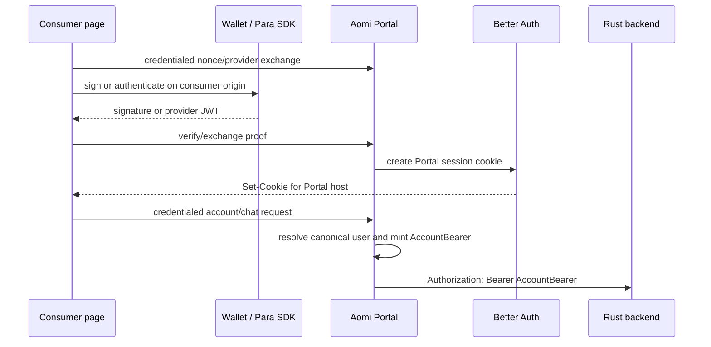
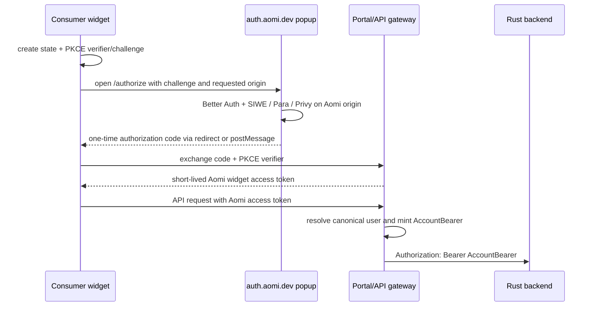

# Widget Authentication Handoff

> Owner handoff: Cecilia / the next authentication implementer
> Branch: `codex/landing-auth-parity`
> Draft PR: [aomi#339 — Unify widget authentication through Portal](https://github.com/aomi-labs/aomi/pull/339)
> Written: 2026-07-14
> Scope: research and handoff only; no implementation changes were made while
> preparing this document.

## Executive summary

PR #339 made the widget substantially easier to install, centralized Aomi
identity and backend proxying in Portal, and repaired several real account and
preview failures. It did **not** produce a permissionless authentication model
for arbitrary third-party origins.

The remaining problem is architectural, not another CORS patch:

- Better Auth's browser session is a Portal cookie. Its default `SameSite=Lax`
  behavior and browser third-party-cookie restrictions make it unreliable when
  an unrelated consumer site calls Portal directly.
- Better Auth's SIWE plugin validates one configured domain. A conforming SIWE
  wallet expects the message domain to match the page that initiated signing.
  The current widget initiates signing on the consumer page but builds a
  Portal-domain message, so this is not a portable or specification-correct
  cross-site flow.
- Para keys are application-scoped. The Para browser SDK requires each web
  origin to be allowed for that application, and Para JWTs are audience-bound
  to that application's public identifier.
- If Para runs only in an Aomi popup, authentication can be centralized, but
  the consumer page does not automatically receive the Para wallet client that
  signs transactions. Authentication and signing capability must be designed
  as separate channels.

The recommended end state is:

1. Keep Portal/Aomi as the canonical identity owner and keep the current
   canonical `users` / `auth_providers` / `public_keys` graph.
2. Keep the Portal-minted EdDSA AccountBearer and the Rust backend verification
   contract unchanged.
3. Replace direct cross-site Better Auth cookie use with an Aomi-hosted
   authorization window using authorization code + PKCE semantics.
4. Give the widget an Aomi access credential that does not depend on an Aomi
   cookie being accepted in a third-party context.
5. Treat wallet execution separately:
   - external wallets remain connected and execute locally in the consumer;
   - Aomi-hosted Para needs a remote-signer connector if its embedded wallets
     must execute from arbitrary consumer sites;
   - consumer-owned Para remains an optional advanced mode, with the consumer
     configuring Para origins and registering only public provider metadata
     with Aomi.

This gives a genuinely zero-contact default without pretending that every
provider wallet can be transplanted across origins for free.

## What this PR accomplished

### 1. Portal became the browser authentication and BFF boundary

Before this PR, Landing duplicated auth/account routes and backend proxy logic.
The PR removed Landing's catch-all API proxy and app-specific provider wrappers.
Landing and external examples now send auth, account, thread, chat, polling,
and SSE traffic to Portal.

Relevant files:

- `apps/portal/src/app/api/auth/[...all]/route.ts`
- `apps/portal/src/app/api/aomi/**`
- `apps/portal/src/app/api/[...slug]/route.ts`
- `apps/landing/app/api/[...slug]/route.ts` (removed)
- `packages/account/src/proxy.ts`

Portal now:

- owns Better Auth and its cookie session;
- verifies provider credentials;
- resolves the stable canonical Aomi user;
- mints an EdDSA AccountBearer with the canonical user UUID as `sub`;
- injects that bearer into allowlisted Rust backend requests;
- supports native SSE without exposing the backend signing key or provider
  secrets to the browser.

The Rust backend remains a verifier, not an authentication service. In
`product-mono`, `aomi-service` verifies `alg=EdDSA`, `kid`, `iss`, `aud`,
`role`, `exp`, and reads canonical user identity from `sub`. This boundary is
good and should be retained.

### 2. One public widget integration replaced app-specific composition

The PR added package-level `AomiWidget`:

```tsx
<AomiWidget
  apiUrl="https://chat.aomi.dev"
  auth={paraAuth({ apiKey: PARA_PUBLIC_KEY })}
/>
```

Consumers can choose:

- `paraAuth(...)` from `@aomi-labs/widget-lib/providers/para`;
- `privyAuth(...)` from `@aomi-labs/widget-lib/providers/privy`;
- no `auth` prop for external-wallet/SIWE mode.

`AomiWidget` currently owns the credentialed Portal transport, Aomi account
runtime, wallet providers, execution defaults, and frame composition.

Relevant files:

- `apps/shadcn-registry/src/components/aomi-widget.tsx`
- `apps/shadcn-registry/src/lib/wallet-kit/providers/para/widget-auth.ts`
- `apps/shadcn-registry/src/lib/wallet-kit/providers/privy/widget-auth.ts`
- `apps/shadcn-registry/src/lib/wallet-kit/config/AomiWalletKitProvider.tsx`

The provider helpers are on separate package subpaths. The providerless Vite
entry does not bundle Para or Privy.

### 3. A minimal non-Next consumer was added

`apps/widget-consumer` proves both Para and providerless builds in a plain Vite
application. It also records Para's current browser shim requirements.

Relevant files:

- `apps/widget-consumer/src/main.tsx`
- `apps/widget-consumer/src/providerless.tsx`
- `apps/widget-consumer/vite.config.ts`
- `apps/widget-consumer/README.md`

This was useful package validation, but both local pages use `localhost`, which
is same-site with local Portal. It does not prove the unrelated-domain cookie
case.

### 4. Credentialed transport was added across every client path

`AomiClientOptions.credentials` now applies to regular fetches, polling, and
the fetch-based SSE subscriber. `AomiWidget` defaults it to
`credentials: "include"`.

Relevant files:

- `packages/client/src/client.ts`
- `packages/client/src/types.ts`
- `packages/client/src/sse.ts`
- `apps/shadcn-registry/src/components/aomi-widget.tsx`

The React runtime also stopped rewriting `localhost` to `127.0.0.1`, because
that crossed a cookie host boundary and caused authenticated thread requests to
return 401.

### 5. Portal CORS and Better Auth now share one origin policy

`resolveAccountTrustedOrigins()` supplies both Better Auth trusted origins and
Portal credentialed CORS. Exact origins and narrow wildcards are supported.
The PR added a first-party Landing preview wildcard but deliberately does not
trust arbitrary Vercel projects.

Relevant files:

- `packages/account/src/better-auth/env.ts`
- `apps/portal/src/proxy.ts`
- `apps/portal/src/proxy.test.ts`

Landing preview builds now derive the matching Portal branch preview URL:

- `apps/landing/lib/aomi-portal-url.ts`
- `apps/landing/next.config.ts`

This fixes Aomi's own changing preview hosts. It cannot make arbitrary
consumer origins permissionless because each origin still has to be trusted by
Portal/Better Auth and, for an Aomi-owned Para key, by Para.

### 6. Provider exchange and canonical-account recovery were hardened

The observed staging Para failure was a canonical provider-exchange 409, not a
Para modal failure. A previous failed exchange had left a Better Auth/email-only
canonical shell while the verified Para identity or wallet already belonged to
the established account.

The PR now:

- evaluates verified provider identity and wallet ownership before email;
- exposes the same verified access signals in new-session and existing-session
  provider exchanges;
- re-homes a Better Auth mapping only when the current user is an auth-only
  shell;
- refuses adoption if that shell has durable account data;
- keeps genuine cross-account ownership collisions fail-closed as 409;
- uses collision-safe legacy usernames when the preferred display name is
  already taken.

The shell deletion guard checks provider identities, public keys, app keys,
bots, CLI sessions, delegated approvals, usage, threads, application usage,
and transactions before deleting anything.

Relevant files:

- `packages/account/src/service/account-service.ts`
- `packages/account/src/service/provider-exchange.ts`
- `packages/account/src/db/queries.ts`
- `packages/account/test/account-service-adoption.test.ts`
- `packages/account/test/provider-exchange.test.ts`

This repair is worth keeping independently of the final widget transport.

### 7. Para JWT wallet claims became usable attestations

The browser obtains a Para session JWT through `useIssueJwt()`. Portal verifies
the JWT through Para JWKS and turns signed `wallets` / `connectedWallets`
claims into EVM/SVM wallet attestations. These token attestations are merged
with the optional Para REST wallet listing.

Relevant files:

- `apps/shadcn-registry/src/lib/wallet-kit/providers/para/para-auth.ts`
- `packages/account/src/providers/para.ts`
- `packages/account/src/providers/account-credentials.ts`
- `packages/account/src/service/account-service.ts`

Important consequence: Aomi does **not** need a consumer's Para REST secret to
trust wallets present in a correctly verified Para JWT. The REST secret is only
needed for an independent/full wallet inventory lookup. Para publishes
environment JWKS endpoints; a consumer-specific JWT verification private key
should not be part of the normal integration.

### 8. Package and documentation work

The PR ships browser-ready widget CSS while preserving Tailwind's theme
contract, updates the generated registry/package outputs, and rewrites root,
Portal, Landing, account, client, React, widget, and Build documentation around
the new integration.

Versions on the branch:

| Package                 | Version |
| ----------------------- | ------: |
| `@aomi-labs/account`    | `0.1.2` |
| `@aomi-labs/client`     | `0.3.2` |
| `@aomi-labs/react`      | `0.5.2` |
| `@aomi-labs/widget-lib` | `1.4.3` |

At handoff, GitHub CI and all five Vercel project checks are green. The PR
remains open and draft. Its own checklist still lacks a successful preview
runtime smoke for Landing backend traffic plus Para canonical recovery.

Validation recorded on the PR includes:

- frozen pnpm install;
- full ESLint;
- 696 root tests and 229 widget-library tests;
- focused Portal CORS, provider recovery, and account tests;
- affected package/application typechecks and package builds;
- Base, Landing, Portal, and Vite consumer production builds;
- generated registry parity;
- providerless bundle inspection confirming no Para/Privy SDK;
- npm pack audits for every version-bumped publishable package;
- local authenticated account, thread creation, model selection, completed
  chat response, Para modal, and providerless isolation checks.

## Current flow and where it breaks



This works for Portal itself and can work for same-site Aomi properties. Four
independent boundaries fail for arbitrary consumers.

### Boundary A: SIWE origin binding

The account runtime currently derives its SIWE message domain and URI from the
Portal `apiUrl`. The signing call, however, happens through the wallet runtime
on the consumer page.

ERC-4361 says the SIWE `domain` must correspond to the origin from which the
signing request was made. A conforming browser wallet should therefore reject
or warn on:

```text
Page asking wallet to sign: https://consumer.example
SIWE message domain:       chat.aomi.dev
```

Better Auth then independently validates the message against its configured
`AOMI_AUTH_DOMAIN`, so simply changing the message to the consumer domain does
not solve the server side. Supporting multiple consumer domains would require
a per-request/per-client verifier rather than the current one-static-domain
SIWE plugin setup.

Key files:

- `apps/shadcn-registry/src/lib/wallet-kit/account/aomi-backend-runtime.ts`
- `packages/account/src/better-auth/auth.ts`
- `packages/account/src/better-auth/env.ts`

### Boundary B: the Portal session cookie

Better Auth uses `SameSite=Lax` session cookies by default. An unrelated
consumer domain calling `chat.aomi.dev` is a cross-site request. CORS with
`Access-Control-Allow-Credentials: true` is necessary but not sufficient:
browsers can omit or reject the cookie, and Safari's tracking prevention is an
explicit failure case for this topology.

This is why the PR documentation already says unrelated top-level domains need
a customer-domain Portal or same-site reverse proxy. That condition conflicts
with a permissionless one-component widget.

### Boundary C: Para application origins and audiences

The current helper initializes Para in the consumer page with a public Para API
key. Para's web integration requires the page origin to be listed for that Para
application. There are only two possible ownership models:

- Use an Aomi-owned key: Aomi must continually add every consumer origin to
  its Para project. This is not permissionless and expands the provider app's
  attack and operational surface.
- Use a consumer-owned key: the consumer configures its own origin in Para.
  This is self-service, but Aomi's current server accepts only one configured
  `PARA_JWT_AUDIENCE` and one optional REST secret, so it is not multi-tenant.

Para JWTs contain an `aud` tied to the Para application. Portal must verify
that audience. A global “accept any aud” shortcut should not be used without a
tenant model and an explicit decision about whether Para `sub` values are
globally stable or app-scoped.

### Boundary D: authentication is not signing capability

A popup at `auth.aomi.dev` can authenticate the user and create an Aomi
session. It cannot hand a live Para SDK object, an injected wallet provider, or
private key material to the consumer page.

The existing Para execution path signs in the local widget runtime through the
Para client. Moving Para into a popup therefore needs one of these explicit
choices:

1. authentication in popup, execution through a separately connected external
   wallet in the consumer;
2. a remote signer protocol that proxies approved signing requests to an Aomi
   top-level window where Para is available;
3. consumer-owned Para running locally, with Aomi verifying the resulting
   tenant-bound provider JWT.

Any proposal that says only “move auth to a popup” is incomplete until it picks
one of these execution models.

## Recommended architecture

### Principle: separate three credentials

The current implementation makes one browser cookie carry too many concerns.
The next design should name three separate things:

| Concern             | Credential/capability                   | Owner             |
| ------------------- | --------------------------------------- | ----------------- |
| Aomi identity       | Aomi authorization session/access token | Aomi auth service |
| Backend identity    | short-lived EdDSA AccountBearer         | Portal/BFF only   |
| Transaction signing | local wallet or remote provider signer  | wallet/provider   |

The consumer should never receive the Portal's AccountBearer signing key or a
provider server secret. The Rust backend should keep seeing the same
AccountBearer contract it sees today.

### Hosted authorization bridge

Add an Aomi-hosted authorization surface, preferably on a stable origin such as
`https://auth.aomi.dev`:



Requirements:

- Authorization code, never a provider JWT or long-lived bearer, crosses the
  popup boundary.
- PKCE challenge/verifier, `state`, expiry, single use, requesting origin, and
  requested scopes are transaction-bound.
- `postMessage` uses an exact `targetOrigin`; both windows validate
  `event.origin`, `event.source`, state, and code context.
- The user sees which origin is requesting Aomi access.
- Aomi access tokens are audience- and scope-bound and short-lived.
- Provider tokens remain server-side or are consumed once during exchange.
- The Portal/Aomi API validates the widget token, resolves the canonical UUID,
  then uses the existing AccountBearer mint/proxy path.

For a pure SPA, keep the short-lived access token in memory. Reopen the popup
for renewal; the Aomi cookie is first-party while the popup is top-level, so a
still-valid auth session should make renewal brief.

For consumers with a server, offer an optional framework adapter that handles
the code callback, stores refresh state in an `HttpOnly` cookie on the
consumer's own domain, and proxies widget API traffic. This is the strongest
persistent-session option, but it should not be the only integration.

Do not use an invisible third-party iframe as the primary session mechanism.
It recreates the cookie/storage problem and is hostile to passkeys and popup
approval UX.

### SIWE in the hosted model

If SIWE is the chosen Aomi sign-in method, request the signature from the
top-level Aomi authorization window. An injected wallet or WalletConnect
connection opened there sees an Aomi origin and signs an Aomi-domain message,
so the ERC-4361 origin and Better Auth expected domain agree.

After Aomi sign-in, an external wallet connected in the consumer is execution
context, not automatically the account identity. Link it through an
authenticated wallet-link challenge. That challenge should be designed for
the consumer origin instead of reusing a static Portal-domain SIWE message.
It must bind at least:

- the current Aomi account/session;
- wallet address and chain;
- consumer origin or registered client;
- nonce, purpose, issued-at, and expiry.

### Aomi-hosted Para: zero-config identity, remote signing as a separate phase

Run the Aomi-owned Para SDK only on the Aomi authorization/signer origin. Then
only Aomi's origin has to be allowed in Aomi's Para project, and consumers need
no Para key.

This immediately solves Para authentication and signed wallet attestation. It
does not immediately solve embedded-wallet execution. For that, add a narrow
remote signer connector:

- expose EVM/SVM accounts as read-only descriptors in the widget;
- when signing is required, open/focus an Aomi signer window;
- send a typed, origin-bound request over `postMessage`;
- show the transaction/message and require the provider's configured approval;
- return only the signature or signed payload;
- let the existing consumer execution runtime simulate/broadcast where
  appropriate;
- never serialize provider session secrets or wallet key material.

Treat this like a wallet bridge, not like an auth callback. It needs explicit
request IDs, origin/source validation, chain/account binding, expiry, replay
protection, cancellation, and an allowlist of signing methods. Do not expose a
generic arbitrary RPC tunnel.

Until this connector exists, hosted Para should be described honestly as an
identity/onboarding path. Users who need execution must connect an external
wallet or use the advanced consumer-owned Para mode.

### Consumer-owned Para: optional advanced mode

Some consumers will want their own Para branding, users, policies, and local
embedded-wallet execution. Support that as a separate integration tier:

1. Consumer creates its Para application and configures its own allowed
   origins. Aomi does not manage those origins.
2. Consumer passes the public Para API key to `paraAuth()` locally.
3. Consumer self-registers its public Para metadata with Aomi:
   - environment (`BETA`/`PROD`);
   - expected JWT audience/application identifier;
   - allowed Aomi client/redirect origins if persistent auth is used.
4. Aomi verifies the JWT using Para's published environment JWKS and the
   registered audience.
5. Aomi uses the signed `wallets` and `connectedWallets` claims for current
   embedded wallet attestation.

The standard path should **not** ask for:

- a consumer Para JWT verification private key;
- a Para REST secret;
- manual Aomi staff configuration.

If Aomi later needs an authoritative all-wallet REST sync, make it an opt-in
server integration or have the consumer backend issue a narrowly scoped
attestation. It is not required to authenticate the signed JWT claims already
used by this branch.

Before multi-tenant Para is enabled, change the identity key model from an
implicit global `("para", sub)` to an explicitly researched namespace such as
`(provider, environment/issuer, audience/tenant, subject)`. Do not assume that
the same `sub` from two Para applications denotes the same Aomi person unless
Para documents that guarantee and the product explicitly wants that merge.

### Does Aomi need a developer portal?

Not for the default hosted mode. A static public widget client plus the hosted
authorization window can be zero-contact if the security review accepts its
redirect/postMessage model.

A self-service developer portal is appropriate for advanced capabilities:

- exact callback/redirect origin registration;
- refresh-token/server-adapter integrations;
- consumer-owned Para or Privy metadata;
- application identity, quotas, scopes, branding, and revocation;
- webhook or server-to-server credentials.

“Permissionless” should mean no manual Aomi staff action. It does not have to
mean that advanced consumers never create an application record.

## Options considered

| Option                                                       | Consumer setup                                            | Cross-site reliability                         | Embedded Para execution                     | Assessment                                                             |
| ------------------------------------------------------------ | --------------------------------------------------------- | ---------------------------------------------- | ------------------------------------------- | ---------------------------------------------------------------------- |
| Current direct Portal cookie + consumer SDK                  | public provider key plus Aomi/Para origin configuration   | poor on unrelated sites                        | local                                       | Keep only for same-site Aomi properties; not the public architecture.  |
| Customer-domain Portal / reverse proxy                       | DNS or framework proxy plus origin setup                  | good                                           | local if provider also runs there           | Useful tactical enterprise option, too heavy for default installation. |
| Popup for auth only                                          | one widget component                                      | good for identity                              | not solved                                  | Valid intermediate step only if limitations are explicit.              |
| Hosted authorization + Aomi token + remote signer/BYOP split | zero-config default; optional self-service advanced setup | good                                           | remote in hosted mode or local in BYOP mode | Recommended.                                                           |
| Hidden iframe session                                        | superficially low                                         | poor under third-party cookie/storage controls | awkward                                     | Avoid as primary design.                                               |

## Why not keep extending the current cross-origin design?

Adding wildcard trusted origins, setting `SameSite=None`, or disabling Better
Auth origin checks would expand CSRF/token exposure and still would not solve:

- browser third-party-cookie blocking;
- ERC-4361's signing-origin requirement;
- Para's own per-application allowed origins;
- provider wallet capability across windows;
- safe consumer-specific audience and identity namespacing.

The problem has crossed the threshold where a centralized authorization
protocol is simpler than more exceptions.

## Current Para failure: first investigation for the next owner

The user reports that Para authentication is currently broken even in the chat
Portal. Do not assume this is the cross-site architecture issue: same-origin
Portal auth should work, and the earlier confirmed staging incident was a 409
canonical-account conflict.

Use this decision tree before changing code.

### 1. Capture the exact failing stage

Inspect the browser network and Portal server logs for this sequence:

1. Para modal login completes and `useAccount().isConnected` becomes true.
2. `useIssueJwt().issueJwtAsync()` returns `{ token, keyId }`.
3. Browser posts to `/api/auth/aomi/provider/exchange` when no Aomi account
   exists, or `/api/aomi/provider/exchange` when one exists.
4. `/api/aomi/account` returns the canonical account and Better Auth session.
5. Thread/chat calls reuse that session and Portal injects AccountBearer.

Interpret the first failure:

| Observation                                   | Most likely area                                                            |
| --------------------------------------------- | --------------------------------------------------------------------------- |
| Para request blocked/CORS before login        | Para allowed origin, browser public key, BETA/PROD mismatch, or SDK runtime |
| Login succeeds but JWT issue returns 401/403  | Para session/origin/application configuration                               |
| Provider exchange returns 400                 | missing/wrong JWKS, JWT audience, expiry, issuer/key, or token shape        |
| Provider exchange returns 409                 | canonical provider/wallet/email ownership conflict in DB                    |
| Exchange returns 200 but account is empty/401 | Better Auth cookie host/domain/environment mismatch                         |
| Account works but chat is anonymous/401       | Portal cookie transport, canonical resolution, or AccountBearer mint/proxy  |

### 2. Stop relying on swallowed frontend errors while debugging

Two current code paths intentionally suppress the most useful errors:

- `useSafeIssueJwt()` returns `null` for Para 401/403, CORS, and several
  network-shaped errors and adds a 30-second cooldown.
- `useAomiBackendAccountRuntime()` catches provider-exchange failures, leaves
  status `ready`, increments an internal version, and retries only after a
  cooldown.

This can make “Para connected but Aomi unauthenticated” look like no event.
Use the browser debugger/server logs now. A follow-up implementation should
surface a structured auth-stage error in development and telemetry without
logging provider tokens.

Relevant files:

- `apps/shadcn-registry/src/lib/wallet-kit/providers/para/para-auth.ts`
- `apps/shadcn-registry/src/lib/wallet-kit/account/aomi-backend-runtime.ts`
- `packages/account/src/better-auth/provider-plugin.ts`

### 3. Verify environment alignment

Check these as one tuple, not independently:

- browser `NEXT_PUBLIC_PARA_API_KEY`;
- browser `NEXT_PUBLIC_PARA_ENVIRONMENT`;
- server `PARA_JWT_AUDIENCE`;
- server `PARA_JWKS_URL`;
- optional server `PARA_API_SECRET_KEY` and REST base;
- exact deployed Portal origin in the Para application's allowed origins.

Potential configuration trap found during this handoff:

- `createParaCredentialVerifier()` currently refuses Para unless both
  `paraAudience` **and** `paraJwksUrl` are present.
- `apps/portal/LOCAL_ENV.example` does not list `PARA_JWKS_URL`.
- `packages/account/README.md` labels it an optional override.
- Para publishes fixed BETA and PROD JWKS URLs.

If the deployed environment lacks `PARA_JWKS_URL`, exchange fails with
`Para JWKS verification is not configured`. Make the runtime/docs consistent
in the eventual fix; do not diagnose this as a database problem.

Also verify the exact `aud` claim by decoding the rejected JWT locally without
logging or persisting the raw token. Para documents `aud` as the API key's
unique ID, which may not be identical to the visible environment-prefixed key.
The explicit `PARA_JWT_AUDIENCE` should win, as the code already intends.

### 4. If it is a 409, inspect canonical ownership read-only

Compare the verified token's subject, verified email, and wallet addresses
against:

- Better Auth user/session/account rows (`ba_users`, `ba_sessions`,
  `ba_accounts`);
- `auth_providers` rows for `betterauth`, `email`, and `para`;
- `public_keys` rows for each attested EVM/SVM address;
- the `users` rows referenced by those records.

The new guarded recovery only removes the current Better Auth mapping when its
user is a true auth-only shell. If it has any durable rows covered by
`deleteAomiUserIfAuthOnlyShell()`, the conflict is intentionally preserved.
Do not broaden that delete predicate until the competing account's data has
been reviewed and an explicit merge/recovery policy is agreed.

### 5. Confirm the fixed path end to end

A successful check must prove more than opening the Para modal:

- Para session and JWT issuance;
- provider exchange 200;
- Better Auth session present;
- canonical account UUID is the expected returning UUID;
- Para identity and EVM/SVM `public_keys` belong to that UUID;
- authenticated thread list/history is preserved;
- chat reaches Rust with an AccountBearer for that UUID;
- at least one Para wallet signing/execution request still works.

## Suggested implementation phases

### Phase 0: decide what to salvage from PR #339

Keep or extract independently:

- `AomiWidget` and provider subpath packaging;
- credential-capable client transport;
- providerless bundle isolation;
- compiled CSS/theme fix;
- canonical account recovery and provider JWT wallet attestations;
- Portal/BFF AccountBearer boundary;
- preview-pairing utility for Aomi-owned deployments.

Do not present direct credentialed Portal calls as the final third-party auth
contract. If PR #339 is merged for the useful packaging/account changes, mark
external unrelated-domain auth experimental or same-site-only.

### Phase 1: fix and instrument first-party Para

- Run the failure decision tree above on chat staging/production.
- Align Para browser environment, audience, JWKS default, and allowed origin.
- Add structured stage/error reporting for JWT issuance and provider exchange.
- Add an E2E that asserts canonical UUID and thread continuity, not only modal
  success.

### Phase 2: spike the authorization bridge

Build the smallest vertical slice:

- `/authorize` in a top-level Aomi window;
- Better Auth session reuse;
- one-time code + PKCE + state + exact opener/redirect validation;
- `/token` exchange for a short-lived widget/API token;
- one authenticated account request through Portal to the existing
  AccountBearer proxy;
- no Para yet.

Threat-model code interception/injection, malicious opener behavior, login
CSRF, open redirects, token replay, XSS, popup closure, and concurrent auth
attempts before expanding the slice.

### Phase 3: add hosted SIWE and provider auth

- Perform SIWE signing in the Aomi top-level window so origin and message
  domain agree.
- Add Para and Privy exchange inside the hosted origin.
- Return only the Aomi authorization code to the consumer.
- Keep provider credentials out of consumer storage.

### Phase 4: choose and prove the execution model

Do not make a broad implementation before a focused Para spike answers:

- Can a reusable Aomi signer window retain the Para session reliably?
- Can it sign EVM messages/transactions and Solana messages/transactions after
  being reopened/focused?
- What approval UX does Para impose for cross-application or repeated signing?
- Should the signer return a signature/signed payload or broadcast itself?
- How does cancellation/retry map into the existing pending transaction UI?

If the spike is sound, implement a narrow remote EVM/SVM signer connector. If
not, make external wallets the hosted mode's execution mechanism and prioritize
consumer-owned provider mode.

### Phase 5: add multi-tenant consumer-owned providers

- Define the application/client record and self-service registration flow.
- Store public provider environment/audience metadata only.
- Namespace provider subjects by tenant unless provider documentation proves a
  safe global subject.
- Verify Para JWT with published environment JWKS and registered audience.
- Use JWT wallet claims without requiring the consumer REST secret.
- Add exact callback/origin management only where the chosen auth protocol
  requires it.

### Phase 6: migrate the widget API

The intended default consumer API should be close to:

```tsx
<AomiWidget auth={{ mode: "hosted" }} />
```

Advanced local-provider mode can remain explicit:

```tsx
<AomiWidget
  auth={paraAuth({
    apiKey: PARA_PUBLIC_KEY,
    // public Aomi application/client metadata, not a provider secret
    aomiClientId: AOMI_CLIENT_ID,
  })}
/>
```

Avoid making the consumer understand Better Auth, AccountBearer, Portal CORS,
provider JWT keys, or Rust backend topology.

## Required validation matrix

The current local checks are not enough because `localhost` hides site-boundary
problems. Test at least:

| Dimension         | Cases                                                                         |
| ----------------- | ----------------------------------------------------------------------------- |
| Site relationship | same origin, sibling subdomains, unrelated top-level domains                  |
| Browser           | Chrome, Safari, Firefox; private/tracking-protection modes                    |
| Auth              | existing Aomi session, SIWE, Para email, Para OAuth, Privy, sign-out/re-auth  |
| Wallet            | injected EOA, WalletConnect, smart account/EIP-1271, Para EVM, Para SVM       |
| Consumer          | pure Vite SPA, Next server adapter, production HTTPS preview                  |
| Account state     | new user, returning user, auth-only shell, genuine cross-account conflict     |
| Transport         | REST, polling, SSE reconnect, token expiry/renewal                            |
| Failure           | popup blocked/closed, wrong state, expired code, provider outage, DB conflict |

For cross-site tests, use genuinely different registrable domains. Different
ports on `localhost` are not representative.

## Decisions Cecilia should make before implementation

1. Is zero-config hosted Para required to execute with Para embedded wallets,
   or is external-wallet execution acceptable for the first hosted release?
2. Does Aomi want to operate an OAuth/OIDC-style public authorization service,
   or require every production consumer to self-register a client and exact
   redirects?
3. For advanced consumer-owned Para, are signed current-session wallet claims
   sufficient, or is full REST inventory/reconciliation a product requirement?
4. What is the account merge policy when two established canonical users share
   a verified email but provider identity/wallet signals disagree?
5. Can provider identities be namespaced by
   `(provider, environment, audience, subject)`, and what migration does that
   require for existing `auth_providers` rows?
6. Which side broadcasts provider-signed transactions in remote-signer mode?
7. What scopes should a third-party widget token receive by default (chat,
   threads, account read, wallet link, execution, secrets)?

## Source map for the next owner

Start with these files in this order:

1. `apps/shadcn-registry/src/components/aomi-widget.tsx`
2. `apps/shadcn-registry/src/lib/wallet-kit/account/aomi-backend-runtime.ts`
3. `apps/shadcn-registry/src/lib/wallet-kit/account/aomi-backend-client.ts`
4. `apps/shadcn-registry/src/lib/wallet-kit/providers/para/para-auth.ts`
5. `apps/shadcn-registry/src/lib/wallet-kit/providers/para/ParaPluginProvider.tsx`
6. `packages/account/src/better-auth/auth.ts`
7. `packages/account/src/better-auth/env.ts`
8. `packages/account/src/better-auth/provider-plugin.ts`
9. `packages/account/src/providers/account-credentials.ts`
10. `packages/account/src/providers/para.ts`
11. `packages/account/src/service/provider-exchange.ts`
12. `packages/account/src/service/account-service.ts`
13. `packages/account/src/db/queries.ts`
14. `apps/portal/src/proxy.ts`
15. `packages/account/src/proxy.ts`
16. `packages/account/src/bearer.ts`
17. `apps/widget-consumer/README.md`
18. `specs/WIDGET-AUTH-PLAN.md`

Backend trust contract in the sibling `product-mono` repository:

- `docs/topics/account-authentication/facts/service-identity.md`
- `aomi/crates/service/src/lib.rs`
- `aomi/bin/backend/src/auth/request/credentials.rs`

The `product-mono/frontend/` directory currently contains no frontend source;
the active browser implementation is this repository. The useful
`product-mono` material is the Rust verifier and its maintained auth contract.

## Primary external references

- [ERC-4361: Sign-In with Ethereum](https://eips.ethereum.org/EIPS/eip-4361)
  — SIWE message fields and the signing-request origin requirement.
- [Better Auth SIWE plugin](https://better-auth.com/docs/plugins/siwe) — the
  plugin validates nonce, domain, address, chain, and time bounds in addition
  to the supplied signature verifier.
- [Better Auth cookies](https://better-auth.com/docs/concepts/cookies) — cookie
  behavior, cross-subdomain setup, Safari ITP, and reverse-proxy guidance.
- [Better Auth security](https://better-auth.com/docs/reference/security) —
  `SameSite=Lax`, trusted origins, CSRF, and wildcard-origin behavior.
- [Para JWT token management](https://docs.getpara.com/v2/react/guides/sessions-jwt)
  — JWT `aud`, wallet claims, expiry, and BETA/PROD JWKS URLs.
- [Para developer portal setup](https://docs.getpara.com/v2/react/guides/customization/developer-portal-setup)
  — application API keys and allowed web origins.
- [OAuth 2.0 Security Best Current Practice (RFC 9700)](https://www.rfc-editor.org/rfc/rfc9700.html)
  — authorization response protections, PKCE, and browser-based clients.

## Final recommendation

Do not spend the next iteration trying to make one Portal Better Auth cookie
and one Aomi Para application behave as if every website were same-origin.

Preserve the strong parts of this PR—the single widget API, canonical account
graph, provider verification, AccountBearer boundary, and packaging—but move
third-party authentication onto an explicit hosted authorization protocol.
Then solve local and provider-hosted signing as a separate wallet capability.
That separation is the cleanest path to an integration that is genuinely easy
for consumers without weakening origin checks or collecting their provider
secrets.
