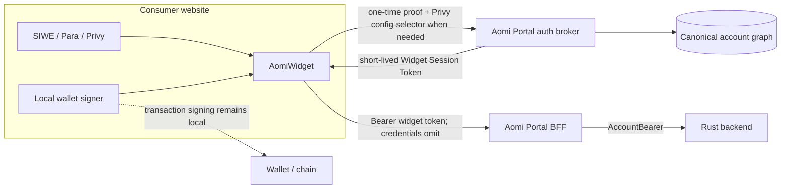

# Widget Authentication Handoff

> Owner handoff: Cecilia / next authentication implementer
>
> Branch reviewed: `codex/landing-auth-parity` at `aaaea079`
>
> Draft PR: [aomi#339 — Unify widget authentication through Portal](https://github.com/aomi-labs/aomi/pull/339)
>
> Research refreshed: 2026-07-14
>
> Status: architecture and implementation plan; the unrelated-domain widget
> session flow described here is not implemented.

## Decisions

1. **Pure SIWE is permissionless.** A consumer does not need an Aomi
   integration key merely to prove an Ethereum address. Portal derives the SIWE
   domain/URI from the browser request's observed `Origin`; it does not trust an
   origin string chosen in the JSON body.
2. **An origin is not a consumer credential.** It gives browser and phishing
   binding, not developer authentication. Aomi intentionally accepts every
   valid HTTPS origin for SIWE and does not approve, register, or attribute the
   embedding site. Protecting users from a malicious integration is the
   integrator's responsibility.
3. **Para JWT auth is registration-free; Privy needs registered public
   verification material.** Para publishes fixed Beta/Production JWKS, so
   Portal can accept any valid Para audience and namespace the identity by the
   signed `aud`. Privy documents an app-specific verification key and no
   universal JWKS discovery contract, so its app ID/public key pair must reach
   Aomi through trusted deployment configuration.
4. **Aomi owns the authoritative BFF.** Consumers keep provider SDKs and
   signers in their page, but Portal verifies user proofs, resolves the
   canonical user, authorizes routes, and mints the existing AccountBearer.
5. **Do not require provider REST secrets for the first provider release.**
   Para session JWTs and Privy identity tokens can carry the user/provider
   attestations needed for the initial flow and can be verified with public
   material. Add a consumer's provider secret later only for a specifically
   approved REST operation that cannot be satisfied by a signed token.
6. **Authentication is multi-tenant; the canonical Aomi user is global.** Each
   Para audience and Privy app has a separate provider credential namespace,
   but those credentials may resolve to the same global `users.id`. The same
   EOA wallet resolves globally. The same email resolves globally only when
   Aomi can classify the provider claim as a user-completed, strongly verified
   Google/email login; weaker or ambiguous claims require one Aomi-controlled
   email or wallet proof.
7. **Keep provider onboarding minimal.** Para needs no deployment-page fields.
   Privy needs only public verifier configuration in the first release. Defer
   provider REST-secret storage and the broader partner platform.

## Direct answers

| Question                                              | Answer                                                                                                                                                                                                           |
| ----------------------------------------------------- | ---------------------------------------------------------------------------------------------------------------------------------------------------------------------------------------------------------------- |
| Does pure SIWE require an Aomi consumer key?          | **No.** The signed wallet address authenticates the user; Portal derives and binds the SIWE message to the observed consumer origin, then grants the resolved canonical user full ordinary user permissions.     |
| Can Portal trust a consumer-supplied origin field?    | **No.** Use the HTTP `Origin` observed by Portal, normalize it, store it with the nonce, and compare it to the signed SIWE domain/URI and subsequent widget-token requests.                                      |
| Is `Origin` strong developer authentication?          | **No.** Browsers protect it from page JavaScript, but non-browser clients can forge it. Aomi uses it only for browser/signature binding and deliberately does not treat it as proof that Aomi approved the site. |
| Does Aomi allowlist SIWE origins or reseller domains? | **No.** Any valid HTTPS origin can initiate SIWE. The actual observed origin is used in the signed message, but it is not matched to a customer, domain registry, or reseller authorization record.              |
| When is an Aomi publishable integration key needed?   | Not for SIWE or Para JWT auth. Privy may use one to select its registered verifier configuration. It is browser-visible and authenticates neither the consumer nor the end user.                                 |
| What must a Para consumer configure with Aomi?        | **Nothing persistent for JWT-only auth.** At runtime the widget sends the Para environment and session JWT; Portal reads the signed `aud` and uses Aomi-owned fixed JWKS.                                        |
| What must a Privy consumer configure with Aomi?       | Privy app ID, identity-token kind, and the corresponding **public** verification key. Identity tokens must be enabled. The app secret is not required for local verification.                                    |
| When is a Para/Privy secret required?                 | Only when Portal calls that provider's authenticated REST API. This is optional and deferred from the minimum widget auth flow.                                                                                  |
| Do two consumer provider tenants share one Aomi user? | **Yes.** Their provider subjects remain tenant-scoped, but a strongly verified common email, a common global wallet, or a completed Aomi link proof attaches both to one canonical `users.id`.                   |
| Should the consumer run the authoritative BFF?        | **No.** Under the current backend contract, a leaked or malicious user-minting key can impersonate arbitrary canonical users across broad account routes.                                                        |

## Target boundary



Credential meanings must remain separate:

| Credential                       | Meaning                                                              |                         Secret? | Accepted by              |
| -------------------------------- | -------------------------------------------------------------------- | ------------------------------: | ------------------------ |
| Aomi publishable integration key | Optionally select registered Privy verifier configuration            |                              No | Portal                   |
| Widget Session Token             | Authenticate one canonical ordinary-user session bound to its origin | Bearer secret in browser memory | Portal                   |
| Provider JWT                     | Para/Privy proof issued to the authenticated provider session        |              Short-lived bearer | Portal exchange only     |
| AccountBearer                    | Aomi canonical `users.id` assertion                                  |            Server-minted bearer | Rust                     |
| `Aomi-App-Key`                   | Aomi runtime application entitlement                                 |                             Yes | Rust, injected by Portal |
| Portal service private key       | Authority to mint trusted Aomi bearers                               |        Yes, highest sensitivity | Portal only              |

## Tenancy model: many provider tenants, one Aomi user

The target is **multi-tenant authentication ingress with one global identity
plane**. Consumer A and Consumer B may use different Para projects or Privy
apps. Their external provider records remain separate, but both can point to
the same canonical Aomi `users.id`; threads, account settings, and other Aomi
state are not duplicated merely because the user entered through another
consumer.

| Concern             | Current implementation                                       | Required target                                                         |
| ------------------- | ------------------------------------------------------------ | ----------------------------------------------------------------------- |
| Para verifier       | One global audience/JWKS configuration                       | Any signed audience under fixed Beta/Production JWKS                    |
| Privy verifier      | One global app ID/key configuration                          | One registered public verifier per Privy app                            |
| Provider identity   | Global `(provider, subject)`                                 | `(provider, issuer/environment, tenant/audience, subject)`              |
| Canonical Aomi user | Global `users.id`                                            | Remains global                                                          |
| EOA wallet identity | Globally unique address                                      | Remains global across all consumers                                     |
| Email resolution    | Global lookup, but email-presence can be mislabeled verified | Global only for high-assurance user-completed Google/email proof        |
| Ambiguous identity  | First available ownership signal can influence resolution    | Resolve all strong signals atomically; conflict requires explicit proof |

The current branch is therefore not provider-multi-tenant even though its
canonical account graph is global. It also already attempts global email
resolution, but the Para and Privy adapters can currently set
`emailVerified=true` merely because an email is present. That behavior must not
become the multi-tenant contract.

### Global resolution algorithm

For every verified login, Portal derives two categories of signals:

```text
tenant-local credential
  Para:  (para, environment, signed aud, signed sub)
  Privy: (privy, privy.io, appId, signed DID)

global ownership factors
  strongly verified normalized email / Google identity
  globally unique EOA/SVM wallet
  previously completed Aomi link/recovery proof
```

Portal resolves all strong signals in one transaction:

1. If no signal has an owner, create one canonical Aomi user.
2. If every owned signal points to the same user, attach the new tenant-local
   provider credential to that user.
3. If a strongly verified global email already belongs to a user, a new Para
   audience or Privy app login with that same proof attaches to that existing
   user automatically.
4. If signals point to different users, do not choose the first one and do not
   merge data automatically. Require an Aomi-controlled email code, SIWE/SIWS,
   or dual-session link proof.
5. Once linked, all later logins through either consumer resolve directly to
   the same canonical UUID.

This gives the intended result:

```text
Para consumer A subject  ─┐
Para consumer B subject  ─┼── global Aomi user 123
Privy consumer C DID     ─┤
SIWE wallet 0xabc        ─┘
```

### What counts as a global email proof

Email equality alone is not enough. Aomi must distinguish an interactive,
provider-verified Google/email login from an application-provisioned,
pregenerated, imported, custom-ID, or metadata-only identity.

This matters because Para supports
[authentication-free pregeneration for an application-chosen email or other identifier](https://docs.getpara.com/v2/server/guides/pregen),
and Privy's server API can
[create users with application-supplied linked accounts](https://docs.privy.io/api-reference/users/create).
A signed token may faithfully report what that provider project associates
with a user without proving that the human just controlled that email.

The provider adapter must emit an assurance classification, not a loose
boolean:

```text
google_interactive_verified   -> eligible for automatic global resolution
email_otp_verified            -> eligible for automatic global resolution
aomi_email_or_wallet_verified -> eligible for automatic global resolution
pregenerated / imported       -> tenant-local only
custom_id / metadata_only     -> tenant-local only
unknown                       -> tenant-local until Aomi step-up
```

Para may promote an email only when its verified token shape unambiguously
represents a completed Google/email authentication rather than a pregen/custom
session. Privy may promote only an explicitly verified login account with
provider-defined verification provenance; linked-account presence alone is
insufficient. If the provider contract cannot make that distinction, Portal
sends an Aomi-controlled email code or requests an already-linked wallet proof
once.

### Storage contract

Add issuer and tenant columns to provider identities and enforce:

```text
unique(provider, issuer_environment, tenant_id, subject)
```

Maintain a globally unique normalized-email ownership factor only for accepted
high-assurance proofs. Keep global wallet uniqueness for EOAs/SVM wallets;
smart-contract wallet identity must include chain scope. Existing duplicate
canonical users sharing a claimed email require an explicit survivor/FK
repoint migration or user-approved merge, never an arbitrary first-row choice.

## Pure SIWE: no integration key required

### Why this works

[ERC-4361](https://eips.ethereum.org/EIPS/eip-4361) requires the SIWE
`domain` (and scheme, when present) to correspond to the origin that initiated
signing. It also requires the relying party to validate the parsed message,
expected fields, nonce, and signature. The resulting session is bound to the
wallet address.

For a widget rendered directly in a consumer page:

```text
page origin: https://consumer.example
SIWE domain: consumer.example
SIWE URI:    https://consumer.example
```

The consumer does not need to pre-register that domain if Aomi intentionally
offers permissionless SIWE. Portal can reflect an arbitrary valid HTTPS origin
on the dedicated widget-auth/widget-business CORS route classes.

This is not “trust whatever origin the consumer tells us.” The protocol is:

1. Widget requests a challenge.
2. Portal reads the request's HTTP `Origin`, rejects missing/null/invalid
   production origins, normalizes it, and creates a one-time nonce record.
3. Portal returns canonical SIWE fields for that observed origin.
4. The wallet signs the conforming message and should compare it to the page
   origin.
5. Portal verifies the signature, address, chain, nonce, issued/expiry times,
   domain, URI, and that the verify request has the same observed origin.
6. Portal atomically consumes the nonce and issues a Widget Session Token bound
   to the same origin, wallet/canonical user, and browser session.
7. Subsequent Portal requests must carry that token and the matching browser
   origin.

If the widget is actually hosted inside a cross-origin iframe, ERC-4361 binds
the message to the iframe origin rather than its parent. The intended
five-line integration renders the widget in the consumer document, so the
consumer origin is the relevant one.

### Why the Aomi key is optional here

The wallet signature proves control of the address. An Aomi publishable key
could add consumer attribution, but the product deliberately does not require
or use that attribution for SIWE. It would not strengthen user authentication.
Because that key would be shipped in JavaScript, another site could copy it,
and a non-browser caller can forge `Origin`.

Therefore:

- no Aomi key: full ordinary Aomi user permissions after valid SIWE;
- observed origin: signature/session binding only, never approval or customer
  attribution;
- provider integration key: optional Privy verifier selection only;
- non-public Aomi apps and `admin`/`service` roles retain their existing,
  separate authorization requirements.

This is an explicit product risk decision: a user who signs into Aomi from a
site is authorizing that site to operate their Aomi account with the same
ordinary user permissions available through first-party authentication. Aomi
does not add a widget-specific denylist for account routes. Wallet-controlled
transactions still require the wallet's own signing flow, and existing route
ownership, app-entitlement, billing, spending, and signature checks still
apply.

### Better Auth does not provide this dynamic contract as configured

The current Better Auth SIWE plugin is configured with one static `domain`.
[Better Auth documents](https://better-auth.com/docs/plugins/siwe) that the
plugin validates nonce, domain, address, chain, and time bounds against that
configuration. Its normal session is also a Portal cookie, and
[Safari blocks third-party cookies](https://better-auth.com/docs/concepts/cookies)
for unrelated frontend/API domains.

Keep Better Auth SIWE for first-party Aomi login. Add purpose-built widget SIWE
challenge/verify endpoints that issue the short-lived Widget Session Token.
Do not broaden the seven-day Better Auth bearer session into the public widget
credential.

## Para: no Aomi onboarding for JWT-only auth

### What the consumer configures

The consumer creates and configures its own Para project. In Para it sets:

- the Beta or Production environment and corresponding web API key;
- the consumer site's allowed browser origins;
- Google, email, or other desired login methods;
- embedded-wallet creation, branding, redirect, and session settings.

Para documents that Beta and Production contain separate users/wallets and
that web origins must be configured in the
[Para production setup](https://docs.getpara.com/v2/general/production-deployment).
Those settings stay between the consumer and Para; Aomi does not need access to
the consumer's Para Dashboard.

The consumer places the normal browser-visible Para API key in the widget:

```tsx
<AomiWidget
  apiUrl="https://chat.aomi.dev"
  auth={paraAuth({
    apiKey: import.meta.env.VITE_PARA_API_KEY,
    environment: "PROD",
  })}
/>
```

There is no Aomi `integrationKey` and no Para field on an Aomi deployment page
for the minimum flow. The consumer does not paste its public API key or a Para
secret into Aomi.

### What the widget sends at runtime

After Para login, the widget calls `issueJwt()` and sends Portal:

```text
environment: BETA | PROD
Para session JWT
returned keyId (optional cross-check)
```

[Para session JWTs](https://docs.getpara.com/v2/server/guides/sessions)
contain signed `sub`, `aud`, expiry, identity fields such as email/auth method,
and wallets provisioned through the consumer application. `aud` is the unique
ID of the Para application represented by the consumer's public API key.

The JWT is a short-lived bearer credential. It is the only sensitive Para
value sent to Aomi in the minimum flow. The Para browser SDK, refresh/session
state, and wallet signer remain in the consumer page.

### Why Portal can verify without consumer keys

Para publishes environment-wide public JWKS:

| Environment | Aomi-owned fixed JWKS                                |
| ----------- | ---------------------------------------------------- |
| Beta        | `https://api.beta.getpara.com/.well-known/jwks.json` |
| Production  | `https://api.getpara.com/.well-known/jwks.json`      |

Portal owns this two-entry mapping and pins the supported algorithm/key-use
policy. The browser may select Beta or Production, but it may never supply a
JWKS URL or signing key.

Portal deliberately accepts any JWT that verifies under the selected Para
environment. It reads the now-verified `aud` instead of comparing it to a
pre-registered Aomi value, and resolves the provider identity as:

```text
(provider=para, environment, signed aud, signed sub)
```

Accepting any `aud` is the permissionless product decision. Keeping `aud` in
the identity namespace prevents the same-looking `sub` under two consumer Para
applications from becoming the same Aomi credential automatically.

Portal verifies:

- fixed environment JWKS, pinned algorithm, signature, and `kid`;
- `exp`, `iat`, non-empty `aud`, non-empty `sub`, and supported claim shape;
- browser-origin binding for the resulting Aomi session;
- `wallets` and `connectedWallets` with different durability semantics.

The signed JWT can attest that Para associated the session with its `sub`,
reported email/Google auth method, and token-contained wallets. Canonical
resolution always stores the namespaced provider subject. It may additionally
reuse the global email owner only when the token shape is classified as a
user-completed, strongly verified Google/email login under the assurance rules
above. Externally connected wallets should use SIWE/SIWS when Aomi needs
independent proof of current key control.

### When a Para secret would be required

[Para REST](https://docs.getpara.com/v2/rest/setup) and Para's session/wallet
verification endpoints require a server-only partner secret. Aomi would need
that secret only to call Para after the JWT exchange—for example to fetch a
complete live wallet inventory or use other server-side Para operations.

If that capability is approved later, the consumer enters the secret in an
authenticated Aomi deployment secret form. Portal sends it directly to Aomi's
secret store, never returns it to the browser, and exposes only replace/revoke
controls. It must never appear in widget props, client environment variables,
logs, or deployment metadata.

Do not request or store the Para secret in v1 because the signed JWT already
provides the required login and wallet snapshot. The current REST code also
uses JWT `sub` as `CUSTOM_ID`, while Para documents wallet lookup by the
original `userIdentifier`; that mapping is not yet proven.

## Privy: one public verifier-registration step

### Why Privy differs from Para

[Privy identity tokens](https://docs.privy.io/user-management/users/identity-tokens)
are ES256 JWTs containing `sub` (Privy DID), `iss=privy.io`, `aud` (Privy
app ID), expiry, and signed linked-account/user data. They are the best match
for the widget because Aomi gets email/Google identity and linked-wallet claims
without calling Privy REST.

The difference is key discovery. Privy documents a verification key **for the
specific app** and manual verification using that public key. It does not
document a universal public JWKS endpoint from which Aomi can safely discover
the verification key for an arbitrary Privy app. Portal therefore needs a
trusted mapping from Privy app ID to public identity-token verification key.

The runtime widget cannot submit an arbitrary public key with its JWT. An
attacker could create a key pair, self-sign a fake token, and submit the
matching public key. Public does not mean untrusted: Aomi must receive and
approve the key through authenticated deployment configuration before using it
as a trust anchor.

#### Consumer configures in Privy

- one Privy app per desired environment;
- login methods and embedded-wallet settings;
- exact browser origins in App settings → Domains;
- **Return user data in an identity token** in Authentication → Advanced;
- desired token/session lifetime.

[Privy allowed origins](https://docs.privy.io/recipes/dashboard/allowed-domains)
control where Privy's browser SDK may use the public app ID. These remain
consumer-to-Privy settings; Aomi does not maintain a duplicate origin
allowlist.

### What the consumer shares with Aomi

The Aomi deployment page should expose a small **Privy authentication** form:

| Field                                    | Classification | Why Portal needs it                                                   |
| ---------------------------------------- | -------------- | --------------------------------------------------------------------- |
| Privy app ID                             | Public         | Must equal the verified identity token's signed `aud`                 |
| Token type: `identity_token`             | Public config  | Prevents access/identity-token ambiguity                              |
| Identity-token public verification key   | Public         | Verifies the JWT signature and therefore its linked-account claims    |
| Confirmation that identity tokens are on | Public config  | Ensures `getIdentityToken()` and signed linked accounts are available |

The consumer copies the app ID and corresponding public verification key from
its Privy configuration into this authenticated server-rendered form. Aomi
validates the key format, stores it as verifier configuration, and keeps
current and previous public keys during a bounded rotation window. It is safe
to display the stored public key back to authorized deployment owners because
it is not a secret.

Format validation alone does not prove that a pasted key belongs to the stated
Privy app. Activating the mapping is a trust-bootstrap step: v1 requires Aomi
manual approval/out-of-band confirmation that the app ID and key came from the
same Privy project. If Privy later documents a server API or public discovery
contract that cryptographically establishes this mapping, automate that check.
Do not invent an undocumented endpoint.

Until a Privy verifier mapping is approved, its tokens cannot create links to
existing canonical users or wallets. Even after approval, contradictory
existing ownership fails closed; SIWE/SIWS is the independent recovery/linking
proof.

After saving, Aomi issues a browser-visible `aomi_pk_...` configuration ID so
the widget can select the verifier. This Aomi key is also not a credential; it
does not authenticate the consumer or end user.

The deployment page must **not** ask for the Privy app secret in v1. It must
also never accept a verification key supplied only by an unauthenticated
runtime widget request. Until Privy documents a stable public key-discovery
endpoint, fully automatic arbitrary-app discovery is a provider-confirmation
item rather than an assumed capability.

### What the consumer places in its browser

```tsx
<AomiWidget
  integrationKey="aomi_pk_privy_config"
  apiUrl="https://chat.aomi.dev"
  auth={privyAuth({
    appId: import.meta.env.VITE_PRIVY_APP_ID,
    methods: ["email", "google"],
  })}
/>
```

The Privy app ID and Aomi configuration ID are public. After login, the widget
calls `getIdentityToken()` and sends:

```text
Aomi Privy configuration ID
Privy identity token
token kind = identity_token
```

The identity token is the only sensitive Privy value sent to Aomi in the
minimum flow. The Privy SDK, refresh token, and embedded/smart-wallet signer
remain in the consumer page. Never send Privy refresh tokens to Aomi.

### What Portal verifies and learns

Portal resolves the registered Aomi configuration and verifies:

- registered Aomi key selects the app/token verification configuration;
- the exchange session remains bound to the request's actual observed origin,
  but Aomi does not maintain a second Privy-origin allowlist;
- token kind is exactly the configured kind;
- explicit `ES256` algorithm;
- signature using the registered public key;
- `iss=privy.io`, `aud=appId`, `exp`, `iat`, and non-empty `sub`;
- signed linked-account schema before reading email, Google, or wallets;
- provider namespace `(privy, privy.io, appId, sub)`;
- browser-origin binding for the resulting Aomi session.

The signed identity token attests that Privy associated those linked accounts
with that app-local Privy user. Aomi always stores the namespaced DID and may
reuse a global email owner only when the specific linked login account carries
accepted verification provenance. Existing Aomi wallet/account ownership must
remain conflict-safe; external wallets use SIWE/SIWS when independent proof of
key control is required.

No Privy app secret is needed for manual local JWT verification.

The current code falls back from
`PRIVY_IDENTITY_JWT_VERIFICATION_KEY` to
`PRIVY_JWT_VERIFICATION_KEY`. Privy's public docs do not clearly guarantee
that every app uses the same key representation for both token kinds. Register
one explicit identity-token key and remove this fallback from the multi-tenant
contract.

### Why not use only the Privy access token

[Privy access tokens](https://docs.privy.io/authentication/user-authentication/access-tokens)
are also ES256 JWTs and are intended specifically to prove authentication.
They contain the DID, session ID, app ID, issuer, and expiry, but not the rich
linked-account data.

The access token is sufficient if Aomi only needs the Privy DID. It does not
contain the rich signed linked-account data used for email/Google and wallet
attestations. Supporting and matching both token kinds in v1 adds key, renewal,
and parsing ambiguity, so v1 uses identity tokens only.

### When the Privy app secret would be required

Privy's [REST API](https://docs.privy.io/api-reference/introduction) and
[wallet listing endpoint](https://docs.privy.io/api-reference/wallets/get-all)
require Basic Auth with app ID as username and app secret as password, plus the
`privy-app-id` header.

Only request the app secret if Aomi explicitly needs the complete current
Privy user/wallet record or other server-side Privy operations beyond the
identity-token snapshot. The secret grants broader project API access.

If approved later, the consumer enters it in an authenticated Aomi deployment
secret form. Portal writes it directly to Aomi's secret store and exposes only
replace/revoke controls. Never put it in widget props, client environment
variables, logs, or ordinary deployment metadata. Do not request it in v1.

## Manual Aomi Privy verifier registry

Start with a validated deployment configuration, not an unauthenticated
browser `init` endpoint and not an in-process mutable map.

```ts
type PrivyWidgetVerifier = {
  keyHash: string; // hash of browser-visible aomi_pk config selector
  status: "active" | "revoked";
  appId: string;
  tokenKind: "identity_token";
  verificationKeys: string[]; // current + bounded previous public keys
};
```

Generate the plaintext `aomi_pk_...` once, give it to the consumer, and keep
only a hash for lookup. Hashing avoids plaintext retention but does not make a
browser-visible key secret.

Every Portal instance must load the same config. Invalid/duplicate key hashes
or app IDs fail startup. Runtime exchange rejects browser-supplied verification
keys and server-secret references. This registry is solely for Privy verifier
selection; pure SIWE and Para JWT auth bypass it entirely.

### Current environment variables translated to v1

| Current setting                       | v1 treatment                                                                 |
| ------------------------------------- | ---------------------------------------------------------------------------- |
| `PARA_JWT_AUDIENCE` / `PARA_AUDIENCE` | Remove as required config; read the verified signed `aud` from each JWT      |
| `PARA_JWKS_URL`                       | Remove as consumer config; Portal owns the fixed Beta/Production mapping     |
| `PARA_API_SECRET_KEY`                 | Leave unset; required only for an explicitly approved future Para REST path  |
| `PRIVY_APP_ID`                        | Move from one global env value to registered per-integration public config   |
| `PRIVY_IDENTITY_JWT_VERIFICATION_KEY` | Move to registered public config with current/previous rotation support      |
| `PRIVY_JWT_VERIFICATION_KEY`          | Do not use as an identity-token fallback; access-token support is out of v1  |
| `PRIVY_APP_SECRET`                    | Leave unset; required only for an explicitly approved future Privy REST path |

## Where the BFF should live

### Recommendation

Keep the authoritative BFF in Aomi Portal.

| Dimension               | Aomi-owned BFF                          | Consumer-owned authoritative BFF                                                                             |
| ----------------------- | --------------------------------------- | ------------------------------------------------------------------------------------------------------------ |
| Consumer integration    | React widget plus public provider ID    | Framework-specific server routes, secrets, deployment, session storage, proxying, SSE, retries, and upgrades |
| Canonical identity      | One audited resolver                    | Every consumer becomes an identity issuer                                                                    |
| Provider verification   | Central, consistent, upgradeable        | Duplicated or trusted by assertion                                                                           |
| Aomi database           | Never exposed                           | Needs a constrained API/proxy or direct access                                                               |
| Bearer minting          | One protected Portal key                | A private issuer key per consumer                                                                            |
| Revocation/rotation     | Central                                 | Coordinated across consumer deployment and Rust trust config                                                 |
| Global user continuity  | Natural after explicit linking          | Conflicts with tenant-local identity authority                                                               |
| Compromise blast radius | Portal is already the security boundary | Consumer compromise can become Aomi user impersonation                                                       |
| Runtime portability     | Aomi operates Next/Portal               | Must support Next, Vite+server, Cloudflare, Vercel, legacy hosts, etc.                                       |

### How much control the current bearer would give away

The Rust backend verifies a trusted issuer, `role=user`, audience, expiry, and
then uses `sub` as the canonical Aomi user. It does not currently bind that
user bearer to a widget integration, provider tenant, origin, or route scope.

If a consumer receives a key trusted to mint the current user AccountBearer,
that consumer can choose another user's canonical `sub`. Current account
routes authenticated by that bearer include:

- account/profile and wallet reads;
- threads and thread mutation when the accompanying thread context is
  available;
- scheduled intent read/delete;
- provider grant revocation;
- app-key create/list/revoke;
- bot registration/disable;
- BYOK and payment/stream configuration;
- user secrets routes;
- execution/tool routes subject to their additional thread/app checks.

Limits of that compromise:

- a user-role key is not automatically a `service` or `admin` key;
- non-public Aomi apps can still require a separate `Aomi-App-Key`;
- wallet-controlled authorization and on-chain signing still require the
  appropriate user signature/key;
- handlers may impose ownership or thread checks beyond the bearer.

Those limits do not make the design acceptable. Arbitrary user impersonation,
private-data access, and account-state mutation are already stop-ship risks.

Giving the consumer the existing Portal key is worst: one leak affects every
consumer and first-party Aomi. Giving each consumer a distinct trusted issuer
improves revocation attribution but not authorization; the backend still
accepts any canonical `sub` from that issuer.

### What it would take to make consumer BFFs safe

A safe consumer-issued credential would need a new backend contract:

- distinct role/audience from Portal user AccountBearer;
- issuer/integration ID bound into verified claims;
- route and method scopes enforced in Rust;
- integration-bound user namespace or a proof that Aomi independently linked
  the global canonical user;
- no ability to choose arbitrary global `sub`;
- separate app grants and quotas;
- per-consumer keys, rotation, revocation, incident response, and audit;
- a narrow Aomi identity API instead of database access;
- conformance packages/tests for every supported server runtime.

At that point Aomi still needs to verify or link the user centrally, so moving
the BFF adds substantial deployment and trust machinery without removing the
hard identity work.

A consumer may optionally run a lightweight same-origin proxy for cookie or
network convenience, but it must forward the original provider/SIWE proof to
Aomi and must not become the authority that asserts canonical user IDs.

## Account safety required before multi-tenant providers

The current branch was built around one Para tenant and one Privy app. Before a
second consumer provider tenant is enabled:

1. Namespace external credentials by provider contract:

   ```text
   (provider, issuer/environment, tenant/audience, subject)
   ```

2. Replace first-signal-wins resolution with atomic all-owner conflict
   detection.
3. Replace the current `emailVerified` boolean heuristic with explicit
   provider assurance. Automatically reuse the global normalized-email owner
   only for accepted user-completed Google/email proofs.
4. For pregen, imported, custom-ID, metadata-only, unknown, or contradictory
   claims, require an Aomi-controlled email/wallet/link proof before joining an
   existing global user.
5. Scope wallet provenance and reconciliation to the exact provider identity,
   not provider name.
6. Treat Para `connectedWallets` as current-session claims. Do not use a
   partial token to delete durable wallets.
7. Do not assume a Privy linked email or Para email field is globally verified
   merely because it is present; honor explicit login provenance.
8. Keep smart-account SIWE identity chain-scoped; the same contract address on
   another chain is not automatically the same signer.
9. Add explicit account linking for conflicts and low-assurance matches: prove
   the existing Aomi account and the new tenant-local provider identity before
   joining them.

## Widget Session Token and route policy

After any accepted proof, Portal issues a distinct browser-to-Portal Widget
Session Token. Recommended v1:

```text
opaque random token
hash stored server-side
30-minute absolute lifetime
memory-only browser storage
bound to canonical user + observed origin + optional provider integration
credentials: omit
revoked on sign-out
```

This is not a Better Auth session and not the AccountBearer accepted by Rust.

Portal resolves:

```text
first-party Better Auth session -> ordinary user principal
Widget Session Token           -> ordinary user principal
neither                        -> anonymous principal
```

There is no widget-specific route denylist. Once SIWE or a registered provider
proof resolves a canonical user, the Widget Session Token can exercise every
route authorized to the existing ordinary `role=user` principal, including
ordinary account-management routes. It cannot mint or become `admin` or
`service`, bypass a separate `Aomi-App-Key`, override route ownership checks,
or replace a wallet signature required for an on-chain action.

## Implementation order

### 0. Fix account identity safety

- add issuer/tenant columns and uniqueness in `db-master`;
- migrate current Aomi Para/Privy/Better Auth/SIWE identities without changing
  canonical UUIDs;
- implement atomic all-signal resolution and exact-provider wallet provenance;
- replace email-presence-as-verification with provider assurance classes;
- preserve/create one global normalized-email ownership factor only for
  accepted high-assurance claims;
- add a reviewed duplicate-user merge migration for existing collisions;
- remove provider-wide reconciliation.

### 1. Build the Widget Session Token boundary

- issue/verify/revoke opaque widget sessions;
- add `resolvePortalPrincipal()`;
- split Portal CORS into first-party credentialed and widget
  non-credentialed route classes;
- resolve the canonical user and mint the same ordinary-user AccountBearer
  used by first-party auth;
- keep Rust AccountBearer verification unchanged.

### 2. Ship permissionless SIWE

- custom observed-origin challenge and verify endpoints;
- atomic nonce consume;
- EOA first unless supported smart-account chains have explicit tests;
- dynamic HTTPS origin only on widget route classes;
- unrelated-domain browser tests with Portal cookies blocked.

No Aomi integration key, origin allowlist, domain ownership check, reseller
registry, or embed-token system is required in this phase.

### 3. Add registration-free Para

- use the consumer's existing Para API key/environment only in its browser;
- send environment plus `issueJwt()` output to Portal;
- use fixed Para environment JWKS and accept the verified signed `aud`;
- use session JWT claims only; leave Para REST secret/reconciliation disabled;
- namespace identity by environment/audience.

### 4. Add registered Privy

- select identity-token-only v1;
- require identity tokens enabled in the consumer's Privy app;
- add authenticated deployment fields for app ID and explicit public
  identity-token verification key;
- issue a browser-visible Aomi config selector for that registered verifier;
- verify signed linked accounts without Privy REST;
- leave app-secret wallet reconciliation disabled.

### 5. Add global-account continuity and recovery

- automatically attach a new tenant-local Para/Privy credential when its
  accepted high-assurance email or global wallet points to exactly one user;
- use a safe unlinked shell when no global proof exists;
- require Aomi email, dual-session, or already-linked wallet proof for
  low-assurance and contradictory cases;
- make all later consumer logins follow the linked canonical UUID;
- never merge existing populated users by arbitrary first-row selection.

### Later

- partner portal and database-backed integration registry;
- provider key/config rotation UI, audit, billing, and analytics;
- provider REST secrets only for approved, necessary capabilities;
- optional hosted Aomi identity;
- ask Privy for a supported public arbitrary-app key-discovery and rotation
  contract before reconsidering registration-free Privy.

## Release gates

### SIWE

- unknown HTTPS consumer completes SIWE without an Aomi key or Portal cookie;
- wallet displays the consumer domain;
- body-supplied origin is ignored;
- origin A nonce/session fails from origin B;
- nonce replay, expiry, wrong purpose, wrong chain/address, malformed message,
  and wrong URI/domain fail;
- REST, polling, and fetch-SSE work with the Widget Session Token;
- the same EOA signing from two unrelated consumer origins resolves to the
  same canonical `users.id`;
- the resolved user can exercise the full existing ordinary `role=user` route
  set, subject to the same ownership, app, billing, spending, and signature
  checks as first-party auth;
- the session cannot become `admin` or `service`.

### Para

- consumer client needs only its web Para API key/environment and no Aomi key;
- no Para values are entered on an Aomi deployment page;
- Portal uses only the Aomi-owned Beta/Production JWKS mapping;
- the browser cannot submit a JWKS URL or signing key;
- signature, environment, `kid`, algorithm, expiry, missing `aud`, or missing
  `sub` failures are rejected;
- arbitrary valid signed audiences are accepted and namespaced;
- same `sub` under two audiences remains two credentials;
- `connectedWallets` cannot delete or globally relink durable wallets;
- no Para REST secret is present in the minimum E2E.

### Privy

- consumer client needs only Privy app ID plus Aomi publishable key;
- deployment setup asks only for app ID, identity-token kind, and the matching
  public verification key;
- runtime widget cannot supply or replace the trusted verification key;
- app secret is absent in the minimum E2E;
- wrong app ID, issuer, token kind, key, algorithm, expiry, or subject fails;
- same DID under two app IDs remains two credentials;
- identity-token linked accounts are parsed only after verification;
- the registered key selects only the configured Privy verifier; Aomi accepts
  exchanges from any valid HTTPS browser origin.

### Global identity across tenants

- a user-completed, high-assurance Google/email login with the same normalized
  email under Para audiences A and B resolves to one canonical UUID while
  retaining two tenant-local provider credentials;
- the same accepted email under Para and Privy also resolves to that UUID;
- a pregen, imported, custom-ID, metadata-only, or unknown-assurance email does
  not select an existing global account without Aomi step-up;
- two strong signals owned by different canonical users fail closed and create
  no partial provider/wallet links;
- an Aomi email code, SIWE/SIWS, or dual-session proof resolves the conflict and
  all later logins reuse the selected canonical UUID;
- migration tests preserve existing canonical UUIDs and explicitly handle any
  pre-existing duplicate users before enabling the second tenant.

### Trust boundary

- Widget Session Token is rejected by Rust;
- AccountBearer still contains canonical `users.id`;
- consumers never receive Portal private key or canonical DB credentials;
- consumer cannot submit canonical `users.id` for bearer minting;
- Widget Session Tokens mint only ordinary user bearers and cannot mint
  `admin` or `service` credentials;
- a copied publishable integration key authenticates no user by itself.

## Current branch changes still needed

| Area              | Current state                                                           | Required change                                                                                |
| ----------------- | ----------------------------------------------------------------------- | ---------------------------------------------------------------------------------------------- |
| SIWE              | Better Auth has one static `siweDomain` and cookie session              | Add custom observed-origin widget challenge/verify and Widget Session Token                    |
| Provider config   | One global Para and Privy env configuration                             | Para resolves dynamically by fixed environment JWKS/signed `aud`; Privy uses registered config |
| Para JWKS         | `PARA_JWKS_URL` accepts an arbitrary configured URL                     | Replace with Aomi-owned Beta/Prod registry; accept any valid signed audience                   |
| Para REST         | Optional `PARA_API_SECRET_KEY` drives wallet lookup                     | Disable for minimum widget flow; prove identifier contract before reuse                        |
| Privy token       | Widget prefers identity token; server supports access/identity fallback | Choose identity token explicitly and register its exact key                                    |
| Privy REST        | Optional app secret lists wallets                                       | Disable for minimum widget flow                                                                |
| Identity key      | Global `(provider, subject)`                                            | Add issuer/environment and tenant/audience                                                     |
| Resolution        | First strong signal can select owner                                    | Resolve all strong signals atomically and fail on contradictory owners                         |
| Email             | Nested/linked presence can become verified                              | Classify assurance; globally reuse only user-completed verified Google/email claims            |
| Global continuity | Provider tenant and email assurance are not modeled together            | Attach tenant credentials to one global user; step up ambiguous/conflicting matches            |
| Wallet sync       | Provider-wide reconciliation                                            | Scope to exact provider identity and authoritative claim type                                  |
| Browser transport | Public widget defaults to credentialed cookie flow                      | Send Widget Session Token with `credentials: "omit"`                                           |
| Portal proxy      | Better Auth session resolves only user ID                               | Resolve canonical user, enforce session-origin binding, then mint ordinary AccountBearer       |
| Rust              | Accepts AccountBearer user role                                         | Keep unchanged for Aomi-owned BFF; add rejection test for widget token                         |

Primary local files:

- `packages/account/src/better-auth/env.ts`
- `packages/account/src/providers/{account-credentials,para,privy}.ts`
- `packages/account/src/service/{provider-exchange,account-service}.ts`
- `packages/account/src/proxy.ts`
- `apps/portal/src/proxy.ts`
- `apps/portal/src/app/api/[...slug]/route.ts`
- `apps/shadcn-registry/src/components/aomi-widget.tsx`
- `apps/shadcn-registry/src/lib/wallet-kit/providers/{para,privy}/`
- `packages/client/src/{account-session,client,sse}.ts`
- `../product-mono/aomi/bin/backend/src/auth/request/`

## Recommendation

```text
Pure SIWE
  no Aomi consumer key
  + accept every valid HTTPS origin
  + bind proof/session to Portal-observed origin
  + wallet signature
  -> full ordinary-user Widget Session Token

Para
  consumer browser: Para web API key + environment
  consumer registers with Aomi: nothing
  runtime sends: environment + signed session JWT
  Portal: fixed Para JWKS
  Portal: namespace by verified aud + sub
  no Para REST secret in v1

Privy
  consumer browser: Privy app ID; identity tokens enabled
  consumer registers: app ID + identity-token public verification key
  Portal: local ES256 verification
  no Privy app secret in v1

Global identity
  provider credentials: tenant-scoped by Para aud / Privy appId
  canonical Aomi user: one global users.id
  same global wallet: automatic reuse
  same high-assurance Google/email proof: automatic reuse
  weak or contradictory claim: one-time Aomi email/wallet/link proof

BFF
  remains Aomi-owned
  consumer keeps only provider SDK and signer
  Portal alone resolves canonical user and mints AccountBearer
```

This makes SIWE and Para JWT auth registration-free. Aomi authenticates the
wallet owner or Para-signed provider session without approving the embedding
site. Privy retains one public verifier-registration step because its
documented verification material is app-specific and not universally
discoverable. All accepted provider credentials and SIWE wallets feed one
global Aomi identity resolver; consumers do not receive separate Aomi users.
Neither minimum provider flow stores a provider REST secret. The Aomi-owned
BFF still prevents consumers from becoming unrestricted issuers for Aomi's
user namespace.
