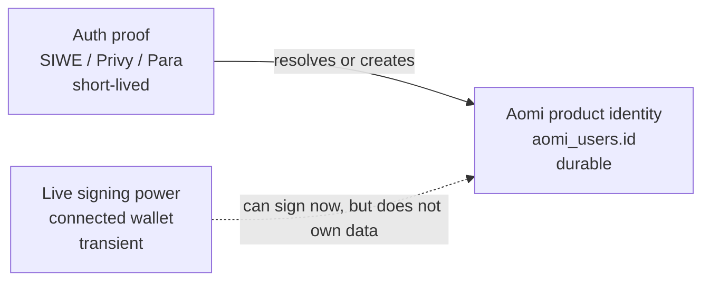
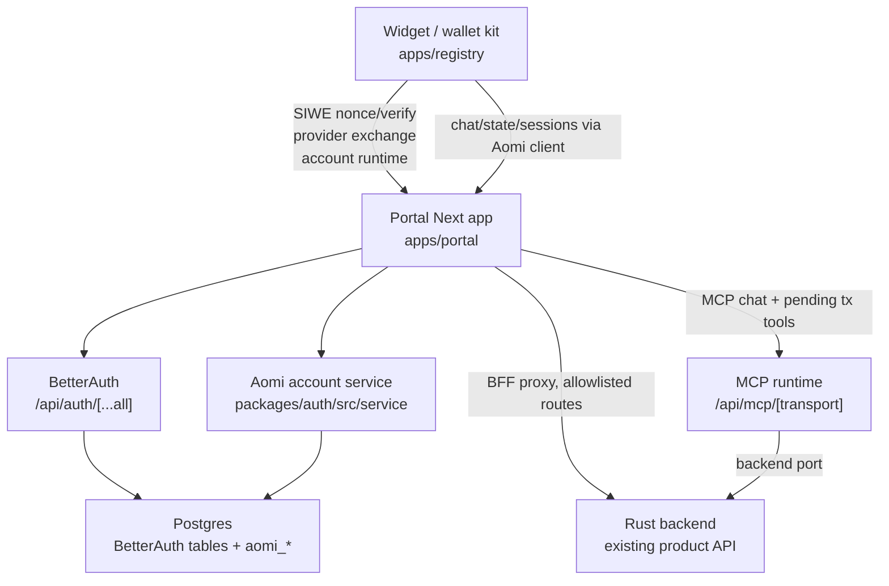
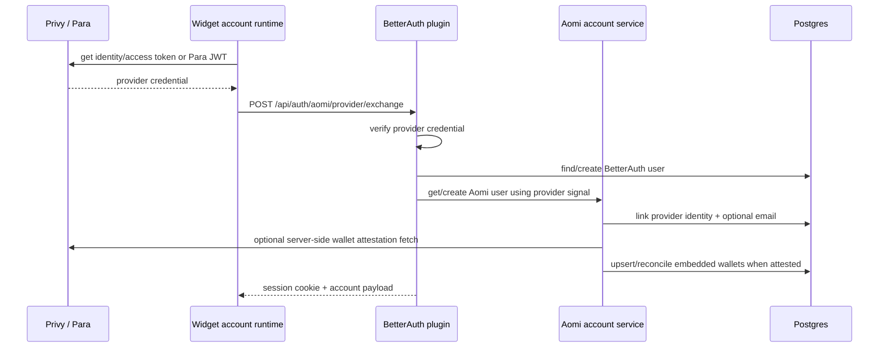
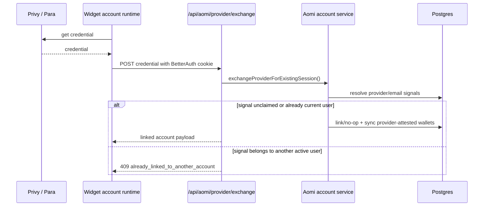
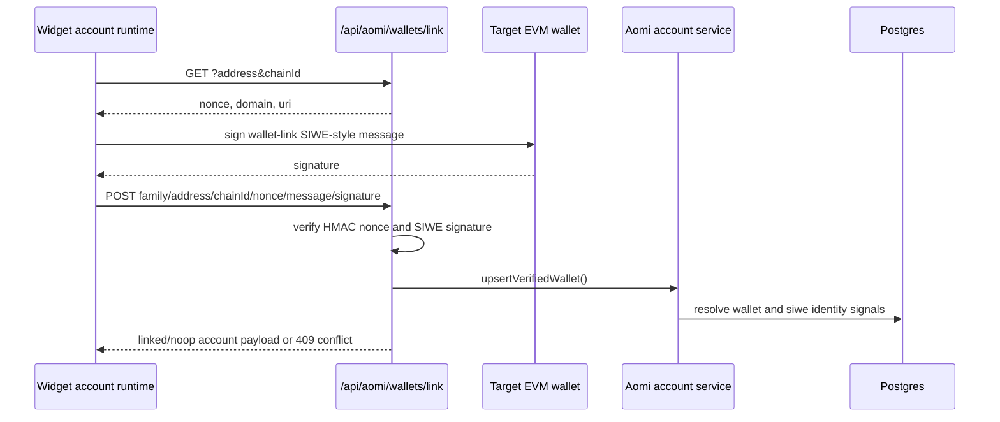
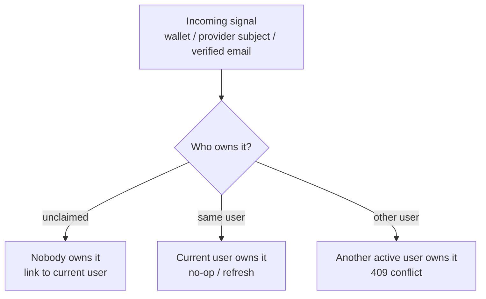
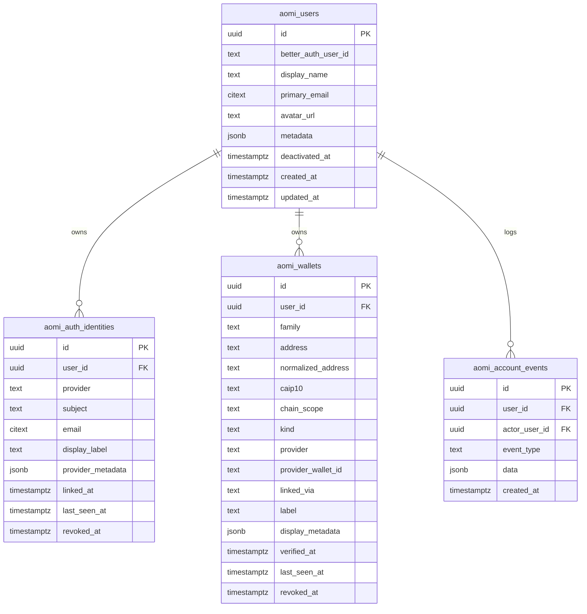

# Widget User Auth — Current State And Remaining Work

> Status: code-aligned current-state document.
> Last checked against this repo on 2026-07-13.
>
> This is no longer only an implementation plan. It records what exists in the
> code right now, where it lives, how the pieces fit together, and what is still
> left before the Rust backend can treat `aomi_users.id` as its durable account
> owner.
>
> 2026-07-02 implementation note: historical BetterAuth backend JWT/JWKS and
> legacy Rust provider-exchange paths have been removed. The live backend-auth
> path is BetterAuth session -> canonical Aomi user -> portal-minted EdDSA
> AccountBearer via the static service topology.
>
> 2026-07-13 integration note: Portal is the sole browser auth, account, and
> backend-BFF host. Landing and future widget integrators call Portal
> cross-origin; they do not mount copies of Portal's Next routes.
> Integrators mount one `AomiWidget`, choose embedded auth with `paraAuth()` or
> `privyAuth()`, or omit `auth` for external-wallet/SIWE-only operation. The
> provider helpers live on provider subpaths so the providerless bundle does
> not include either embedded-auth SDK.

---

## Table Of Contents

1. The one idea
2. Current status
3. Repository map
4. Architecture
5. Route map
6. Runtime flow
7. Token model
8. Identity and linking rules
9. Database schema
10. Provider auth sources
11. Frontend account runtime
12. Portal integration
13. MCP boundary
14. What remains
15. Verification
16. Important corrections from the older plan

---

## 1. The One Idea

A user is not a wallet address.

A wallet proves control at a moment in time. The durable owner of product data is
`aomi_users.id`. The current browser wallet is only live signing context.



The code now implements this separation in the portal and widget layer:

- BetterAuth owns browser sessions and SIWE/provider sign-in.
- `packages/auth` owns the Aomi account graph: users, provider identities,
  linked wallets, and account events.
- The widget wallet kit consumes the account runtime and exposes account state
  separately from live wallet connection state.
- The Rust backend still uses the existing account-session exchange unless the
  opt-in BetterAuth JWT path is enabled.

---

## 2. Current Status

| Area                              | Current state                                                                                                                                      |
| --------------------------------- | -------------------------------------------------------------------------------------------------------------------------------------------------- |
| BetterAuth mount                  | Shipped at `apps/portal/src/app/api/auth/[...all]/route.ts`.                                                                                       |
| SIWE sign-in                      | Shipped through BetterAuth SIWE plugin plus widget auto-SIWE flow.                                                                                 |
| Provider session creation         | Shipped through BetterAuth plugin endpoint `/api/auth/aomi/provider/exchange`.                                                                     |
| Provider link to existing account | Shipped at `/api/aomi/provider/exchange`.                                                                                                          |
| Account runtime API               | Shipped at `/api/aomi/account`, `/api/aomi/wallets/*`, `/api/aomi/identities/*`, `/api/aomi/sign-out`.                                             |
| Account database schema           | Shipped in `packages/auth/src/db/schema.sql`, run lazily by account service calls.                                                                 |
| `aomi_users.id`                   | Shipped as the portal-side durable user id.                                                                                                        |
| Linked provider identities        | Shipped in `aomi_auth_identities`.                                                                                                                 |
| Linked wallets                    | Shipped in `aomi_wallets`, including SIWE external wallets and provider-attested embedded wallets when REST credentials are configured.            |
| Account deletion/deactivation     | Shipped at `DELETE /api/aomi/account`; soft-deactivates the user, revokes linked identities/wallets, clears the BetterAuth mapping, and signs out. |
| Conflict policy                   | Shipped: unclaimed signals link, same-owner signals no-op, other-owner signals return conflict. No merge engine.                                   |
| MCP approval auth                 | Removed after deprecation. Portal routes and MCP tools do not depend on legacy auth approval subpaths.                                             |
| BetterAuth backend JWT            | Removed. Backend trust now uses portal-minted EdDSA AccountBearer tokens, not BetterAuth JWT/JWKS.                                                 |
| Rust canonical-user trust         | Shipped through the BFF proxy: `aomi_users.id` is mirrored to backend `users.id`, then used as AccountBearer `sub`.                                |
| SIWE-only Rust history            | No longer anonymous after BFF login; SIWE creates a Better Auth session and the proxy mints the backend bearer from that session.                  |
| External widget origins           | Landing calls Portal directly with credentialed fetches. Portal CORS and BetterAuth use one exact trusted-origin policy.                           |

---

## 3. Repository Map

Current auth/account files live here:

```text
packages/auth/src/
  index.ts                                  # shared auth/account type exports only
  account.ts                                # public account-service exports
  types.ts                                  # shared account/auth/wallet structs
  better-auth/
    auth.ts                                 # betterAuth(...) server config
    auth-client.ts                          # createAuthClient + siweClient
    env.ts                                  # auth/account env reader
    index.ts                                # BetterAuth package exports
    provider-plugin.ts                      # /api/auth/aomi/provider/exchange
    siwe.ts                                 # SIWE verification helper
  db/
    pool.ts                                 # pg.Pool from DATABASE_URL
    queries.ts                              # schema runner + account queries
    schema.sql                              # aomi_* tables/indexes
  providers/
    account-credentials.ts                  # provider credential verification dispatcher
    default-wallet-attesters.ts             # Privy/Para REST attester registry
    para.ts                                 # Para JWT + wallet-list verification
    privy.ts                                # Privy access/identity token + wallet-list verification
    wallet-attestation.ts                   # attested wallet types/helpers
  service/
    account-service.ts                      # account creation, linking, unlinking, sync
    provider-exchange.ts                    # link provider credential into existing session
    wallet-linking.ts                       # HMAC nonce + SIWE wallet-link proof
    wallet-normalization.ts                 # EVM/SVM address normalization + CAIP-10
```

Portal route mounts:

```text
apps/portal/src/app/api/
  auth/[...all]/route.ts                    # BetterAuth catch-all
  aomi/account/route.ts                     # GET/PATCH/DELETE account runtime
  aomi/provider/exchange/route.ts           # link provider into current session
  aomi/sign-out/route.ts                    # wrapper over BetterAuth sign-out
  aomi/wallets/link/route.ts                # wallet-link nonce + signature submit
  aomi/wallets/[id]/route.ts                # rename/unlink linked wallet
  aomi/identities/[id]/route.ts             # rename/unlink provider identity
  mcp/[transport]/route.ts                  # MCP endpoint; chat + pending tx tools only
  [...slug]/route.ts                        # Rust backend BFF proxy
```

Portal MCP bridge files:

```text
apps/portal/src/lib/aomi-mcp/
  env.ts                                    # AOMI_BE_URL/AOMI_AUTH_TOKEN/dev user id
  mcp-server.ts                             # wires @aomi-labs/mcp-core to BE
```

Widget/account runtime files:

```text
apps/registry/src/lib/wallet-kit/
  config/types.ts                           # account={{ mode: "aomi-backend" }}
  config/AomiWalletKitProvider.tsx          # enables account runtime via provider config
  account/
    types.ts                                # AccountRuntime / AccountWallet types
    aomi-backend-client.ts                  # fetch client for /api/aomi + /api/auth paths
    aomi-backend-runtime.ts                 # auto-SIWE, provider exchange, link/unlink
    disabled-runtime.ts
    use-resolved-account-runtime.ts
  composer/AomiWalletKitComposer.tsx        # exposes accountUser/accountWallets/actions
  providers/privy/PrivyPluginProvider.tsx   # Privy getCredential()
  providers/para/ParaPluginProvider.tsx     # Para getCredential()
```

Client/backend credential bridge:

```text
packages/client/src/account-session.ts      # optional BFF bearer provider for cross-origin clients
apps/portal/src/components/portal-aomi-frame.tsx
apps/portal/src/app/api/[...slug]/route.ts  # BFF proxy allowlist
```

Verification harness:

```text
apps/portal/src/app/dev/widget-auth-e2e/
  page.tsx
  widget-auth-e2e-client.tsx                # SIWE, Privy exchange, link/unlink, sign-out harness
```

---

## 4. Architecture



The remaining seam is operational, not a separate auth design:

- Portal/account identity works today.
- Privy/Para provider credentials create or link Better Auth sessions through
  `/api/auth/aomi/provider/exchange` and `/api/aomi/provider/exchange`.
- Browser and CLI backend calls enter through the portal BFF. The proxy resolves
  the Better Auth session, mirrors the canonical user into the backend DB, and
  mints the backend AccountBearer.
- Direct cross-origin clients can call `/api/aomi/account-bearer` with a Better Auth
  cookie when they intentionally need a short-lived AccountBearer outside the
  same-origin proxy path.

---

## 5. Route Map

### BetterAuth

Mounted by `apps/portal/src/app/api/auth/[...all]/route.ts`.

| Route                              | Owner                      | Purpose                                                                                                |
| ---------------------------------- | -------------------------- | ------------------------------------------------------------------------------------------------------ |
| `/api/auth/siwe/nonce`             | BetterAuth SIWE plugin     | Create SIWE nonce.                                                                                     |
| `/api/auth/siwe/verify`            | BetterAuth SIWE plugin     | Verify SIWE message/signature and create BetterAuth session.                                           |
| `/api/auth/aomi/provider/exchange` | `aomiProviderAuthPlugin()` | Verify Privy/Para credential, create or find BetterAuth user, create Aomi account, set session cookie. |
| `/api/auth/sign-out`               | BetterAuth                 | Clear BetterAuth session.                                                                              |

### Aomi Account API

Mounted under `apps/portal/src/app/api/aomi/*`.

| Route                         | Methods  | Current behavior                                                                                                                                                             |
| ----------------------------- | -------- | ---------------------------------------------------------------------------------------------------------------------------------------------------------------------------- |
| `/api/aomi/account`           | `GET`    | Return `{ user, linkedAccounts, wallets, session }` for current BetterAuth session, or null account payload if unauthenticated. Also syncs SIWE wallet rows from BetterAuth. |
| `/api/aomi/account`           | `PATCH`  | Update `displayName` and/or `avatarUrl` for the current Aomi user.                                                                                                           |
| `/api/aomi/account`           | `DELETE` | Deactivate the current Aomi user, revoke all active provider identities and wallets so they can be linked again elsewhere, clear the BetterAuth user mapping, and sign out.  |
| `/api/aomi/provider/exchange` | `POST`   | Verify a Privy/Para credential and link it into the existing BetterAuth session's Aomi account. Returns `409` on cross-account signal conflicts.                             |
| `/api/aomi/wallets/link`      | `GET`    | Return HMAC wallet-link nonce for an authenticated Aomi account, EVM address, and chain id.                                                                                  |
| `/api/aomi/wallets/link`      | `POST`   | Verify nonce + SIWE-style wallet-link signature, then upsert an external EVM wallet. Returns `409` on cross-account wallet conflicts.                                        |
| `/api/aomi/wallets/[id]`      | `PATCH`  | Rename wallet label.                                                                                                                                                         |
| `/api/aomi/wallets/[id]`      | `DELETE` | Soft-revoke wallet. Blocks non-embedded wallet unlink only when the total login-factor count is `<= 1`; also detaches BetterAuth SIWE wallet/account rows for SIWE wallets.  |
| `/api/aomi/identities/[id]`   | `PATCH`  | Rename provider identity display label unless protected.                                                                                                                     |
| `/api/aomi/identities/[id]`   | `DELETE` | Soft-revoke provider identity unless protected or last login factor.                                                                                                         |
| `/api/aomi/sign-out`          | `POST`   | Proxy to BetterAuth `/api/auth/sign-out`.                                                                                                                                    |

Protected identities today:

- `better_auth`
- `siwe`
- `email`

### Rust Backend Proxy

`apps/portal/src/app/api/[...slug]/route.ts` proxies only allowlisted product API
routes. It forwards a small header set:

```text
accept
authorization
content-type
aomi-app-key
x-session-id
```

The proxy currently allowlists account, session/thread, state, chat, events,
model/control, secret, settings, and simulation routes. It strips browser
cookies and incoming client `Authorization` before forwarding to the backend.

---

## 6. Runtime Flow

### SIWE Sign-In

```mermaid
sequenceDiagram
  participant W as EVM wallet
  participant Kit as Widget account runtime
  participant Auth as BetterAuth /api/auth
  participant Account as Aomi account service
  participant DB as Postgres

  Kit->>Auth: POST /api/auth/siwe/nonce
  Auth-->>Kit: nonce
  Kit->>W: sign SIWE message
  W-->>Kit: signature
  Kit->>Auth: POST /api/auth/siwe/verify
  Auth->>DB: create BetterAuth user/session/walletAddress
  Auth-->>Kit: session cookie
  Kit->>Account: GET /api/aomi/account
  Account->>DB: get/create aomi_users; mirror SIWE wallet
  Account-->>Kit: account runtime payload
```

Implementation details:

- The widget runtime only auto-prompts SIWE when account mode is enabled, the
  account response has no user, and there is an active EVM signer.
- A rejected SIWE attempt suppresses repeat prompts for that wallet/chain until
  state changes.
- SIWE wallet rows from BetterAuth are mirrored into `aomi_wallets` as
  `family='evm'`, `kind='external'`, `provider='siwe'`, `linked_via='siwe'`.

### Provider Sign-In Without An Existing Account



### Provider Link Into Existing Account



### Link Another EVM Wallet



The wallet being linked must sign. An existing linked wallet never re-signs just
because the user is attaching a new wallet.

---

## 7. Token Model

There are still several credentials, and they intentionally do different jobs.

| Credential           | Made by    | Proves                                 | Stored?                  | Current use                                                      |
| -------------------- | ---------- | -------------------------------------- | ------------------------ | ---------------------------------------------------------------- |
| Privy access token   | Privy      | Privy login/session subject            | Raw token is not stored  | Can verify login proof; no email/linked accounts.                |
| Privy identity token | Privy      | Privy user plus identity claims        | Raw token is not stored  | Preferred account credential; can include email/linked accounts. |
| Para session JWT     | Para       | Para session/user subject              | Raw token is not stored  | Verifies via Para JWKS and feeds account link/sign-in.           |
| BetterAuth session   | BetterAuth | Browser/device is BetterAuth user X    | BetterAuth session table | Primary portal session; carried by cookie or CLI bearer token.   |
| AccountBearer        | Portal BFF | Backend may trust canonical `users.id` | Not stored               | Minted per BFF request, verified by Rust service topology.       |

### Backend AccountBearer

The BFF-facing bridge is `@aomi-labs/account`, not a BetterAuth JWT plugin.

- `apps/portal/src/lib/aomi-account/canonical-session.ts` resolves the Better
  Auth session to a canonical Aomi user and backend `users.id`.
- `packages/account/src/proxy.ts` strips client credentials, mints an EdDSA
  `AccountBearer`, and forwards trusted backend requests.
- `packages/account/src/token.ts` backs `/api/aomi/account-bearer` for explicit
  cross-origin clients.
- `packages/client/src/account-session.ts` can use that BFF token route when a
  consumer is intentionally calling the backend directly. The CLI does not need
  that route; it sends its Better Auth bearer session to the portal proxy.

---

## 8. Identity And Linking Rules

All incoming signals go through the same ladder:



Current code:

- `findSignalOwner()` checks wallets, provider identities, or email identities.
- `resolveSignal()` returns `linked`, `noop`, or `conflict`.
- `upsertAuthIdentity()` and `upsertWallet()` update only when the existing active
  row already belongs to the same user.
- Partial unique indexes enforce one active owner for a provider subject, email
  identity, or wallet key.

There is no merge engine right now.

What that means:

- A claimed signal never moves silently.
- A user must sign into the owning account and unlink there before linking the
  signal elsewhere.
- There is no background clustering or account recovery sweep.
- Email is only linked when provider verification says it is verified.
- `better_auth`, `siwe`, and `email` identities are protected from direct unlink.

Login-factor counting is intentionally conservative:

```sql
active wallets
+ active provider identities excluding better_auth, siwe, email
```

For provider identities, that count blocks unlinking when it would leave no other
login factor. For wallets, `unlinkWallet()` blocks unlinking a non-embedded
wallet only when this total count is `<= 1`; embedded wallets are allowed to be
revoked even when they are the only wallet row.

---

## 9. Database Schema

The authoritative schema is `packages/auth/src/db/schema.sql`.



Schema facts that matter:

- `pgcrypto` and `citext` are enabled.
- `aomi_users.better_auth_user_id` is unique but nullable.
- `aomi_users.primary_email` has a non-unique active-user index, not a uniqueness
  constraint.
- `aomi_auth_identities` has no provider check constraint in the live schema.
- `aomi_auth_identities_active_unique` enforces one active `(provider, subject)`.
- `aomi_auth_identities_active_email_unique` enforces one active email identity
  for `provider='email'`.
- `aomi_wallets.family` is constrained to `evm | svm`.
- `aomi_wallets.kind` is constrained to `external | embedded | smart_account`.
- `aomi_wallets.linked_via` has no check constraint in the live schema.
- `aomi_wallets_active_unique` enforces one active wallet by
  `(family, normalized_address, coalesce(chain_scope, '*'))`.

The live schema does not have:

- `primary_email_verified` on `aomi_users`.
- `email_verified` or `auth_method` on `aomi_auth_identities`.
- `wallet_capability` storage. Capability is computed client-side from live
  wallet presence.
- `aomi_wallet_proofs`.
- `aomi_wallet_challenges`.

---

## 10. Provider Auth Sources

### Privy

Client side:

- `apps/registry/src/lib/wallet-kit/providers/privy/PrivyPluginProvider.tsx`
  exposes `getCredential()`.
- It prefers `privy.getIdentityToken()`.
- It falls back to `privy.getAccessToken()`.

Server side:

- `packages/auth/src/providers/privy.ts` verifies both token kinds.
- Access tokens use `createPrivyAccessTokenVerifier()` from
  `packages/auth/src/providers/privy.ts`.
- Identity tokens verify with `jose.jwtVerify`, `iss = "privy.io"`, and
  `aud = PRIVY_APP_ID`.
- Identity token verification accepts `PRIVY_IDENTITY_JWT_VERIFICATION_KEY`,
  falling back to `PRIVY_JWT_VERIFICATION_KEY`.
- Privy REST wallet attestation uses `PRIVY_APP_ID` + `PRIVY_APP_SECRET` against
  `https://api.privy.io/v1/wallets`.

Privy wallet attestation behavior:

- Lists wallets by verified Privy subject.
- Keeps only currently custodied wallets.
- Skips imported/exported/archived wallets.
- Supports EVM and Solana wallet rows.
- Upserts them as `kind='embedded'`, `linked_via='privy'`.

### Para

Client side:

- `apps/registry/src/lib/wallet-kit/providers/para/ParaPluginProvider.tsx`
  exposes `getCredential` when Para session is connected and not locally detached.
- `apps/registry/src/lib/wallet-kit/providers/para/para-auth.ts` calls
  `useIssueJwt().issueJwtAsync()`.

Server side:

- `packages/auth/src/providers/para.ts` verifies Para session JWTs via JWKS.
- Required env: `PARA_JWKS_URL` and `PARA_API_KEY` or
  `NEXT_PUBLIC_PARA_API_KEY` as the expected audience.
- Optional `keyId` must match the protected JWT header `kid` if both are present.
- Para REST wallet attestation uses `PARA_API_SECRET_KEY` as `X-API-Key`.
- Default Para wallet API base is `https://api.beta.getpara.com/v1/wallets`,
  overridable with `PARA_API_BASE_URL`.

Para wallet attestation behavior:

- Fetches wallets by `userIdentifier`, defaulting identifier type to `CUSTOM_ID`.
- Keeps only EVM/Solana wallet types with embedded/MPC schemes:
  `DKLS`, `FROST`, or scheme strings containing `MPC`.
- Upserts them as `kind='embedded'`, `linked_via='para'`.

### Solana

Solana is partly represented but not a standalone auth flow yet:

- `WalletFamily` includes `svm`.
- SVM addresses preserve case in normalization.
- Provider-attested Solana embedded wallets can be recorded as `aomi_wallets`.
- There is no SIWS route or manual Solana challenge table yet.
- A live Solana wallet can be write-capable in the widget, but it is not a
  portal auth proof by itself.

---

## 11. Frontend Account Runtime

Account runtime is opt-in through wallet-kit config:

```tsx
<AomiWalletKitProvider account={{ mode: "aomi-backend" }} />
```

The portal enables it in `apps/portal/src/components/wallet-providers.tsx`.

The runtime exposes these fields through `useAomiWalletKit()`:

```text
accountStatus
accountUser
accountLinkedAccounts
accountWallets
signOutAccount
updateAccount
linkWallet
updateLinkedAccount
updateLinkedWallet
unlinkLinkedWallet
unlinkLinkedAccount
getAccountCredential
```

Account runtime behavior in
`apps/registry/src/lib/wallet-kit/account/aomi-backend-runtime.ts`:

- Fetches `/api/aomi/account` on mount/refresh.
- Auto-SIWE signs with an active EVM wallet when there is no account user.
- Exchanges provider credentials in create-session mode if no account exists.
- Exchanges provider credentials in link mode if an account already exists.
- Suppresses repeated failed SIWE attempts for the same address/chain.
- Suppresses immediate re-exchange after sign-out for the same provider credential.
- Computes wallet capability as:
  - `write` when the wallet address is live in the current EVM/SVM runtime.
  - `read` when it is linked but not currently connected.
- Builds wallet-link messages client-side and submits nonce/message/signature to
  `/api/aomi/wallets/link`.
- Labels newly linked wallets with a brand-based default such as `MetaMask 1`.

---

## 12. Portal Integration

`apps/portal/src/components/wallet-providers.tsx` selects auth provider config:

- Privy wins when `NEXT_PUBLIC_PRIVY_APP_ID` is set.
- Otherwise Para is used when `NEXT_PUBLIC_PARA_API_KEY` is set.
- Otherwise auth is disabled but wallet connections can still exist.

It always passes:

```tsx
account={{ mode: "aomi-backend" }}
```

`apps/portal/src/components/portal-aomi-frame.tsx` uses same-origin proxy mode
by default. In that mode the frame does not need a client token provider: browser
requests carry the Better Auth cookie to the portal, and the BFF proxy mints the
backend AccountBearer server-side.

`createAccountAccessTokenProvider()` remains for explicit cross-origin clients
that need `/api/aomi/account-bearer`; it is not the normal portal widget path.

### Landing and external widgets

Landing mounts the package-level `AomiWidget` and selects Para with
`auth={paraAuth(...)}`. `AomiWidget` passes the canonical Portal URL as both
the account runtime `baseUrl` and the frame `backendUrl`. The client uses
`credentials: "include"` for
REST, polling, and streaming requests, so the Portal BetterAuth session is
reused and Portal mints the same canonical-user AccountBearer for backend
requests.

The same component supports Privy through the Privy provider subpath and a
providerless mode by omitting `auth`. Consumers do not need a Portal client,
Next proxy, wallet-kit wrapper, chain list, or Solana network list for the
default integration; each remains overridable through `AomiWidget` props.

Portal's `src/proxy.ts` handles credentialed CORS for `/api/*`. Its origin
allowlist comes from the same `resolveAccountTrustedOrigins()` function used by
BetterAuth and applies the same exact/wildcard matching. The hosted Landing
origin, Aomi-owned Landing Vercel previews, and standard local Landing origins
are included; additional integrators must be added through
`AOMI_TRUSTED_ORIGINS`.

Landing intentionally retains no `/api/auth/*` or `/api/aomi/*` route mounts.
Provider exchange, SIWE, account updates, wallet links, sign-out, and
AccountBearer minting all remain Portal responsibilities.

---

## 13. MCP Boundary

The active MCP endpoint no longer uses the old approval-auth flow. The portal
mounts one MCP route:

```text
apps/portal/src/app/api/mcp/[transport]/route.ts
```

That route builds an MCP server from:

```text
apps/portal/src/lib/aomi-mcp/
  env.ts
  mcp-server.ts

packages/mcp-core/src/
  runtime.ts
  ports/backend.ts
  tools/chat.ts
  tools/pending-tx.ts
```

The active MCP server registers only:

```text
chat
pending_tx
```

There are no active `connect_provider`, `connect_app`, `disconnect_provider`,
or `disconnect_app` tools.

The deprecated package layout and explicit legacy package subpaths were removed.

Do not confuse this with widget user auth:

| System                | Answers                       | Routes / package surface                          |
| --------------------- | ----------------------------- | ------------------------------------------------- |
| Widget account auth   | Who is this user?             | `/api/auth/*`, `/api/aomi/*`, `@aomi-labs/auth/*` |
| Active MCP runtime    | What tools can this MCP call? | `/api/mcp/[transport]`, `@aomi-labs/mcp-core`     |
| Removed MCP approvals | May app X use provider Y?     | Removed package surface                           |

The former MCP approval helpers no longer share the root auth export, package
subpaths, portal route aliases, or MCP runtime dependency graph.

---

## 14. What Remains

### Deferred Schema Alignment

The remaining auth-model work is the later schema/provenance alignment from
`AUTH-STACK-REVIEW.md` §13-A, not the removed BetterAuth JWT path:

- Decide final canonical table names across portal auth DB and backend DB.
- Add a nullable provider-provenance FK for provider-attested wallet rows.
- Include a live auth-DB `jwks` table drop in that later migration if any
  deployed auth database has the old table.

### Id Unification / Mapping

The durable open question is still how `aomi_users.id` maps to product-mono
`users.id`:

- Direct unification if databases/users are shared.
- Explicit mapping if product-mono keeps a separate user table.

The current merge keeps `sub = users.id` for backend bearers. It does not
attempt the deferred schema rename or cross-DB convergence work.

### Solana Auth

Still not implemented:

- SIWS/manual SVM challenge endpoint.
- SVM challenge/proof tables.
- SVM wallet auth that can create a BetterAuth session without Privy/Para.

### UX/Product Polish

Still worth finishing:

- Production-grade account settings copy around linked wallets vs live wallets.
- Clear conflict recovery UX when a wallet/provider is already linked elsewhere.
- Better “last login factor” messaging.
- Decide whether provider-attested embedded wallets should always show as
  read-capable even when provider REST credentials are absent.

### Operational Hardening

Still needed before depending on this in production:

- Run schema through migrations instead of lazy `runAomiAuthSchema()` in service
  calls.
- Add rate limiting around SIWE/provider/wallet-link endpoints if not handled by
  deployment/runtime defaults.
- Confirm production `DATABASE_URL`, `BETTER_AUTH_SECRET`, `BETTER_AUTH_URL`,
  `AOMI_AUTH_DOMAIN`, `AOMI_TRUSTED_ORIGINS`, Privy keys, and Para keys.
- Decide whether local defaults in `readAccountAuthEnv()` are acceptable only in
  development.

---

## 15. Verification

Current focused tests exist under:

```text
packages/auth/test/
  account-credentials.test.ts
  privy.test.ts
  provider-wallets.test.ts
  wallet-attestation.test.ts
  wallet-linking.test.ts

apps/registry/src/lib/wallet-kit/account/
  aomi-backend-runtime.test.ts

apps/registry/src/lib/wallet-kit/
  accounts.test.ts
  composer/merge-wallet-rows.test.ts
  ...
```

Useful commands:

```bash
pnpm --filter @aomi-labs/auth type-check
pnpm exec vitest run packages/auth/test
pnpm exec vitest run apps/registry/src/lib/wallet-kit/account/aomi-backend-runtime.test.ts
pnpm run typecheck:portal
pnpm run build:registry
```

Manual harness:

```text
apps/portal/src/app/dev/widget-auth-e2e/page.tsx
```

That harness exercises:

- SIWE nonce + verify.
- Privy provider exchange.
- Linked-wallet nonce + signature flow.
- Account refresh.
- Wallet unlink.
- Provider logout.
- BetterAuth sign-out.
- Account deletion/deactivation.

---

## 16. Important Corrections From The Older Plan

These are the places where the old plan no longer matched the code:

1. This is not build-ready future work anymore. Large parts are implemented.
2. The live schema is looser than the old SQL:
   `primary_email_verified`, identity `email_verified`, and identity
   `auth_method` do not exist.
3. The live schema drops provider and `linked_via` check constraints so values
   can evolve without schema churn.
4. Provider-attested embedded wallets are now synced into `aomi_wallets` when
   Privy/Para REST credentials are configured. The old text described them as
   identity-only in v1.
5. There are two provider-exchange paths:
   `/api/auth/aomi/provider/exchange` creates a BetterAuth session, while
   `/api/aomi/provider/exchange` links into an existing session.
6. `packages/auth/src/service/siwe-mirror.ts` was removed; SIWE mirroring
   happens through `syncSiweWalletsForUser()` in `account-service.ts`.
7. The BFF proxy is the Rust-facing auth boundary and injects portal-minted
   AccountBearer tokens, not BetterAuth JWTs.
8. The old BetterAuth JWT/JWKS client support was removed; cross-origin clients
   use `/api/aomi/account-bearer` when needed.
9. MCP approval auth was deprecated, unmounted, and then removed from
   `@aomi-labs/auth`.
10. The current account runtime computes linked wallet capability from live
    wallet state; capability is not stored in Postgres.
