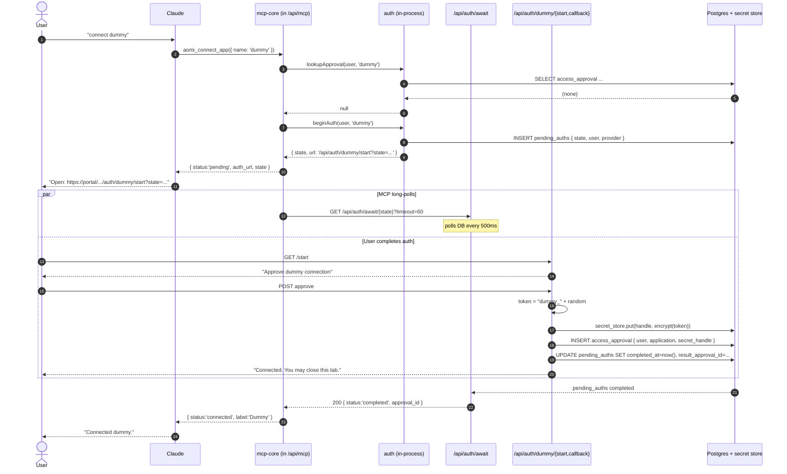
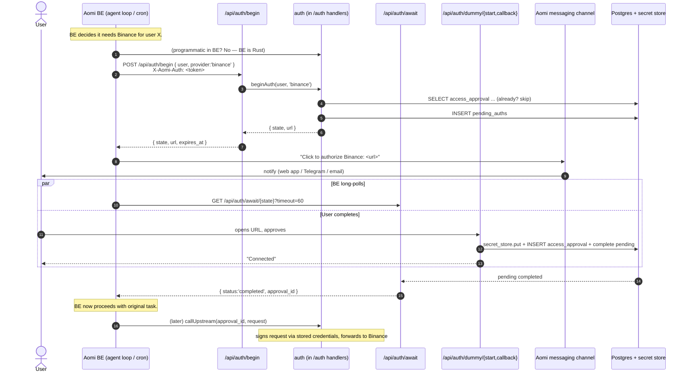
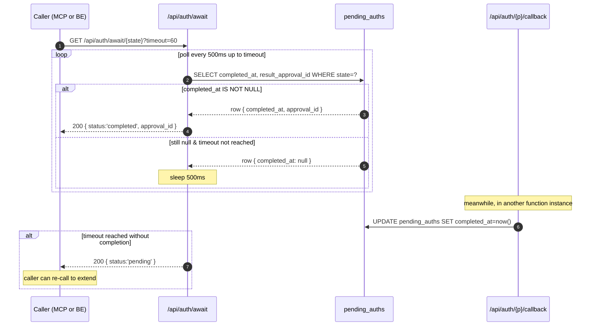

# Aomi MCP — Design

> Historical design note. The current implementation contract is
> [`MCP-CHAT-PARITY-PLAN.md`](./MCP-CHAT-PARITY-PLAN.md): OAuth-protected
> `/api/mcp` exposes the four-tool asynchronous Aomi agent path, while the
> former discovery/execution funnel remains available at `/api/mcp/direct`.
> Both endpoints use the same origin-scoped OAuth protected-resource metadata,
> BetterAuth canonical-user resolution, and BFF-minted AccountBearer. The
> approval-auth and `[transport]` route design below is retired context.

A single design document for shipping Aomi as a Claude/Codex plugin via MCP,
and for hosting the shared credential authority that both MCP and the Rust BE
depend on.

Covers:
- (a) package + file layout, including the standalone `packages/auth` module.
- (b) the first end-to-end prototype slice with sequence diagrams.

## 1. Context

Three rules drive the design:

1. **Aomi BE never holds API tokens or wallet keys.** All credentialed work is
   handled by `packages/auth`, mounted in the portal Vercel deployment. The BE
   can _trigger_ credentialed upstream calls, but it does so by going through
   `auth` — it never reads or stores secret material.
2. **MCP is Aomi-shaped, not pass-through.** Tools expose Aomi verbs
   (`aomi_chat`, `aomi_list_pending`, `aomi_request_signature`, …). The MCP
   never exposes Binance / Dune / Privy / etc. directly to Claude.
3. **Wallet signing requires the user's laptop open.** Embedded wallets
   (Privy / Para) and raw PK execute locally; the BE only ever sees signed
   bytes. API-token work _can_ run async (auth holds tokens server-side), but
   signing cannot.

### The dual-path insight

Two AI-facing call paths need the **same** credential authority. They differ
only in who narrates the auth link to the user.

**Path 1 — Claude-driven.**

```
user → Claude → MCP → BE → auth → upstream (e.g. Binance)
                              │
                              ▼ (when no grant)
                       returns auth_url
                              │
                              ▼
                  Claude shows URL in chat; user clicks
```

**Path 2 — Aomi-bot-driven.**

```
Aomi BE (agent loop, cron, scheduled task) → auth → upstream
                                                │
                                                ▼ (when no grant)
                                         returns auth_url
                                                │
                                                ▼
                       Aomi bot pushes URL via its own channel (web app,
                       Telegram, etc.); user clicks
```

Both paths produce the same artifact: a row in `access_approval` plus a credential
in the secret store. Both paths need to long-poll for completion. Both paths
revoke the same way.

That's why `auth` is its own module — it isn't an MCP concern, it's a shared
service that the MCP _and_ the BE both depend on.

## 2. Trust topology

```
                  ┌──────────────────────────────────────────────┐
                  │              portal.aomi.dev                 │
                  │                (Vercel app)                  │
                  │                                              │
   Claude  ──MCP──▶  /api/mcp/[transport]   (packages/mcp-core)  │
                  │           │                                  │
                  │           ▼   in-process call                │
                  │   ┌──────────────────────────────────────┐   │
                  │   │       packages/auth                  │   │
                  │   │                                      │   │
                  │   │  HTTP routes:                        │   │
   browser   ────────▶│   /api/auth/{provider}/start         │   │
   browser   ────────▶│   /api/auth/{provider}/callback      │   │
                  │   │   /api/auth/await/[state]            │◀───── MCP long-poll
   Aomi BE   ────────▶│   /api/auth/begin                    │   │
   Aomi BE   ────────▶│   /api/auth/proxy/{app}/*            │──────▶ upstream APIs
                  │   │                                      │   │
                  │   │  programmatic API (in-process):      │   │
                  │   │   beginAuth / awaitAuth /            │   │
                  │   │   lookupApproval / revokeApproval /        │   │
                  │   │   callUpstream                       │   │
                  │   └──────────────────────────────────────┘   │
                  │           │              │                   │
                  │           ▼              ▼                   │
                  │   ┌────────────┐   ┌──────────────┐          │
                  │   │ Vercel KV  │   │ Postgres     │          │
                  │   │ (envelope- │   │  access_approval  │          │
                  │   │  encrypted)│   │  pending_*   │          │
                  │   └────────────┘   └──────────────┘          │
                  │                                              │
                  │   /api/sign/[handle]      (post-v1)          │
                  └──────────────────────────────────────────────┘
```

Per-handler capabilities (production target — v1 prototype is laxer; see §4):

| Handler                          | Owner            | Reads DB | Reads secrets | Writes secrets |
| -------------------------------- | ---------------- | -------- | ------------- | -------------- |
| `/api/mcp/*`                     | `mcp-core`       | yes      | no            | no             |
| `/api/auth/{provider}/start`     | `auth`           | yes      | no            | no             |
| `/api/auth/{provider}/callback`  | `auth`           | insert   | no            | yes            |
| `/api/auth/await/[state]`        | `auth`           | yes      | no            | no             |
| `/api/auth/begin`                | `auth`           | insert   | no            | no             |
| `/api/auth/proxy/{app}/*`        | `auth`           | lookup   | yes           | no             |
| `/api/sign/*` (post-v1)          | portal           | yes      | no            | no             |

The MCP runtime role does **not** have KMS decrypt permission. Only auth's
callback role (writes) and proxy role (reads) do. A bug in MCP cannot leak a
Binance token. A bug in the proxy cannot leak conversation history.

**v1 relaxation.** Until the dedicated proxy ships, "writes secrets" means
`POST /api/secrets` on the BE — the OAuth callback hands the token to BE's
existing `SecretVault` and only the opaque handle comes back to portal. BE
remains the actual reader of the value (same as today's `/api/secrets`
flow). The trust boundary we _aren't_ enforcing in v1 is "BE never touches
the token" — we keep it because moving it requires the proxy + KV+KMS work.
What v1 _does_ enforce is "MCP never touches the token" and "the OAuth
dance lives in `auth`, not in BE."

## 3. Package layout

### New package: `packages/auth`

The credential authority. Owns providers, pending state, the secret store,
the credential proxy, and all route handlers under `/api/auth/*`. Used
in-process by `mcp-core` and over HTTP by the Rust BE.

```
packages/auth/
  src/
    index.ts                  exports programmatic API + route factories
    api/
      begin.ts                beginAuth(user_id, provider, opts) → { state, url }
      await.ts                awaitAuth(state, { timeout_ms }) → { status, approval_id? }
      lookup.ts               lookupApproval(user_id, application) → AccessApproval | null
      revoke.ts               revokeApproval(approval_id) → void
      proxy.ts                callUpstream(approval_id, request) → response
    providers/
      registry.ts             name → ProviderModule
      types.ts                ProviderModule interface
      dummy.ts                v0
      binance.ts              v1
      privy.ts                v1
      para.ts                 v1
    pending/
      auths.ts                pending_auths table accessors + completion notify
    approvals/
      approvals.ts            access_approval table accessors
    secret-store/
      index.ts                put/get/rotate; uniform interface
      be-vault.ts             v1 backend — proxies BE /api/secrets (SecretVault)
      memory.ts               dev fallback (in-process Map, no BE)
      vercel-kv.ts            production — envelope encryption via KMS
    proxy/
      signers/
        bearer.ts             Authorization: Bearer <token>
        hmac.ts               HMAC body signing (Binance, OKX, …)
        api-key.ts            X-API-KEY header
      index.ts                dispatch by provider.signer kind
    routes/
      start.ts                handler factory (browser entrypoint)
      callback.ts             handler factory (browser callback)
      await.ts                handler factory (long-poll, used by MCP)
      begin.ts                handler factory (BE-only, service-auth)
      proxy.ts                handler factory (BE-only, service-auth)
    db/
      schema.sql              tables auth owns
      client.ts               shared pool (injected by host app)
    types.ts                  AccessApproval, PendingAuth, Provider, etc.
  package.json
  tsconfig.json
```

### Package: `packages/mcp-core`

Claude-facing tool surface. Imports `@aomi-labs/auth` for any credential
question; never touches the secret store or providers directly.

```
packages/mcp-core/
  src/
    index.ts                  exports createMcpServer(deps)
    runtime.ts                wires tools + resources to a Backend port + Auth port
    types.ts                  Tool, Resource, AuthContext, ports
    ports/
      backend.ts              interface to Aomi BE (chat, list_pending, …)
      auth.ts                 interface to @aomi-labs/auth (begin/await/lookup)
    tools/
      chat.ts
      list-pending.ts
      request-signature.ts    (post-v1)
      connect-app.ts          calls auth.begin + auth.await
      disconnect-app.ts       calls auth.revoke
      session-status.ts
      set-context.ts
      list-apps.ts
    resources/
      transcript.ts           aomi://session/transcript
      pending.ts              aomi://session/pending
  package.json
  tsconfig.json
```

The `Auth` port lets `mcp-core` be unit-tested without a real DB; in
production wiring it gets `@aomi-labs/auth`'s functions directly.

### Portal wiring: `apps/portal/src/`

Mostly thin glue: mount `mcp-core` and `auth` route handlers on Next routes,
inject the Postgres pool and secret-store impl.

```
app/api/
  mcp/[transport]/route.ts             mounts mcp-core, injects auth port
  auth/[provider]/start/route.ts       → packages/auth/routes/start
  auth/[provider]/callback/route.ts    → packages/auth/routes/callback
  auth/await/[state]/route.ts          → packages/auth/routes/await
  auth/begin/route.ts                  → packages/auth/routes/begin (BE-only)
  auth/proxy/[app]/[...path]/route.ts  → packages/auth/routes/proxy (BE-only)
  sign/[handle]/route.ts               (post-v1)

app/sign/[handle]/page.tsx             (post-v1) sign broker UI

lib/
  db.ts                                Postgres pool, shared by both packages
  secret-store.ts                      selects memory vs vercel-kv per env
  service-auth.ts                      validates X-Aomi-Service token / mTLS
```

### CLI (post-v1)

```
packages/client/src/cli/commands/
  mcp.ts                               `aomi mcp` — stdio MCP locally
```

Local stdio MCP shares `packages/mcp-core`. Auth in stdio mode is interesting:
the local MCP could either (a) talk to the portal `auth` HTTP routes (same as
BE does) or (b) keep tokens in OS keychain locally. Decided later.

## 4. v1 prototype scope

Smallest end-to-end slice that proves the architecture.

| Surface              | Item                         | Behavior in v1                                                                |
| -------------------- | ---------------------------- | ----------------------------------------------------------------------------- |
| `auth` programmatic  | `beginAuth`                  | Insert `pending_auths`, return `{state, url}`.                                |
| `auth` programmatic  | `awaitAuth`                  | Poll `pending_auths` until completion or timeout.                             |
| `auth` programmatic  | `lookupApproval`                | Read `access_approval` (no secret lookup).                                         |
| `auth` provider      | `dummy`                      | Fake start page → fake token → write secret + grant.                          |
| MCP tool             | `aomi_chat`                  | Round-trip a message to BE through `ClientSession`.                           |
| MCP tool             | `aomi_list_pending`          | Return user's pending tx list (BE read).                                      |
| MCP tool             | `aomi_connect_app`           | Calls `beginAuth(...,'dummy')` + `awaitAuth`; returns URL or `{connected}`.   |
| Route                | `/api/mcp/[transport]`       | Streamable HTTP via `@modelcontextprotocol/sdk`.                              |
| Route                | `/api/auth/dummy/start`      | Renders "Approve" page.                                                       |
| Route                | `/api/auth/dummy/callback`   | Stores fake token, inserts grant, marks pending complete.                     |
| Route                | `/api/auth/await/[state]`    | Long-poll, ≤60s, returns `{status, approval_id?}`.                               |
| Route                | `/api/auth/begin`            | BE-facing; same as programmatic `beginAuth`, HTTP wrapper.                    |
| Storage              | secret store                 | `auth/secret-store/be-vault.ts` — POSTs to BE `/api/secrets`, hands back the handle. BE's existing `SecretVault` keeps the value. |
| Storage              | pending + grants             | Postgres (3 tables; see §6).                                                  |
| Aomi user identity   | dev header                   | `X-Aomi-User` resolves the `user_id`. No real plugin OAuth yet.               |
| Service identity     | shared secret                | `X-Aomi-Auth` static token validates BE ↔ portal `/api/auth/*`. No mTLS yet. |

Out of scope for v1:

- Real Binance / Privy / Para providers (dummy proves the loop first).
- The full credential proxy (`/api/auth/proxy/*`). v1 relies on BE's existing
  `SecretVault` + existing tool runtime to actually use the stored token —
  auth just deposits it via `POST /api/secrets`. The dedicated proxy lands
  when we move tokens out of the BE.
- Sign broker and wallet signing.
- Vercel KV + KMS envelope (BE `SecretVault` is the v1 backend; KV+KMS lands
  with the dedicated proxy).
- Plugin-level OAuth for Claude (dev header instead — full plan in §8).
- Path 2 in production (BE→auth wiring beyond the bare `/api/auth/begin`
  route; the Rust client gets stubbed).

Done means: `next dev` running, MCP Inspector or a Claude Code dev install
walking `aomi_connect_app('dummy')` end-to-end. Same `auth` calls invokable
from `curl` to validate Path 2 shape.

Estimate: ~1 developer-week.

## 5. Sequence diagrams

### 5.1 `aomi_chat` (no auth needed)

```mermaid
sequenceDiagram
    autonumber
    actor U as User
    participant C as Claude
    participant M as portal /api/mcp (mcp-core)
    participant B as Aomi BE

    U->>C: "what's the price of ETH?"
    C->>M: tools/call aomi_chat({ message })
    M->>M: resolve user_id (v1: X-Aomi-User dev header)
    M->>B: POST /v1/chat { session_id, message }
    B->>B: agent run; no credentialed calls in v1
    B-->>M: { reply, newly_queued_tx_ids: [] }
    M-->>C: tool result { reply, pending: [] }
    C-->>U: shows reply
```

### 5.2 Path 1 — Claude-driven auth (`aomi_connect_app`)



Notes:

- `M → A` calls are in-process within the same Vercel function (mcp-core
  imports auth).
- `Aw` (the await handler) is a different Vercel function instance. It and
  the callback handler synchronize via `pending_auths.completed_at`.
- The MCP handler **never touches the secret store** at any step. This
  boundary holds in v1.

### 5.3 Path 2 — Aomi-bot-driven auth (BE-initiated)



Notes:

- The `auth` module is the same code as Path 1. Only the caller and the
  notification channel differ.
- BE uses `X-Aomi-Auth` static token in v1 to authenticate to
  `/api/auth/begin` (and later `/auth/proxy`). mTLS replaces this in
  production.
- The "Aomi messaging channel" is whatever Aomi already uses to surface
  asynchronous outputs to users (Aomi web app push, future Telegram bot,
  etc). Not part of `auth`.
- BE long-polls with the same retry-extend pattern as MCP — `auth` doesn't
  care which path is polling.

### 5.4 Await long-poll mechanics (shared by both paths)



Notes:

- Why poll vs push? Vercel functions can't push to each other directly. The
  callback writes a row; the await handler reads it. Median ~250ms latency
  after the user clicks; no WebSockets / Pusher infra in v1.
- Vercel Pro has a 60s function limit; `timeout=60` matches. Local `next dev`
  has no such limit.

## 6. Data model (subset used in v1)

Owned by `packages/auth`. Schema lives at `packages/auth/src/db/schema.sql`
and gets folded into the main migration.

```sql
-- minimal users table (dev-mode: one row inserted manually)
CREATE TABLE users (
  id            uuid PRIMARY KEY,
  username      text,
  status        text NOT NULL DEFAULT 'active',
  created_at    timestamptz NOT NULL DEFAULT now(),
  updated_at    timestamptz NOT NULL DEFAULT now()
);

-- pending OAuth attempts; both MCP and BE poll this
CREATE TABLE pending_auths (
  state_token        text PRIMARY KEY,
  user_id            uuid NOT NULL REFERENCES users(id),
  provider           text NOT NULL,
  initiator          text NOT NULL,            -- 'mcp' | 'be'   (path 1 vs path 2)
  started_at         timestamptz NOT NULL DEFAULT now(),
  completed_at       timestamptz,
  result_approval_id    uuid,
  error              text
);

CREATE INDEX pending_auths_open_idx
  ON pending_auths(state_token) WHERE completed_at IS NULL;

-- metadata about completed approvals; NO secret material
-- (Schema shape mirrors the BE Diesel entity `DbAccessApproval` in
--  aomi/crates/database/src/entities/access_approval.rs. v1 portal
--  prototype keeps these fields in-memory; SQL form ships when the
--  portal flips off the in-memory store.)
CREATE TABLE access_approval (
  id                 bigserial PRIMARY KEY,
  user_id            text NOT NULL REFERENCES users(id),
  auth_identity_id   bigint NOT NULL REFERENCES auth_identities(id),
  application        text NOT NULL,
  external_subject   text,
  display_label      text,
  grant_kind         text NOT NULL,            -- 'oauth' | 'api_key' | ...
  scopes             text[] NOT NULL DEFAULT '{}',
  secret_handle      text NOT NULL,            -- JSON-encoded { name: handle } (v1) → opaque pointer (post-v1)
  expires_at         bigint,
  refreshed_at       bigint,
  last_used_at       bigint,
  granted_at         bigint NOT NULL,
  revoked_at         bigint,
  revocation_reason  text,
  metadata           jsonb NOT NULL DEFAULT '{}',
  created_at         bigint NOT NULL,
  updated_at         bigint NOT NULL
);
```

`initiator` is new vs the prior draft — it's not load-bearing for behavior,
but it's free audit data: "which path started this auth?"

Full auth schema (`auth_identities`, `identity_wallets`, `wallet_addresses`,
`user_sessions`, signer policies, etc.) lands in the main migration; v1
prototype only needs the three tables above.

## 7. Build order

1. `packages/auth` skeleton — types, `Provider` interface, `pending`, `grants`.
2. `packages/auth/secret-store/be-vault.ts` — thin client over BE
   `POST /api/secrets`. Returns the handle the BE assigned; reads happen
   inside BE tool runtime (unchanged). Plus `memory.ts` for tests.
3. `packages/auth/providers/dummy.ts` + start/callback handler factories.
   Callback uses `be-vault` to stash the fake token, then inserts
   `access_approval { secret_handle: <BE handle> }`.
4. `packages/auth/api/{begin,await,lookup}.ts` programmatic API.
5. `packages/auth/routes/*` HTTP wrappers around the API. Begin/proxy
   routes guard on `X-Aomi-Auth`.
6. `packages/mcp-core` skeleton — `Backend` port, `Auth` port, three tools,
   `runtime.ts`.
7. `apps/portal/src/lib/db.ts` — shared Postgres pool.
8. Wire portal routes:
   - `/api/mcp/[transport]` mounts `mcp-core` with `Auth` port = direct import of `auth.api`.
   - `/api/auth/{provider}/{start,callback}` mount auth providers.
   - `/api/auth/await/[state]` mounts the await handler.
   - `/api/auth/begin` mounts the BE-facing begin handler (with `X-Aomi-Auth` guard).
9. End-to-end Path 1 against MCP Inspector via `next dev`. Verify
   `access_approval` row gets written with a real BE-issued handle and that the
   BE can list it via existing `GET /api/secrets`.
10. End-to-end Path 2 via `curl /api/auth/begin` + `curl /api/auth/await/...`.
11. Wire `aomi_chat` against dev BE; verify round-trip.
12. Install plugin into Claude Code dev mode; complete Path 1 from Claude.

Each step is roughly half a day. Total ~1 developer-week.

## 8. Decisions and remaining open questions

### 8.1 v1 commitments

| Topic                         | Decision                                                                                                                                                                                                                                                                |
| ----------------------------- | ----------------------------------------------------------------------------------------------------------------------------------------------------------------------------------------------------------------------------------------------------------------------- |
| Providers                     | Build `dummy` first; prove the loop end-to-end before any real provider.                                                                                                                                                                                                |
| Secret storage (v1)           | Reuse BE `SecretVault` via `POST /api/secrets`. Auth's `secret-store/be-vault.ts` is a thin client; the actual value stays in BE process memory (same as today). `access_approval.secret_handle` stores the BE-returned handle string.                                       |
| Vercel KV + KMS envelope      | Defer to production cut-over (lands alongside the dedicated proxy).                                                                                                                                                                                                     |
| Service identity              | `X-Aomi-Auth` static token for v1. Used by BE → portal `/api/auth/*` _and_ portal → BE `/api/secrets` callouts so the BE knows the call is from auth and not from the FE.                                                                                               |
| Aomi user identity            | `X-Aomi-User` dev header for v1.                                                                                                                                                                                                                                        |

### 8.2 Post-v1 plan (in commitment order)

1. **Plugin-level OAuth for Claude** — portal-hosted "install Aomi" page
   issues an `aomi_user_token` Claude stores; MCP authenticates with it.
   Likely OAuth 2.1 device flow per MCP spec. Replaces `X-Aomi-User` dev
   header in MCP requests.

2. **Local stdio MCP** (`aomi mcp` subcommand). Same `mcp-core`, stdio
   transport, `Auth` port impl is an HTTP client against the portal
   `/api/auth/*` routes (so a local stdio MCP authenticates Aomi the same
   way a remote one does). Picked up when doing the BE↔FE e2e against a
   `next dev` server — it falls out of the same plumbing.

3. **Real providers** — Binance, Privy, Para, then case-by-case. Each is a
   new `providers/{name}.ts`; HMAC-style APIs contribute to `signers/`.

4. **Dedicated credential proxy** at `/api/auth/proxy/*` with Vercel KV +
   KMS envelope. Tokens stop flowing through BE `SecretVault`; BE forwards
   credentialed requests through the proxy instead. This is the change
   that actually lands the "BE never touches tokens" rule.

5. **Sign broker** — own design pass. Covers: how local stdio MCP and the
   browser tab both subscribe to pending sign requests; how Privy/Para
   SDKs are hosted in `app/sign/[handle]/`; signer policy table; raw-PK
   fallback for local-only sessions.

6. **Production service identity** — mTLS or short-lived signed service
   tokens replacing `X-Aomi-Auth` static; per-request user attribution;
   rotation.

7. **Token rotation worker** — cron route. Reads `access_approval.expires_at`,
   calls upstream refresh, writes new ciphertext to the secret store.
   Lands with #4.

### 8.3 Still open

- **Path 2 messaging channel.** Aomi BE needs a way to push the `auth_url`
  to the user out of band (web app push, Telegram bot, email, …). Out of
  `auth`'s scope; depends on whatever messaging surface Aomi standardizes
  on. `auth` returns the URL — somebody else decides how it reaches the
  user.
- **Multi-instance pending state.** Postgres polling scales far enough for
  v1 through medium volume; revisit if poll latency becomes a problem.
