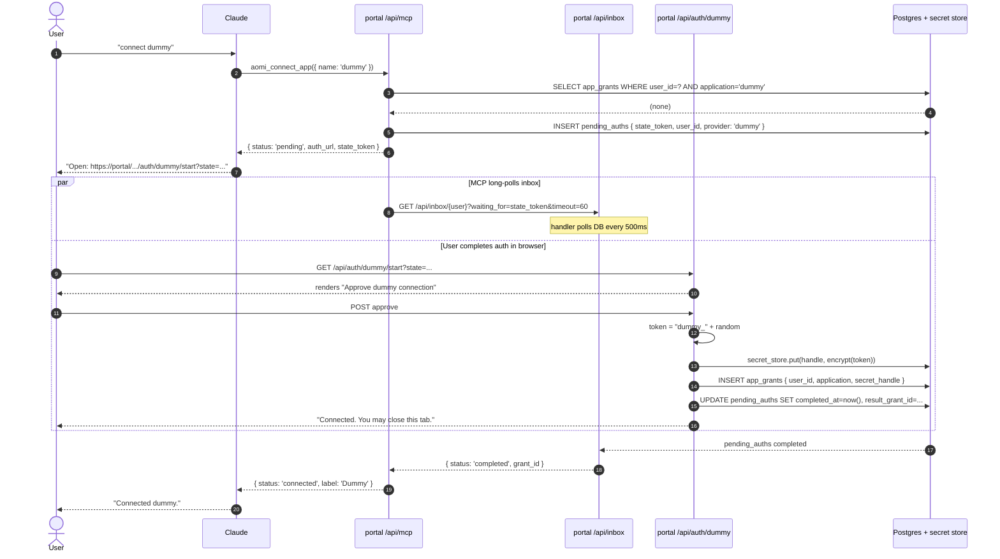

# Aomi MCP — Design

A single design document for shipping Aomi as a Claude/Codex plugin via MCP.
Covers (a) package + file layout, and (b) the first end-to-end prototype slice
with sequence diagrams.

## 1. Context

Three rules drive the design:

1. **BE never holds API tokens or wallet keys.** All credentialed work is
   handled by the portal layer (MCP server, credential proxy, secret store).
   The Rust BE can _trigger_ credentialed upstream calls, but it does so by
   forwarding through the portal proxy — it never reads or stores secret
   material.
2. **MCP is Aomi-shaped, not pass-through.** Tools expose Aomi verbs
   (`aomi_chat`, `aomi_list_pending`, `aomi_request_signature`, …). The MCP
   never exposes Binance / Dune / Privy / etc. directly to Claude. Third-party
   integrations stay inside the Aomi BE agent.
3. **Wallet signing requires the user's laptop open.** Embedded wallets
   (Privy / Para) and raw PK both execute locally; the BE only ever sees signed
   bytes. API-token work _can_ run async (the MCP/proxy holds tokens via a
   secret store), but signing cannot.

## 2. Trust topology

```
                       ┌──────────────────────────────────────┐
                       │            portal.aomi.dev           │
                       │              (Vercel app)            │
                       │                                      │
   Claude / Codex ──MCP─▶ /api/mcp/[transport]                │
                       │  /api/inbox/[session]                │
   End user browser ──▶│  /api/auth/{provider}/{start|cb}     │
                       │  /api/sign/[handle]                  │
                       │                                      │
   Aomi BE (Rust) ────▶│  /api/proxy/{app}/*                  │ ──▶ upstream APIs
                       │                                      │
                       │  ┌────────────┐    ┌──────────────┐  │
                       │  │ Vercel KV  │    │ Postgres     │  │
                       │  │ (envelope- │    │  app_grants  │  │
                       │  │  encrypted)│    │  pending_*   │  │
                       │  └────────────┘    └──────────────┘  │
                       └──────────────────────────────────────┘
```

Per-handler capabilities (production target — v1 prototype is laxer; see §4):

| Handler                | Reads DB     | Reads secret store | Writes secret store |
| ---------------------- | ------------ | ------------------ | ------------------- |
| `/api/mcp/*`           | yes          | no                 | no                  |
| `/api/inbox/*`         | yes          | no                 | no                  |
| `/api/auth/*/callback` | yes (insert) | no                 | yes                 |
| `/api/proxy/*`         | yes (lookup) | yes                | no                  |
| `/api/sign/*`          | yes          | no                 | no                  |

The MCP runtime IAM role does **not** have KMS decrypt permission. Only the
proxy role and the OAuth callback role do. A bug in the MCP handler cannot leak
a Binance token; a bug in the proxy cannot leak a conversation transcript.

## 3. Package layout

### New package: `packages/mcp-core`

Protocol-agnostic. Runs identically over stdio (local Claude Code plugin) or
Streamable HTTP (portal-hosted remote MCP).

```
packages/mcp-core/
  src/
    index.ts                 entry; exports createMcpServer(deps)
    runtime.ts               wires tools/resources against a Backend port + Auth context
    types.ts                 Tool, Resource, AuthContext, Backend port
    backend/
      port.ts                interface the runtime calls; portal supplies an impl
      portal-impl.ts         talks to AomiClient + portal pending/secret stores
    tools/
      chat.ts
      list-pending.ts
      request-signature.ts
      connect-app.ts
      disconnect-app.ts
      session-status.ts
      set-context.ts
      list-apps.ts
    resources/
      transcript.ts          aomi://session/transcript
      pending.ts             aomi://session/pending
  package.json
  tsconfig.json
```

The `Backend` port is the seam between MCP and everything else. In portal
deployment it talks to Postgres + AomiClient + pending stores. In local stdio
deployment (later) it talks to the same portal HTTP endpoints over the wire.

### Portal additions: `apps/portal/src/`

```
app/api/
  mcp/[transport]/route.ts             Streamable HTTP transport, mounts mcp-core
  inbox/[session]/route.ts             long-poll for pending_* completion
  auth/[provider]/start/route.ts       OAuth init, writes pending_auths
  auth/[provider]/callback/route.ts    OAuth callback, writes secret + app_grants
  proxy/[app]/[...path]/route.ts       (post-v1) credential-injecting proxy
  sign/[handle]/route.ts               (post-v1) sign-broker state endpoint

app/sign/[handle]/page.tsx             (post-v1) sign-broker UI (Privy/Para SDK)

lib/
  secret-store/
    index.ts                           put/get/rotate envelope-encrypted blobs
    memory.ts                          v0 dev backend (in-process Map)
    vercel-kv.ts                       v1 backend (envelope encryption via KMS)
  pending/
    auths.ts                           create/complete/await pending_auths
    signatures.ts                      (post-v1) sign-broker state
  db/
    schema.sql                         migrations live alongside main schema
    client.ts                          shared Postgres pool
  auth/
    providers/
      dummy.ts                         v0 prototype provider
      binance.ts                       v1
      privy.ts                         v1
      para.ts                          v1
    session.ts                         aomi user session resolution
  backend/
    portal-port.ts                     mcp-core Backend impl for the portal runtime
```

Route handlers are thin glue; logic lives in `lib/`.

### CLI changes (post-v1)

```
packages/client/src/cli/
  commands/
    mcp.ts                             `aomi mcp` — spawn stdio MCP locally
```

The existing CLI keeps working unchanged. MCP is additive. The local stdio MCP
shares `packages/mcp-core`; only the transport and the `Backend` port impl
differ.

## 4. v1 prototype scope

The smallest end-to-end slice that proves the architecture.

| Surface       | Item                          | Behavior in v1                                                                  |
| ------------- | ----------------------------- | ------------------------------------------------------------------------------- |
| MCP tool      | `aomi_chat`                   | Round-trip a message to BE through `ClientSession`.                             |
| MCP tool      | `aomi_list_pending`           | Return the user's pending tx list (read from BE).                               |
| MCP tool      | `aomi_connect_app`            | Trigger OAuth punt via dummy provider; long-poll inbox; return success.         |
| Route         | `/api/mcp/[transport]`        | Streamable HTTP via `@modelcontextprotocol/sdk`.                                |
| Route         | `/api/inbox/[session]`        | Long-poll, up to 60s. Returns `{status, grant_id?}`.                            |
| Route         | `/api/auth/dummy/start`       | Renders fake "Approve" page.                                                    |
| Route         | `/api/auth/dummy/callback`    | Generates fake token, writes to secret store, inserts `app_grants`, marks `pending_auths`. |
| Storage       | secret store                  | `lib/secret-store/memory.ts`. No KV/KMS yet.                                    |
| Storage       | pending state                 | Postgres `pending_auths` table.                                                 |
| Auth          | aomi user                     | Fixed `user_id` from `X-Aomi-User` dev header. No real OAuth yet.               |

Explicitly **out of scope** for v1:

- Real Binance / Privy / Para OAuth (dummy provider proves the loop first).
- Sign broker and wallet signing.
- Credential proxy at `/api/proxy/*`.
- Vercel KV + KMS envelope encryption (in-memory secret store is fine for `next dev`).
- Plugin-level OAuth for Claude (dev header instead).
- Multi-instance Vercel runtime concerns (single-instance `next dev` only).

Definition of done for v1: a developer running `next dev` can install the
local-built MCP plugin into Claude Code, ask Claude "connect dummy," click the
URL Claude returns, and have Claude confirm "connected." Same loop runs against
MCP Inspector for headless testing.

Estimate: ~1 developer-week.

## 5. Sequence diagrams

### 5.1 `aomi_chat`

```mermaid
sequenceDiagram
    autonumber
    actor U as User
    participant C as Claude / Codex
    participant M as portal /api/mcp
    participant B as Aomi BE

    U->>C: "what's the price of ETH?"
    C->>M: MCP tools/call aomi_chat({ message })
    M->>M: resolve user_id (v1: X-Aomi-User dev header)
    M->>B: POST /v1/chat { session_id, message }
    B->>B: agent run; internal tool calls (no creds in v1)
    B-->>M: { reply, newly_queued_tx_ids: [] }
    M-->>C: tool result { reply, pending: [] }
    C-->>U: shows reply
```

Notes:

- v1 uses a fixed `user_id` resolved from `X-Aomi-User`. Real plugin-level
  OAuth slots in later — the bearer becomes the input, the resolved `user_id`
  stays the same.
- No credentialed app calls in this diagram. Those land when `/api/proxy`
  ships and the BE forwards through it.

### 5.2 `aomi_connect_app` — OAuth punt (dummy provider)



Notes:

- MCP handler and auth callback run as **different Vercel functions** but share
  Postgres + secret store. They synchronize through `pending_auths.completed_at`.
- In v1 the secret store is in-memory, so MCP poll and auth callback must hit
  the same process. `next dev` satisfies that. Production needs Vercel KV; the
  interface in `lib/secret-store/index.ts` stays the same.
- The MCP handler **never touches the secret store** — it only reads metadata
  to know "grant exists." This boundary holds even in v1.

### 5.3 Inbox long-poll mechanics

```mermaid
sequenceDiagram
    autonumber
    participant M as MCP handler
    participant I as Inbox handler
    participant DB as pending_auths
    participant CB as Callback handler

    M->>I: GET /api/inbox/{user}?waiting_for=state_token&timeout=60

    loop poll every 500ms up to timeout
        I->>DB: SELECT completed_at, result_grant_id WHERE state_token=?
        alt completed_at IS NOT NULL
            DB-->>I: row { completed_at, result_grant_id }
            I-->>M: 200 { status: 'completed', grant_id }
        else still null and timeout not reached
            DB-->>I: row { completed_at: null }
            Note over I: sleep 500ms
        end
    end

    Note over CB: (concurrently, after user clicks Approve)
    CB->>DB: UPDATE pending_auths SET completed_at=now()

    alt timeout reached without completion
        I-->>M: 200 { status: 'pending' }
        Note over M: MCP returns same to Claude; Claude can re-call to extend
    end
```

Notes:

- Why poll vs push? Vercel serverless functions can't push to each other
  directly. The callback writes a row; the inbox handler reads it. We pay ~250ms
  median latency after the user clicks; we avoid WebSockets/Pusher in v1.
- Vercel Hobby has a 10s function limit; Pro has 60s. v1 targets Pro with
  `timeout=60`. Local `next dev` has no such limit.
- If the user never completes the flow, the inbox returns `{status: 'pending'}`
  after timeout. MCP returns the same to Claude, which surfaces "still waiting —
  click the URL." Claude can call `aomi_connect_app` again to extend.

## 6. Data model (subset used in v1)

```sql
-- minimal users table (dev-mode: one row inserted manually)
CREATE TABLE users (
  id            uuid PRIMARY KEY,
  username      text,
  status        text NOT NULL DEFAULT 'active',
  created_at    timestamptz NOT NULL DEFAULT now(),
  updated_at    timestamptz NOT NULL DEFAULT now()
);

-- pending OAuth attempts; MCP polls this to know when callback finished
CREATE TABLE pending_auths (
  state_token        text PRIMARY KEY,
  user_id            uuid NOT NULL REFERENCES users(id),
  provider           text NOT NULL,
  started_at         timestamptz NOT NULL DEFAULT now(),
  completed_at       timestamptz,
  result_grant_id    uuid,
  error              text
);

CREATE INDEX pending_auths_open_idx
  ON pending_auths(state_token) WHERE completed_at IS NULL;

-- metadata about completed grants; NO secret material
CREATE TABLE app_grants (
  id                 uuid PRIMARY KEY,
  user_id            uuid NOT NULL REFERENCES users(id),
  application        text NOT NULL,
  display_label      text,
  secret_handle      text NOT NULL,
  granted_at         timestamptz NOT NULL DEFAULT now(),
  revoked_at         timestamptz,
  UNIQUE (user_id, application)
);
```

Full auth schema (`auth_identities`, `identity_wallets`, `wallet_addresses`,
`user_sessions`, signer policy, etc.) lands in the main migration; v1
prototype only needs the three tables above.

## 7. Build order

1. `packages/mcp-core` skeleton — `Backend` port + three tools + `runtime.ts`.
2. `apps/portal/src/lib/db/` — Postgres client and the three v1 tables.
3. `apps/portal/src/lib/secret-store/memory.ts`.
4. `apps/portal/src/lib/pending/auths.ts`.
5. `apps/portal/src/lib/backend/portal-port.ts` — implements `Backend` port.
6. `app/api/mcp/[transport]/route.ts` — mounts `mcp-core` over Streamable HTTP.
7. `app/api/inbox/[user]/route.ts` — polling implementation.
8. `app/api/auth/dummy/start/route.ts` + `callback/route.ts`.
9. End-to-end test against MCP Inspector via `next dev`.
10. Wire `aomi_chat` against a dev BE instance.
11. Install plugin into Claude Code dev mode; complete the loop in Claude.

Each step is roughly half a day. Total ~1 developer-week.

## 8. Open questions deferred past v1

- **Plugin-level OAuth for Claude.** Currently dev header. Real flow: portal-
  hosted "install Aomi" page issues an `aomi_user_token` Claude stores; MCP
  authenticates with it. Likely OAuth 2.1 device flow per MCP spec.
- **Real OAuth providers** (Binance, Privy, Para). Dummy provider proves the
  loop first; each real provider is a `providers/{name}.ts` module + a callback
  flavor.
- **Credential proxy at `/api/proxy/*`.** Server-to-server, per-app signers
  (Bearer, HMAC). Lands once BE actually needs to make a credentialed call on
  the new path.
- **Vercel KV + KMS envelope.** v1 in-memory; production durable + multi-
  instance + per-row encryption.
- **Sign broker.** Needs its own design: how local stdio MCP and the browser
  tab both subscribe; how Privy/Para SDKs are hosted in `app/sign/[handle]/`;
  signer policy table; raw-PK fallback for local-only sessions.
- **Local stdio MCP.** `aomi mcp` subcommand; same `mcp-core`, different
  transport, different `Backend` port impl (HTTP client against portal).
- **Multi-instance pending state.** Postgres polling scales further than KV
  pubsub for this volume; revisit if poll latency becomes a problem.
- **Token rotation worker.** Cron route that refreshes OAuth tokens before
  `expires_at`. Reads `app_grants`, calls upstream refresh, writes new
  ciphertext to KV.
- **Service identity for BE → proxy.** mTLS vs shared service token; rotation
  story; per-request user attribution.
