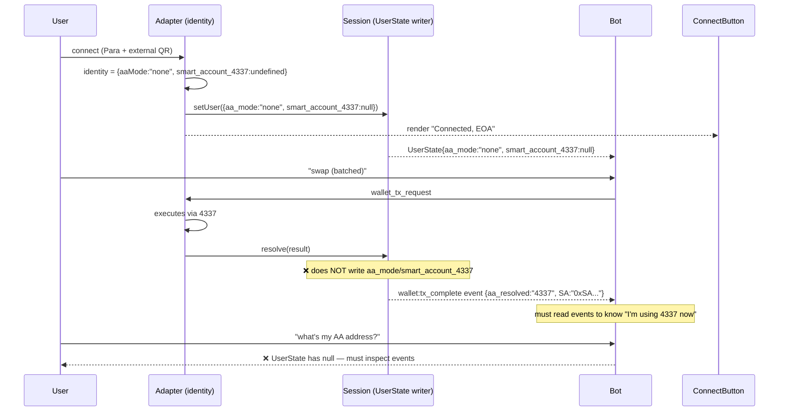
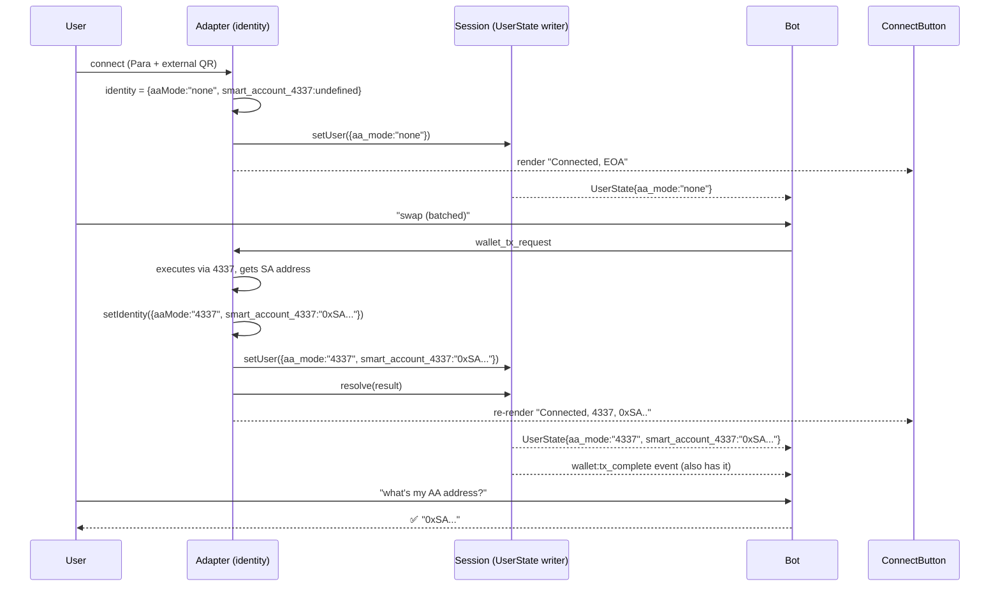
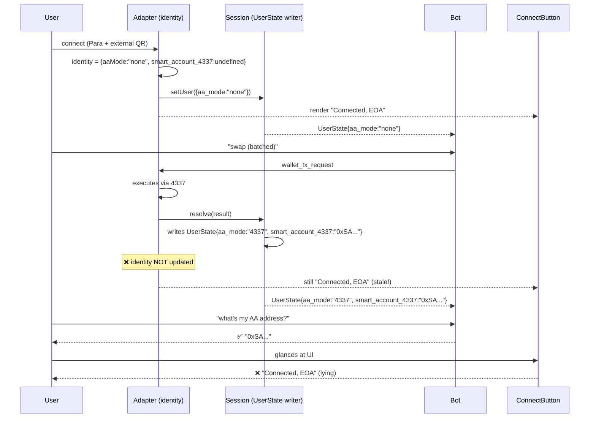

Let me see what's broken from the rename and finish it, then explain A/B/C.

The rename overshot — `SdkSmartAccount` describes the external SDK's shape (we don't control it). Let me check the original field names via git:

The `SdkSmartAccount` and the local Pimlico SDK type describe **external SDK shapes** — those field names are owned by `@getpara/aa-*`, not us. Reverting those to `smartAccountAddress`/`delegationAddress`:

Acknowledged — type/library changes only, not browser-observable. Continuing.

Now check session.ts tx-complete for similar revert + check the rest:

Wait — react typecheck silently passed? Let me confirm types built and run tests:

All 246 tests pass with the SDK-shape names reverted. Now hole #3, with your new `smart_account_4337`/`delegation_7702` fields in mind:

## A vs B vs C — sequence diagrams

Scenario: Para + external wagmi + batched tx that resolves to 4337.

### Option A — connect-time intent only (no per-tx writes)

**Problem**: `smart_account_4337` stays `null` in UserState forever. Bot can't answer "what's my smart account address" by reading state. Defeats the point of hole (a).

### Option B — plumb tx outcome back into identity (both update)

**Cost**: needs new wiring — `wallet-execution.ts` already returns the result; we'd add a callback so the adapter can call `setIdentity` after every tx, before the React `useMemo` recomputes from Para SDK state. Not big, but it's new state plumbing.

### Option C — current behavior (divergent)

**Bot**: happy. **UI**: lies after first AA tx. The two surfaces tell different stories.

## My recommendation

**B** is the only option that's actually correct given you want `smart_account_4337` to be queryable from state. A throws away the data. C lies in the UI.

The plumbing for B is small:
1. `wallet-execution.ts` already returns the result with `SmartAccount4337`/`Delegation7702` (just verified)
2. Add a callback to `executeAdapterTransaction` (or have the adapter pass its own "on tx resolved" handler)
3. The adapter calls `setIdentity({...identity, aaMode, smart_account_4337})` after each tx
4. React re-renders, ConnectButton & UserState both update

Want me to do **B**?